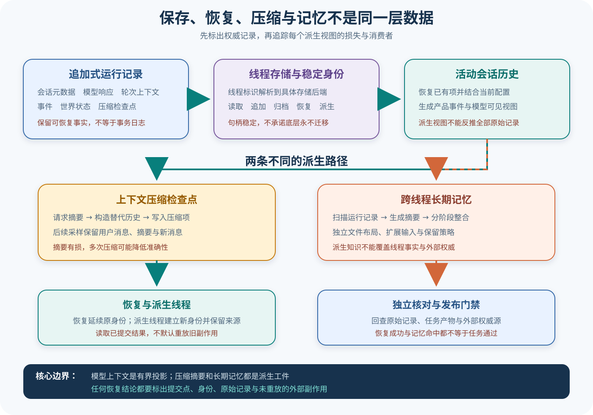

# Codex 记录、恢复、压缩与长期记忆

## 读者会得到什么

「会话保存了」不是一个足够精确的结论。Codex 同时存在追加式 Rollout、存储中立的 Thread Store、运行时模型历史、压缩后的替代历史、恢复时重建的事件视图，以及跨线程提炼的 Memory 工件。它们服务不同消费者，也有不同丢失风险。

记录不是上下文。记忆也不是记录。它们不能混用。

本篇建立数据权威地图：ThreadId 是持久线程句柄；RolloutItem 保存可恢复记录；模型 Context 是由记录与当前配置投影出的有界视图；CompactedItem 保存摘要及可选替代历史；长期 Memory 则由后台管线从多个线程提炼成独立文件。摘要不是原始记录，记忆也不是会话真相。

## 核心概念

这一主题的关键不是「存没存」，而是每种数据为谁服务、能否重建、是否有损以及谁有权修改。Rollout 偏向追加证据，Thread Store 提供稳定身份和后端接口，运行时 History 服务当前采样，Compaction 改变模型视图，Memory 跨线程提炼候选知识。它们可以互相引用，却不能共享一个含糊的 history 名称。

| 对象 | 权威范围 | 是否有损 | 主要消费者 |
|---|---|---|---|
| ThreadId | 持久线程身份 | 否 | 产品表面、Thread Store |
| RolloutLine / Item | 已追加的会话记录 | 原则上追加 | 恢复、审计、投影器 |
| Thread Store | 身份到后端的解析与操作 | 取决于后端 | 应用与恢复流程 |
| 运行时 History | 当前 Session 的响应项 | 可正规化 | Agent Loop |
| 模型 Context | 单次采样可见输入 | 是 | Provider 请求 |
| CompactedItem | 压缩摘要和替代历史元数据 | 摘要有损 | 恢复与后续投影 |
| Fork lineage | 新线程与来源关系 | 不复制所有外部状态 | 分支工作流、审计 |
| Memory 工件 | 跨线程提炼的候选知识 | 高度有损 | 未来任务上下文 |

追加记录表示新事实形成新条目，不通过改写过去伪造历史。RolloutItem 可以包含 SessionMeta、ResponseItem、TurnContext、WorldState 和 EventMsg；并非每项都要发送给模型。RolloutLine 的序号和时间帮助检测尾部与顺序，但是否具备事务耐久性仍取决于 writer 和后端。

恢复是从提交记录重建活动状态。它应区分 New、Resumed、Forked 与 Cleared：Resumed 延续原身份，Forked 建立新 ThreadId 并保存来源，Cleared 表示上下文有意清空。界面回放、模型 History 和恢复事件由同一记录投影，却可能选择不同条目。

压缩建立新的模型可见替代历史，不宣称旧事实消失。摘要保留任务目标、重要约束、工具结论和未解决事项，旧助手细节可以退出窗口；CompactedItem 记录摘要与窗口边界，以便恢复者知道何时、用什么替代。连续压缩会累积信息损失。

长期 Memory 的作用域跨 Thread，因此风险也不同。扫描器选择哪些线程、模型怎样提炼、扩展输入是否过期、冲突事实如何合并，都会改变最终文件。Memory 只能作为下次推理的候选片段，高风险权限、发布结论和用户明确事实仍需回到权威来源。

工具副作用不完全属于任何一个会话文件。记录可证明曾请求和已提交结果，外部文件或服务可能在崩溃点处于 unknown。恢复器不能通过重放旧工具来「重建历史」，而应使用提交点、幂等键或外部探测判断真实状态。

## 为什么这样设计

第一，ThreadId 与存储后端分离，使本地 Rollout、状态数据库或远程存储可以替换，而应用仍使用稳定句柄。路径移动和后端迁移不会要求产品表面暴露文件位置，也能减少把实现细节当身份的错误。

第二，追加 Rollout 与模型 Context 分离，兼顾可审计性和有限窗口。历史证据可以持续增长，模型只接收正规化的相关子集；更换模型或压缩策略时，可以从同一记录重建新投影，而无需修改已经发生的事件。

第三，把压缩作为独立 Turn 与持久条目，让摘要生成本身可观察、可失败和可恢复。若在内存里悄悄替换数组，无法知道哪些事实被摘要、模型为何忘记，也无法在摘要请求失败时安全回退。

第四，Fork 使用新 Thread 身份保护因果分支。两个分支可以共享历史前缀，却会产生不同后续副作用和评分；保留 lineage 便于比较，避免把分支成功重复计算为原 Trial 的恢复结果。

第五，Memory 独立于 Thread 记录，防止模型提炼结果反向篡改会话事实。派生知识可以更新、过期和删除，原始 Rollout 保留发生过什么；冲突时由调用方核对来源，而不是让最后一次提炼覆盖历史。

第六，恢复不默认重放副作用，是因为通用 Harness 无法保证所有工具幂等。保守的 unknown 状态可能需要人工处理，却比重复发布、重复写入或重复发送消息更诚实。任务可用性与副作用安全在这里存在明确取舍。

## 实现思路

教学原型建立三份存储：追加型事件日志、Thread 元数据索引和派生工件目录。它用于演示权威边界，不代表 Codex 锁定实现采用完全相同的文件布局。

1. **追加权威记录。** 每个 RolloutLine 包含 seq、时间、ThreadId、TurnId、类型和负载哈希；writer 只追加，发现尾行损坏时停止并报告。
2. **维护 Thread 索引。** 索引保存 ThreadId、后端定位、归档状态和 lineage，不复制全部对话；索引可重建时记录重建水位。
3. **重建运行时 History。** 恢复器读取已提交条目，验证顺序与工具调用配对，生成产品回放事件和 Agent History；不执行旧工具。
4. **派生模型 Context。** 根据当前模型模态、窗口和项目配置正规化响应项，输出 kept / transformed / dropped 报告。
5. **执行压缩。** 在独立 Turn 请求摘要，验证关键约束和未结算工具关系，写 CompactedItem 后再原子切换替代历史。
6. **处理 Fork。** 新建 ThreadId，记录 parent 与 fork 水位，只共享可复制历史；外部工作区状态另行快照或声明共享。
7. **提炼 Memory。** 后台扫描有界来源，保留来源引用、生成版本、冲突和删除信号；最终文件不写回原 Rollout。
8. **接入 Eval。** Trial 保存 canonical Thread、Rollout 水位、外部产物和 Scorer 版本；Fork 与恢复由实验契约明确计数。

```text
rollout.append(event, expected_next_seq)
history = recover_committed_items(rollout)
context, report = normalize(history, model, budget)
如果需要压缩:
    summary = summarize(context, required_facts)
    rollout.append(Compacted(summary, source_window))
    context = build_replacement_history(summary, retained_items)
memory = derive_with_sources(selected_threads)  // 只生成派生工件
```

压缩验证不只检查令牌下降。先从结构化状态抽取不可丢失事实，如当前目标、允许路径、未完成步骤和工具结果身份；摘要生成后逐项核对。无法证明保留时，保持旧历史或将压缩标为失败，不能写入一个看似流畅但缺少安全约束的摘要。

恢复测试使用故障注入覆盖写入前、写入中、fsync 后、索引更新前后和压缩切换点。每个检查点记录可见水位，恢复后禁止重复已提交工具副作用。存储后端不同，原子性假设也必须分别验证，不能从本地文件推断远程实现。

Memory 项至少包含正文、支持来源、生成提交、更新时间、冲突状态和过期策略。只有一个已删除来源支持的项应被清理；多来源冲突则保留不确定标记。面向模型展示时可以压缩这些元数据，审计文件仍完整保留。

## 贯穿案例

用户要求修改解析器并运行测试。第一轮读取文件、写入补丁并启动测试；测试完成后进行手动压缩，随后进程重启并恢复，最后从该线程 fork 一个替代实现。案例同时检查日志、模型 Context、外部文件和 Eval 身份。

1. **记录第一轮。** Rollout 追加用户消息、工具调用、工具结果、助手消息和 TurnComplete；外部工作区保存补丁哈希与测试日志。
2. **执行压缩。** 摘要必须保留目标文件、已改内容、测试失败和「禁止修改快照」约束；CompactedItem 记录来源窗口，旧条目仍在 Rollout。
3. **重启恢复。** 新 Session 用同一 ThreadId 读取提交水位，重建历史和界面事件；不重新运行已提交的补丁或测试工具。
4. **继续新轮次。** 模型请求包含替代历史与新用户输入，不含被压缩的旧助手细节；正规化报告说明每项去向。
5. **创建 Fork。** 替代方案获得新 ThreadId 与 parent lineage，共享历史前缀，但工作区共享或快照策略被显式记录。
6. **独立评分。** 原 Thread 与 Fork 是两个 Target 变体还是同一 Trial 的探索，由实验契约预先决定；不能完成后择优改分母。

```json
{"threadId":"th-main","rolloutSeq":42,"compactedFrom":[1,35],"replacementContext":"summary-v1","workspaceHash":"a1"}
```

```json
{"threadId":"th-fork","parent":"th-main","forkSeq":42,"trialPolicy":"预先声明的变体","workspaceMode":"共享或快照"}
```

崩溃变体发生在文件补丁已经写入、tool result 尚未追加。恢复器看到 started 而没有 terminal，先比较工作区哈希或调用幂等键；无法确认就标为 unknown，不自动再次应用补丁。原始 Trial 保留这次不确定结果，基础设施恢复只增加 Attempt 记录。

压缩反例故意删除「禁止修改快照」。关键事实核对失败，系统不切换 replacement history，并保留失败摘要作为诊断工件。摘要文本读起来通顺不构成成功；验证器关心的是所需事实集合和工具关系完整性。

Memory 变体在后台提炼出「该项目始终禁止修改快照」，但它只由本次临时用户指令支持。下次另一个项目不能无条件继承；Memory 项必须带项目作用域和来源，用户撤销或来源过期后清理。这个反例说明跨线程便利性会放大错误事实的影响范围。

派生便利不能覆盖来源边界。

## 真实输入与输出

### 输入

恢复测试先提交一轮带文本元素的用户消息，模型返回一条助手消息，Turn 完成后再从原记录重启：

```json
{"user":"Record some messages","assistant":"Completed first turn"}
```

压缩测试依次执行普通轮次、手动压缩和新轮次。模拟模型第二次请求返回摘要，第三次请求用于检查压缩后的模型输入：

```text
普通轮次 → 压缩请求 → 新用户消息
```

### 输出

恢复后的初始事件仍按 TurnStarted、UserMessage、AgentMessage、TokenCount、TurnComplete 排列，且完成事件与开始事件共享轮次标识。压缩后的第三次模型请求保留原用户消息、摘要和新消息，但旧助手消息不再进入该模型视图：

```text
追加记录：仍包含 TurnContext 与 Compacted 条目
模型输入：初始上下文 + 保留的用户消息 + 压缩摘要 + 新消息
```

这证明恢复事件、持久记录和下一次模型输入可以相关，却不是同一个数组。

## 调用链

先确定权威，再谈恢复。



Claim: codex.rollout.store-history-context-separation

Claim: codex.compaction.resume-has-bounded-semantics

1. Session 把会话元数据、模型响应项、TurnContext、事件、跨智能体通信和压缩检查点写成 RolloutItem；RolloutLine 再附加时间戳与可选序号，形成持久记录边界。
2. Thread Store 只把 ThreadId 视作持久句柄。具体实现负责把它解析到本地 Rollout、状态数据库或其他后端，并提供读取、追加、归档、恢复与 Fork 接口。
3. 恢复时，InitialHistory 区分 New、Cleared、Resumed 与 Forked。恢复读取已有 RolloutItem，再分别重建产品表面需要的初始事件、会话元数据和模型历史；Fork 则建立新的线程身份并保留来源关系。
4. 采样前，运行时 History 把 ResponseItemEnvelope 投影成适合当前模型输入模态和截断策略的 Context。不是每个持久事件都应直接发给模型，也不能仅凭模型 Context 还原全部原始记录。
5. 压缩是一个独立 Turn 生命周期。它克隆历史、请求摘要、处理受限重试与上下文超限，随后构造替代历史，并把 CompactedItem 连同摘要、窗口标识和可选 replacement_history 写回持久记录。
6. 后续模型请求读取替代历史，而不是继续携带全部旧助手消息。原 Rollout 中的压缩检查点仍用于恢复和审计；多次压缩会增加摘要损失，所以源码会发出准确性警告。
7. Memory 启动任务在独立根目录维护原始记忆汇总、Rollout 摘要与扩展输入，再通过分阶段管线提炼跨线程信息。它是派生知识库，不应覆盖 ThreadId、Rollout 或具体任务产物。

## 源码证据

RolloutItem 是持久域类型，不只包含聊天消息：

```source
codex-rs/history/src/lib.rs:93-105
pub enum RolloutItem {
    SessionMeta(...), ResponseItem(...), Compacted(...),
    TurnContext(...), WorldState(...), EventMsg(...),
}
```

Thread Store 明确把 ThreadId 定义为唯一持久线程句柄，后端负责解析：

```source
codex-rs/thread-store/src/lib.rs:1-5
Application code should treat [`codex_protocol::ThreadId`] as the only durable thread handle.
Implementations are responsible for resolving that id to local rollout files, RPC requests, or any other backing store.
```

恢复与 Fork 在初始历史类型上分开：

```source
codex-rs/history/src/lib.rs:209-221
pub struct ResumedHistory { conversation_id, history, rollout_path }
pub enum InitialHistory { New, Cleared, Resumed(...), Forked(...) }
```

压缩成功后不是覆盖原文件假装旧消息从未存在，而是构造替代模型历史并记录压缩元数据：

```source
codex-rs/core/src/compact.rs:347-384
let summary_text = format!("{SUMMARY_PREFIX}\n{summary_suffix}");
let mut new_history = build_compacted_history(...);
sess.replace_compacted_history(new_history, ..., CompactedHistoryMetadata { ... }).await;
```

上游测试同时检查下一次请求的替代视图和 Rollout 中的 Compacted 条目：

```source
codex-rs/core/tests/suite/compact.rs:635-697
assert_eq!(assistant_count, 0, "assistant history should be cleared");
RolloutItem::Compacted(ci) if ci.message == expected_summary_message => ...
```

Memory 写路径拥有独立文件布局和后台阶段，不是 History 的别名：

```source
codex-rs/memories/write/src/lib.rs:1-5,35-39,116-146
This crate owns the startup memory pipeline, file-backed memory artifact helpers...
ROLLOUT_SUMMARIES_SUBDIR; RAW_MEMORIES_FILENAME;
pub fn memory_root(...) ...
```

两条 Claim 均使用 B 级。第一条由持久类型、存储接口和恢复类型源码共同支持；第二条由压缩实现及恢复、压缩上游测试锁定。B 级仍不等于崩溃一致性、任意旧版本迁移或所有后端生产恢复已验证。

## 失败与限制

Rollout 是记录边界，不自动等于事务日志。追加途中崩溃、尾行损坏、文件压缩、状态数据库索引滞后或后端迁移都需要单独测试。ThreadId 稳定也只保证引用身份，不能保证底层文件永不移动。

恢复不是副作用重放。重建初始事件与模型历史，应读取已提交工具结果，而不是再次执行旧命令。当前引用测试证明消息和推理事件可以恢复，却没有覆盖所有工具副作用、崩溃点和外部系统幂等性，因此不能把恢复写成「恰好一次」保证。

Fork 不是恢复的别名。恢复延续原 `conversation_id`；Fork 从已有 RolloutItem 派生新线程，并保留来源身份。若统计任务成功率，两个线程不能在没有 Trial 规则时同时充当独立成功样本。

压缩是有损投影。测试证明旧助手消息退出下一次模型视图、摘要进入模型视图且 Compacted 条目进入 Rollout；它没有证明摘要包含全部事实。长线程和多次压缩可能降低准确性，关键约束必须留在结构化状态或可核对工件中。

SQLite 与 Rollout 承担不同角色。状态库可以索引线程、队列和元数据，但本篇没有把它宣布为所有会话内容的唯一真相；出现差异时，应按具体 API 与迁移模式检查哪一层拥有该字段。

Memory 更不能反写历史。它会受到扫描上限、截断、模型提炼、扩展输入、保留期和工作区差异影响。记忆内容只能作为下一次推理的候选上下文；涉及权限、发布状态和用户明确事实时，仍须回到原始记录或外部权威源核对。

## 验证方法

先为同一 ThreadId 捕获 Rollout 文件、Thread Store 返回、恢复初始事件和首个模型请求。给每个 RolloutLine 记录序号、类型与轮次标识，确认事件投影不会改变持久项身份，也不会把界面专用事件全部塞入模型 Context。

再做断点矩阵：用户消息前、工具调用前、工具结果提交后、TurnComplete 后、压缩摘要返回前后分别终止进程。恢复时检查哪些记录可见、是否出现重复工具副作用、尾行损坏如何报告。恢复成功不能只看界面重新打开。

随后验证压缩。构造可识别的旧用户消息、旧助手消息、工具结果和关键约束；压缩后分别检查 Rollout、`replacement_history` 和下一次请求。摘要缺少关键约束时，测试应失败，而不是因为令牌数下降就算成功。

最后单独测试 Memory。记录进入扫描集合、阶段一摘要、阶段二整合和最终文件的每次变换，注入过期扩展、删除源和相互冲突事实。确认删除信号能清理只由该来源支持的记忆，同时不会修改原线程记录。

## 自检

### 问题 1

为什么 Thread Store、Rollout 和模型 Context 不能合称「会话历史」？

**答案：** Thread Store 提供持久身份与后端接口，Rollout 保存多类可恢复项，模型 Context 是为当前采样构造的有界投影；消费者和权威范围都不同。

### 问题 2

压缩后旧助手消息不在下一次请求中，是否表示它已从 Rollout 删除？

**答案：** 不能这样推断。测试同时看到替代模型视图和新增 Compacted 条目；模型视图收缩不等于原始记录被抹除。

### 问题 3

恢复是否应该重新执行历史工具调用来重建状态？

**答案：** 不应该默认重放已提交副作用。应恢复记录的工具结果，并对缺失或不确定提交点使用显式恢复策略。

### 问题 4

长期 Memory 可以作为权限和发布结论的权威来源吗？

**答案：** 不可以。Memory 是受扫描、截断和模型提炼影响的派生工件；高风险事实必须回查原始记录或外部权威源。
