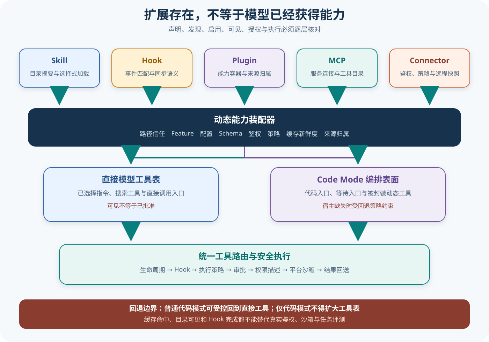

# Codex 扩展、动态工具与代码模式

## 读者会得到什么

一个扩展目录存在，不代表模型已经获得能力。Skill 要先被发现并在需要时加载；Hook 要经过配置、信任和事件匹配；Plugin 只是能力容器；MCP 与 Connector 还受连接、鉴权、目录缓存和工具可见性影响；Code Mode 更会直接改变模型看到的工具表面。

存在不是能力。可见不是授权。授权也不是成功。

本篇把「安装」「发现」「启用」「模型可见」「获准执行」「实际成功」拆成六个检查点。只有逐层记录，才能解释为什么同一 Plugin 中的 Skill 可见而 MCP 工具不可见，为什么异步 Hook 不能阻断启动操作，以及为什么代码模式宿主缺失时有的配置回退、有的配置失效关闭。

路径只是入口。缓存只是快照。

## 真实输入与输出

### 输入

Skill 上游测试创建一个带符号链接发现路径的 Skill，并在用户输入中显式选择它。Plugin 测试则准备同时声明 App 与 MCP 的包，再分别使用不同鉴权模式查询工具：

```text
用户选择 Skill → 读取规范路径中的说明
Plugin 声明 App 与 MCP → 结合鉴权和启用状态搜索工具
```

Code Mode 测试启用代码模式后，把宿主程序指向不存在的可执行文件；另一个场景启用仅代码模式：

```json
{"宿主":"不存在","模式":"普通代码模式或仅代码模式"}
```

### 输出

被选择 Skill 的指令作为独立内容种类进入请求；Plugin 工具搜索结果保留来源归属，但 App 与 MCP 工具会因鉴权方式产生不同可见集合。普通代码模式在宿主缺失时可以回到直接工具并只警告一次；仅代码模式则保留代码模式工具、绝不暴露直接 shell 工具，并让调用明确失败。

```text
能力目录 ≠ 模型工具表
模型工具表 ≠ 已授权执行
宿主缺失：按配置回退，或失效关闭
```

## 调用链

动态能力必须逐层装配。



Claim: codex.extensions.capabilities-are-dynamically-assembled

Claim: codex.code-mode.changes-tool-surface

1. 启动或配置刷新时，系统从内置缓存、工作区和 Plugin 根目录发现 Skill、Hook、MCP 配置及 App 声明。路径存在只是候选输入；解析错误、Schema 不合法或受管配置失败可能使会话拒绝启动。
2. Plugin 汇总 Skill、Hook、MCP 与 Connector 声明，并附加插件身份和来源元数据。Plugin 不是单一运行时，它不能让所有子能力自动共享同一启用、鉴权或生命周期。
3. Skill 先以目录摘要进入模型可见提示，只有显式选择或匹配后才加载完整指令和依赖。发现路径与规范路径可以不同，但加载必须保持来源可追踪。
4. Hook 注册在会话、提示、工具、压缩和子智能体等事件上。同步 Hook 可以按事件语义阻断或修改流程；异步 Hook 在后台执行，不能反向阻断已经启动的操作。
5. MCP 与 Connector 分别建立服务连接或远程能力快照，再经策略、鉴权、工具目录缓存、搜索和可见性过滤形成动态工具。缓存命中只能证明目录可复用，不能证明凭据仍有效或远端调用会成功。
6. Code Mode 把可调用工具封装进代码执行表面，模型主要看到 `exec`、`wait` 等编排入口；被封装工具仍经原路由、生命周期、审批和沙箱执行，不因为通过代码调用就获得额外权限。
7. 若代码模式宿主不可用，普通模式可按配置回退到直接工具并提示；仅代码模式或关闭回退时保持代码表面但返回失败。回退改变工具可见集合，必须进入 Trace 和 Eval 条件。

## 源码证据

Skill crate 暴露根加载请求、快照缓存、工具依赖和提及解析，说明发现、加载与依赖不是一个动作：

```source
codex-rs/skills/src/lib.rs:17-38
pub use loading::SkillRootLoadRequest;
pub use loading::SkillRootSnapshotCache;
pub use model::SkillToolDependency;
pub use mentions::extract_tool_mentions;
```

Hook 公开多个生命周期事件，并明确只有部分事件使用 matcher：

```source
codex-rs/hooks/src/lib.rs:22-45,57-89
"PreToolUse", "PostToolUse", ...
Other events can appear in hooks JSON, but Codex ignores their matcher fields...
```

Plugin 能力摘要把 Skill、Hook、应用连接器等来源汇总，但保留插件身份：

```source
codex-rs/plugin/src/lib.rs:15-24,51-89
pub struct PluginCapabilitySummary { ... app_connector_ids ... }
pub struct PluginHookSource { plugin_id, plugin_root, hooks, ... }
```

Connector 具有策略评估、运行时上下文、快照和缓存；MCP 另有模型可见判断与工具目录缓存：

```source
codex-rs/connectors/src/lib.rs:29-53
pub use app_tool_policy::AppToolPolicyEvaluator;
pub use connector_runtime::ConnectorRuntimeManager;
pub use runtime_projection::ConnectorRuntimeTool;
```

```source
codex-rs/codex-mcp/src/lib.rs:5-30
pub use connection_manager::tool_is_model_visible;
pub use tool_catalog_cache::McpToolCatalogCache;
```

代码模式上游测试锁定宿主缺失时的两种不同结果：

```source
codex-rs/core/tests/suite/code_mode.rs:315-387
missing_process_host_falls_back_to_direct_tools_and_warns_once
missing_process_host_keeps_code_mode_only_and_fails_closed
"code-mode-only must never expose direct shell tools"
```

第一条 Claim 使用 D 级：多个 crate 和上游测试分别证明候选发现、来源、策略和工具投影；把它们组合成六检查点架构属于跨模块分析。第二条使用 B 级：代码模式导出的宿主类型和上游测试共同锁定工具表面变化及宿主缺失行为。两者都不证明任意第三方扩展安全。

## 失败与限制

发现不等于加载。Skill 目录、Plugin manifest、Hook 配置或 MCP 文件即使存在，也可能因 Feature、配置层、路径信任、Schema、平台或会话模式被排除。审计不能只列文件树。

加载不等于模型可见。完整 Skill 指令通常按选择加载；Connector 和 MCP 工具可以通过搜索后才进入请求；Plugin App 还会因鉴权模式隐藏。工具目录的静态截图无法代表下一轮模型实际收到的工具表。

模型可见不等于获准执行。Hook、审批、Exec Policy、PermissionProfile 与平台沙箱仍位于调用路径上。Code Mode 只是改变编排表面，不应成为绕过安全层的第二条执行通道。

Hook 具有时间语义。异步 Hook 不能阻止已启动操作；同步 PreToolUse 可以在执行前阻断，但脚本超时、输出解析失败和多个 Hook 冲突需要明确合并规则。Plugin Hook 还必须保留来源，否则无法解释谁阻断了工具。

缓存不是新鲜性证明。Connector 目录和 MCP 工具目录可能来自内存或磁盘快照；远端撤权、Schema 变化和连接失效需要刷新或调用时验证。把缓存命中写成能力可用会产生假阳性。

Code Mode 回退必须进入证据。普通模式回到直接工具后，Prompt、工具名称和调用形态已经变化；仅代码模式则选择失败关闭。两种运行不能混入同一实验单元，也不能只按最终文本评分而忽略实际工具表面。

回退会改表面。失效必须可见。工具表要留档。来源也要留档。

## 验证方法

先建立能力清单，每项记录声明路径、发现结果、启用状态、来源 Plugin、所需鉴权、模型可见名称和真实执行器。对 Skill、Hook、MCP 与 Connector 分别注入合法、缺失和损坏配置，确认失败不会伪装成空目录。

再捕获连续两轮模型请求。第一轮只暴露搜索或 Skill 目录，第二轮在选择后检查完整指令、动态工具 Schema 和 Plugin 来源。切换鉴权模式与 Feature，确认不可用工具不会从缓存泄漏到请求。

随后为 Hook 建立事件矩阵：会话开始、用户提示、工具前后、压缩前后、停止和子智能体生命周期。同步阻断要证明真实工具未执行；异步 Hook 要证明启动操作不被反向取消，同时保留后台结果。

最后测试 Code Mode 四象限：宿主可用或缺失，允许回退或禁止回退。逐一记录模型工具表、警告次数、执行路由、审批事件、沙箱后端和输出形态。独立 Eval 应按这些条件分层，而不是把四种环境合并成一个成功率。

## 自检

### 问题 1

Plugin 已启用，是否表示其中所有能力都对模型可见？

**答案：** 不是。Skill、Hook、MCP 和 Connector 各自还有发现、加载、鉴权、策略与投影步骤，Plugin 只提供来源容器。

### 问题 2

异步 Hook 返回阻断决定，能否阻止已经启动的工具？

**答案：** 不能依赖它阻断。异步 Hook 与启动操作解耦；需要执行前阻断时应使用具备同步阻断语义的事件。

### 问题 3

Code Mode 是否给被封装工具增加权限？

**答案：** 不会。它改变模型看到的编排入口，底层工具仍需经过路由、审批、权限描述和平台沙箱。

### 问题 4

宿主缺失时为什么不能统一回退到直接工具？

**答案：** 仅代码模式承诺不暴露直接工具，统一回退会扩大模型能力；因此不同配置必须分别选择受控回退或失效关闭。
