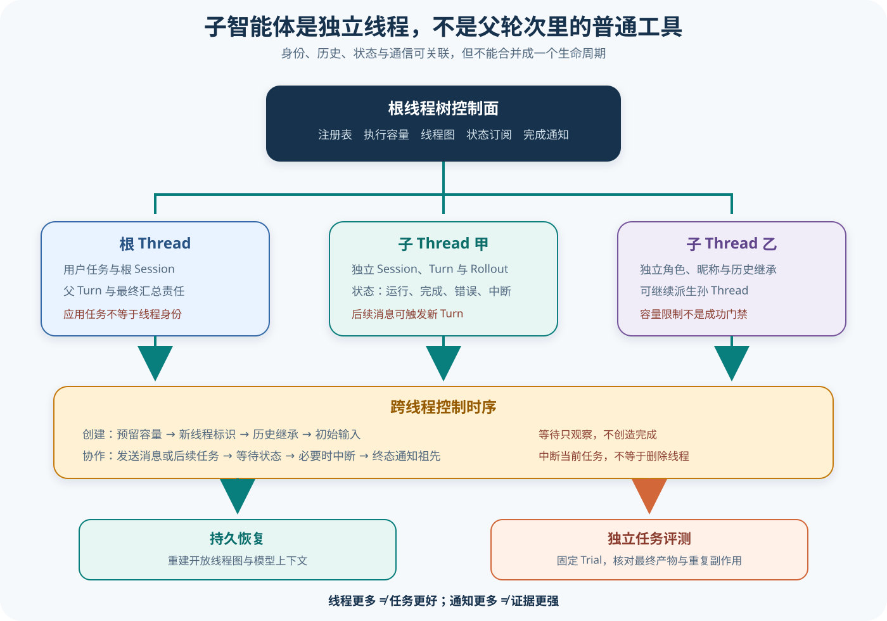

# Codex 子智能体、线程图与协作编排

## 读者会得到什么

子智能体不是父轮次里的一个普通函数 Future。每个子智能体拥有自己的 ThreadId、Session、Turn、模型上下文、状态和 Rollout；根线程树共享 AgentControl、注册表与执行容量。消息可以只追加，也可以触发新 Turn；等待、打断、恢复和完成通知又是不同控制动作。

线程不是任务。通知不是结果。并发也不是质量。

本篇把应用任务、根 Thread、子 Thread、活动 Agent 与跨线程通信分开。这样才能解释：spawn 为什么要保留父线程与父轮次，follow-up 为什么可能触发新轮次，wait 为什么不等于轮询文本，interrupt 为什么不是删除线程，以及子智能体数量为什么不是任务成功率。

身份必须稳定。关系必须可追。来源不能丢失。终态也要留痕。

## 真实输入与输出

### 输入

上游测试让根线程调用 `spawn_agent`，子线程收到初始任务并返回完成消息；另一个场景不调用等待工具，父线程仍要接收完成通知：

```json
{"任务":"创建子线程并继续","子任务":"独立完成一项有界工作"}
```

后续测试复用同一子线程发送 follow-up，并检查新父 Turn 的关联信息；等待场景则让父线程在子线程仍运行时调用 `wait_agent`。

### 输出

子线程拥有不同 ThreadId 和独立 transcript；完成后，根线程的后续模型输入包含结构化子智能体通知，即使父线程没有主动等待。复用子线程时，后续子 Turn 关联新的父 Turn，而根线程本身不把父线程标识指向自己。

```text
根线程 → 创建子线程 → 子线程独立运行
子线程完成 → 状态终结 → 完成通知进入根线程
后续消息 → 同一子线程的新 Turn
```

这些结果锁定关联与通知，不证明并行执行会提升任务质量。

## 调用链

线程树负责身份，控制面负责生命周期。



Claim: codex.orchestration.subagents-are-thread-scoped

1. 根 Session 创建一次 AgentControl。它持有弱引用到全局 ThreadManagerState，但内部 AgentRegistry、执行限制器和会话态只在该根线程树共享，不是全局智能体池。
2. spawn 先预留线程与执行容量，生成新 ThreadId，计算父线程、父轮次、AgentPath、角色、昵称、历史继承方式和协作模式，再启动子 CodexThread 并提交初始输入。
3. Fork 历史不是无条件复制全部父记录。配置可选择无历史、完整历史或最近若干 Turn；截断会影响子线程模型上下文，持久父子边仍应保留。
4. send_message 只向既有子线程传递通信；follow-up 在需要时触发新 Turn。通信上下文记录发送者 ThreadId、接收者 ThreadId、种类与父轮次，使 Trace 能区分创建消息和后续消息。
5. wait 订阅 AgentStatus，并在目标仍运行时等待状态变化；list 读取根线程树的活动节点；interrupt 向目标线程发送中断操作。它们分别观察、枚举和控制，不应互相模拟。
6. 子线程到达完成、错误、关闭或中断等终态后，控制面更新状态并向可接收通知的祖先注入子智能体通知。父线程无需保持阻塞等待，也能在下一次采样看到结果。
7. V2 路径可从持久线程图恢复开放后代的元数据与模型上下文，并在容量允许时重新驻留。恢复的是线程身份和记录，不是把已完成子任务重新计为一次新成功。

## 源码证据

AgentControl 的作用域在源码注释中写得很明确：

```source
codex-rs/core/src/agent/control.rs:101-120
An `AgentControl` instance is intended to be created at most once per root thread/session tree.
That same `AgentControl` is then shared with every sub-agent spawned from that root.
```

活动节点把 ThreadId、AgentMetadata 与 AgentStatus 分开持有：

```source
codex-rs/core/src/agent/control.rs:88-99
pub(crate) struct LiveAgent { thread_id, metadata, status }
pub(crate) struct ListedAgent { agent_path, agent_status }
```

发送通信与打断走不同控制路径；只有标记 trigger_turn 的通信携带父轮次触发新 Turn：

```source
codex-rs/core/src/agent/control.rs:211-282,296-311
let parent_turn_id = parent_turn_id.filter(|_| communication.trigger_turn);
Op::InterAgentCommunication { communication }
Op::Interrupt
```

spawn 在创建前执行容量预留，并把历史继承与父身份显式传入：

```source
codex-rs/core/src/agent/control/spawn.rs:403-448
let agent_max_threads = config.effective_agent_max_threads(...);
let mut reservation = self.state.reserve_spawn_slot(...)?;
let inheritance = SpawnAgentThreadInheritance { ... };
```

跨线程通信事件保留种类与两端 ThreadId：

```source
codex-rs/core/src/agent_communication.rs:7-19,26-58
Self::Spawn => "spawn"; Self::Followup => "followup";
sender_thread_id; receiver_thread_id;
```

上游通知测试直接检查父 Rollout 最终含子智能体通知，并检查父子 transcript 路径不同：

```source
codex-rs/core/tests/suite/subagent_notifications.rs:492-516,784-793
rollout.contains("<subagent_notification>")
assert_ne!(parent_transcript_path, agent_transcript_path);
```

该 Claim 使用 B 级：控制面源码锁定根线程树作用域、独立 ThreadId、通信与中断路径，上游测试锁定独立 transcript 和完成通知。它不证明所有多智能体模式都默认启用，也不保证子线程并发带来质量提升。

## 失败与限制

spawn 成功不等于子任务成功。它只证明子 Thread 被创建并收到初始输入；模型错误、工具失败、审批阻断、超时或通知丢失仍需分别观察。执行容量也只是资源边界，不是质量门禁。

消息送达不等于新 Turn 已完成。普通消息、触发 Turn 的 follow-up 和完成通知具有不同语义；若只保存文本而丢失 communication kind、trigger_turn 和父轮次，恢复后就无法判断是否应重新采样。

wait 不创造完成。它只订阅状态，目标可能完成、失败、中断或消失；多个等待者也不能把一次终态计成多次任务完成。轮询超时应保留为观察结果，不能自动改写子任务状态。

等待只观察。中断只控制。

interrupt 不是删除。中断当前任务后，线程记录和身份仍可能存在，也可能后续恢复或接收 follow-up。若真正要求关闭或释放资源，应使用对应生命周期操作并核对最终状态。

历史继承会改变行为。无历史、完整历史和最近若干 Turn 的子线程看到不同 Prompt；完整历史还可能携带不必要隐私或旧指令，截断历史则可能丢掉约束。每次 spawn 都应记录继承模式和实际上下文摘要。

多智能体模式本身受策略约束。模型指令可禁止主动 spawn，用户或技能的明确授权才能打开某些委派路径。看到工具存在不能推断本轮允许调用。

## 验证方法

先建立线程图夹具：根线程创建两个子线程，其中一个再创建孙线程。记录每个 ThreadId、AgentPath、角色、父 ThreadId、父 TurnId、历史继承模式和容量预留；检查 list 只返回正确根树的活动节点。

再测试消息语义。分别发送不触发 Turn 的消息和触发 Turn 的 follow-up，捕获子线程请求体及跨线程事件；确认发送者、接收者、通信种类和父轮次一致，重复消息不会无意生成两个 Turn。

随后测试状态机：运行中等待、完成后等待、中断运行中任务、终态后中断、冷恢复开放子线程。每一步都核对状态、通知次数、Rollout 和执行容量释放，不只观察最终聊天文本。

最后测试质量边界。固定 Trial 与任务数据，比较单智能体和多智能体路径；子任务恢复只能计为同一 Trial 内 Attempt。评分器检查最终产物、重复副作用和成本，不能把 spawn 数量、并发峰值或通知数量当作成功代理。

## 自检

### 问题 1

为什么子智能体不是父 Turn 中的普通并行工具？

**答案：** 它拥有独立 ThreadId、Session、Turn、历史、状态与 Rollout，并通过根线程树控制面通信；生命周期长于单个工具 Future。

### 问题 2

父线程没有调用 wait，是否一定收不到子线程完成结果？

**答案：** 不一定。上游测试锁定了无主动等待时仍向父 Rollout 注入完成通知的路径。

### 问题 3

interrupt 后能否认为子线程已删除？

**答案：** 不能。interrupt 针对当前任务，线程身份和持久记录仍可能保留；删除、关闭和释放资源是其他生命周期语义。

### 问题 4

并发创建更多子智能体是否能直接提高 Eval 成功率？

**答案：** 不能。并发数是资源与编排指标；任务成功仍由固定 Trial、最终产物和独立评分器决定。
