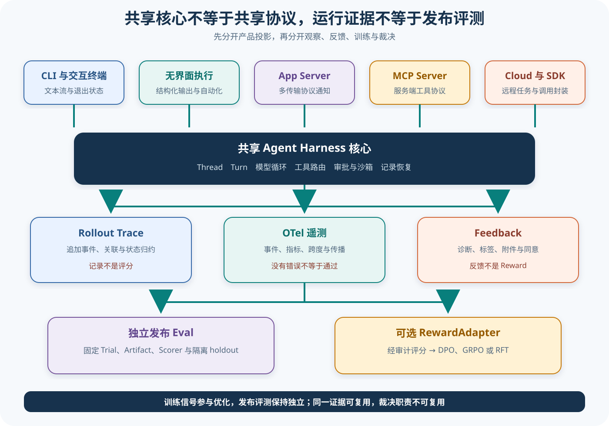

# Codex 产品表面、证据通道与评测设计

## 读者会得到什么

Codex 的 CLI、交互终端、无界面执行、App Server、MCP Server、Cloud 与 SDK 可以共享核心 Thread、Turn、模型和工具链，却通过不同命令、传输与协议投影对外。共享核心不代表事件名、停止语义、错误载荷或能力集合完全相同。

投影不是原始事件。共享也不是等价。

本篇同时分开三类证据通道：Rollout Trace 记录可重放的运行关联，OTel 输出遥测事件和指标，Feedback 收集诊断与用户反馈。三者都能帮助分析，却都不是训练 Reward，也不是独立发布 Eval。观察不是评分。反馈不是门禁。

遥测会有缺口。反馈会有偏差。裁决必须独立。产物必须核对。

## 核心概念

产品表面决定外部调用者怎样提交工作、接收增量、取消和解释终态；证据通道决定运行信息怎样被保存或外发；Eval 决定固定任务怎样产生可比较判定。这三组职责可以共享 Thread 与 Turn 身份，但没有哪一组天然拥有另外两组的完整语义。

| 对象 | 面向谁 | 主要输出 | 不应直接推出 |
|---|---|---|---|
| CLI / TUI | 人类终端用户 | 文本流、界面状态、退出行为 | App Server 协议完全相同 |
| 无界面执行 | 自动化进程 | stdout、stderr、退出码 | 产物一定正确 |
| App Server | 应用客户端 | JSON-RPC 响应与通知 | 核心事件无损暴露 |
| MCP Server / SDK | 工具消费者与程序 | 协议调用、资源或事件 | 支持所有交互审批 |
| Rollout | Thread 恢复与审计 | 追加会话项 | 外部世界完整状态 |
| Rollout Trace | 因果与重放分析 | raw event、bundle、reducer | 任务通过 |
| OTel | 可观测平台 | span、event、metric | 无遥测即无执行 |
| Feedback | 用户与诊断渠道 | 文字、标签、附件 | 训练 Reward 或发布分数 |
| Eval | 质量与发布决策 | Trial、Artifact、Score | 训练数据可同时当 holdout |

协议投影会选择、重命名、合并或丢弃核心事件。终端适合人读的增量文本，App Server 需要稳定 JSON-RPC 关联，无界面执行需要进程退出契约。共享核心只保证它们可以追溯到同一 Thread / Turn，不保证停止枚举、错误载荷和能力集合一致。

Rollout 与 Trace 也不同。Rollout 服务会话恢复和模型历史投影，Trace 侧重跨请求、工具和压缩的因果关联；reducer 再从 raw event 生成派生状态。任何 reducer 输出都应能回到原事件版本，不能用派生快照覆盖权威记录。

OTel 适合性能、错误和跨服务关联，但受采样、Exporter、脱敏与网络影响。它是旁路观察：发送失败通常不应改变产品结果，权威会话写入失败则可能阻断继续。评测不能把「未见 error span」当成正确性证明。

Feedback 表达体验、偏好或诊断线索。它可能有选择偏差、重复提交、界面位置效应和敏感附件；只有经过去重、归因、隐私处理和显式 RewardAdapter，才能获得训练语义。独立发布 Eval 使用固定 Dataset、Target、Scorer 和未参与训练的 holdout。

证据完整性与数据最小化需要同时满足。Trace、OTel 和 Feedback 可能包含路径、命令、模型输入或附件，公开或集中上传前应脱敏、设定保留期和访问控制；脱敏规则版本进入 Artifact。删除敏感正文后仍保留不可逆哈希与关联 ID，支持核对而不泄露内容。

协议版本也是 Target 条件。App Server 新增通知或改变错误映射时，旧客户端可能丢字段；surface adapter 应协商版本并保存实际选择。不同版本的运行不能只按同一「App Server」标签合并，否则兼容差异会被误判为模型波动。

## 为什么这样设计

第一，共享核心、分离表面可以复用 Agent Loop、安全和持久化，同时让终端与应用协议各自演进。若所有入口直接暴露内部事件，内部重构会破坏客户端；若每个表面复制核心，停止和审批语义会漂移。

第二，产品输出与证据通道分开，使展示优化不会删掉审计信息。TUI 可以合并 chunk 或隐藏内部事件，Rollout / Trace 仍保存关联；证据通道故障也不会让界面凭空显示成功。

第三，Trace 与 OTel 并存，是因为可重放因果和运营遥测的保留、Schema 与性能预算不同。Trace 可针对单个 Thread 形成完整 bundle，OTel 更适合跨服务聚合与指标；把二者合并会在完整性和成本之间失去明确契约。

第四，Feedback 独立于 Eval，防止用户偏好直接成为正确答案。反馈可以帮助发现新失败模式或构建训练数据，Scorer 则按预先固定的任务规则判断；同一信号若既训练又裁判，会造成数据泄漏。

第五，多 crate 边界限制依赖与所有权，但需要桥接测试锁定语义。入口、协议、Trace、OTel 与 Feedback 可以独立版本化，适配器必须保存关联键和错误映射；否则包都能编译，端到端证据仍可能断链。

第六，按 surface 分层报告 Eval，避免把协议能力差异归因给模型。无法交互审批的自动化表面与 TUI 不应直接混合成功率；Target 记录表面、版本、权限和工具集合，比较才有意义。

## 实现思路

教学接入层以 `RunEnvelope` 贯穿表面、核心证据和 Eval。它是课程蓝图，不表示 Codex 源码存在同名统一对象。

1. **冻结 Target。** 记录源码、模型、surface、传输、配置、权限、工具表和工作区，生成 TrialId 与 run ID。
2. **适配输入。** 将 CLI 参数或 JSON-RPC 请求映射为核心 Op，保存外部 request ID、ThreadId 和 TurnId 的对应关系。
3. **投影输出。** 为每个核心事件声明保留、合并、重命名或丢弃规则；停止原因映射使用封闭测试表。
4. **写权威证据。** Rollout 和外部 Artifact 使用追加提交点，Trace 关联模型、工具与压缩；失败不得被界面文字覆盖。
5. **发送旁路遥测。** OTel 传播 trace context，记录采样和 Exporter 状态；缺口在证据中显式标记。
6. **收集 Feedback。** 验证同意、脱敏、目标身份与附件大小，保存版本和撤回，不直接写 Score。
7. **独立评分。** Scorer 在隔离环境检查产物、轨迹和安全约束；基础设施恢复记 Attempt，产品失败保持 Trial fail。
8. **训练适配。** 只有完整 RewardAdapter 契约才能输出 DPO / GRPO / RFT 信号，发布 holdout 与训练快照隔离。

```text
target = freeze(surface, transport, model, permissions, tools)
core_run = surface_adapter.submit(target.input)
surface_output = project(core_run.events, mapping_version)
artifacts = collect(rollout, trace, workspace, surface_output)
telemetry_status = export_best_effort(core_run)
trial = bind(dataset_item, target, artifacts)
score = independent_scorer(trial)
```

映射表要对每种核心终态给出表面响应、退出码和错误载荷。新增内部枚举却没有映射时，兼容测试失败，不能静默落到成功。相反，表面为了兼容压缩多个原因时，Eval Adapter仍保存原始终态，避免信息损失污染统计。

证据 Schema 至少保留 ThreadId、TurnId、request ID、tool call ID、Trace ID、Artifact hash 和 Scorer version。公开材料对敏感值脱敏，但身份关系不丢。OTel 采样率、Trace writer 是否启用、Feedback 是否授权也进入运行条件。

Scorer 不读取模型自报完成或用户点赞作为答案。代码任务在干净检出应用补丁并运行固定测试，安全任务检查允许副作用集合，协议任务比较映射契约。多个分数需要预先定义聚合和失败门槛，不能运行后选择最有利指标。

## 贯穿案例

同一任务「修改解析器并通过测试」分别经无界面执行和 App Server 运行。模型、源码和权限固定，Target 只改变 surface；两条 run 都开启 Rollout Trace，OTel 采用 50% 采样，Feedback 仅在 App 客户端可用。

1. **冻结两个 Trial。** Dataset item 相同，surface 分别为 exec 与 app-server，映射版本、传输和工具表写入 Target。
2. **提交核心运行。** exec 通过进程参数创建 Thread，App Server 通过 JSON-RPC request ID 创建 Thread；两者各自关联 TurnId。
3. **执行工具。** 核心产生相同类型的模型、审批和工具事件，Rollout / Trace 保存原始身份；产品表面投影不同。
4. **观察终态。** exec 返回退出码 0 与最终文本，App Server 返回成功响应和通知；其中 App run 的测试实际失败。
5. **处理证据缺口。** App run 因 OTel 未采样没有 span，但 Trace 和 Rollout完整；不得据遥测缺失判未执行。
6. **独立评分。** Scorer 在干净检出运行测试，exec pass、App fail；协议成功不覆盖产物失败。

```json
{"trial":"app-12","surface":"app-server","rpc":"success","coreStop":"completed","otel":"not-sampled","artifactTest":"fail"}
```

```json
{"trial":"app-12","score":0,"reason":"固定测试失败","feedbackUsedAsAnswer":false,"scorerVersion":"v2"}
```

Feedback 变体中，用户给 App 最终消息点正反馈，因为文字清楚；这条偏好保存并可用于体验分析，不能把失败 Trial 改成通过。若未来用于训练，RewardAdapter 要说明目标是表达质量还是代码正确性，并使用独立标签解决归因。

协议映射反例新增内部 `blocked` 终态，而 App 适配器仍默认返回普通成功。契约测试应立即失败；临时兼容也必须在 Artifact 中保存原始 blocked。否则表面绿色会系统性掩盖审批不可用。

最后比较多 crate 桥接：关闭 Trace writer、让 OTel Exporter 失败、拒绝 Feedback 上传，核心任务仍按自身结果结算，各通道分别记录缺口。在这套教学实验策略中，只有 Rollout 权威写入失败才因无法保证恢复证据而停止；这不声称锁定 Codex 的所有表面和配置采用同一故障处置。这组故障注入把运行、观察与评分责任彻底分开。

隐私反例让 Feedback 附件包含凭据。上传器在网络发送前拒绝或脱敏，原 Trial 的产品结果保持不变；若诊断证据因此不足，复核状态写为 partial，而不是为了完整性泄露秘密。数据治理本身也需要可测试的失败路径。

## 真实输入与输出

### 输入

CLI 流测试向本地模拟 Responses 服务提交一次真实命令行会话；App Server 可选择标准输入输出、Unix Socket 或 WebSocket 传输。OTel 测试注入正常完成、解析错误和流提前关闭：

```text
同一核心 Turn → CLI 流输出或 App Server 通知
同一模型流 → 成功事件、失败事件与用量属性
```

Feedback 路径则捕获诊断日志、结构化标签和可选附件，上传前仍受同意与脱敏边界约束。

### 输出

CLI 可以输出面向终端的流式投影并追加 Rollout；App Server 通过 JSON-RPC 消息和通知路由到客户端；OTel 记录请求、流事件、工具决定、沙箱结果与用量；Trace bundle 保存追加事件并可归约状态；Feedback 形成诊断快照和附件。

```text
产品输出：供用户或客户端消费
运行证据：供调试、分析和关联
评测结果：由独立 Scorer 对固定 Trial 产出
```

这三种输出不能互换。

## 调用链

共享核心，分离投影；共享证据，独立评分。



Claim: codex.surfaces.protocol-projections-not-identical

Claim: codex.feedback-trace.is-not-release-eval

Claim: codex.architecture.multi-crate-boundaries-have-tradeoffs

1. CLI 解析交互、Exec、MCP Server、App Server、Cloud、Resume、Fork 与调试命令，再把控制权交给相应 surface adapter。不同入口先决定配置、传输、认证和输出协议。
2. 适配器把外部请求映射到共享 Thread、Op、Event、Turn、模型与工具核心；核心事件再被 CLI 文本流、TUI 状态或 App Server JSON-RPC 通知投影。投影可能隐藏、合并或重命名内部事件。
3. Rollout Trace 在热路径记录线程、推理、工具、MCP 与压缩的关联事件，追加到 bundle 后可重放和归约。它面向因果分析，不负责判断任务是否正确。
4. OTel 记录 span、事件、指标和传播上下文。事件可以区分响应完成、解析失败、工具结果与沙箱结局，但遥测缺失或采样不能改写原始任务事实。
5. Feedback 从 tracing layer 捕获诊断日志和结构化元数据，并按选项附加脱敏诊断、Rollout 或缓存信息。用户反馈表达观察或偏好，不自动形成可训练标量。
6. Eval Adapter 把固定 Trial、目标、产物和原始证据交给独立 Scorer。训练 RewardAdapter 可从已审计评分派生 DPO、GRPO 或 RFT 信号；发布门禁仍应使用隔离 holdout 和独立评测。
7. 多 crate 边界让协议、存储、沙箱、Trace、Feedback 和表面适配器可独立演进，也增加跨 crate 配置、Feature、版本与语义漂移成本。架构图必须标出这些桥接点。

## 源码证据

CLI 枚举多个产品与管理入口，而不是只有一个交互命令：

```source
codex-rs/cli/src/main.rs:126-223
Exec(ExecCli), McpServer(...), AppServer(...), Resume(...), Fork(...), Cloud(...)
```

App Server 支持多种传输并维护独立输入、处理和输出循环：

```source
codex-rs/app-server/src/lib.rs:158-167,733-763
run_main_with_transport_options uses two loops/tasks
AppServerTransport::Stdio ... UnixSocket ... WebSocket ...
```

Trace crate 明确拥有追加事件 Schema、writer 与 reducer：

```source
codex-rs/rollout-trace/src/lib.rs:1-3,47-78
Trace bundle format, writer, and reducer for Codex rollouts.
pub use raw_event::RawTraceEvent; pub use writer::TraceWriter;
```

OTel 暴露 SessionTelemetry、运行指标和 W3C 上下文传播：

```source
codex-rs/otel/src/lib.rs:16-40
pub use ... SessionTelemetry;
pub use ... RuntimeMetricsSummary;
pub use ... inject_span_w3c_trace_headers;
```

Feedback 保存诊断快照并上传可选附件，其职责是问题反馈而非评分：

```source
codex-rs/feedback/src/lib.rs:175-257,360-427
pub struct CodexFeedback ...
pub fn snapshot(...) -> FeedbackSnapshot ...
pub async fn upload_feedback(...)
```

第一条 Claim 使用 B 级，由入口分派、App Server 传输和 CLI 流上游测试支持。后两条使用 D 级：证据 crate 的职责由源码锁定，但把它们映射到独立 Eval 与多 crate 取舍属于架构推断；仓库没有内置完整发布门禁或训练 RewardAdapter。

## 失败与限制

表面共享核心不等于协议等价。CLI 的退出码、文本流和终端信号，App Server 的 JSON-RPC 错误与通知，Cloud 的任务状态都需各自映射。只验证一个表面不能替另一个表面签字。

Trace 不是原始世界。Trace writer 可能关闭、事件可能受版本或采样影响，reducer 还是派生状态；文件存在只能证明记录通道产出，不能证明任务满足用户目标。

Telemetry 不是完整审计。OTel 适合关联、性能和运行指标，但 exporter 配置、采样、脱敏和网络故障都会造成缺口。发布评测不能以「没有错误 span」替代产物检查。

Feedback 不是 Reward。正负反馈可能受选择偏差、界面、用户预期和诊断上下文影响；附件还可能包含敏感信息。未经 Schema、归因、去重、对抗审计与独立标签，不应直接进入训练。

训练 Reward 也不是发布 Eval。训练可使用经审计的偏好或可验证奖励优化模型，但 checkpoint 选择与最终发布必须使用隔离数据。否则同一信号既训练又裁判，会高估泛化。

多 crate 不是天然优点。清晰边界能限制依赖与所有权，过细拆分也会让 Feature、错误类型、协议版本和测试夹具在多个包漂移。评审要看真实调用链，而不是按 crate 名猜能力。

## 验证方法

先用同一固定输入运行 CLI、无界面执行和 App Server，保存原始核心事件、各表面输出、退出状态与取消结果。建立映射表，逐项标记保留、合并、重命名和丢弃字段。

再开启 Trace 与 OTel，给 Thread、Turn、模型请求、工具调用和审批使用稳定关联键。注入流关闭、解析失败、工具拒绝与沙箱错误，确认 Trace、遥测与产品输出能关联，但缺少任一通道时不会伪造成功。

随后测试 Feedback：检查用户同意、脱敏、附件大小、路径读取失败和上传拒绝。反馈记录应引用 Trial 与证据，而不是只保存自由文本；进入训练前必须经过独立标签和数据治理。

最后建立 Eval：Dataset 固定 Trial，Target 调用某个明确表面，Artifact 保存产物与原始证据，Scorer 独立判断。RewardAdapter 只消费经审计评分；发布 holdout 与训练数据隔离，并单独报告每个 surface 的结果。

## 自检

### 问题 1

CLI 与 App Server 共享核心，是否可以只测试 CLI？

**答案：** 不可以。两者的传输、协议投影、错误和停止语义不同，共享核心只能复用部分证据。

### 问题 2

Trace 能完整重放，是否就能判断任务通过？

**答案：** 不能。Trace 提供运行关联和派生状态，任务正确性仍需对目标产物和副作用独立评分。

### 问题 3

用户点击正反馈，可以直接作为训练 Reward 吗？

**答案：** 不应直接使用。必须处理归因、偏差、去重、隐私和标签质量，再由显式 RewardAdapter 转换。

### 问题 4

训练 Reward 很高，为什么还需要独立发布 Eval？

**答案：** 训练信号参与了优化，会产生适配偏差；隔离 holdout 才能检验未见数据上的任务质量与安全边界。
