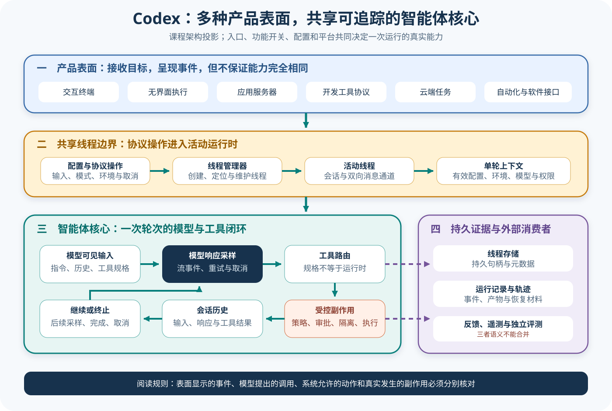
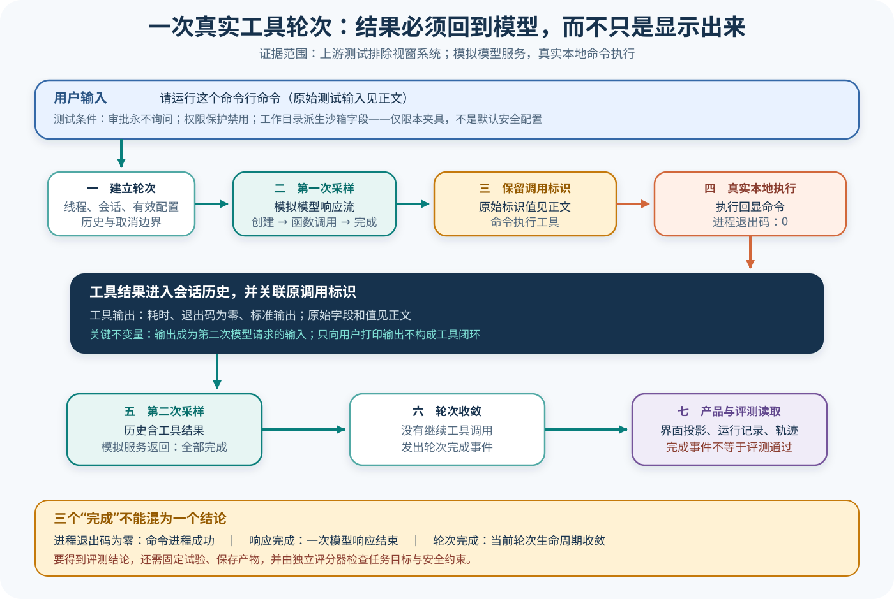

# Codex 源码课程

[返回学习入口](../../00-start-here.md)

Codex 的公开仓库以 Rust 核心为中心，同时服务 CLI、无头执行、IDE 和应用协议。课程关注的不是某个界面怎样使用，而是 Thread、Turn、模型请求、工具路由、执行策略、Sandbox、事件和持久化怎样连接成同一项任务。



## 这条课程适合谁

如果你想理解强类型事件、异步任务和多产品表面怎样共享 Harness 核心，这条路线很合适。即使你不熟悉全部 Rust 语法，也可以跟着文章理解 enum、trait、async channel 等结构在调用链中的作用。

## 锁定来源

课程基于 Codex 提交 `c9b19deb09c1841ce7acc33ddb96276030936a29`：

- [CLI 入口](https://github.com/openai/codex/blob/c9b19deb09c1841ce7acc33ddb96276030936a29/codex-rs/cli/src/main.rs)
- [ThreadManager](https://github.com/openai/codex/blob/c9b19deb09c1841ce7acc33ddb96276030936a29/codex-rs/core/src/thread_manager.rs)
- [Turn 状态](https://github.com/openai/codex/blob/c9b19deb09c1841ce7acc33ddb96276030936a29/codex-rs/core/src/session/turn.rs)
- [工具路由](https://github.com/openai/codex/blob/c9b19deb09c1841ce7acc33ddb96276030936a29/codex-rs/core/src/tools/router.rs)

## 先看一项任务

用户提交代码修改目标后，某个产品表面创建或恢复 Thread，再向核心提交 Turn。核心构造模型输入，解析响应中的工具请求，经策略与执行环境处理后把结果写回同一任务。事件流同时驱动界面和持久化。

```text
CLI / App / IDE
  → ThreadManager
  → Thread 与 Turn
  → Model Client
  → Tool Router
  → Policy / Sandbox / Execution
  → Event 与 Thread Store
```



图中把产品表面压缩成同一个入口，是为了突出共享核心，它并不表示 CLI、应用和 IDE 拥有完全相同的交互协议。

## 仓库地图

| 区域 | 首轮关注点 |
| --- | --- |
| `codex-rs/cli` | CLI 如何选择交互、exec 和其他表面 |
| `codex-rs/core` | Thread、Turn、模型、工具与事件主链 |
| `codex-rs/core/src/tools` | 工具发现、路由和各类 Handler |
| Sandbox 与 exec policy 相关 crate | 命令审批和环境隔离怎样分工 |
| `codex-rs/protocol` 与 app-server | 多客户端怎样交换任务和事件 |
| `codex-rs/thread-store` | Thread 历史怎样持久化与查询 |

首轮跳过 UI 渲染、安装器、Provider 边缘兼容和与当前任务无关的 Connector。

## 三层读法

- **Starter**：读配置、Thread/Turn 和工具循环，先跟完一个工具请求。
- **Builder**：继续追踪执行策略、审批、Sandbox、Rollout 和压缩，解释状态怎样跨轮演化。
- **Maintainer**：阅读多表面、子代理与事件章节，并从测试检查并发顺序、错误分类和恢复边界。

## 阅读顺序

这八篇沿一项任务逐层追问：模型看见什么，这些输入在哪一层运行，行动如何发生，最终结果又怎样被独立核对。

1. [配置、项目指令与模型输入](01-config-prompt-context.md)从模型实际看见的内容起步，把配置、项目指令、历史和工具投影为一次模型请求。它留下「这次请求落在哪一层生命周期」的问题，为下一篇划定入口。
2. [Thread、Task 与 Turn](02-thread-task-turn.md)接住这个运行边界问题，分清 Thread、Session、Task、Turn 与 Op/Event。边界明确后，下一篇才能在当前 Turn 内追踪 Function Call 的去向。
3. [模型响应与工具循环](03-model-tool-loop.md)沿当前 Turn 继续追踪模型输出，经 Tool Router、Handler 和有序结果回填形成再次采样的闭环。工具一旦走到 Shell，下一篇便要回答它能以什么权限执行。
4. [执行策略、审批与 Sandbox](04-exec-policy-sandbox.md)接住命令权限问题，分开 Exec Policy、用户审批与实际隔离。进程结束后，这些安全决策和执行结果如何留下证据，成为下一篇的起点。
5. [Rollout、历史、压缩与恢复](05-rollout-history-memory.md)沿执行后的证据继续走，分清完整 Rollout、模型可见历史、Compaction 与跨线程 Memory。历史怎样接续清楚以后，下一篇再检查当前任务如何获得扩展能力。
6. [扩展表面与 Code Mode](06-extensions-code-mode.md)接住「当前任务还能使用什么」的问题，区分 Skill、Hook、Plugin、MCP 与 Code Mode 介入的层次。单个 Agent 的能力面理清后，下一篇转向多个独立 Thread 怎样协作。
7. [子代理与编排](07-subagents-orchestration.md)把单 Agent 的工具调用推进到 Thread 树，解释父子身份、状态、通信、等待、打断与回收。树内控制厘清后，下一篇把视线移到 CLI、Exec、App Server 等树外表面及其证据投影。
8. [事件、Trace 与 Eval 接缝](08-surfaces-trace-eval-design.md)接住多表面怎样共享核心的问题，继续追到 Event、Rollout Trace、OTel 与 Feedback。最后由 Codex 运行之外的测试和显式 Evaluator 核对结果，收束这条从模型输入到独立判定的链条。

## 用贯穿任务复盘

把运费任务映射为一条 Codex 链：产品表面创建或恢复 Thread，用户输入形成 Turn，项目指令和工具进入模型请求，Tool Router 分派读取、编辑和测试，Exec Policy/审批/Sandbox 分别做判断，Rollout 与 Thread Store 保存事件。最后说明为什么 Turn 正常结束只能证明生命周期收敛——不能替代目标测试判定。

复盘时特别检查两种顺序：并发工具的实际完成顺序，以及写入模型历史的确定顺序。它们不必相同，但 Call ID 和因果关系必须保持。

## 完成课程后应该能回答

- Thread、Turn 和产品表面分别拥有哪部分状态；
- 模型工具请求怎样进入 Router 和具体 Handler；
- 产品策略、用户审批和 Sandbox 在哪里分开；
- 事件怎样同时服务界面、SDK 和历史存储；
- 压缩与恢复怎样影响下一轮 Context；
- 哪些测试能够核对工具和任务主链。

[从第一篇开始：配置、项目指令与模型输入](01-config-prompt-context.md)
