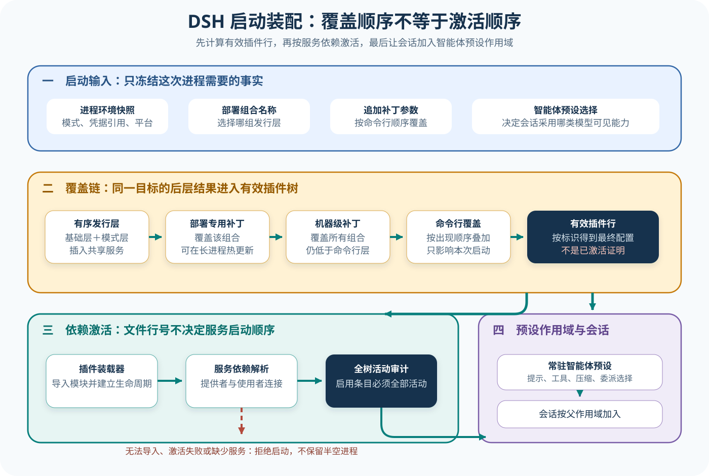

# DSH 启动、组合与 Agent 预设

## 读者会得到什么

这一课解释一条容易被目录结构掩盖的事实：DSH 不是先启动一个固定 Agent，再从配置里改几个选项；它先把多个补丁层合成有效插件行，由 Cordis Loader 解析服务依赖并激活插件树，之后才由 agent preset 决定某类会话中的 persona、模型可见工具、压缩和委派能力。启动组合就是产品行为的一部分。

读完后，你应能区分 bundle、profile、补丁、有效插件树和 agent preset。你也会知道三类失败应该去哪一层查：补丁没有命中是组合问题，插件无法导入是装载问题，插件等待缺失服务是激活问题；它们都发生在一次正常 Agent Turn 之前。

先算出这次到底装了什么。

## 核心概念



Claim: deepseek-harness.boot.profile-preset-composition

| 概念 | 所属层 | 决定什么 | 不代表什么 |
| --- | --- | --- | --- |
| bundle | 发行组合 | 提供一组可复用 Patch | 最终有效配置 |
| profile | 部署组合 | 选择有序 bundle 与用户层 | Agent 身份 |
| overlay Patch | 配置变换 | 插入、覆盖或调整 Entry | 插件已经激活 |
| Entry / Fiber | Loader 运行时 | 配置行与活动插件实例的对应 | 文件顺序就是启动顺序 |
| host composition | 进程宿主 | 注册表、模型路由、持久化与安全服务 | 某个 Agent 已选择全部服务 |
| agent preset | Agent 平面 | persona、Prompt、工具和委派选择 | 独立进程或完整宿主 |

一个 profile 是部署组合，不是 Agent 身份。锁定源码把 profile 放在 Harness home 下：其 `package.json` 的 `dsh.profile.bundles` 保存有序 bundle 名称，自己的 `cordis.patch.yml` 作为用户层。`loadProfile()` 按清单顺序解析每个 bundle 声明的 patch，然后读取 profile patch；CLI 启动还会继续叠加 home 级 patch、按参数顺序出现的 `--patch` 覆盖和由启动标志导出的补丁。

顺序有语义。上游测试用 bundle-a 插入 `id: a`，bundle-b 把它改成 `v: 2`，profile 层再改成 `v: 3`，最终断言有效行是 `v: 3`。这证明后层能覆盖前层的同一目标；它不等于任意 YAML 都会深合并。DSH 的 patch 算法按 id 处理行，`config` 的替换行为和 group child 的可见性要以同一次 `applyEntryPatches` 为准。

bundle 是发行单元。它通过包清单的 `dsh.bundle.patch` 指向一份补丁文件；base bundle 插入 LLM、Session、Agent、持久化、安全和各类注册表等宿主共享行，web 或 headless bundle 再覆盖模式差异。profile 只决定按什么顺序采用哪些 bundle，并在其上添加部署者自己的修改。

agent preset 是另一条轴。standard preset 文件明确把自己称为 agent-plane composition：它贡献 persona、AGENTS 指令、shell 与文件工具选择、技能、计划模式、压缩和委派工具。注册表本体、模型路由、持久化、Sandbox 和审批堆栈仍留在 host composition。会话通过 scope 父链加入已经挂载的 preset，因而共享 preset 的能力选择，但会话状态继续按 Session 或 Agent 分开保存。

不要把 profile 和 preset 合成一个词。profile 决定进程有哪些服务及部署覆盖，preset 决定某类 Agent 在这些服务上选择哪些模型可见能力；一个宿主可以挂多个 preset，而同一 preset 也依赖 profile 已经提供的宿主服务。图中把它们画成先后链，是启动到会话的观察顺序，不宣称两者只能一对一。

最后是激活。`boot()` 创建 Context 与 Loader，挂载根 include，把补丁交给同一配置树，等待条目稳定，再审计每个启用条目的 fiber。条目没有 fiber、激活失败或仍在等待注入服务都会拒绝启动；只有明确 disabled 的条目可以没有活动 fiber。这样可以避免进程以「部分插件没起来但仍退出 0」的半空状态伪装成功。

## 为什么这样设计

第一，bundle 把产品发行能力与具体部署分开。基础能力可以作为共享补丁发布，web、headless 或组织 profile 再按顺序覆盖；升级公共 bundle 时不必复制整份配置，部署差异也能单独审计。

第二，Patch 顺序与服务依赖承担不同责任。顺序决定同一 Entry 最终长什么样，Cordis 注入关系决定插件何时激活。若用 YAML 行号推断启动顺序，异步服务依赖会被误诊；若只看依赖，又解释不了后层为何覆盖前层。

第三，host 与 preset 分轴让一个进程承载多类 Agent。持久化、模型路由和审批服务可以共享，persona、工具与压缩策略按 preset 选择。这个结构减少重复宿主，也要求 scope 边界防止会话状态或工具选择串线。

第四，启动后审计把「配置可解析」提升为「启用插件均已活动」。导入失败、激活异常和等待缺失服务会在正常 Turn 前暴露，避免半成品进程继续接受任务并产生难以解释的局部失败。

这种设计也支持安全恢复。配置转储可以在不启动完整产品树时解释损坏层，部署者先修正组合，再重新进入激活；诊断命令不会因为加载网络、终端或持久化插件而制造新的副作用。

最终得到的是可解释、可复现且能拒绝半启动状态的装配过程。

## 实现思路

下面是配置驱动 Harness 启动器的教学蓝图。DSH 的真实 Patch、Loader 与 preset 证据来自锁定源码；provenance 清单和运行快照是课程建议的可观测补强。

1. **冻结启动输入。** 在创建插件树前解析 Harness home、profile、模式、命令行 Patch 与平台，保存匿名化 RunSpec。
2. **加载有序层。** 验证每个 bundle 包和声明，按 profile 顺序读取 Patch，再追加 profile、home、命令行和标志派生层。
3. **组合并记录来源。** 对同一 Patch 算法计算有效 Entry；每次插入、覆盖、跳过都记录来源层与目标 ID。
4. **挂载 Loader。** 解析插件模块并根据服务注入驱动 Fiber，不用文件顺序替代依赖关系。
5. **等待稳定并审计。** 启用 Entry 必须有活动 Fiber；失败和 pending 都携带插件与缺失服务，启动整体拒绝。
6. **挂载 preset 并创建会话。** preset 只选择 Agent 平面能力；Session 绑定 preset 与有效宿主快照，二者分开保存。

```text
层 = bundles(profile顺序) + profile + home + cli_overlays + flags
有效Entry, provenance = applyEntryPatches(空树, 层)
loader.mount(有效Entry)
await loader.stable()
如果 存在 enabled 且 fiber 非 active: 启动失败(原因与缺失服务)
host.mount(agent_presets)
session = host.create(preset_id, effective_config_hash)
```

实现要提供 `explain entry-id` 一类诊断：显示最终值、最后修改层、被跳过 Patch 和活动 Fiber。只有源 YAML 而没有有效树，无法判断安全设置到底是否生效。

热更新必须带能力边界。只允许重算用户层的变化应生成新有效哈希，并标出哪些 Entry 已重新挂载；启动来源、进程环境和不可安全替换的宿主服务则要求重启。磁盘内容变化不能直接宣称活动配置变化。

失败清理同样属于启动器责任。任一 Fiber 激活失败时，已创建的终端、watcher、连接和临时目录都应按反向所有权释放；清理结果进入启动 Artifact，避免下一次重试被旧资源污染。

## 贯穿案例

设想部署者用 base 与 headless 两个 bundle，profile 把模型路由改为测试 Provider，并为 reviewer preset 只开放只读工具。案例沿启动到会话验证组合与激活不是同一状态。

1. **组合 bundle。** base 插入 `model-router` 与 `sandbox`，headless 覆盖终端表面；provenance 显示两层目标和顺序。
2. **应用 profile。** profile 把 `model-router.config.provider` 改为 test，并保留 sandbox；有效树哈希从 C1 变为 C2。
3. **发现激活失败。** reviewer preset 依赖 `tool-registry`，但 profile 错误禁用该 Entry；Loader 稳定后显示 preset Fiber pending，启动拒绝，不创建 Session。
4. **修复并重启。** 恢复 tool-registry，所有启用 Fiber active；reviewer preset 挂载，Session s1 加入其 scope。
5. **核对能力。** s1 的模型上下文只含 Read / Grep，而 Sandbox、持久化和模型路由来自 host；独立 Artifact 保存 preset ID 与有效树哈希 C3。

```json
{"profile":"ci","layers":["base","headless","profile"],"effectiveHash":"C2","pending":[{"entry":"reviewer","missing":"tool-registry"}]}
```

```json
{"profile":"ci","effectiveHash":"C3","fibers":"all-active","session":{"id":"s1","preset":"reviewer","visibleTools":["Read","Grep"]}}
```

若只检查 YAML 解析，C2 会被误报成功；若只检查 s1 的工具列表，又无法证明 Sandbox Fiber 活动。案例的完成条件同时要求有效值、活动服务和会话可见能力，三者分别核对。

再把 profile Patch 的目标 ID 拼错。组合器应把它记录为 skipped，最终 Provider 仍来自 base；如果系统只检查进程退出码，这个错误会潜伏到真实模型调用。对抗测试因此还要断言关键覆盖确实改变了目标值。

最后并行创建 reviewer 与 writer 两个 Session，检查它们共享 host 服务却得到不同工具与 persona；任何 Session 状态或 preset 工具串线都应阻断发布。这一步验证多 preset 是同宿主上的隔离选择，而非两个独立进程。

## 真实输入与输出

### 输入

上游 `profile.spec.ts:121-137` 构造了一个最小可重复配置。第一层插入插件行，第二层覆盖配置，profile 自己的 patch 再覆盖一次：

```yaml
# bundle-a
- insert:
    - id: a
      name: pkg-a

# bundle-b
- id: a
  config:
    v: 2

# profile/cordis.patch.yml
- id: a
  config:
    v: 3
```

这不是伪造的产品配置格式，而是上游测试直接写入临时 bundle 与 profile 的内容。测试同时把 profile manifest 的 bundle 顺序固定为 `['bundle-a', 'bundle-b']`，所以可以把最终值归因到明确的层顺序。

### 输出

同一测试调用 `loadProfile()` 和 `composeEntries()` 后，直接断言有效插件行如下：

```json
[{"id":"a","name":"pkg-a","config":{"v":3}}]
```

输出是「将要挂载的有效行」，不是已激活服务证明。只有 Loader 成功导入 `pkg-a`、满足注入依赖并让 fiber 进入活动状态，启动才完整。真实 CLI 还可能在 profile 层之后叠加 home 级 patch、命令行 overlay 和标志补丁，因此排错时要导出整棵有效配置，而不能只打开某一份源 YAML。

有效不等于活动。

## 调用链

1. 启动器解析进程环境、profile 名、`--patch` 路径和模式标志；启动专用环境变量必须在插件树挂载前冻结，不能靠后加载的项目 `.env` 偷改启动来源。
2. `loadProfile()` 找到 profile 清单；对已发行模板可按规则初始化，对未知且不存在的 profile 直接报错，不默默生成空配置。
3. 代码按 `dsh.profile.bundles` 顺序解析每个 bundle 包，读取其 `dsh.bundle.patch`；包无法解析或没有 bundle 声明时 fail loud。
4. 启动器依次拼接 bundle patches、profile patch、home 级 patch、命令行 overlays 和标志派生 patch，用同一次 patch 算法得到有效 entry list。
5. 根 include 把有效补丁挂到 Cordis Loader；相对插件名按配置目录解析，打包宿主可为 bare 包名提供明确解析锚点。
6. Loader 按服务可用性驱动条目生命周期，而不是按 YAML 行号串行启动。宿主准备发生在配置树条目挂载前，供插件读取冻结的启动参数和共享服务。
7. 树稳定后，启动审计拒绝无法导入、激活抛错或持续等待缺失服务的条目；部分 Context 会被释放，错误保留插件名和深层原因。
8. agent preset 作为常驻 scope 挂载；新会话选择 preset 后通过父 scope 获得 persona、Prompt section 和工具注册，但 Session 数据仍按自己的身份保存。

顺序用于覆盖。依赖用于激活。两者不能混写。

## 源码证据

profile 的实际加载和组合入口如下：

```source
packages/boot/app-boot/src/profile.ts:371-416
const bundles = manifest.dsh?.profile?.bundles ?? []
const layers = bundles.map((packageName): ProfileLayer => {
  const packageDir = resolveBundleDir(binName, packageName, installAnchor, dir)
  const declared = bundleManifest.dsh?.bundle?.patch
  if (declared === undefined) throw new Error(...)
  return { packageName, packageDir, patchPath, patches: loadOverlayPatches(...) }
})
const patches = options.userLayer !== false && existsSync(patchPath)
  ? loadOverlayPatches(binName, patchPath)
  : []
return applyEntryPatches([], structuredClone(layers.flat()), ...)
```

上游测试把覆盖顺序锁成可执行断言：

```source
packages/boot/app-boot/tests/profile.spec.ts:121-137
expect(profile.layers.map(layer => layer.packageName)).toEqual(['bundle-a', 'bundle-b'])
const entries = composeEntries([
  ...profile.layers.map(layer => layer.patches),
  profile.patches,
])
expect(entries).toEqual([{ id: 'a', name: 'pkg-a', config: { v: 3 } }])
```

激活门禁则在 `packages/boot/app-boot/src/index.ts:658-724`。它先找出没有 fiber 且未禁用的条目，再读取活动、失败和等待状态；等待状态会列出缺失服务。上游 `packages/boot/app-boot/tests/app-boot.spec.ts:719-724` 断言无法导入的插件拒绝启动，`774-781` 断言等待 `neverProvided` 服务的插件也拒绝启动。

Claim 保持 D 级。bundle/profile 顺序由源码与测试直接证明，standard preset 的 agent-plane 与 host-plane 边界由真实配置直接说明；把两条轴放入一张「进程组合→会话加入」的课程模型属于跨文件推断。要核对某次实际运行，仍需读取最终有效树和选中的 preset。

## 失败与限制

第一，patch 目标不存在时不一定和插件导入失败表现相同。`composeEntries()` 可以报告 skipped patch；若日志被忽略，部署者可能误以为覆盖已生效。验证要检查目标 id 是否存在以及最终行是否真的改变，不能只看补丁文件解析成功。

第二，配置求值有时序。`!!js` 表达式依赖启动时环境；profile 热重载只重算被允许的用户层，不会合理地重新定义已经决定进程来源的启动变量。把需要重启的变化误当热更新，会得到「磁盘内容已改、活动服务没变」的错觉。

改配置不等于已生效。

第三，Loader 按依赖激活，不按文件行号。把某个 provider 写在 consumer 前面不能保证它先完成；正确契约是服务注入能否解析。反过来，pending 条目可能没有同步抛错，必须等树稳定后的审计才能发现。

第四，帮助或配置转储命令不应无意启动完整产品树。锁定实现为默认配置转储提供跳过用户层的路径，用于在用户 patch 已损坏时恢复；研究其他 CLI 分支时仍要确认它是否只解析参数，还是已经创建网络、终端或持久化资源。

第五，standard preset 不是唯一 preset，也不代表所有平台。它对 bash 与 PowerShell 工具使用平台条件，委派到 Codex 或 Claude Code 的 provider 行在锁定文件中默认 disabled。看到配置行只能说明组合候选，不能声称外部 provider 已安装、已授权或已执行。

## 验证方法

先锁定 commit，再运行 profile 的顺序测试。增加三个层分别覆盖同一 id，确认后层值进入有效行；随后删掉目标 id，检查 skipped patch 诊断。再把 bundle 名改成不可解析包、把包清单删掉 `dsh.bundle`，两者都应明确失败且指出不同原因。

接着运行真实 Loader 最小测试。一个相对 `noop.mjs` 应产生带 fiber 的 entry；一个缺失模块必须拒绝；一个注入不存在服务的插件必须以 pending 和服务名拒绝。测试结束后检查部分 Context 已释放，避免失败启动留下终端、watcher 或后台任务。

然后对实际 profile 导出有效配置，逐层记录 provenance：基础 bundle、模式 bundle、profile patch、home patch、命令行 overlay、标志补丁。对每个安全或模型关键行，比较源值与最终值；不要用源文件位置替代有效值。

最后创建两个 preset 指向同一 host，给它们不同 persona 或工具选择，分别创建 Session。检查模型可见 Prompt 与工具按 preset 分开，而持久化、模型路由和审批服务仍来自 host；若跨 preset 泄漏，优先检查 realm、scope 父链和错误放置的 process-global 服务。

## 自检

### 问题 1

为什么看到 base bundle 里有 `sandbox` 行，仍不能断言某次会话正在受沙箱保护？

**答案：** bundle 只提供组合候选；后续 profile、home、命令行和平台条件可以修改或禁用行，最终服务还必须成功激活。必须检查有效配置、当前权限模式和真实执行后端。

### 问题 2

bundle-b 把 `v` 改成 2，为什么最终测试值是 3？

**答案：** profile 自己的 patch 在有序 bundle 层之后应用，并再次覆盖同一 id 的配置。这个结论来自上游可执行测试，不是从文件名猜出的优先级。

### 问题 3

插件文件能成功导入，是否表示启动完整成功？

**答案：** 不表示。插件 fiber 还可能激活失败或持续等待缺失服务；树稳定后的审计要求所有启用条目处于活动状态，否则拒绝启动。

### 问题 4

profile 和 agent preset 最关键的区别是什么？

**答案：** profile 组合进程级服务和部署覆盖，preset 在这些宿主服务之上选择某类 Agent 的 persona、Prompt、工具与扩展。它们是相交但不同的组合轴，不应合并成一个固定配置。
