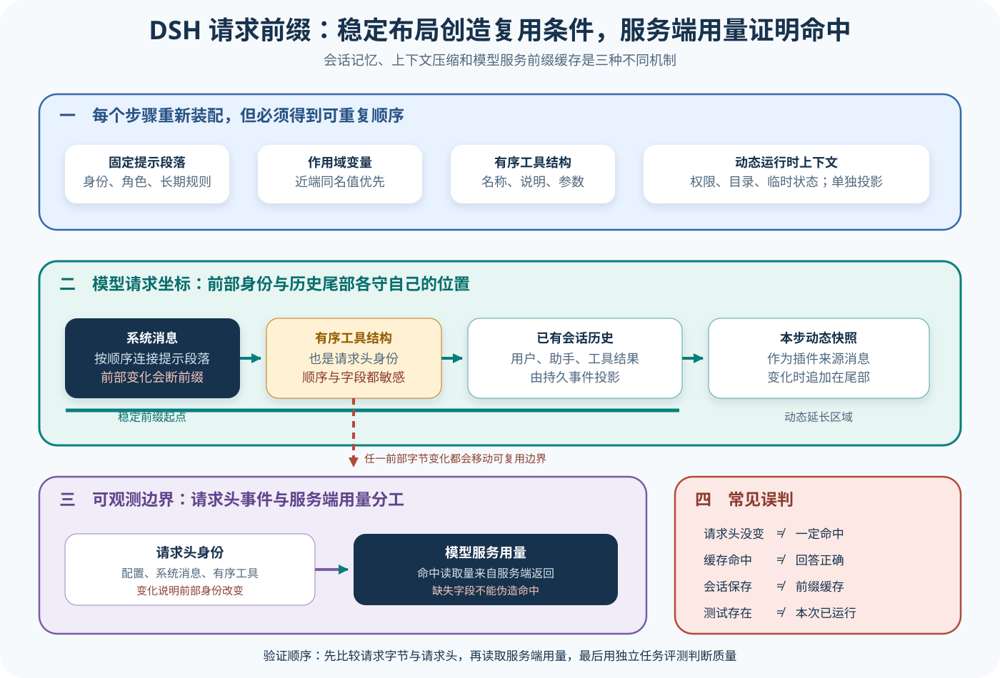

# DSH Prompt、运行时 Context 与 KV Cache

## 读者会得到什么

这一课回答模型请求开头怎样保持稳定，以及动态状态为什么不应反复改写 System Prompt。DSH 把长期指令 section、运行时 context、工具 schema 和会话历史作为不同输入面：section 与工具在每个 step 重新装配，运行时快照作为插件来源的 user message 落在历史尾部，请求 header 则记录 config、system 和有序工具集合是否改变。

读完后，你能从一次请求里分辨稳定前缀与动态尾部，能解释 `request/header` 多出一条意味着什么，也能正确解读 `cacheReadTokens`。最重要的是：稳定前缀是缓存可复用的必要设计条件，不是缓存命中、成本下降或回答质量提高的充分证明。

先看字节顺序，再谈缓存。

## 核心概念



Claim: deepseek-harness.context.stable-prefix-runtime-tail

| 概念 | 请求位置 | 变化频率 | 观测意义 |
| --- | --- | --- | --- |
| Prompt section | System 前缀 | 通常较低 | 长期身份与指令 |
| Runtime context | 历史尾部插件消息 | 可逐步变化 | 当前目录、权限等动态事实 |
| Tool schema | System 后的工具表面 | 能力变化时 | 模型可见动作与参数 |
| Request header | Session 审计事件 | 前缀身份变化时 | config、system、tools 的版本边界 |
| KV Cache | Provider 计算层 | 由服务策略决定 | 相同前缀计算是否被复用 |
| `cacheReadTokens` | Usage 投影 | 每次响应 | 已观察到的缓存读取量 |

System Prompt 不是一段手写大字符串。`SystemPrompt.assemble()` 沿 scope 链收集变量、section、context 和工具 schema；近端 scope 可以遮蔽同名全局贡献，section 与 context 分别按数值 order 排序，工具走可重复的 canonical order。`renderPrompt()` 再把非空 section 用两个换行连接，得到模型请求的 system 字符串。

上游最小测试把顺序钉得很清楚：identity、persona、rules、cwd 依次形成 System Prompt；两个 context 按 earlier、later 排序；工具集合同时得到 `echo` schema。这里的 context 不会拼进 system 字符串，而由 `renderContextSnapshot()` 形成带「当前运行时快照取代旧快照」语义的独立文本。

两个位置，两种职责。

Agent Loop 在每个 step 的 `preStep()` 重新 assemble。它把 runtime context 投影成一条插件来源消息，与本步 claimed messages 一起进入 Session。随后 `step()` 才使用 `renderPrompt(assembly)`、有序工具和 `session.deriveMessages()` 构造请求。因此权限模式、当前目录或其他动态事实可以在历史尾部更新，而不必修改最前面的 system 与工具前缀。

动态事实走尾部。

锁定测试专门覆盖这一点。第一次 mode 为 `read-only` 时写入一个 runtime context user message；第二次值不变，不重复追加；第三次改成 `danger-full-access`，新增快照；清空 context 时写一条明确失效消息。五次模型请求的 `system` 完全相同，Session 中只有一条 `request/header`。

不变就不重复。

请求 header 是可观测边界，不是缓存本身。`canonicalHeader()` 保存调用 config、adapter defaults、非空 system 与非空 tools；`headerEquals()` 对 config、system 字符串和有序工具 schema 做字段比较。Agent Loop 只在首次或 header 变化时追加新事件，因此它能告诉离线分析者前缀身份何时改变，却不能单独证明 Provider 命中了 KV Cache。

身份变化可以追踪。

DeepSeek adapter 的序列化顺序是 system message 在前，再追加会话 messages。随着工具结果和后续用户消息进入历史，新请求通常是旧请求前缀的延长；若前部字节相同并满足 Provider 的缓存粒度和保留策略，服务端才可能复用前缀。DSH 没有在这条普通序列化路径里伪造命中，它把 Provider usage 中的命中 token 映射成 `cacheReadTokens`，供 Session 的 assistant usage 记录。

命中仍需外部观测。

仓库包含一个需要 `DEEPSEEK_API_KEY` 的真实 API 端到端测试。它构造长 system、一次工具调用和后续 turn，要求第一次请求之后每次 usage 的 `cacheReadTokens > 0`。由于测试使用 `describe.skipIf(!process.env.DEEPSEEK_API_KEY)`，无凭据的普通门禁只证明测试结构存在，不证明今天已现场命中。本文不会把未运行的带密钥测试升级成 A 级实验。

## 为什么这样设计

第一，稳定指令与动态事实有不同生命周期。persona、规则和工具描述适合作为稳定前缀；cwd、权限模式和临时状态放在尾部，既能让模型看到最新值，也避免每步从前部打断可复用字节。

第二，运行时快照进入 Session 事件，离线重放才能解释某一步为何拥有不同环境。若动态值只保存在进程变量里，最终答案可能可见，形成答案的权限与目录却无法复核。

第三，Request header 记录前缀身份变化，却不冒充 Provider 缓存。Harness 可以证明自己发送了什么，Provider usage 才能证明服务端报告了多少读取；责任分开后，缓存故障不会被错误归到 Prompt 组合。

第四，工具排序与 Schema 也纳入稳定面。只固定 System 文本，却让工具注册顺序随机变化，仍会破坏完整请求前缀。统一 canonical order 同时服务重放、差分和缓存可观察性。

第五，缓存指标与质量指标分开，使优化不会掩盖行为退化。团队可以提高稳定前缀复用并降低成本，同时让固定 Trial 继续检查陈旧指令、错误工具选择和最终产物；任一指标改善都不能替另一项签字。

这些边界最终让输入稳定性、服务端复用和任务正确性能够被分别验证、分别回归。

## 实现思路

教学实现把 Prompt 装配器、运行时快照投影器、Header 版本器和 Usage 采集器分开。DSH 源码直接证明这些接缝；缓存命中实验仍由外部 Provider 决定。

1. **注册分面贡献。** section、context、variable 与 tools 按 scope 和 name 管理，定义稳定 order，并保留来源插件。
2. **每步重新装配。** 先求值变量，再分别排序 section 与 context，工具使用 canonical order；Waterfall 变换输出可审计。
3. **投影动态快照。** 只在语义变化、清空或压缩丢失保留快照时追加插件消息，不重复写入相同状态。
4. **计算 Header 身份。** 对 config、System 字节和有序 Tool Schema 建立哈希；变化时追加 request/header 与差异字段。
5. **序列化请求。** System 在前，Session 派生消息在后；记录真正发送给 Adapter 的顺序和长度。
6. **收集 Usage。** 原样保存 Provider 的 cache read 字段、模型和时间；缺失记为 unavailable，不填零冒充观测。

```text
assembly = systemPrompt.assemble(scope)
system = renderSections(assembly.sections)
snapshot = renderRuntimeContext(assembly.contexts)
session.append_if_changed(snapshot)
header = canonical(config, system, orderTools(assembly.tools))
session.append_header_if_changed(header, diff)
response = provider.request(system, session.deriveMessages(), header.tools)
session.record_usage(response.cacheReadTokens ?? unavailable)
```

实现应输出字节断点诊断：若 Header 改变，指出是 config、System 哪个 section，还是哪个 Tool Schema 字段。只输出「缓存未命中」无法指导修复，也可能把 Provider 淘汰误判为 Harness 问题。

快照比较不能只做对象引用相等。应对规范化文本或结构计算语义哈希，明确空值、顺序和清除标记；Compaction 后若当前快照已不在派生上下文，投影器需要重新发出，而不是因进程变量未变就继续省略。

Usage 采集还要绑定 Provider、模型、区域和请求 ID。同样的 Header 在不同租户或时间窗口可能没有共享缓存，聚合报表必须按这些条件分桶，并把缺失字段与真实零值分开。

## 贯穿案例

一个编码 Session 连续执行三步：先在只读模式检查仓库，再切换为可写模式修改文件，最后运行测试。persona 与工具集合保持不变，权限状态通过 runtime context 更新。

1. **第一步装配。** System 哈希 S1、Tools 哈希 T1，尾部写入 `mode=read-only`；首次 Header H1 进入 Session，Provider 没有缓存读取。
2. **第二步状态不变。** 再次检查时不追加相同快照，H1 不变；请求是前一请求的延长，Provider 报告 cacheReadTokens，但该值只约束本次调用。
3. **第三步权限变化。** runtime context 追加 `mode=write`，System 与 Tools 仍为 S1/T1，Header 不新增；模型能看到新权限，稳定前部保持一致。
4. **破坏实验。** 把 Tool description 改一个字，T1 变为 T2，生成 Header H2；即使权限没变，前缀身份已变化。
5. **质量评分。** 独立 Eval 检查文件与测试，不因缓存读取较高而提高正确性分数。

```json
{"step":1,"system":"S1","tools":"T1","header":"H1","runtime":"read-only","cacheReadTokens":0}
```

```json
{"step":3,"system":"S1","tools":"T1","header":"H1","runtime":"write","cacheReadTokens":2048}
```

```json
{"step":4,"system":"S1","tools":"T2","header":"H2","headerDiff":"tool.description","cacheObservation":"重新测量"}
```

若 Provider 不返回 Usage，前三步仍能证明 DSH 的输入布局，却不能声称命中。若 cacheReadTokens 大于零但最终测试失败，缓存实验通过、任务 Eval 失败；两个结论分别报告。

再把权限状态误放进 System section。第三步会从 S1 变为 S2 并产生 Header H2，字节断点定位到该 section；将它移回 runtime context 后恢复稳定前部。这个对照直接展示分面设计的价值。

最后清空权限 Context，投影器必须追加明确失效消息。若只是停止写入，模型历史仍可能保留旧的可写状态；案例应把「清除」视为一次语义变化，并检查 Session 事件可重放。

## 真实输入与输出

### 输入

上游 System Prompt 测试注册了两个稳定 section、两个动态 context 和一个工具 schema：

```ts
ctx.systemPrompt.section({ name: 'cwd', order: 20, text: () => 'cwd: /tmp' })
ctx.systemPrompt.section({ name: 'rules', order: 10, text: 'Be precise.' })
ctx.systemPrompt.context({ name: 'later', order: 20, text: () => 'context 2' })
ctx.systemPrompt.context({ name: 'earlier', order: 10, text: 'context 1' })
ctx.systemPrompt.tools(() => ({
  schemas: [{ name: 'echo', description: 'echo back', parameters: {} }],
}))
```

这是确定性单元测试输入，适合验证排序与分面，不包含真实 Provider。运行时 tail 行为由另一个 Agent Loop 测试验证；真实缓存命中则需要单独的带凭据端到端测试，三类证据不能混成一次实验。

### 输出

装配后的 system 与 runtime context 分别为：

```text
[Harness identity]

You are DeepSeek Harness.

Be precise.

cwd: /tmp

--- 运行时快照作为历史尾部消息 ---
Current runtime context. This snapshot supersedes earlier runtime-context snapshots.

context 1

context 2
```

源码测试的具体英文是上游事实；图和解释使用中文。关键不是翻译文字，而是两部分进入请求的坐标不同：system 位于最前，runtime snapshot 进入会话历史尾部。动态快照变化时，前部 system 仍可保持字节一致。

## 调用链

1. 插件在全局或 Agent scope 注册 section、context、variable 和 tool provider；同名近端贡献遮蔽远端贡献，注册或撤销会发出 change 事件。
2. 每个 step 开始前，Agent Loop 调用 `assemble()`；变量先求值，section 与 context 各自稳定排序，工具 schema 进入 canonical order，waterfall 可以做受约束的最终变换。
3. `renderPrompt()` 只渲染 section，得到 system；`renderContextSections()` 与投影器决定动态快照是否需要作为插件 user message 追加或清除。
4. 可见 user messages 先写入 Session。`session.deriveMessages()` 从持久事件投影历史，保证动态快照与工具结果位于可追踪的尾部。
5. Agent Loop 构造 canonical request header；若 config、adapter defaults、system 或有序工具集合与当前 epoch 不同，追加新的 `request/header`。
6. DeepSeek adapter 把 system 放在 wire messages 最前，再序列化历史；Provider 接收的是具体字节序列，而不是 section 名称或本仓库的架构概念。
7. Provider usage 若报告缓存命中 token，adapter 映射为 `cacheReadTokens` 并随 assistant message 保存；没有该字段只能记为未观察到，不能反推一定未缓存。

位置决定前缀。Usage 才是命中观测。

## 源码证据

稳定 section、动态 context 与工具在装配时保持独立：

```source
packages/core/system-prompt/src/index.ts:467-540
const sectionByName = this.layers.merge(scope, layer => layer.sections)
const contextByName = this.layers.merge(scope, layer => layer.contexts)
const sectionDefinitions = [...sectionByName.values()].sort((a, b) => a.order - b.order)
const assembly: PromptAssembly = {
  sections,
  contexts: runtimeContextSuppressed ? [] : [...contextByName.values()].sort(...),
  tools: orderTools(collected, this.toolOrder, knownNames),
  variables,
}
```

运行时变化不重写 system header 的上游测试为：

```source
packages/core/agent-loop/tests/loop.spec.ts:357-410
mode = 'danger-full-access'
send(agent, 'changed')
expect(contextEvents()).toHaveLength(2)
expect(adapter.requests.map(request => request.system))
  .toEqual(Array(5).fill(adapter.requests[0]?.system))
expect(agent.session.events.filter(event => event.type === 'request/header'))
  .toHaveLength(1)
```

`packages/core/session/src/request-header.ts:44-53` 直接定义 header equality：system 必须相等，工具数量、顺序和序列化 schema 必须相等。`packages/llm/llm-deepseek/src/serialize.ts:381-387` 则证明 wire 顺序先 system 后 history。两者解释可复用前缀为何能够形成，但命中仍由 Provider usage 证明。

布局先于用量。

Claim 使用 B 级，因为它严格限定锁定 DSH 的输入布局，并由源码和上游行为测试直接支持；它没有声称任何一次线上请求已经命中缓存。带凭据 E2E 若实际运行、保存环境与原始 usage，才可为特定 Provider、模型和日期建立更高等级实验记录。

等级跟随证据。

## 失败与限制

第一，动态数据进入 system 会从变化位置打断前缀。把时间、当前分支、权限状态或临时诊断每步插进固定 section，可能让 header 频繁变化；更糟的是，如果变化没有进入持久事件，离线重放无法解释请求差异。

第二，工具 schema 也是 header 的一部分。工具描述、参数 JSON、顺序或可见集合变化都会让 `headerEquals()` 返回 false。仅保证 System Prompt 字符串相同，不足以保证完整请求前缀相同。

第三，稳定字节不保证缓存命中。Provider 可能有最小 token 块、时效、模型路由、租户隔离、容量淘汰或未公开策略。`cacheReadTokens === 0` 也可能是前缀太短或 usage 缺失，不应立刻归因于 Harness bug。

零值也要解释。

第四，缓存命中不等于回答更好。它只说明部分前缀计算被复用；错误的旧指令同样可以高命中。质量必须由任务 Eval 判断，成本与延迟需要独立测量。

复用不是质量。

第五，Session Memory、Compaction 与 KV Cache 不是一件事。Session 保存事实和事件，Compaction 改写派生模型上下文，Provider KV Cache 复用请求前缀计算；任一层的「命中」都不能替代另外两层的正确性。

第六，真实缓存测试带凭据并可能受外部服务漂移影响。普通 CI 跳过是合理的安全选择，但发布结论必须诚实写成「未在本次运行验证」，不能把测试文件存在写成现场结果。

## 验证方法

先运行无网络的装配测试。交换 registration 顺序但保留 order，输出仍应按 order 排列；改变 scope，确认近端同名 section 遮蔽全局；改变工具注册顺序，确认 canonical tool order 稳定。对最终 system 和 tools 做字节级哈希，而不是只目视文本相似。

再运行 runtime context 测试。依次使用不变、变化、清空和继续为空的状态，检查 context user message 只在语义变化时追加，system 五次一致，`request/header` 仍只有首次一条。若 Compaction 移除了保留快照，还要验证投影器会重新发出当前快照。

随后做破坏实验：改变 persona 一个字符、调换工具顺序、修改 schema description、切换 model config。每次都检查 header 是否新增，以及差异从请求哪个位置开始。这样才能把「前缀断了」定位到具体输入面。

逐字节找断点。

最后才运行带凭据 E2E。固定 Provider、模型、区域、输入和时间窗口，保存每次 request header 哈希、usage 与响应；首请求允许无命中，后续请求检查 `cacheReadTokens`。若缺 key、服务报错或 usage 字段缺失，结果记为 blocked 或 inconclusive，不伪造通过。

缺证据就不通过。

## 自检

### 问题 1

为什么权限模式变化适合进入 runtime context tail，而不适合每步改写 System Prompt？

**答案：** 权限模式是动态事实。尾部快照能持久记录变化并保持前部 system 与工具前缀稳定；改写 system 会让 header 改变，也更难从历史解释何时变化。

### 问题 2

Session 里只有一条 `request/header`，是否足以证明 Provider KV Cache 命中？

**答案：** 不足。它证明 canonical header 没变化；完整历史前缀、Provider 策略和缓存状态仍需核对，命中应由 `cacheReadTokens` 等 usage 观测支持。

### 问题 3

为什么工具描述改一个字也可能破坏缓存前缀？

**答案：** 有序工具 schema 属于 request header，字段比较使用序列化后的 schema。描述变化会改变前部请求字节，即使 system 文本完全相同。

### 问题 4

仓库有真实 API 缓存测试，为什么本文 Claim 仍不写「已验证命中」？

**答案：** 测试受 `DEEPSEEK_API_KEY` 门控；文件存在只证明有验证路径。本次没有保存真实运行 usage 与环境证据，因此只能说明设计和测试契约，不能冒充现场实验结果。
