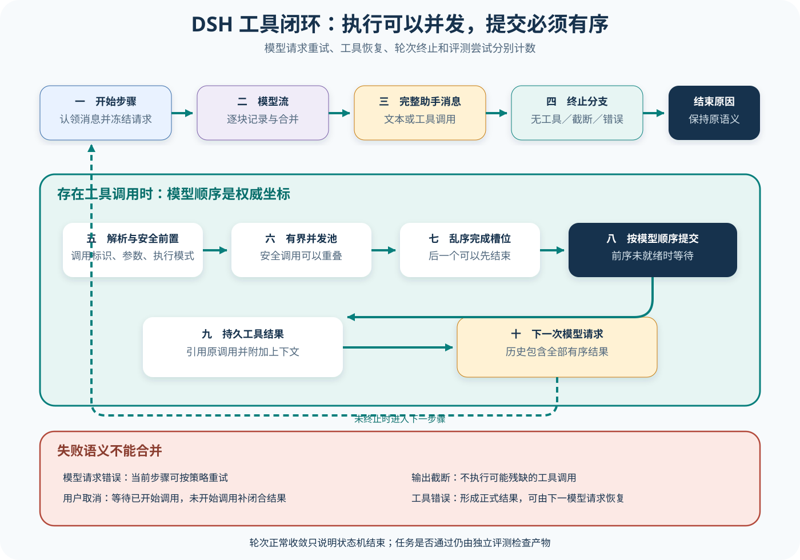

# DSH Agent Loop、模型流与工具闭环

## 读者会得到什么

这一课深入 DSH 的执行心脏：一个 Harness Turn 怎样包含多个 step，每个 step 怎样从模型流得到完整 assistant message，多个工具怎样并发执行却按模型顺序提交结果，工具结果怎样进入下一次请求，以及取消、错误、截断和工具结论怎样形成不同终止原因。

你还会得到一套排错口径。Provider 请求重试发生在同一个 step 内，工具恢复发生在模型与环境的闭环中，Turn 结束是 Harness 状态机结论，Eval Attempt 则是评测基础设施的恢复单位。四者不能共用一个「重试次数」。

先找边界，再数调用。

## 核心概念



Claim: deepseek-harness.loop.tool-results-before-next-request

| 概念 | 边界 | 结束条件 | 不应混同 |
| --- | --- | --- | --- |
| Turn | 一次外层任务推进 | 稳定终止原因 | 单次模型请求 |
| Step | 一次请求与工具处理 | 形成下一步或终止 | Eval Attempt |
| StreamChunk | 模型增量 | 流中单片到达 | 完整 AssistantMessage |
| Tool slot | 模型顺序位置 | 对应结果已 settle | 实际完成顺序 |
| Provider retry | 当前 Step 的请求恢复 | 得到可用模型流 | 工具错误后的再采样 |
| Turn reason | Harness 状态机结论 | completed 等终态 | 任务评分 |

外层 Turn 负责持久边界。它追加 `turn/start`，循环执行 step；每个 step 前从 inbox 认领消息并装配 Prompt，结束时无论成功或异常都追加 `step/end`。当没有下一步消息且得到稳定结束原因时，最终追加 `turn/end`。因此一个 Turn 可以有多个模型请求，不能用 Turn 数量代替 Provider 调用数。

step 内先构造冻结请求，再选择 prepared adapter 或默认 LLM service 的 stream。每个 chunk 都先成为 `assistant/chunk` 事件，`BlockAssembler` 负责拼出 reasoning、text、tool-call、usage 和 finish。只有流完成后才形成 `assistant/message`；界面可以实时显示 chunk，但后续工具调度使用的是完整调用块。

DeepSeek adapter 可以在传输层解析 SSE，但 Agent Loop 不直接依赖 SSE 文本行，而只消费统一 StreamChunk。HTTP 连接、SSE frame、Provider event、Harness chunk 和完整 assistant message 是五个边界；网络重连或 frame 拆分不能被误计成新的 Turn。

若 finish 是 error 或 aborted，`agent/request-error` waterfall 可以返回 retry。这个 retry 重新发起 Provider 请求，却没有把半成品 assistant message伪装成正常完成。没有 retry 动作时抛出结构化 LLM error，外层把 Turn 记为 error 或 aborted。它与工具返回错误结果后让模型修正参数不是同一恢复层。

若 finish 为 `max-tokens`，step 返回截断原因，不执行可能不完整的工具调用。若 finish 正常且 assistant message 没有 tool-call，step 返回 completed。只有存在完整工具调用时，循环才进入 `executeToolCalls()`，并依据结果的 `concludesTurn` 决定立即收敛还是把工具结果送入下一 step。

工具调度分成「是否可并行」和「提交顺序」两个问题。并发安全调用可以进入有界滚动池，exclusive 调用形成屏障；实际执行允许后一个先完成，但 `commitReady()` 只跨越连续的模型顺序 slot，把 `tool/result` 按原调用顺序写入 Session。这样 Provider 下一次看到的调用—结果配对不受操作系统调度时序污染。

完成可以乱序。

上游测试给了最强反例：模型依次发出 `c1`、`c2`，两个并发工具都启动，测试先释放 `c2`。此时 Session 仍没有任何 tool result；释放 `c1` 后，结果才按 `[c1, c2]` 提交。另一个断言从 `deriveMessages()` 读取历史，工具结果标识仍是 `[c1, c2]`。

取消也要保持日志可重放。已开始的调用会被 drain 并按序提交；尚未调度的模型调用得到合成的 aborted result，避免 assistant 留下没有配对结果的调用。内部 scheduler failure 则不伪造恢复结果：它停止新 dispatch，等待已开始任务 settle，再抛出第一个内部故障。这两条路径故意不同。

终止原因不能压成一个布尔值。锁定测试分别覆盖 completed、blocked、aborted、error 和 max-tokens；其中 max-tokens 在同一 Turn 中具有 sticky 语义，后续 completed step 不会把早先截断降级成成功。Eval 仍需独立判断任务产物是否正确。

## 为什么这样设计

第一，流式显示与确定性执行需要不同边界。界面可以即时消费 Chunk，工具调度却必须等待完整调用块，否则网络分片会把半截参数当成动作。BlockAssembler 在两者之间建立明确提交点。

第二，并发执行提升吞吐，有序提交保持模型因果。工具可以反序完成，但下一请求仍按模型调用顺序看到结果；这样操作系统调度不会改变对话历史，外部竞态则由工具契约和隔离另外处理。

第三，恢复层分开才能计算成本和可靠性。Provider retry、工具错误后的模型修正、Turn 重启与 Eval Attempt 分别记录，避免一个重试数字同时掩盖网络、产品与评测基础设施问题。

第四，多种终止原因保留安全语义。max-tokens 不执行半截调用，aborted 闭合未开始调用，blocked 与 error 保留不同恢复方向；completed 只说明状态机收敛，不抢占独立 Scorer 的职责。

第五，持久事件先于派生界面。Turn、Step、Chunk、Message、Call 与 Result 都有明确序号，终端和评测从同一日志投影；这样取消或崩溃后可以解释已提交到哪里，不靠最后一屏文本猜测。

这些分层共同保证性能优化不会改变模型看到的确定性因果链，也不会掩盖真实副作用。

## 实现思路

教学实现可把 Turn 控制器、Step 采样器、Chunk Assembler、Tool Scheduler 和终止归约器分开。以下蓝图复用 DSH 已证明的边界，但不替代具体源码。

1. **开启持久边界。** 追加 turn/start，认领 inbox 消息；每个 Step 都有 start/end，即使异常也写入终态。
2. **冻结请求并消费流。** 保存 config、system、tools、history 与 abort signal；逐 Chunk 记录，只有 assembler 完成才提交 AssistantMessage。
3. **分类模型终态。** error / aborted 进入有界请求恢复，max-tokens 直接终止工具路径，无 ToolUse 则完成。
4. **调度完整工具调用。** 根据实时 mode 分组，exclusive 形成屏障，parallel 进入有界池；每个调用占据模型顺序 slot。
5. **按 slot 提交。** settle 可以乱序，commit pointer 只跨越连续完成 slot；结果关联 call ID 后写 Session。
6. **决定下一 Step。** 普通结果进入派生历史，concludesTurn、取消或错误进入终止归约；sticky 原因不得被后续成功覆盖。

```text
while turn 未终止:
    request = freeze(preStep())
    message, finish = assemble(await stream(request))
    如果 finish 是 max-tokens: 记录截断并终止
    如果 finish 是 error/aborted: 按策略恢复或终止
    session.append(message)
    如果 message 无 tool-call: 终止为 completed
    slots = schedule(message.tool_calls)
    并发执行 slots；仅按模型顺序 commitReady()
    如果 任一结果 concludesTurn: 终止
    否则 tool-results 进入下一 Step
```

内部 scheduler failure 与工具业务 error 必须使用不同通道。前者说明 Harness 无法可靠提交调用，应停止 dispatch 并抛出；后者是模型可观察 ToolResult，可以进入下一步尝试修正。

调度器还要记录 started、settled 与 committed 三个时间。started 证明副作用可能发生，settled 说明执行已返回，committed 才说明结果进入模型历史；三者解决取消、超时与完成顺序的不同诊断问题。

恢复时只能从已持久提交点继续。已经 committed 的工具调用不得重放；started 但未 settled 的调用属于副作用未知，需要查询外部状态或人工处理。用同一 call ID 静默重跑会破坏幂等性。

## 贯穿案例

用户要求同时读取两个独立报告，再根据结果写摘要。模型按 c1、c2 发出两个并发 Read，c2 先完成；随后模型调用 Write。案例验证并发、顺序和终止不是同一件事。

1. **第一 Step 采样。** 完整 AssistantMessage 含 c1 / c2；Chunk 到达期间不执行任何半成品参数。
2. **反序执行。** 两个 Read 同时 dispatch，c2 先 settle。slot 1 已有结果，但 slot 0 未完成，所以 Session 暂无 ToolResult。
3. **有序提交。** c1 settle 后 commit pointer 依次写入 c1、c2；下一模型请求看到确定性配对。
4. **第二 Step 写入。** 模型基于两个结果提出 Write，权限与执行成功，结果进入 Session；下一响应无工具调用，Turn completed。
5. **独立验收。** Scorer 检查摘要内容、只修改目标文件和读取顺序无关性；completed 只是输入之一。

```json
{"calls":["c1","c2"],"settled":["c2"],"committed":[]}
```

```json
{"calls":["c1","c2"],"settled":["c2","c1"],"committed":["c1","c2"]}
```

```json
{"turnReason":"completed","providerRequests":3,"toolExecutions":3,"score":{"summaryCorrect":true,"unexpectedWrites":0}}
```

取消变体在 c2 settle 后触发 Abort：已开始的 c1/c2 被 drain 并按序提交，尚未 dispatch 的调用得到合成 aborted result。Artifact 必须区分真实执行与合成闭合，不能用相同 ToolResult 文本推断副作用。

截断变体让模型在 Write 参数中途达到 max-tokens。Assembler 不生成完整 ToolUse，调度器执行次数保持为 2，Turn 原因为 max-tokens；提高上限后只能发起新的受控运行，不能执行保存下来的半截 JSON。

最后让 Write 返回业务错误。错误 ToolResult按正常事件提交，下一 Step 可选择修正路径；若 scheduler 自身抛错，则不得伪造 ToolResult 让模型继续。两条路径的对照用于证明恢复层没有被混合。

## 真实输入与输出

### 输入

上游 `tool-calls.spec.ts:220-241` 构造两个按模型顺序出现、允许并发的调用：

```json
{
  "assistant_tool_calls": [
    {"id":"c1","name":"p","args":{"id":"1"}},
    {"id":"c2","name":"p","args":{"id":"2"}}
  ],
  "settlement_order": ["c2","c1"]
}
```

`settlement_order` 是对测试门闩释放顺序的中文化描述，不是上游 wire 字段。真实上游调用块与 `CallId` 值来自测试，模型和工具都是确定性夹具；这适合证明 scheduler 语义，不代表真实进程工具的延迟分布。

### 输出

虽然 `c2` 先结束，持久化与下一次模型历史仍保持模型顺序：

```json
{
  "session_tool_result_order": ["c1","c2"],
  "derived_history_tool_result_order": ["c1","c2"],
  "next_model_response": "done"
}
```

顺序稳定的目的不是让工具串行，而是让模型看到确定性因果链。如果业务真的需要「完成顺序」，应把完成时间作为结果元数据保存，不能重排调用—结果配对。

提交不能乱序。

## 调用链

1. inbox 的 waking message 启动 Turn，Session 追加 `turn/start`；`preStep()` 认领 next-turn 或 next-step 消息并装配 system、tools 与 runtime context。
2. Session 追加 `step/start` 和可见 user messages，`buildRequest()` 冻结 config、system、tools、history、session id 与 abort signal。
3. LLM adapter 发出流，Harness 逐块记录并聚合；error/aborted 可经 request-error policy 决定是否在当前 step 重试。
4. 完成的 assistant message 先写 Session。max-tokens 直接形成截断原因；无工具调用形成 completed；有调用才进入工具 scheduler。
5. scheduler 解析参数、读取每个调用的实时执行模式，exclusive 单独成组，parallel 进入有界池；pre/execute/post middleware 可以返回最终结果或附加 context。
6. 实际 dispatch 可以乱序结束，slot 只按模型顺序 commit。每个 `tool/result` 引用先前 `tool/call` 的序号，附加 context 在所属结果之后进入 next-step inbox。
7. 工具未要求 conclude 且没有取消时，外层开始新 step；`session.deriveMessages()` 把有序结果放进下一模型请求。否则结束当前 Turn。
8. `turn/end` 保存 completed、max-tokens、blocked、aborted 或 error。产品表面映射此状态，Eval 再读取完整 Trace 与 Artifact 打分。

并发执行。有序提交。分层终止。

## 源码证据

并发池与模型顺序提交的核心在：

```source
packages/core/agent-loop/src/tool-calls.ts:129-160
const slots: (Slot | undefined)[] = group.map(() => undefined)
let committed = 0
const commitReady = async (): Promise<void> => {
  while (committed < group.length) {
    const slot = slots[committed]
    if (slot === undefined) break
    appendToolResult(session, turn, step, call!.block, result, callSeqs[committed]!)
    committed++
  }
}
```

上游反序完成测试直接断言结果顺序：

```source
packages/core/agent-loop/tests/tool-calls.spec.ts:220-241
gated.release('2')
expect(events(agent).filter(e => e.type === 'tool/result')).toEqual([])
gated.release('1')
const results = events(agent).filter(e => e.type === 'tool/result')
expect(results.map(e => e.data.message.source.callId))
  .toEqual([CallId('c1'), CallId('c2')])
```

`packages/core/agent-loop/src/agent.ts:372-418` 区分 Provider error retry、max-tokens、无工具完成和工具执行；`packages/core/agent-loop/tests/loop.spec.ts:945-980` 分别断言用户取消得到 aborted、截断得到 max-tokens。本文 Claim 使用 B 级，因为「工具结果先按模型顺序提交，再进入下一请求」由源码和行为测试直接支持。

## 失败与限制

第一，chunk 不是消息。中途网络断开可能留下已记录的流片段，但只有 assembler 完成后才有正常 assistant message。监控若按 chunk 数统计模型调用，会严重放大用量。

第二，Provider retry 可能产生多次网络请求。若 Trace 只保存最终 assistant message 而不保存 request-error 和 attempt 关联，就无法解释成本、延迟或重复扣费。它仍不应改变 Eval Trial 分母。

第三，并发安全声明是工具契约。错误地把有共享副作用的工具标成 parallel，会制造竞态；错误地全部标 exclusive 则损失吞吐。Harness 的有序提交只能稳定模型历史，不能撤销已经发生的外部竞态。

第四，取消不是瞬时回滚。已经 dispatch 的工具可能无法撤销，scheduler 会等待其 settle；合成 aborted result 只为未开始调用闭合消息链，不能声称外部副作用从未发生。

第五，max-tokens 的半截工具参数不得执行。保留安全文本不等于参数完整；上游测试明确要求截断 step 不产生 `tool/call`。提高 token 上限是配置选择，不是对已发生截断的安全修复。

第六，工具结果 error 可以进入下一次模型请求，让模型换参数或换工具；这属于 Agent 恢复。产品任务是否失败由 Eval 判断，不能无限重试直到偶然通过再抹掉前面的失败。

## 验证方法

先用 Mock adapter 固定两次响应：第一次 tool-call，第二次 text。断言请求数为 2、第二次 history 含同一 call id 的 tool-result、Session 的边界顺序为 turn/start→step/start→step/end→下一 step→turn/end。

再用两个 gated parallel 工具反序释放。确认后一个先 settle 时没有越过前一个提交，最终 Session 与 derived history 都按模型顺序。加入 exclusive 中间调用，确认它形成屏障；修改 registry mode，确认未开始调用会重新分类。

随后注入 Provider error、retry、用户取消、scheduler internal failure、工具普通 error、concludesTurn 和 max-tokens。逐条断言网络请求数、实际副作用数、持久事件、下一次采样和 turn-end reason，不用一个「失败」断言覆盖所有分支。

最后把 Agent Trace 映射到 Eval：一次任务是固定 Trial，Provider 请求恢复与工具恢复写进 Trace，只有基础设施恢复才创建 Eval Attempt。Scorer 独立检查产物，不能根据 completed 或自然语言「done」直接判通过。

## 自检

### 问题 1

两个并发工具中 `c2` 先结束，为什么不能先把 `c2` result 送给模型？

**答案：** 模型按 `c1`、`c2` 发出调用。DSH 保持调用—结果的确定性顺序，避免运行时调度改变下一请求语义；完成时间可以另存元数据。

### 问题 2

Provider retry 和工具报错后再次采样有什么区别？

**答案：** Provider retry 在当前 step 重新取得模型流；工具错误是一个正式 tool-result，进入历史后由下一模型请求决定恢复。两者事件、成本和责任层不同。

### 问题 3

用户取消后出现合成 aborted tool result，是否证明工具没有副作用？

**答案：** 不证明。合成结果用于闭合尚未开始的调用；已 dispatch 的工具可能已经产生副作用并会被等待 settle，必须检查实际执行事件和环境产物。

### 问题 4

`turn/end: completed` 为什么仍不能当作 Eval pass？

**答案：** completed 只说明 Harness 状态机没有更多工具或消息要处理。任务可以正常结束却答案错误，Eval 仍需按固定契约检查 Trace、Artifact 与 Scorer。
