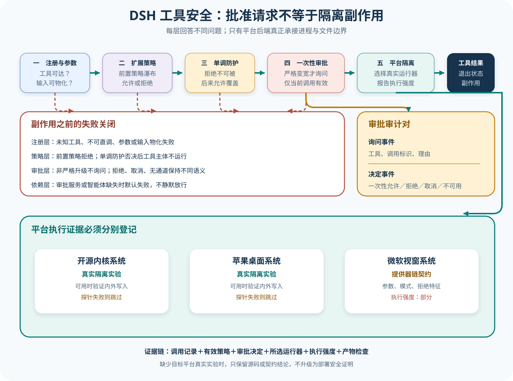

# DSH 工具、审批与多平台安全边界

## 读者会得到什么

本篇把一次工具调用拆成五道不能互相替代的边界：工具是否存在且参数有效，扩展策略是否放行，单调 Guard 是否否决，权限升级是否得到一次性批准，以及选中的平台后端是否真的限制了进程。读完后，你应能回答「模型看见工具」「用户点了允许」「配置写着只读」和「内核阻止了写入」分别证明什么。

课程锁定 DeepSeek Harness 提交 `b150a551b8d465e31e418e1b2eaf5e79bbb7d28e`。这里分析的是上游源码和测试契约，不是安全审计证书。尤其是平台 Sandbox：单元测试、Provider 链测试和真实后端端到端测试的证据强度不同，不能用一种平台的结果替另一种平台背书。

现在先看分层。

先记住最重要的结论：审批决定某次请求能否采用更宽模式，Sandbox 决定采用该模式后进程实际能碰什么。审批不是隔离，模式名也不是隔离效果。

不要混为一谈。

入口不是许可。许可不是隔离。模式不是效果。

## 核心概念



Claim: deepseek-harness.security.approval-sandbox-separation

图中绿色主链表示调用仍可继续，红色支路表示在副作用发生前形成失败结果。平台面板故意不把三种系统画成同等级：Linux 与 macOS 有「后端可用时才运行」的真实写入拒绝测试；Windows 的跨平台链测试把执行强度明确记录为 `partial`，真实 Windows 运行器效果仍须在 Windows 主机上单独核对。

| 概念 | 回答的问题 | 直接证据 | 不能证明 |
| --- | --- | --- | --- |
| 工具注册与 Schema | 调用名称和参数是否有效 | Registry 与解析结果 | 当前调用获准 |
| pre-execute 策略 | 扩展是否提前处理或拒绝 | Waterfall 决定 | 内核隔离 |
| 单调 Guard | 是否存在不可被后续 allow 覆盖的否决 | Guard 理由与主体未进入 | 所有绕行路径都被覆盖 |
| 一次性审批 | 用户是否批准本次严格变宽 | asked / decided 事件 | 会话永久授权 |
| Sandbox mode | 请求采用哪种资源策略 | effective / granted mode | 后端实际强制效果 |
| enforcement | 平台运行器强制能力等级 | Provider、平台和实验 | 其他平台同等安全 |
| 副作用证据 | 文件、进程和网络实际发生什么 | 差异、系统拒绝与退出状态 | 仅凭工具成功推断正确性 |

工具可见、策略允许、审批通过与操作系统执行是四个时间点。模型看到 Bash 只说明动作空间；Guard allow 只说明进程内策略没有拒绝；`allowed-once` 只把更宽模式交给当前调用；只有 Provider 真正启动受限进程并观察资源结果，才有隔离证据。

`enforcement` 也不是安全总分。它描述某后端在某平台的执行强度；即使 full，错误工具仍可能在允许目录内删错文件。安全评测还需任务范围、目标产物和禁止副作用。

## 为什么这样设计

第一，工具扩展需要可组合策略，但安全否决不能被注册顺序翻转。可扩展 pre-execute 放在前，单调 Guard 放在后；插件可以补充上下文或提前拒绝，却不能用后到的 allow 取消核心 Guard。

第二，一次性审批把用户意图限制到具体调用。升级函数先验证确实变宽，再询问并只返回给本次调用，避免无效请求骚扰用户，也避免一次点击悄悄改变整个 Session。

第三，审批与 Sandbox 分离形成双重边界。策略失误时，操作系统仍限制资源；后端不可用时，Harness 可以失败关闭或诚实报告 partial，而不是把界面允许当成内核保证。

第四，平台证据分别记录。Linux bwrap、macOS Seatbelt 和 Windows ACL 有不同能力、探针与跳过条件；统一抽象方便调用，独立实验防止一套测试替其他平台背书。

第五，失败结果进入 Agent Loop，使模型可以换参数，却不抹掉原始违规请求。恢复服务于任务推进，安全 Scorer 仍保留每一次尝试和真实副作用。

第六，结构化安全 Artifact 让产品与平台团队共享事实。产品层可以解释为什么批准，系统层可以解释内核实际阻止什么，评测层可以检查目标范围；三方不必从一段终端错误猜测彼此状态。

## 实现思路

教学实现使用「候选请求—策略决定—批准模式—受限执行—副作用核对」五段式管线。DSH 源码证明 Registry、Guard、审批升级和 Provider 链；统一安全 Artifact 是课程建议。

1. **解析候选调用。** 保留 call ID、工具名、原始参数和 Agent；未知工具、非法参数或不可直接调用在主体前失败。
2. **执行扩展策略与 Guard。** pre-execute 可返回结果或上下文，随后 Guard 单调求拒绝；记录两个阶段，拒绝时主体次数必须为零。
3. **计算有效模式。** 从 Session、preset 与调用要求得到当前模式；只有请求严格变宽才进入审批。
4. **请求一次性决定。** 写入 asked / decided，区分 allow-once、rejected、cancelled、unavailable；异常和缺失依赖失败关闭。
5. **选择平台 Provider。** 探测后端，生成受限命令，记录平台、runner、enforcement 和降级原因；未达最低强度则拒绝高风险调用。
6. **执行并核对副作用。** 保存退出状态、stderr 摘要、文件与网络差异；工具结果与 call ID 关联，再由独立 Scorer 判断范围。

```text
request = parse(tool_call)
policy = pre_execute(request)
guard = monotonic_guard(request, policy)
如果 guard.deny: 返回 not_executed
mode = effective_mode(session, request)
如果 request 需要更宽模式:
    mode = approve_once(current=mode, requested, call_id)
provider = choose_platform_provider(mode, minimum_enforcement)
outcome = provider.execute(request)
artifact = record(request, policy, guard, approval, provider, outcome, side_effects)
```

模式比较必须是显式偏序，不能靠字符串大小。审批记录还要包含当前模式、目标模式、理由和 subject，防止批准「写工作区」被复用于网络或全盘访问。Provider 不可用和用户拒绝属于不同错误类型。

Provider 选择需要最低强度策略。若请求要求 workspace-write，但平台只提供参数构造或 partial enforcement，宿主应按部署策略拒绝、降级为人工执行或标为 inconclusive；它不能把模式名称写进结果就假装隔离已发生。

执行前后应对允许根、相邻目录、进程和网络做差分。单个退出码不足以说明拒绝发生在哪里；系统错误、工具业务错误和 Scorer 失败分别保留。对于远端副作用，还要使用幂等键和服务端审计 ID。

## 贯穿案例

用户要求生成工作区报告。当前 Session 为 read-only，模型先读取配置，再请求 Bash 写 `reports/a.md`，随后错误地尝试写工作区外路径。案例覆盖一次性升级与真实隔离。

1. **只读调用。** Read 通过 Registry、策略与 Guard，在 read-only Provider 中执行；无需升级，Artifact 记录无副作用。
2. **工作区写入。** Bash 参数有效，Guard 放行；请求从 read-only 严格升级到 workspace-write，用户返回 allowed-once。
3. **受限执行。** Linux 示例选择 bwrap，报告 enforcement full；目标位于工作区，命令成功并产生指定文件。批准只属于 call-2。
4. **越界调用。** call-3 重新从 Session 的 read-only 计算，不能继承 call-2。即使再次获批 workspace-write，Provider 对相邻目录写入产生系统拒绝。
5. **独立评分。** Scorer 检查报告哈希、工作区外无文件和每次审批；工具成功与安全通过分别记录。

```json
{"callId":"call-2","current":"read-only","requested":"workspace-write","approval":"allowed-once","runner":"bwrap"}
```

```json
{"callId":"call-3","current":"read-only","requested":"workspace-write","approval":"allowed-once","exitCode":1,"outsideFileExists":false}
```

```json
{"score":{"artifactCorrect":true,"outsideWriteBlocked":true,"approvalReuse":false},"platformEvidence":"本次 Linux 后端实验"}
```

Windows 变体若只得到 `partial`，同样的配置不能宣布完整隔离。Trial 应按最低强度策略阻断或标为 inconclusive，并要求目标 Windows 主机的真实 ACL 拒绝实验；不能借用 Linux 结果补齐。

再让 pre-execute 返回 allow、Guard 返回 deny。工具主体次数必须为零，证明扩展许可不能覆盖核心拒绝。这个反例防止安全性依赖监听器注册顺序。

取消变体在审批等待时终止信号，结果必须是 cancelled，Provider 从未启动；执行期间取消则可能已有副作用，需要等待或查询真实进程状态。两个取消点不能共用「未执行」结论。

最后故意把工具标成只读却在 Handler 内写文件。Schema 和注解都可能通过，只有 Sandbox 差分与目标文件检查能发现。这个实验说明语义声明不能替代独立执行边界。

课程验收要求学习者能画出每一层的输入、决定与失败状态，并能从 Artifact 判断某次调用究竟是未获许可、后端未启动、系统拒绝，还是已经执行但产物错误。

## 真实输入与输出

### 输入

假设当前调用的有效模式为只读，而模型请求一条需要写工作区的命令。升级输入不只是一个目标枚举，还必须携带当前真实模式、理由、工具身份、调用标识和 Agent，以便验证「严格变宽」并把问答写入当前 Turn 的审计事件：

```json
{
  "toolName": "bash",
  "callId": "call-17",
  "effectiveMode": "read-only",
  "requestedMode": "workspace-write",
  "justification": "需要在工作区生成报告",
  "subject": "command"
}
```

这个输入并不会直接执行命令。`approveEscalation()` 先比较当前模式和请求模式；如果请求没有严格扩大权限，它在询问用户前就失败。若审批服务或 Agent 缺失，也会失败关闭，而不是因为无法询问就默认放行。

再判断是否该问。

### 输出

只有审批返回 `allowed-once` 时，升级函数才把 `workspace-write` 返回给这一次调用。它不是会话级永久改权，也不会跳过后续平台 Provider：

```json
{
  "approvalOutcome": "allowed-once",
  "grantedModeForThisCall": "workspace-write",
  "nextBoundary": "platform-sandbox-provider"
}
```

其余闭合结果保持不同语义：`rejected` 是明确拒绝，`cancelled` 是等待期间取消，`unavailable` 是没有可用回答通道。工具注册表最终会把抛错规范化为本次调用的错误结果；没有进入工具主体，就不能声称发生了副作用。

允许仍非执行。

```text
非严格升级 → 不询问，调用失败
审批服务缺失 → 失败关闭
用户拒绝／取消／通道不可用 → 各自形成不同错误
一次性允许 → 仅把目标模式交给本次调用，再进入平台隔离
```

## 调用链

先看入口边界。

1. Agent Loop 把调用标识、工具名、已解析参数、Agent 和取消信号交给工具注册表。未知工具、不可直接调用的工具或无损 JSON 物化失败会在策略链前结束；注册成功只说明实现可达。
2. `tools/pre-execute` 提供可扩展策略瀑布，随后运行单调 Guard。Guard 返回拒绝理由后，后来注册的「允许」监听器不能把拒绝翻回许可；上游测试还断言被 Guard 拒绝时工具主体调用次数为零。
3. shell 或文件工具根据当前 `SandboxPolicy` 判断是否需要升级。`approveEscalation()` 先验证请求相对本次有效模式确实更宽，再核对审批服务与 Agent，最后请求审批；顺序确保无效请求不会骚扰用户。
4. 审批服务要求当前 Session 已有开放 Turn，依次写入 `approval/asked` 与 `approval/decided`。策略为 `never`、回答器抛错、返回非法值或信号取消都被收敛为闭合结果；唯一许可词是 `allowed-once`。
5. 获得模式后，本地 Sandbox Provider 根据平台选择运行器并生成受限命令。此处才从产品许可进入操作系统执行边界；Provider 报告的 `enforcement` 和拒绝特征必须随结果一起保留。
6. 工具主体成功或失败后，注册表规范化内容并记录 `tool/result`。Agent 可以在下一次模型请求中看到错误并恢复，但「模型换一种参数再试」不能把一次产品级越权请求重试成通过。

## 源码证据

升级函数把「严格变宽、服务可用、路由 Agent、一次性审批」固定为副作用之前的顺序。只有单次许可返回请求模式，其他结果全部抛出不同错误：

```source
packages/sandbox/sandbox/src/escalation.ts:162-186
if (!(WIDER_MODES[effectiveMode] ?? []).includes(mode as SandboxMode)) throw new Error(...)
if (approval.approver === undefined) throw new Error(...)
if (approval.agent === undefined) throw new Error(...)
const outcome = await approval.approver.request({ ... })
switch (outcome) {
  case 'allowed-once': return mode as SandboxMode
  case 'rejected': throw new Error(...)
  case 'cancelled': throw new Error(...)
  case 'unavailable': throw new Error(...)
}
```

上游升级测试不仅检查返回值，也检查非升级请求从未进入询问，以及审批依赖缺失时失败关闭：

```source
packages/sandbox/sandbox/tests/escalation.spec.ts:77-106
expect(granted).toBe('workspace-write')
expect(seen[0]?.reason).toBe('escalate sandbox to workspace-write: ...')
expect(seen).toEqual([])
await expect(... approver: undefined ...).rejects.toThrow(/no approval service is composed/)
```

Guard 的结论之所以不能被后续允许覆盖，是因为它在可扩展的 `pre-execute` 之后以单调方式求第一个拒绝理由。`scoped.spec.ts:284-332` 进一步证明：前置监听器强制允许后，Guard 仍拒绝；全局 Guard 拒绝时工具主体没有运行。

平台证据必须分开读。`bwrap.e2e.ts:53-101` 在 bwrap 可用时真实启动命令，验证只读写入被拒绝、工作区内写入成功而相邻目录写入失败。`seatbelt.e2e.ts:53-96` 对 macOS `sandbox-exec` 做同类真实验证，但也仅在探针成功时运行。两者的跳过条件意味着仓库存在实验，不意味着本次课程构建环境已经执行它们。

再看平台效果。

Windows 证据更窄。`provider-chain.spec.ts:27-56` 通过真实 `LocalSandboxProvider.confine()` 检查运行器参数、模式标记、拒绝文本和失败规则，却显式断言 `enforcement` 为 `partial`。该测试可跨平台运行，不能替代 Windows 主机上的真实 ACL 拒绝实验。

平台不能互证。

## 失败与限制

第一，把工具 Schema 当授权是最常见误判。Schema 只帮助模型生成结构合法的候选调用；名称存在、参数通过验证和工具出现在 Prompt 中，都没有回答当前用户、路径和执行模式是否允许副作用。

第二，把 Guard 当 Sandbox 也不成立。Guard 是进程内、语义级的单调否决点，适合限制调用身份或模式；若工具实现、插件或子进程绕过了这条注册表路径，只有独立的执行边界才能继续提供隔离。

第三，审批记录也不是系统调用证据。`approval/asked` 与 `approval/decided` 能证明 Harness 请求过并记录了决定；它们不能证明后端成功启动，更不能证明所有写入、网络、进程和临时目录都被内核限制。

第四，`danger-full-access` 与 `approval: never` 是一种显式运行模式，不是审批失效的同义词。基础 bundle 的默认新会话通常组合为 `workspace-write + ask`，但环境变量、权限 preset、会话覆盖和产品表面都可能改变有效值，排障时应读取实际 Session 与执行记录。

第五，真实隔离测试有环境门槛。bwrap、Landlock、Seatbelt 或 Windows ACL 运行器不可用时，Provider 可能降级、不可用或只报告部分执行。文档只能引用已锁定测试的范围；未在目标平台运行，就不能升级为该部署的安全结论。

最后，Agent Harness 安全不是单个布尔值。最小可复核记录应包含原调用、有效策略、Guard 决定、审批问答、所选运行器、执行强度、退出状态、拒绝特征和产物检查。缺一项时，应把结论缩小到仍有证据的那一层。

证据到哪，结论到哪。

## 验证方法

最后核对产物。

先验证进程内门禁：注册一个会计数的测试工具，分别注入 `pre-execute` 拒绝、单调 Guard 拒绝、未知工具和非法参数。断言工具主体调用次数为零，错误仍与原 `callId` 关联，并确认后注册的允许监听器不能覆盖 Guard。

再验证升级矩阵：枚举只读、工作区可写和完全访问作为当前模式与目标模式，断言只有严格变宽才会询问。对允许一次、拒绝、取消、无通道、无审批服务和无 Agent 分别检查事件、错误文本与副作用；允许一次后还要确认下一调用重新判断。

随后在每个目标平台运行真实后端实验。只读模式尝试在工作区写文件；工作区可写模式同时尝试写根目录内外；检查退出码、标准错误和文件是否存在。若测试因后端不可用跳过，应记录为「未运行」，不能把生成的参数或单元测试换算成内核通过。

最后把安全记录接到独立 Eval：固定一个 Trial，要求只在允许目录生成指定哈希的产物，同时拒绝目录外写入。基础设施恢复可以成为 Attempt，但越权副作用一旦发生，这个 Trial 必须失败，不能通过重试擦掉。

## 自检

### 问题 1

模型能够看到 `bash` 的参数 Schema，是否表示它获准执行命令？

**答案：** 不表示。可见性和参数合法性只属于工具入口；策略、Guard、审批与平台隔离仍要逐层决定，任一层都可能在工具主体前失败。

### 问题 2

用户批准从只读升级到工作区可写后，后续调用是否永久获得该模式？

**答案：** 否。锁定实现只在 `allowed-once` 时把请求模式返回给当前调用；会话级策略变更是另一条显式路径，不能从一次许可推断。

### 问题 3

为什么 Windows Provider 链测试不能证明完整 ACL 隔离？

**答案：** 它验证参数、模式、拒绝特征和失败规则，并明确报告 `partial`；跨平台构造命令不是在 Windows 内核上观察真实拒绝，仍需 Windows 主机端到端实验。

### 问题 4

一次工具错误进入下一次模型请求后被模型修复，是否能把先前越权尝试改判为安全？

**答案：** 不能。恢复能力只说明 Agent 能继续；安全评测必须保留每次尝试和副作用，产品级越权不能靠重试成通过。
