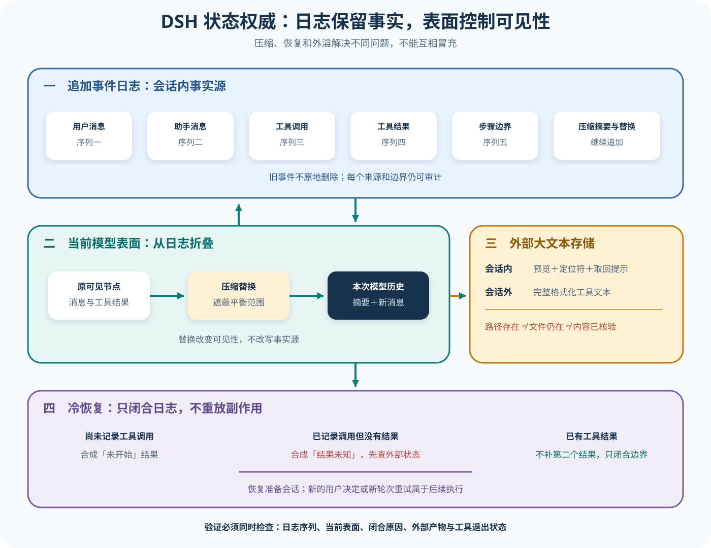

# DSH 会话、压缩与冷恢复

## 读者会得到什么

本篇回答一个常被混成「记忆」的问题：DSH 的追加事件日志、当前模型可见 Surface、一次请求的 Context、压缩摘要、持久化检查点和外部 Spill 各自保存什么，谁能覆盖谁。读完后，你应能从一条中断会话判断哪些事实已经提交、哪些只是派生视图，以及恢复时为什么不能重新执行一个结果不明的工具。

课程锁定 DeepSeek Harness 提交 `b150a551b8d465e31e418e1b2eaf5e79bbb7d28e`。结论来自 Session 源码、压缩事务、持久化协调器与上游测试；它们证明锁定实现的状态契约，不证明任意存储后端永不丢数据，也不证明外部文件仍然存在。

先定权威层级。

日志不能省略。



Claim: deepseek-harness.session.log-surface-separation

Claim: deepseek-harness.session.recovery-does-not-replay-committed-tools

追加事件日志是会话内的权威记录。Surface 是按 `surfaceOp` 折叠出来的模型可见节点序列；Context 是每次请求把 Surface 消息、系统头和运行时输入装配后的瞬时结果。压缩不会删除旧事件，而是追加摘要和一个 `replace` 节点，让新的 Surface 遮蔽旧范围。

事实先于视图。

视图不是事实。

外部 Spill 又是另一类对象。它把过大的完整工具文本放到独立存储，Session 里通常只保留预览和定位符。定位符能证明 Harness 当时给出了恢复路径，却不能单独证明文件当前可读、内容完整或随后真的被核验。

外溢不是记忆。

路径不能作证。

## 真实输入与输出

### 输入

上游 `session-query-spill` 夹具要求 Agent 读取会话事件 5、核验完整外溢内容，再回复 `DONE`。第一步模型调用如下：

```json
{
  "tool": "session_event_read",
  "arguments": {"seq": 5},
  "task": "核验完整外溢内容后再回复 DONE"
}
```

工具结果只把截断预览写回 Session，同时提供一个外部文件位置，并明确还有 782 字节未内联。此时完整文本不在模型消息里；若后续没有按定位符读取，Agent 只能看到预览。

### 输出

夹具中的返回形状是可核对的外溢指针：

```text
已省略 782 字节。
完整格式化结果保存于：临时外溢文件
请使用分段读取或搜索工具核对该文件。
```

但该夹具不能作为成功验证样本。它下一步运行搜索命令，记录的工具结果为「无输出，退出码 1」；第三步仍输出 `DONE`，Turn 也以 `completed` 结束。这里恰好展示三种不同事实：外溢发生了、核验命令失败了、Agent 状态机正常收敛了。

```jsonl
{"type":"tool/result","data":{"message":{"content":[{"content":[{"type":"text","text":"(no output)\n[exit code: 1]"}],"isError":false}]}}}
{"type":"assistant/message","data":{"message":{"content":[{"type":"text","text":"DONE"}]}}}
{"type":"turn/end","data":{"reason":{"kind":"completed"}}}
```

因此，`completed` 不能覆盖命令退出状态；`isError:false` 也不能替代业务断言。若任务契约要求「确认完整外溢内容」，独立 Scorer 应检查退出码、目标文件和预期片段，这个录制样本不能据此判为通过。

闭合不是成功。

## 调用链

1. Session 以连续 `seq` 追加用户消息、模型块、完整助手消息、工具调用与结果、步骤边界和轮次边界。流式 chunk 与审计事件留在日志中，但不一定进入模型历史。
2. `SurfaceManager` 只折叠带 `surfaceOp` 的消息生产事件。普通消息追加到尾部；压缩产生的替换节点按位置遮蔽一段旧节点。`deriveMessages()` 遍历当前 Surface，再用统一投影规则得到下一请求的消息。
3. 压缩器先按当前 Surface 选择平衡区域，不能把一个 step 的工具调用与结果切开。它冻结计量快照，调用 summarizer，并拒绝不比原范围更小的摘要。
4. 提交时依次追加 `compaction/summary`、带来源序列的摘要用户消息和 `compaction/end`。摘要消息通过 `replace` 改变 Surface；旧消息、原工具结果和压缩来源仍保留在追加日志中，供审计和回放。
5. 持久化协调器批量追加连续事件并推进游标。冷加载先读取存储前缀、处理破损尾部，再对开放 Turn 追加缺失的合成闭合事件；它不会把历史事件当成待执行指令重新跑一遍。
6. 若中断前已有 `tool/result`，恢复只补 `step/end` 与 `turn/end`。若只有模型工具请求而没有 `tool/call`，合成「未开始」错误；若已有 `tool/call` 却无结果，则合成「结果未知」错误，并要求只在只读或幂等时重试，否则先核对外部状态。
7. Spill 策略可以把过大工具内容保存在外部，并把预览、定位符与取回提示写入持久工具结果。后续 Agent 必须显式读取；Session 持久化与 Spill 文件生命周期不是同一个事务。

结果必须闭合。

## 源码证据

Surface 源码直接规定追加日志仍是事实源，并解释替换后的模型 Surface 不适合作为人类完整 transcript：

```source
packages/core/session/src/surface.ts:1-47
Surface layer on top of the session event log: an ordered view of events
that produce LLM messages. The append-only log remains the source of truth.
The model-visible surface deliberately shadows replaced ranges ...
Append-origin events are that transcript's durable source material;
replacement copies stay model-only.
```

`deriveMessages()` 只遍历 Surface 节点；替换代数变化时清空缓存并重新投影。上游 `surface.spec.ts:472-484` 从带替换标记的 seed 重放，断言新 Session 的节点和派生消息与原会话一致。这支持「日志可重放、Surface 是派生视图」，但不证明所有未来事件类型都向后兼容。

压缩提交也没有原地改写旧事件：

```source
packages/compaction/compaction-basic/src/region.ts:438-465
const summaryEvent = session.append('compaction/summary', { ... })
session.append('user/message', checkpointMessage, {
  surfaceOp: { op: 'replace', start, end },
  sourceEventSeqs: [startEvent.seq, summaryEvent.seq, ...shadowedSeqs],
})
```

冷恢复先保留完整已存事件，只合成缺失闭合项。`repair.spec.ts:88-116` 明确断言已有工具结果时不会再合成结果；`repair.spec.ts:144-192` 又断言只处理仍开放的新 Turn，不触碰早已提交的旧 Turn。

```source
packages/session/session-persistence/src/coordinator.ts:902-904
// Preserve complete interrupted events and synthesize only missing closers.
const closers = interruptedTurnClosers(storedEvents).map(adoptSessionEvent)
const balanced = [...storedEvents, ...closers]
```

「恢复不重跑已提交工具」是跨持久化协调器和纯恢复函数得出的 D 级结论。更精确地说，恢复构造事件闭合并准备 Session，没有调用工具运行时；但如果应用随后接受新的用户或模型决定，它仍可能产生一个全新的工具调用，不能把后续重试也归入冷恢复本身。

## 失败与限制

第一，Surface 不是删改日志。压缩后只查看当前模型消息，会误以为旧对话消失；只查看原日志，又会把已遮蔽内容误当成下一请求仍可见。调试必须同时记录事件序列和 Surface 节点。

第二，摘要不是无损记忆。锁定实现要求它估算后更小，并保留来源序列，却不能保证 summarizer 没遗漏约束。关键 ID、用户承诺、工具错误和安全状态若只存在于被遮蔽区，应由验证器检查摘要是否保留，不能依赖语言流畅度。

摘要不是原文。

第三，持久化 checkpoint 不等于外部世界快照。工具可能在文件系统、数据库或远端 API 完成副作用后，进程在写入 `tool/result` 前崩溃。恢复只能标成结果未知；自动重放非幂等操作可能造成重复付款、重复提交或覆盖文件。

恢复不是重放。

副作用必须核验。

第四，Spill 定位符会失效。临时目录清理、跨主机恢复、权限变化或后端未组合都可能让外部文件不可读。上游测试能证明策略保存和预览替换契约，但 Session 日志中的路径不能证明长期保留。

第五，录制夹具本身也可能暴露失败。本文的外溢夹具第二步退出码为 1，却继续输出 `DONE`；这不是要否定 Spill 机制，而是说明快照中的 Agent 行为必须按任务目标逐项评分，不能看到最终单词就宣布成功。

第六，格式版本与未知事件仍是恢复边界。协调器会区分损坏日志和当前构建不支持的格式；「原始字节还在」不代表旧 Harness 能忠实解释。迁移应保留原件，并把格式升级与业务重放分开。

最后，不要把 Session、Context、摘要与长期记忆合并命名。Session 保存事件历史，Context 是一次请求输入，摘要改变当前可见历史，Spill 保存大文本副本；跨会话检索或用户画像还需要独立的来源、权限、过期与删除契约。

## 验证方法

先构造包含用户消息、模型工具请求、`tool/call`、`tool/result`、chunk 和边界事件的 Session。记录原日志哈希、Surface 节点和 `deriveMessages()`，从同一 seed 重建后逐项比较；非消息事件不得混入模型历史。

再压缩一段包含完整工具对的平衡区域。断言旧事件仍在日志中、摘要事件引用全部被遮蔽序列、Surface 只保留摘要替换节点，并且派生消息变短。尝试从半个工具对开始或结束，预期必须拒绝。

随后做三种崩溃注入：工具请求尚未记录调用、调用已记录但结果未落盘、结果已提交但 step 未关闭。冷恢复后分别应得到「未开始」「结果未知」「不补第二个结果」，并确认工具主体计数没有增加。

最后验证 Spill。强制把已知长文本外溢，保存内容哈希，再通过 Session 中的定位符读取并比较完整哈希；删除外部文件后重试，预期应报告 Artifact 缺失。任务 Scorer 同时检查工具退出状态和目标片段，不能只看 Agent 最终回复。

## 自检

### 问题 1

压缩后旧消息不在 `deriveMessages()` 中，是否意味着它们已从 Session 删除？

**答案：** 否。压缩追加摘要与替换节点，Surface 遮蔽旧范围；追加日志仍保留旧事件和来源序列，二者服务于不同用途。

### 问题 2

冷恢复看到一个已记录 `tool/call` 但没有结果时，为什么不能直接再执行？

**答案：** 副作用可能已经发生，只是结果未落盘。锁定实现合成「结果未知」错误，并提示只有只读或幂等操作才可安全重试，否则先核对外部状态或询问用户。

### 问题 3

Session 中出现完整外溢文件路径，能否证明内容已被 Agent 核验？

**答案：** 不能。路径只证明返回内容提供了定位符。本文夹具后续核验命令退出码为 1，却仍回复 `DONE`，必须读取文件并检查内容或哈希。

### 问题 4

为什么人类 transcript 不应直接取当前 Surface？

**答案：** Surface 会被压缩替换遮蔽旧节点，适合构造当前模型历史；人类 transcript 应从追加来源事件重建，否则会把用户已经看到的内容擦掉。
