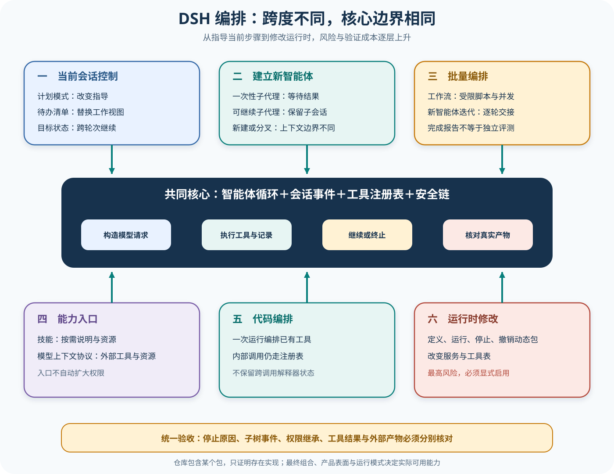

# DSH 编排、委派与运行时扩展

## 读者会得到什么

本篇不把「编排」当成一个万能模块，而是按控制跨度拆开：Plan 改变当前 Session 的行为指导，Todo 保存当前工作清单，Goal 维持跨 Turn 目标，Subagent 建立子会话，Workflow 批量调用子代理接缝，Ralph 用一轮一个新 Agent 的方式迭代，Skill 与 MCP 提供能力入口，Extension 改变运行时组合，Code Mode 则把多次工具调度包进一次模型可见的代码调用。

这些能力都在 Agent Loop 外层实现，却最终回到共同的 Session、工具注册表、Agent 生命周期和安全边界。Loop 不需要认识 `todo_write` 或 `subagent` 的业务含义；它只执行可见工具、记录结果并继续下一步。理解这点，才能区分「新增策略」「新增状态」「新增 Agent」和「新增可执行代码」。

先按跨度选能力。

## 核心概念



Claim: deepseek-harness.orchestration.extensions-share-core-loop

图中每一层都可以改变模型下一步看到的输入或可调用能力，但它们没有获得绕过工具安全和 Session 记录的特权。动态扩展的风险最高，因为它可能改变工具表与服务组合；因此它应是显式启用能力，不应从「仓库有这个包」推断成默认产品表面可用。

| 机制 | 改变什么 | 是否创建新 Agent | 权威结果 |
| --- | --- | --- | --- |
| Plan | 当前 Session 的行为指导 | 否 | 模式事件，不是安全强制 |
| Todo | 当前工作清单快照 | 否 | todo/write，不是验收 |
| Goal | 跨 Turn 目标与 revision | 否 | 生命周期状态，不是 Scorer |
| Subagent | 子 Session 与独立 Agent Loop | 是 | 子树终态与父端消费 |
| Workflow / Ralph | 多子 Agent 的调度与迭代 | 是 | 每个子运行与聚合 Artifact |
| Skill / MCP | 指令或外部工具能力 | 否 | 加载/调用事件与副作用 |
| Code Mode | 一次调用内批量编排 Registry 工具 | 否 | 每次内部工具结果 |
| Extension | 活运行时服务与工具表 | 可能 | 插件生命周期与有效配置 |

机制选择取决于控制跨度。只需改变当前回答方式用 Plan，跟踪短期步骤用 Todo，跨 Turn 目标用 Goal，需要独立上下文才创建 Subagent；需要批量并发时 Workflow 调度多个子 Agent，Ralph 则用 fresh Agent 与共享工作区迭代。

配置、启动和完成仍是三种状态。AgentDefinition 或 Skill 包存在只说明候选能力；模型选择、工具批准、子任务开始和产物通过要分别观察。根 Session 的汇总文本不能替代子树证据。

## 为什么这样设计

第一，共享核心 Agent Loop 避免每种编排机制重新实现模型、工具、Session 和权限。Workflow 的 agent()、Ralph 的每轮 Worker、Subagent 都最终进入同一接缝，安全与可观测性可以复用。

第二，不同状态跨度需要不同原语。把 Todo、Goal 和 Eval 合成一个「完成」字段，会让模型自己勾选任务就获得发布权；分开后，工作管理、长期意图和独立验收各自负责。

第三，子 Agent 通过独立 Session 隔离上下文，却可共享工作区完成协作。这个设计降低父上下文负担，同时把文件冲突、递归深度和父子结果归属显式交给编排层。

第四，Code Mode 与 Extension 分开限制风险。前者批量调用现有 Registry 工具，后者改变运行时服务和工具表；动态代码安装需要更高权限、来源验证、回滚和请求 Header 漂移检查。

第五，Hook 只观察或扩展事件，不成为权威调度器。监听器失败不会改写运行结算，避免日志、遥测或通知插件偶然决定任务是否完成。

这些分层还让失败责任可以准确归属：计划错误属于决策输入，子 Agent 启动失败属于编排基础设施，工具拒绝属于安全链，产物不合格属于任务结果。若把它们压成单个 success 布尔值，恢复策略会把产品失败误当瞬时故障，也会让重试悄悄改变评测分母。独立状态与关联 ID 因而既服务调试，也服务可信评测。

## 实现思路

教学实现以统一 `OrchestrationRun` 包装不同机制，同时保留具体类型。共享字段包括 run ID、parent Session、目标、预算、状态和 Artifact；各机制仍拥有自己的状态机。

1. **按跨度选择原语。** 当前 Turn 指导、跨 Turn 状态、独立 Agent、批量 Workflow 与运行时 Extension 分别路由，拒绝用一个万能 execute。
2. **编译能力与预算。** 固定 Provider、tools、permission、maxDepth、maxTurns、并发和交接 Schema；记录是否继承父 Context 或共享工作区。
3. **创建关联身份。** 每个子 Agent、Workflow item 和 Ralph 轮次都有独立 Session / run ID，绑定 parent 与 input item。
4. **通过共同安全链执行。** Agent、Skill、MCP、Code Mode 内部工具与 Extension 入口都经过 Registry、Guard、审批和 Sandbox。
5. **收敛并传播结果。** 子运行终态、结构化报告和父端消费分别记录；父端摘要不覆盖子树原始错误。
6. **独立验收与清理。** 检查工作区冲突、预算、产物和动态插件撤销；内部 completed 只作为 Artifact 字段。

```text
spec = compile(kind, goal, provider, tools, budgets, handoff_schema)
run = create_run(parent_session, spec)
如果 kind 是 subagent/workflow/ralph:
    children = start_child_sessions(spec)
    results = await bounded_join(children)
否则:
    results = execute_through_registry(spec)
record(child_results, parent_consumption, side_effects)
score = independent_scorer(results, workspace_diff, budgets)
```

Workflow 必须保留输入身份与 canonical result，不能让先完成的子任务改变输出对应关系。Ralph 每轮 fresh 时，长期状态只来自明确报告与工作区；报告长度、轮次上限和停止判定都要可测试。

Extension 运行前保存有效配置与工具 Header，停止或撤销后再次计算并检查服务释放。撤销失败不能被界面隐藏，必须阻断后续把旧工具表当稳定前缀。

实现时还要为父子关系建立不可变关联记录：父运行只能追加「已消费哪个子结果」，不能修改子运行的原始终态。这样即使父 Agent 重新组织摘要，复核者仍能沿 run ID 找回输入、预算、工具轨迹和产物。这个约束也是并发结果保持输入身份的基础。

## 贯穿案例

用户要求并行审查三个模块、汇总风险并更新报告。宿主选择 Workflow 调度三个 reviewer 子 Agent，Todo 展示当前进度，Goal 保存跨 Turn 目标；最终写入仍由父 Agent 完成。

1. **编译 Workflow。** 三个输入 item 获得固定 ID，maxConcurrency=2，每个子 Agent 只读、maxTurns=4，输出统一风险 Schema。
2. **启动子树。** a、b 先运行，b 先完成；Workflow 保留 item ID，不按完成顺序错配。c 在槽位释放后启动。
3. **处理失败。** b 的结构化输出无效，记录产品失败，不自动重跑到通过；Hook 发送通知但不改变终态。
4. **父端汇总。** 父 Agent 消费 a、b、c 原始结果，Todo 更新进度；Goal 仍 active，直到独立 Scorer 检查报告。
5. **验收。** Scorer 发现 b 缺失必需字段，Trial fail；Goal 的 completed 或报告中的「完成」不能覆盖。

```json
{"workflow":"review-1","items":["a","b","c"],"maxConcurrency":2,"completionOrder":["b","a","c"]}
```

```json
{"canonicalResults":{"a":"valid","b":"schema-error","c":"valid"},"parentConsumed":["a","b","c"]}
```

```json
{"goalState":"completed","todoRemaining":0,"eval":{"status":"fail","reason":"b 缺失风险证据"}}
```

递归变体让 b 子 Agent 再委派两层。根端只看到汇总，验证器必须读取最深 Session 的 depth rejection；不能凭根回复 `DEPTH_ONE_DONE` 宣称限制已触发。

Code Mode 变体在一个 `run_code` 中读取三个模块，内部每次 Read 仍走 Registry；Extension 变体动态注册审查工具，则还需来源签名、Header 变化和撤销检查。两者不能因都能「批量执行」就合并治理。

案例最终应保存四组互不覆盖的证据：Workflow 调度事件说明三个 item 如何运行；各子 Session 说明 reviewer 实际看了什么；父端报告说明哪些结果被消费；独立 Scorer 说明为何发布门禁失败。下一次修复只针对 b 产生一个新 Trial，旧失败仍留在记录中，不能通过重复执行把原有失败改写成通过。

## 真实输入与输出

### 输入

上游 `subagent-depth-two-rejection` 夹具给根 Agent 的任务是：连续委派两代，第二层子 Agent 再尝试一次委派，并报告深度拒绝。根会话实际发出的第一次工具输入是：

```json
{
  "name": "subagent",
  "arguments": {
    "description": "启动第一层",
    "prompt": "调用一次子代理，让它再尝试一次子代理调用并报告结果。",
    "run_in_background": false
  }
}
```

这个调用是前台等待的一次性委派。进程内 Driver 先解析下一层深度并创建一个真正的子 Agent，然后把 prompt 作为子会话的新用户消息，等待其进入空闲，再读取收尾结果。它不是在父 Loop 内递归调用同一个函数栈。

### 输出

根 Session 最终只记录了第一层返回和根回复：

```jsonl
{"type":"tool/result","data":{"message":{"content":[{"content":[{"type":"text","text":"DEPTH_ONE_DONE"}],"isError":false}]}}}
{"type":"assistant/message","data":{"message":{"content":[{"type":"text","text":"ROOT_DONE"}]}}}
{"type":"turn/end","data":{"reason":{"kind":"completed"}}}
```

这份根快照证明一次父工具调用收到了子结果并继续收敛，却没有把孙代的拒绝错误原文写进根日志。文件名和任务文字不能替代深层子 Session 证据；要验证「第二层再委派被拒绝」，还必须读取子树事件或对应 Provider 测试。

结果边界要守住。

同理，Workflow 返回聚合值只说明脚本与子代理接缝结算；Ralph worker 报告完成也不是独立 Eval；Todo 全部勾完和 Goal 标记完成都只是 Harness 状态。任务是否真的完成，仍需检查产物与外部约束。

## 调用链

1. Plan Mode 把模式状态写进 Session，并在请求组装时增加计划指导；锁定源码明确让退出工具始终注册，因此进入或离开计划模式主要改变 prompt section，而不是偷偷替换整个工具表。指导与强制是两条轴，计划模式本身不是文件写入 Sandbox。
2. `todo_write` 作为普通工具经过真实 Agent Loop。集成测试断言 Session 同时出现 `tool/call`、非错误 `tool/result` 和 `todo/write` 快照；第二次写入替换整张列表。Todo 是工作视图，不是事件级审计或验收结论。
3. Goal 工具把长任务状态保存在会话服务中，并用目标标识与 revision 做并发保护。它适合跨 Turn 的同一 Agent 继续推进；创建、暂停、阻塞和完成是生命周期状态，不会自动启动新 Agent。
4. Subagent Runtime 选择一个具备声明能力的 Provider。进程内 Driver 检查 `maxDepth`，创建子 Agent，应用子组合与工具过滤，再投递 prompt；一次性模式等待结果，可继续模式则保留子会话并通过消息与结算通知继续协作。
5. Workflow Engine 在 Worker 中解释受限脚本，脚本的 `agent()` 最终调用同一个 `ctx.subagents.start()` 接缝。并发上限、结构化 Schema、取消和汇总属于 Workflow；每个子任务仍有自己的 Agent Session 与停止原因。
6. Hook 是挂在生命周期事件上的观察或扩展函数，不是另一种 Agent。Workflow 的开始、阶段、子 Agent 开始与结束、整次结束都形成事件；监听器错误被包含并记录，不能阻止权威运行结算，也不能把观察回调当成任务结果。

钩子不是调度器。

7. Ralph 工具建立在 Workflow 和 Subagent 之上。锁定实现要求 fresh Provider 不能继承父上下文，每轮只跨越有界结构化报告，共享工作区承担长期记忆；只有用户明确要求 Ralph 或新 Agent 迭代时才适用。
8. Skill 负责把按需说明与资源引入当前任务，MCP 将外部工具或资源适配到 Harness。它们扩展「模型知道什么、能请求什么」，不自动扩大文件、网络、审批或凭据权限；来源不可信时，说明文本本身也可能成为提示注入载体。
9. Code Mode 只向模型暴露 `run_code` 传输工具，程序内调用仍通过 Registry 分派原生工具，继承参数校验、Guard、取消和结果记录。一次运行使用隔离 Worker，不应假设跨调用保留变量的 REPL 状态。
10. Cordis Extension 工具可检查、定义、运行、停止和撤销动态包。它会改变活运行时服务与工具表，可能使请求前缀失效，也可能扩大攻击面；动态包代码、宿主半边与浏览器半边必须各自限制，不能把 `node:vm` 名称当安全证明。

fork 子 Agent 的价值之一是复用父会话已经完成的请求前缀，但这个收益有字节级条件：子侧新增 prompt section、报告工具或不同工具 Schema 都会让前缀在继承历史之前发生变化。一次性与可继续模式不能只按交互体验选择，还要核对它们是否改变前缀、权限覆盖、报告通道和恢复生命周期。

## 源码证据

进程内子代理并不是轻量函数回调，而是经 Agent Store 创建子实例并运行独立 Turn：

```source
packages/subagent/subagent-in-process-driver/src/index.ts:106-178
assertSubagentMaxDepth(request.maxDepth)
const childDepth = resolveChildDepth(parent, request.maxDepth)
const handle = await parent.ctx.agents.create({ ... })
child.followup(createUserMessage({ content: prompt, source: { kind: 'user' } }))
await child.whenIdle()
```

Workflow 的 host 侧没有复制 Agent Loop，而是调用同一 Subagent 接缝；Ralph 又调用 Workflow Engine，并在启动前拒绝继承父 Context 的 Provider。这形成「工具 → 编排引擎 → 子代理服务 → 子 Agent Loop」的组合链。

```source
packages/workflow/workflow-worker-thread/src/host.ts:352-365
run = await this.subagents.start(this.provider, { ... })

packages/workflow/tool-ralph/src/index.ts:221-229,447
if (provider.inheritsParentContext) throw new Error(...)
const run: WorkflowRun = ctx.workflowEngine.start({ ... })
```

Todo 的完整集成测试把插件状态落回共同 Session，而不是旁路存储：

```source
packages/todo/tool-todo/tests/integration.spec.ts:49-72
it('model calls todo_write: a tool/call, a non-error tool/result, and a todo/write snapshot land', ...)
expect(findEvent(log, 'tool/call').data.name).toBe('todo_write')
```

Extension 也通过 `ctx.tools.register()` 暴露入口，再调用 `dynamicCordisRunner` 执行定义、运行和撤销。Code Mode 源码则把程序调用描述为 Registry 的 Agent 可见工具。由多个包共同支持「共享核心边界」，所以 Claim 使用 D 级：这是有源码链支撑的跨子系统架构推断，不是单文件直接声明的统一定理。

## 失败与限制

第一，Plan、Todo 与 Goal 解决不同时间尺度。把 Todo 当 Goal 会在列表重写时丢失长期意图；把 Goal 当 Eval 会让 Agent 自己宣布完成；把 Plan 当安全策略会误以为提示文字能阻止副作用。

状态不是证据。

第二，Subagent 共享工作区不等于共享 transcript。新建子 Agent 需要完整独立 prompt；fork 子 Agent 只继承已完成前缀，不应包含父当前未闭合 Turn。可继续子会话还能收后续消息，但消息排队不能改写已经开始的当前 Turn。

第三，递归深度必须在 Provider 能力和实际子树中核对。根 Session 只保存根调用的汇总结果；如果子 Agent 吞掉深层错误并返回成功词，父端 `completed` 不足以证明深度限制按任务要求触发。

第四，Workflow 的并行只是调度能力。共享文件写入、相同分支修改、同一外部记录更新仍会冲突；脚本返回数组也不会自动建立 Trial 身份、去重或发布门禁。子代理基础设施失败与任务答案错误应分开统计。

第五，Ralph 每轮 fresh 并不天然更可靠。工作区里的错误中间产物会成为下一轮事实，短报告可能丢掉关键上下文，worker 自报完成也可能误判。必须为目标、轮次上限、交接 Schema、产物验证和停止条件分别定约。

第六，Skill 和 MCP 是供应链与提示边界。加载说明、连接远端 Server 或暴露资源都可能带入不可信内容；工具名称和描述进入请求前缀，还会影响缓存。权限应按连接、工具和资源最小化，凭据不得通过模型消息回显。

第七，Code Mode 不是权限逃逸。程序能批量编排工具，但每次原生调用仍应走相同安全链；若某个实现直接给 Worker 任意主机 API，便破坏了这个边界。代码成功执行也不代表内部每个业务操作都成功，必须读取结构化结果。

第八，动态 Extension 改变运行时本身，风险高于普通工具调用。热更新、服务冲突、工具表变化、浏览器半边不同步和撤销失败都要独立测试。未启用 Cordis preset 的产品不应展示这些能力，已启用也不等于允许模型安装任意代码。

## 验证方法

先分别运行 Plan、Todo 和 Goal 的集成测试。切换 Plan 前后比较工具 Schema 与提示段；两次写 Todo 验证全量替换；用旧 revision 更新 Goal 应失败。检查 Session 事件，而不是只看界面卡片。

再建立三层子树：根、第一层与第二层分别保存 Session ID、parent、depth、工具调用和停止原因。让最深层尝试超限委派，直接读取其错误结果；根端只接受汇总，不作为深层证据。重复测试一次性与可继续两种模式。

随后运行一个有界 Workflow，混合成功、结构化输出失败、取消和子代理启动失败。确认每次开始都有一次结束、并发不超过上限、结果保持输入身份。Ralph 则检查每轮新 Session、无父 transcript seed、报告长度上限和工作区产物哈希。

最后对 Skill、MCP、Code Mode 与 Extension 做安全验证：注入恶意说明、撤销连接、让代码调用被 Guard 拒绝、动态注册后比较请求头，再停止并撤销插件。任何能力都要经过同一产物 Scorer；内部状态「完成」不得替代独立验收。

## 自检

### 问题 1

Plan Mode 中模型被要求只规划，是否等于写工具已被 Sandbox 禁止？

**答案：** 不等于。锁定实现主要改变提示指导并保持工具 Schema 稳定；安全强制仍由工具策略、审批和平台 Sandbox 承担。

### 问题 2

Workflow 为什么不是另一套 Agent Loop？

**答案：** Workflow Engine 解释编排脚本，host 侧的 `agent()` 最终调用 Subagent Runtime；每个子任务仍由子 Agent 的共享 Loop、Session 和工具链执行。

### 问题 3

根快照里出现 `DEPTH_ONE_DONE`，能否证明孙代超限拒绝已发生？

**答案：** 不能。它只证明第一层返回了该文本。要证明深层拒绝，必须读取对应子 Session 或直接测试 Provider 的深度检查。

### 问题 4

Code Mode 和动态 Extension 的主要差别是什么？

**答案：** Code Mode 在一次工具调用内用程序编排已有 Registry 工具；Extension 可以改变活 Cordis 组合、服务与工具表。后者改变运行时身份与请求前缀，治理风险更高。
