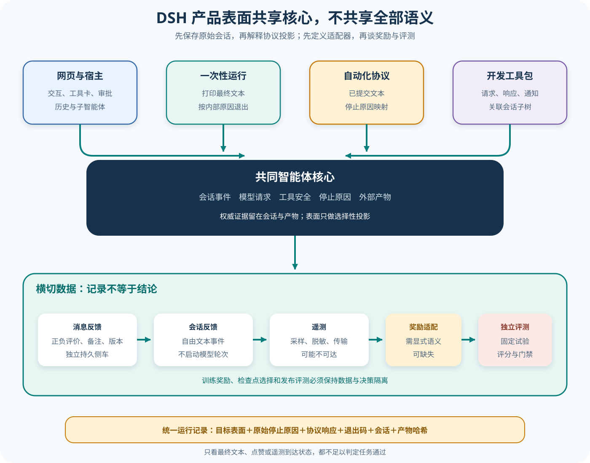

# DSH 产品表面、反馈与评测接入

## 读者会得到什么

本篇从同一个 Agent Session 出发，比较 Web/Host、Headless、ACP、SDK、Python 与无人值守入口怎样驱动它、怎样投影事件、怎样表达停止。随后把消息反馈、Session 反馈、遥测与 Eval 分开，给出一条从可观测数据到独立发布评测的诚实接入路径。

课程锁定 DeepSeek Harness 提交 `b150a551b8d465e31e418e1b2eaf5e79bbb7d28e`。表面名称相同不保证协议语义相同；一条通道显示完整工具卡，另一条可能只发送已提交文本。调用方必须把入口、协议版本与停止映射写进运行记录。

先看谁驱动谁。



Claim: deepseek-harness.surfaces.protocol-adapters-not-identical

Claim: deepseek-harness.feedback.is-not-training-reward

上图中央只有一套 Agent、Session、工具与安全核心，周围却有不同宿主契约。Web 需要交互、回放与可视卡片；Headless 运行一次任务后按停止原因给进程退出码；ACP 通过标准输入输出上的 JSON-RPC 被客户端驱动；Python SDK 启动桥接进程，关联请求、通知和子 Session 树。

共享核心不等于共享结果语义。

投影不是事实。

## 核心概念

产品表面是同一运行核心对某类调用方给出的入口与结果约定。它决定谁创建 Session、怎样提交消息、能收到哪些事件、怎样取消，以及内部停止原因如何映射为协议响应或进程退出码。表面可以复用 Agent Loop，却仍拥有独立的兼容性和信息损失问题。

| 概念 | 它回答的问题 | 权威身份 | 不应直接推出 |
|---|---|---|---|
| Web / Host 表面 | 人如何交互、审批和回放 | Session ID、消息 ID | 界面投影就是完整事件日志 |
| Headless 表面 | 单次进程怎样接收任务和退出 | 进程、Session、退出码 | 输出了文本就算任务成功 |
| ACP | 编辑器或自动化客户端怎样驱动 Agent | 协议 Session、请求 ID | `end_turn` 等于内部 completed |
| SDK / Python bridge | 程序怎样调用、订阅和关闭 | 请求 ID、通知、子 Session 映射 | RPC 成功等于产物正确 |
| Feedback | 用户对消息或会话表达什么判断 | messageId / sessionId、版本 | 二值评价已经是训练 Reward |
| Telemetry | 运行时向观察系统传出了什么 | Trace、Span、Exporter 状态 | 没有 Trace 就没有发生执行 |
| Eval | 固定任务如何形成可比较结论 | Trial ID、Target、Scorer 版本 | Harness 自报完成可替代评分 |
| RewardAdapter | 原始信号如何获得训练语义 | 适配器版本、样本权重 | 训练信号可兼任发布门禁 |

「投影」是理解多表面的关键：权威 Session 保存一组事件，适配器只选择、转换或聚合其中一部分。例如 Web 可以把工具事件渲染成卡片，ACP 只发送已提交的助手文本，Headless 再把终态压成退出码。投影方便调用方，却可能丢掉审批过程、工具错误和细粒度停止原因。

反馈还分消息级与 Session 级。消息级评价以 `messageId` 和版本令牌解决目标身份与并发更新；Session 级自由文本表达对整段体验的意见。二者都属于原始观察信号，必须经过清洗、归因、聚合和版本化适配，才可能进入训练数据。独立 Eval 则从固定 Dataset 建立 Trial，并保留 Target 表面、原始 Session、产物与 Scorer。

最后要区分传输完成、运行完成和任务通过。RPC 返回表示一次协议交互结算；内部 `turn/end` 描述 Agent Loop 的停止；Scorer 才判断任务约束是否满足。这三层状态可以同时出现「成功、完成、失败」，例如 ACP 请求正常返回 `end_turn`，内部因达到 token 上限停止，最终补丁也未通过测试。

## 为什么这样设计

第一，核心与表面分离让同一 Agent 能服务交互界面、命令行跑批和编程调用，而无需复制工具、安全与 Session 逻辑。复制核心会使审批、取消和恢复语义在不同入口漂移；适配层只处理传输与投影，故障边界更清楚。

第二，各表面保留自己的契约，是因为调用方需求真实不同。人类界面需要增量显示和审批卡片，Headless 需要稳定退出码，ACP 需要协议互操作，SDK 需要请求关联和通知订阅。强行输出同一载荷会把展示细节泄漏给自动化客户端，也会让轻量调用承担不必要的兼容负担。

第三，权威事件与表面响应分离可防止信息压缩污染评测。适配器允许把多个内部终态映射到一个协议枚举，但 Eval 同时保存原始 `turn/end`；由此既保持协议兼容，又能准确统计取消、阻塞、超限和基础设施错误。

第四，Feedback、Telemetry、Reward 与 Eval 分层，避免把用户偏好、运行观察和正确性混成一个数字。反馈适合发现体验问题，遥测适合定位性能与故障，训练适配器负责把选定信号转成优化目标，独立评测负责发布判断。每层拥有独立版本和保留策略，训练改动便不能悄悄改写发布标准。

第五，身份与版本从入口贯穿到评测，使并发和重放都可核对。请求 ID 关联协议响应，Session ID 关联事件，messageId 与 ifVersion 保护反馈，Trial ID 关联固定输入与产物。缺少任一身份时，重复通知、冷刷新或重试都会制造难以解释的重复样本。

## 实现思路

可以把多表面接入实现成「权威运行核心 + 无状态协议适配器 + 追加型证据仓库」。适配器可以维护请求关联等传输状态，却不能私自改写 Session 终态；Eval Adapter 读取权威证据并显式记录任何归一化。

1. **定义统一运行信封。** 为一次调用生成 run ID，固定源码、模型、权限、工作区和目标表面；把协议请求 ID 与内部 Session ID 分开保存。
2. **建立表面能力表。** 明确每个入口支持的创建、提示、取消、审批、事件订阅、MCP 和关闭语义；未支持能力应显式拒绝。
3. **投影事件。** 从追加型 Session 日志选择允许外发的事件，记录被丢弃或合并的类别；协议停止映射使用可测试的穷举函数。
4. **保存表面结果。** 同时写入 RPC 响应、进程退出码、stdout、通知缺口和桥接错误，不能覆盖原始 Session。
5. **分流反馈与遥测。** 消息反馈使用版本化 sidecar，Session 反馈使用追加事件；遥测单独记录投递成功与共享披露。
6. **构造独立 Trial。** Eval Adapter 绑定 Dataset item、Target surface、Session 和产物，Scorer 按冻结版本评分；Feedback 只有通过显式 RewardAdapter 才能进入训练通道。

```text
请求 = 表面适配器.解析(外部输入)
运行 = 核心.创建会话并执行(请求, 固定配置)
协议结果 = 表面适配器.投影(运行.事件, 运行.终态)
证据仓库.追加(请求标识, 会话标识, 原始事件, 协议结果)
试验 = 评测适配器.绑定(数据项, 目标表面, 证据, 产物)
判定 = 独立评分器.评分(试验)
```

停止映射应采用封闭枚举和保守默认值。新增内部原因若没有对应协议语义，测试必须失败，不能静默落到 `end_turn`。同样，Headless 的退出码只表达进程契约，详细原因仍写结构化 sidecar，便于自动化系统区分产品失败、取消与基础设施异常。

反馈管道还需要数据治理：保存同意状态、脱敏结果、撤回、版本冲突和来源表面；训练导出创建不可变快照，记录 RewardAdapter 版本。发布 Eval 使用不参与训练的 holdout，并禁止评分器读取用户点赞作为正确答案，从数据层阻断泄漏。

## 贯穿案例

设定一个固定仓库任务：「修改解析器，使空输入返回结构化错误，并通过指定测试」。同一输入分别通过 Headless 和 ACP 执行，目标是判断两种表面的协议差异会不会改变质量统计。

1. **冻结输入。** 创建 Trial `trial-17`，固定源码、模型、工具权限、测试命令和超时；Target 变体只改变表面。
2. **执行 Headless。** 进程打印助手总结，但内部终态为 `max_tokens`，退出码为 1；Session 留下未完成的工具调用和工作区差异。
3. **执行 ACP。** JSON-RPC 请求正常返回，适配器映射出 `end_turn`；自动化 wire 只有已提交文本，原始 Session 同样保留内部终态和工具轨迹。
4. **收集反馈。** 用户在 Web 回放中给某条解释消息差评，并注明「没有说明测试失败」；这条记录与 `messageId` 关联，不修改两个 Trial 的评分。
5. **独立判定。** Scorer 在隔离检出中应用产物并运行测试；两个变体都因测试失败判为 fail，同时报告表面响应差异。
6. **分析归因。** 研究者把 ACP 的 `end_turn` 标记为有损投影，不把它解释为成功；若后续训练要使用差评，另建带版本的 RewardAdapter 数据快照。

```json
{"trialId":"trial-17-acp","surface":"acp","protocolStop":"end_turn","internalStop":"max_tokens","rpcStatus":"ok"}
```

```json
{"trialId":"trial-17-acp","artifactTest":"fail","score":0,"feedbackUsedByScorer":false}
```

这个案例的关键观察是：协议完成与任务失败可以同时成立。若统计脚本只读取 RPC 状态，ACP 变体会被误计为通过；若只读取 Headless 退出码，又无法知道是取消、超限还是工具错误。正确做法是保留三层状态，再由 Eval Adapter 做有版本的归一化。

再做一个反馈并发变体：两个浏览器都从 version 3 开始，一个改为 positive，另一个撤回。服务只接受第一个比较并交换写入，第二个收到冲突并重新读取 version 4。这样可证明最终 sidecar 有清楚的写入顺序，也防止同一反馈被两次导入训练快照。

案例产物应包含请求、Session、协议结果、退出码、工作区差异、测试日志、反馈 sidecar 和评分器版本。任何摘要都只是这些证据的索引；删除原始事件后，研究者便无法区分模型行为与表面投影。

## 真实输入与输出

### 输入

Web 的 Session 级反馈命令直接接收自然语言，不启动模型 Turn。上游浏览器端到端测试输入为：

```text
/feedback the diff view is unreadable
```

命令插件规范化文本后追加 `feedback/record`，再返回当前 Session ID、匿名用户标识和遥测共享状态。与此同时，消息级反馈走另一套请求，目标是特定 `messageId`：

```json
{
  "sessionId": "会话标识",
  "messageId": "助手消息标识",
  "rating": "negative",
  "note": "差异视图难以阅读",
  "ifVersion": null
}
```

`ifVersion` 是比较并交换令牌，避免两个界面静默覆盖同一条反馈。消息反馈只允许 `positive` 或 `negative`，备注还受非空和字节上限约束。

### 输出

Session 级命令的可见确认包含「已为某 Session 记录反馈」与共享披露；事件日志只保存反馈文本。消息级接口则返回带版本、创建时间和更新时间的 sidecar 项，并能在冷刷新后恢复、随后撤回。

```json
{
  "ok": true,
  "value": {
    "messageId": "助手消息标识",
    "rating": "negative",
    "note": "差异视图难以阅读",
    "version": "新版本令牌"
  }
}
```

这两个输出都没有分数标定、样本权重、RewardAdapter 版本、训练 Checkpoint 或发布阈值。它们是用户反馈记录，可以成为后续数据管道输入；在缺少清洗、归因、适配与独立评测时，不是训练奖励，也不是模型质量结论。

反馈不是判决。

记录也不是奖励。

## 调用链

1. Web 客户端通过 Host 暴露的服务操作 Workspace、Session、Agent 和命令；Host 将核心事件投影为消息、工具卡、审批对话、子 Agent 状态与历史列表。浏览器界面是消费者，不是 Session 的权威副本。
2. Headless bundle 创建一个新 Agent，记录任务前水位，投递一次用户消息，等待空闲并 flush Session；它打印水位之后最后一条非空助手文本，只有 `turn/end.reason.kind === completed` 才退出 0，其余情况退出 1。
3. ACP 作为自动化 Agent 端接受 `session/new`、`session/prompt` 与 `session/cancel`。它只向客户端发送已提交 assistant 文本，原始 chunk、reasoning、工具、计划与标题不进入自动化 wire；客户端传入非空 `mcpServers` 会被拒绝。
4. ACP 的 prompt 结果把内部停止原因映射成协议 `stopReason`。这个映射比 Session 原因更粗，某些非正常内部原因也可能成为 `end_turn`；因此 Eval 必须保留原始 `turn/end`，不能只看协议表面。
5. TypeScript 或 Python SDK 通过 JSON-RPC bridge 发起 `session/prompt`，按请求 ID 等待响应，同时订阅通知。Python 客户端还从子代理生命周期通知建立 parent map，让调用方筛选整棵 Session 子树。
6. MCP 在 DSH 中是外部能力接入方向：客户端插件把远端工具转为本地工具注册表项。它与 ACP `session/new` 的 `mcpServers` 参数不是同一条通道；后者在锁定 ACP server 中明确不支持。
7. Web 消息反馈服务把对单条助手消息的评价写入独立持久 sidecar；Session `/feedback` 命令把自由文本追加成 `feedback/record`。二者可与 Session Artifact 关联，却拥有不同身份、版本与删除语义。
8. Session Telemetry 从事件生成可观测记录，并按后端共享状态披露是否可能传出。遥测传输失败不应改变 Agent 任务结果；反馈命令测试甚至刻意连接不可达的本地端点，验证记录与披露仍可完成。
9. 真正 Eval 应从固定 Dataset 生成 Trial，调用明确 Target 表面，保存 Session、协议响应和外部 Artifact，再由独立 Scorer 判定。若要进入 DPO、GRPO 或 RFT，还需显式 RewardAdapter 把反馈或评分转成训练语义，并与发布评测隔离。

遥测不能代替评分。

退出码必须归一。

## 源码证据

ACP 源码明确把自动化通道限制为已提交助手文本：

```source
packages/acp/acp/src/index.ts:218-226
// Emit only committed assistant text/images. Raw chunks, reasoning, tools,
// plans, titles, and retry markers are presentation or trace data and stay
// off the automation wire.
if (event.type === 'assistant/message') { ... }
```

同一实现还拒绝客户端在 `session/new` 中传入 MCP server，并对停止原因进行协议映射。Headless 则直接按内部 completed 判断进程退出码：

```source
packages/bundle/headless/src/index.ts:127-133
await sessions.flush(agent.session)
const outcome = summarize(agent.session.events, firstSeq)
io.stdout.write(outcome.text + '\n')
io.exit(outcome.reason?.kind === 'completed' ? 0 : 1)
```

两条表面消费同一类 Session，却输出不同粒度，所以多表面 Claim 使用 D 级。它是跨 ACP、Headless 和 SDK 的协议投影推断，不宣称所有入口在每个停止原因上都已做成一张完整等价表。

消息反馈的公共类型只定义二值评价、备注、版本和时间：

```source
packages/feedback/message-feedback/src/types.ts:13-32
export type MessageFeedbackRating = 'positive' | 'negative'
export interface MessageFeedbackItem {
  readonly messageId: MessageId
  readonly rating: MessageFeedbackRating
  readonly note?: string
  readonly version: MessageFeedbackVersion
}
```

Web 端到端测试冷刷新后重新读取 sidecar，再撤回评价；Session 反馈测试则确认命令不启动模型 Turn，只追加 `command/run`、`feedback/record`、`command/done`。这些证据能证明反馈持久与界面闭环，不能证明反馈已经训练模型。

## 失败与限制

第一，ACP 的 `end_turn` 不能直接换算成 Headless 退出 0。协议为了兼容自动化客户端压缩了内部原因；同一任务跨表面对比时，应以统一的原始停止分类和任务 Scorer 重新归一化。

表面不是事实源。

第二，Web 能显示并不意味着 ACP 或 SDK 收到了同样信息。工具卡、审批对话、reasoning、计划和 retry marker 可能只属于展示或 Trace；自动化消费者如果需要，必须读取 Session 事件或专门的查询接口。

第三，SDK 的请求成功只说明桥接调用结算。子进程退出、通知过滤、超时与 shutdown 都有独立失败面；订阅子树依赖生命周期通知建立 parent 关系，通知遗漏时不能假定树完整。

协议之间不能互证。

第四，消息点赞有选择偏差、位置偏差、用户差异和重复修改。二值 rating 没有任务难度、正确答案或反事实，直接当奖励会放大噪声。自由文本反馈还可能包含敏感信息与提示注入内容。

第五，Telemetry 是可观测通道，不是权威 Session。采样、脱敏、队列溢出、Exporter 不可达和共享模式都会改变可见记录；不能因后台没收到 Trace 就判 Agent 没执行，也不能因收到 Trace 就判任务成功。

第六，仓库中的性能 benchmark、浏览器回归或上游测试只证明各自约束。它们不是统一任务集，也没有自动形成独立发布门禁。名字里出现 `benchmark` 或 `e2e` 不足以升级证据等级。

第七，无人值守入口的审批必须显式定义。没有人在场时，询问通道不可用应失败关闭；不能为了跑批而把所有任务统一切到完全访问。Trial 还应记录权限模式与实际平台执行强度。

## 验证方法

先用同一固定任务分别跑 Web、Headless、ACP 和 SDK，保存原始 Session。注入 completed、max-tokens、cancelled、blocked 与 error，建立「内部原因—表面响应—进程退出码」表，发现信息损失就由 Eval Adapter 补齐，不能修改原始记录。

再验证消息反馈：对同一 `messageId` 新建评价、用旧版本并发更新、冷刷新、撤回。断言 target 必须是派生的追加型助手消息，version conflict 不会静默覆盖，Session 删除与 sidecar 生命周期按契约处理。

随后验证 Session 反馈和遥测：执行 `/feedback`，确认不产生新模型 Turn；分别在无遥测后端、本地不可达后端和可达测试后端下检查共享披露、队列与 Session 事件。外发内容必须经过脱敏审计。

最后建立独立 Eval：固定 Trial ID 与 Target surface，保存完整 Session、表面返回、退出码和产物哈希。Scorer 不读取点赞作为答案；若另有 RewardAdapter 使用反馈训练，版本化其清洗与聚合规则，并用不参与训练的 holdout 做发布判定。

先保存原始事件。

任何跨表面对比若没有同时冻结任务输入、源码版本、模型配置、工具权限、平台执行强度、停止原因归一规则和评分器版本，即使最终文本看起来相似，也只能作为调试线索，不能成为可复现的质量结论。

一个可核对的评测运行还要把消息反馈的版本冲突、会话反馈的原始文本、遥测是否成功外发、自动化协议丢弃了哪些事件、一次性进程采用什么退出规则、开发工具包是否完整接收子会话通知，以及独立评分器读取了哪些产物逐项登记；否则事后无法判断差异究竟来自模型、工具、权限、协议投影、数据缺失还是评分逻辑。

原始记录优先。

## 自检

### 问题 1

ACP 返回 `end_turn`，是否等于 Headless 会退出 0？

**答案：** 不等于。ACP 映射可能压缩多个内部原因；Headless 只在内部原因严格为 completed 时退出 0，应回到原始 Session 归一化。

### 问题 2

消息级差评为什么不是训练奖励？

**答案：** 它只记录用户对一条消息的二值判断、备注和版本，没有任务正确性、归因、尺度、聚合或 RewardAdapter 语义。必须经过独立设计才能进入训练。

### 问题 3

Web 能看到工具卡，Python SDK 为什么可能看不到？

**答案：** 不同表面选择不同事件投影。Web 面向交互展示，自动化协议可能只发送已提交文本；SDK 若需工具轨迹，应订阅相应通知或查询 Session。

### 问题 4

反馈、遥测和 Eval 的最短区别是什么？

**答案：** 反馈表达用户判断，遥测记录运行观察，Eval 用固定任务与 Scorer 产生可比较结论。三者可连接，但不能互相改名。
