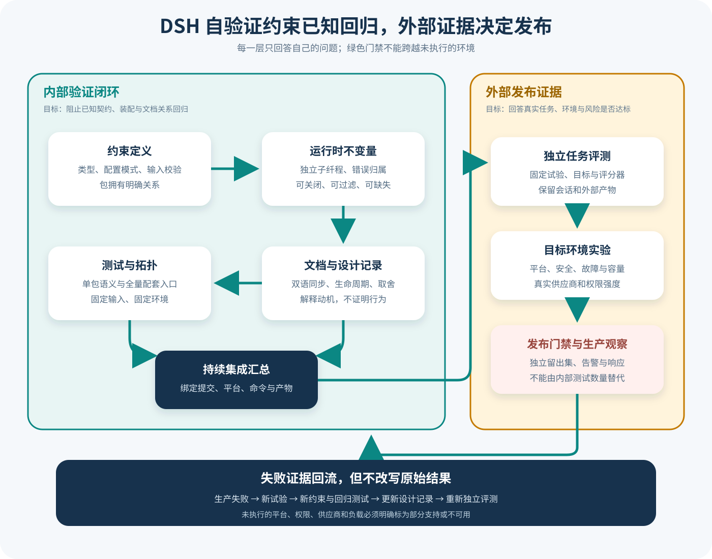

# DSH 自验证、设计取舍与证据边界

## 读者会得到什么

本篇解释 DSH 怎样把类型约束、单元与集成测试、包自有运行时不变量、文档同步门禁和 Agent Note 设计记录拼成一条内部验证链。重点不在罗列测试数量，而在回答每一层能证明什么、遗漏什么，以及怎样把仓库自验证接入独立 Eval。

课程锁定 DeepSeek Harness 提交 `b150a551b8d465e31e418e1b2eaf5e79bbb7d28e`。源码、测试和设计记录彼此补充，却不能相互冒充。内部门禁通过说明锁定版本满足已编码约束；它不自动证明未知平台、真实供应商、恶意输入、长期负载或生产发布条件。

证据必须限定范围。



Claim: deepseek-harness.verification.internal-gates-have-bounded-scope

上图把内部闭环画在左侧，把外部证明画在右侧。左侧负责尽早发现已知契约回归；右侧才回答真实任务是否成功、部署环境是否安全、性能是否可接受。两侧共享版本与产物，但判定主体、数据分布和失败处置不能混为一谈。

## 核心概念

验证首先是「结论与证据是否匹配」的问题。不同检查拥有不同观察范围：类型系统看到静态结构，Schema 看到输入形状，运行时不变量看到一次进程内的事件关系，测试看到作者构造的环境，独立 Eval 看到固定任务和评分器，生产观察看到目标部署。任何一层越过自己的观察范围，绿色结果就会变成过度声明。

| 证据对象 | 直接回答 | 典型产物 | 不能单独证明 |
|---|---|---|---|
| 类型与 Schema | 数据形状是否满足已编码约束 | 编译错误、校验错误 | 业务语义正确、并发安全 |
| 运行时不变量 | 一次运行中可观察关系是否被破坏 | `InvariantError`、包归属 | 没注册或没触发的路径健康 |
| 单元 / 集成测试 | 固定替身与装配下行为是否符合断言 | 测试日志、覆盖路径 | 未知输入、真实平台和供应商 |
| 端到端测试 | 特定产品路径能否完成场景 | 浏览器/进程记录、产物 | 所有平台、长期稳定性 |
| Agent Note | 为什么选择方案、拒绝何种替代 | 状态化设计记录 | 当前实现真的符合设计意图 |
| CI 门禁 | 某提交运行了哪些自动检查 | 工作流、命令、产物 | 生产就绪或发布授权 |
| 独立 Eval | 固定任务是否达到评分标准 | Trial、Trace、Score | 训练分布之外的一切风险 |
| 生产观察 | 目标环境实际表现如何 | 指标、日志、事故记录 | 未发生事故便绝对安全 |

运行时不变量是由包所有者声明的动态关系，例如 Session 序列号严格递增、工具结果必须归属已存在的调用。它适合检测「单个字段都合法，但字段之间关系错误」的情况。服务负责筛选、生命周期与稳定错误，companion 负责具体关系；没有 companion、被过滤或路径未触发时，不会凭空产生证明。

设计记录属于解释性证据。它保存问题背景、候选方案、取舍、实施状态和已知缺口，帮助后来者理解源码为何如此。`implemented` 只表示某项决策曾被落实，当前行为仍要由锁定源码与测试核对；若实现漂移，记录必须更新或降级，不能拿历史意图覆盖现状。

Eval 的统计单位也要明确。Trial 表示一个固定任务在固定 Target 配置下的结果；Attempt 只用于同一 Trial 的基础设施恢复。模型答错、工具误用或产物不合格属于产品失败，不能新建 Attempt 一直重试到通过。训练 Reward、Checkpoint 选择和发布 holdout 分属三个判断环节，使用同一数据会产生泄漏。

证据等级关注来源接近程度与可复查性，不等同于信心形容词。单行源码可以直接证明一个局部分支，却未必证明跨包架构；完整测试可以证明特定输入，却未必证明设计目标。写 Claim 时应同时给出结论、锁定版本、证据、推理跨度和限制，缺少外部实验就将状态写为 partial 或 unavailable。

## 为什么这样设计

第一，把便宜且确定的约束放在内层，可尽早阻止缺陷传播。类型和 Schema 在执行前拒绝形状错误，局部测试快速定位纯函数问题，运行时不变量捕获动态关系，集成与端到端测试再验证装配。分层让失败更靠近责任包，也缩短反馈时间。

第二，不变量由包自有 companion 提供，避免中央服务了解所有产品领域。中央只管理注册、筛选和生命周期，包作者定义自己真正拥有的关系；新增包无需修改一个巨型全局检查器，热更新时的名称所有权也能清楚判断。

第三，单包测试与完整拓扑测试拆开，可以同时回答「关系本身正确吗」和「所有 companion 都接上线了吗」。只做单包测试会漏掉 bundle 装配缺失，只做全树测试又会让启动顺序、共享状态和无关依赖掩盖局部错误。

第四，设计文档门禁与行为门禁并行，是为了防止实现留下无法解释的复杂度。高风险变更若只改代码，后来者无法知道被拒绝的替代方案和剩余代价；若只更新 Note，行为又可能从未实现。二者互相索引，却保持证据类型独立。

第五，外部 Eval 与发布验证不复用内部绿色状态，可抵抗共同盲点。作者编写的实现和测试往往共享假设，独立任务、评分器、目标平台及威胁实验提供不同失败视角。发布决策因此基于多条有边界的证据，而非测试数量或覆盖率总分。

## 实现思路

教学实现可以建立一份「证据清单」和一个最小不变量注册服务。清单把每个 Claim 映射到检查、提交、环境和缺口；服务只负责包所有权、过滤与生命周期，使检查逻辑留在 owner companion。

1. **列出风险与 Claim。** 按类型安全、状态一致性、持久化、安全、恢复、性能和任务质量拆分结论，为每条指定能够否证它的观察。
2. **选择最内层检查。** 能静态证明的放类型，纯函数放单测，跨事件关系放 invariant，真实装配放集成或端到端；避免同一浅层断言重复堆数。
3. **注册 companion。** 使用完整包名占有检查，编译 allowlist 与 blocklist；即使禁用执行也保留 owner，安装失败必须释放子生命周期资源。
4. **构建双重测试拓扑。** 普通包测试只挂所属 companion，专门拓扑测试加载全部 companion；源码规则核对入口、导出、依赖和 bundle 接线。
5. **记录执行证据。** 每次 CI 保存提交、平台、命令、跳过项、退出状态和产物哈希；设计 Note 只记录动机与状态，不写成行为证明。
6. **接入独立 Eval。** 为固定 Dataset 生成 Trial，保存完整 Session 与外部产物，Scorer 在独立环境判定；产品失败保持失败，基础设施恢复才使用 Attempt。
7. **建立发布矩阵。** 把目标平台、权限攻击、供应商故障、崩溃恢复、容量和数据治理列为单独门禁，任何 unavailable 项都缩小发布范围。

```text
对每条 claim:
    observer = 选择能直接看到失败的最内层检查(claim)
    evidence = 执行并保存(observer, commit, environment)
    如果 evidence 未覆盖目标环境:
        claim.status = partial
    如果 claim 涉及任务正确性:
        trial = independent_eval(dataset_item, target, scorer)
        claim 只能引用 trial 的有界结果
```

不变量服务可把 installer 放进独立子 fiber。注册时先占有包名，再判断过滤器是否启用；启用后等待安装结算，出错则 dispose 并释放所有权。正常卸载也等待清理完成，避免旧监听器与新 companion 同时观察事件。错误对象包含稳定 code、packageName 和消息，便于 Host 决定显示、记录或终止。

证据清单需要机器可读字段，例如 claim、source、commit、test、environment、result、limitations 和 reviewer。它不自动给出总分；门禁只判断某项声明需要的证据是否存在且范围相符。这样新增平台时会出现明确的待验证单元，而不会让旧平台绿色结果自动外推。

## 贯穿案例

假设团队准备修改 Session 存储，使重启恢复后继续分配序列号。目标 Claim 是：「在已提交事件之后恢复，后续 seq 始终严格递增，并且不会重复执行未确定的工具副作用。」这句话同时涉及局部关系、崩溃恢复和外部副作用，单条 invariant 无法覆盖全部范围。

1. **拆分结论。** C1 检查进程内 seq 递增；C2 检查持久化往返后水位恢复；C3 检查 started/unknown/committed 工具状态；C4 用真实文件产物验证重启后没有重复写入。
2. **布置内层检查。** Session companion 对每个追加事件比较前后 seq，纯序列化测试覆盖快照往返，故障注入测试在写日志和提交工具结果之间杀进程。
3. **运行固定场景。** Agent 调用一次写文件工具，在副作用完成、结果提交前崩溃；恢复器读取日志，把该调用标为 unknown，并要求人工或幂等探测，不直接重放。
4. **保存证据。** CI 记录 invariant 测试、恢复测试和目标平台；设计 Note 解释为何选择保守 unknown。任何未运行的平台保持 unavailable。
5. **独立验收。** Scorer 检查最终文件只出现一次目标行、Session 无重复 tool result、后续 seq 大于旧水位；Trial 失败时不重试到绿色。
6. **收窄发布。** Windows 文件系统场景通过而 Linux 沙箱未执行，则 Claim 只覆盖已验证环境，发布矩阵留下明确缺口。

```json
{"claim":"session.recovery.no-duplicate-side-effect","platform":"windows","commit":"锁定提交","internalChecks":"pass","externalArtifact":"pass"}
```

```json
{"trialId":"recover-004","attempt":1,"crashPoint":"副作用后、结果提交前","toolState":"unknown","fileLineCount":1,"score":"pass"}
```

若只看到 `InvariantError` 没有抛出，最多能说明已启用 companion 在本次观察路径中没有发现 seq 逆序；它没有观察文件是否重复写入。若只看到最终文件正确，又无法确认 Session 事件是否形成重复结果。案例需要把内部关系与外部产物同时纳入 Scorer。

再注入一个装配缺陷：保留 companion 文件，却从 bundle 移除加载入口。单包测试仍可能通过，完整拓扑或产品装配测试必须失败；若二者都未失败，证据清单应把「生产 bundle 已启用 invariant」降为 unavailable。这个反例说明测试文件存在和运行时保护生效是两个问题。

最终发布记录不写「全部测试通过所以安全」，而写清 C1 至 C4 的各自证据、平台、未执行项和判定者。后来者可以沿 Claim 找到源码、测试、Trial 与产物，也可以准确知道这次验证没有覆盖真实供应商限流或长期负载。

## 真实输入与输出

### 输入

运行时不变量服务接受全局开关以及按完整包名匹配的允许和阻止正则。下面是一组可由锁定源码直接接受的配置，它只启用 Session 包的配套检查：

```json
{
  "enabled": true,
  "package_allowlist": ["^@deepseek-ai/dsh-session$"],
  "package_blocklist": []
}
```

包通过 `ctx.invariants.register(packageName, installer)` 注册检查。注册即占有包名；即使过滤器没有启用 installer，同名重复注册也会失败。启用的 installer 在独立子 fiber 中安装事件监听或启动检查，并用注入的 `fail(message)` 报告违约。

### 输出

当 Session 包检测到序列号没有严格递增时，服务抛出带稳定代码与归属包名的错误。上游测试核对的对象等价于：

```json
{
  "name": "InvariantError",
  "code": "INVARIANT",
  "packageName": "@deepseek-ai/dsh-session",
  "message": "invariant violated by \"@deepseek-ai/dsh-session\": seq must strictly increase"
}
```

这是一条精确的内部违约信号，不是用户任务评分。它能定位哪个包声明的关系被破坏，不能回答模型输出是否正确，也不能替代权限逃逸测试、崩溃恢复实验或线上告警。

失败要能归属。

## 调用链

1. 包先在类型、Schema 和纯函数层表达局部约束。能由编译器或输入校验阻止的错误不应重复伪装成运行时不变量。
2. `InvariantRegistry` 编译允许与阻止正则，验证空白、重复和非法模式；阻止列表在允许列表之后生效。`enabled` 关闭检查时仍保留注册所有权，避免热更新期间出现两个 owner。
3. 每个具备可观察事件关系或可变数据关系的包发布自己的 `./invariant` companion。服务本身不导入产品包，也不自动安装产品检查；装配方决定何时加载它们。
4. companion 注册后在专用子 fiber 中启动。异步安装必须结算后注册才成功；安装失败会释放子 fiber 和包名占用，正常 disposer 也要等清理完成后才允许重注册。
5. 普通包测试由全局测试 host 只挂载所属包的 companion。专门的拓扑测试挂载全部 companion，分别检查「单包语义」和「完整注册覆盖」，减少只测到文件存在却没有执行的伪覆盖。
6. 对不适合全局 host 的聚焦不变量测试，`usesManualInvariantTree` 保留手动拓扑，避免测试装配重复。选中的 companion 若消失、没有注入 invariant 服务或无法激活，测试启动就失败。
7. 源码规则再检查所有工作区包是否有正确的 companion、导出、依赖、类型引用与 bundle 接线。空 installer 必须用包专属理由说明为什么当前没有合理的运行时关系。
8. 文档同步门禁核对双语文档、格式、链接和设计记录。Agent Note 用 proposed、implemented、rejected 与 archived 生命周期保留动机、替代方案、代价和已知缺口；implemented 记录必须跟随已发布事实更新。
9. CI 汇总类型检查、静态规则、单元测试、集成测试和文档门禁。每项结果都绑定提交、平台、命令与产物，任何跳过都应显式记录。
10. 独立 Eval 从固定 Dataset 生成 Trial，运行真实 Target 和工具环境，保存 Session 与外部产物，再由独立 Scorer 判定。发布门禁还要结合威胁测试、目标平台实验、性能预算和可观测性，而不是复用内部测试通过数作为分数。

门禁不是终点。

## 源码证据

注册服务明确把一个包的检查放进独立子 fiber；安装失败时先释放子级，再传播错误：

```source
packages/runtime-diagnostics/invariants/src/index.ts:160-175
const installInvariant = (childCtx: Context) => (
  installer(childCtx, (message): never => {
    throw new InvariantError(packageName, message)
  })
)
...
await child
...
await child.dispose()
throw error
```

服务测试没有只断言「抛错」，还核对稳定错误代码、包归属和消息：

```source
packages/runtime-diagnostics/invariants/tests/service.spec.ts:189-207
expect(caught).toMatchObject({
  name: 'InvariantError',
  code: 'INVARIANT',
  packageName: '@deepseek-ai/dsh-session',
  message: 'invariant violated by "@deepseek-ai/dsh-session": seq must strictly increase',
})
```

测试 host 对覆盖范围作了刻意拆分。普通包测试只选 owner companion；完整拓扑测试选全部 companion；无法找到预期文件会立即失败：

```source
scripts/test-invariants.ts:137-156
// Package tests receive their owner's checks; the dedicated topology test
// receives every owner so coverage and exhaustive runtime registration remain
// independently enforced.
...
throw new Error(`test invariants: package test has no companion at ${companionPath}`)
```

设计记录规则要求非平凡变更同步新增或更新 Agent Note，记录发布事实、替代方案与代价。这说明仓库把「为什么这样设计」当成维护输入。不过设计记录仍是决策说明，不是行为已经正确的动态证据；只有当前源码、测试和实验能核对实际实现。

Claim 使用 D 级，因为「整套内部验证链降低已知回归风险，但范围有限」是跨源码、测试装配和治理文档的综合推断。它不把某条测试、某篇 Note 或某次 CI 单独升级成生产保证。

## 失败与限制

第一，不变量可以被全局关闭或按包过滤。某次运行没有抛出 `InvariantError`，可能因为关系成立，也可能因为 companion 未装配、过滤器未命中、事件路径未触发或检查本身不存在；沉默不能直接解释成健康。

沉默不是通过。

第二，运行时不变量只适合包拥有且可观察的关系。纯工具、组合包、二进制入口和持久化适配器可能合理使用空 installer；后者需要崩溃测试、往返测试或真实文件系统实验。强行给每个包造一个计数检查，会增加虚假安全感。

第三，测试 host 本身也是代码。自动挂载能扩大覆盖，也可能改变启动顺序或掩盖真实装配缺失，所以聚焦测试保留手动树，生产 bundle 仍需独立验证实际 companion 是否加载。

第四，单元测试固定的是作者已经想到的输入。它通常不覆盖未知协议组合、并发交错、磁盘耗尽、跨进程崩溃、供应商限流、终端差异、长时间资源泄漏或对抗性工具输出。

第五，文档同步只证明结构和引用关系满足规则。双语 Note 都存在，不代表其中事实仍然正确；格式门禁通过，也不代表被拒绝的替代方案已经充分实验。审阅者仍需回到锁定源码与当前行为。

第六，测试数量、覆盖率和 Agent Note 数量都不是质量函数。大量相似断言可能共享同一盲点；一个端到端 Trial 也只能证明其固定环境。证据应按结论逐条绑定，而不是按总数营造确定性。

第七，CI 成功不等于生产就绪。真实发布还缺少目标平台矩阵、权限边界攻击、供应商故障注入、恢复点目标、数据治理、性能容量、告警响应和独立任务评测时，状态只能写为 partial 或 unavailable。

第八，锁定仓库拥有中文包文档和设计记录，并不意味着所有产品表面都在同一平台真实执行过。本课程没有运行 Linux 沙箱、macOS 沙箱、真实模型供应商或线上遥测，因此不对这些表面作 A 级声明。

## 验证方法

先验证注册服务本身：用默认、关闭、允许、阻止、非法正则和重复包名配置创建服务，断言选择优先级、稳定错误代码、异步安装失败清理、disposer 等待和热更新重注册。每个失败都要检查资源与 owner 是否真正释放。

再验证 companion 归属：枚举工作区包，将每个 package test 映射到唯一 companion，并由独立拓扑测试加载全部入口。故意删除一个入口、写错注册包名、移除注入或让 installer 忽略 reporter，确认源码门禁和运行测试至少有一层失败。

随后验证产品装配：在真实 bundle 配置中打开不变量，注入一个已知 Session 序列违约和一个工具结果归属违约，确认错误到达预期故障通道，不会被界面、ACP 或 Headless 静默改写成任务完成。再关闭或过滤同一 companion，验证审计记录能明确显示检查未启用。

接着审计文档与设计记录：对每个高风险 Claim 建立「源码—上游测试—本地实验—限制」清单。Agent Note 只解释动机与取舍；若 implemented 文档与源码漂移，先把 Claim 降级并修正文档，不能用历史意图覆盖当前实现。

最后运行独立 Eval。固定源码、模型、平台、权限、Dataset、Scorer 与 Trial ID；将产品失败计入 Trial，不用重试把失败冲成通过。训练奖励、Checkpoint 选择和发布 holdout 分离，只有目标环境的独立证据满足门禁才允许发布。

一条完整验证记录还应列出没有执行的命令、跳过原因、缺失凭证、外部服务版本、可恢复与不可恢复故障、日志与产物哈希，以及谁有权解释结果；否则后来者只能看到绿色状态，无法判断绿色覆盖了哪一段系统。

如果这份记录还要支持发布决策，就必须继续写明每个结论采用哪一级证据、哪些测试与产品配置完全相同、哪些只使用替身、哪些失败会阻断发布、哪些失败仅触发调查、重试是否属于同一 Trial 的基础设施恢复，以及训练奖励、Checkpoint 选择和独立留出集之间如何隔离；缺少其中任何一项，都应缩小结论而不是补写信心措辞。

范围先于结论。

## 自检

### 问题 1

CI 中所有 invariant 测试通过，能否宣称 DSH 已生产就绪？

**答案：** 不能。它只说明锁定提交在测试环境满足已编码关系；目标平台、安全攻击、真实供应商、负载、恢复和独立任务评测仍需各自证据。

### 问题 2

某个包使用空 invariant installer，是否等于这个包没有验证？

**答案：** 不等于。它表示当前没有适合运行时不变量的关系；纯函数可由单元测试验证，持久化适配器应由往返与崩溃测试验证。空实现必须说明理由并在职责变化时复审。

### 问题 3

为什么全局关闭不变量后仍保留包名注册？

**答案：** 过滤控制检查是否执行，不应取消所有权。保留名称能阻止两个 companion 在热更新或组合变化时同时声称同一包。

### 问题 4

Agent Note、源码测试和独立 Eval 分别回答什么？

**答案：** Agent Note 回答为什么这样取舍；源码测试回答已知契约在固定环境是否成立；独立 Eval 回答固定真实任务是否达到发布标准。三者互补，不能互换。
