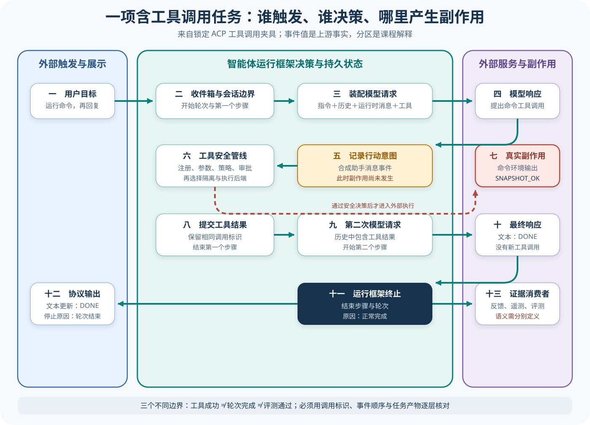

# DeepSeek Harness 源码课程

[返回学习入口](../../00-start-here.md)

DeepSeek Harness 是一套采用 TypeScript 多包结构的 Agent Harness。启动时，各个包会把 Preset（预设）、Prompt、模型调用、工具、Session、Code Mode（代码模式）、扩展和评测接缝接到同一套运行时。装配只是起点。课程会沿一次真实任务追踪配置怎样生成运行对象、模型输出怎样进入工具循环，以及状态怎样跨轮保存。源码目录只帮助定位模块，不能直接证明架构结论。


## 这条课程适合谁

如果你想了解一个功能较完整的 Harness 怎样通过包和配置获得不同能力，可以从这里开始。只要能读懂基础 TypeScript，就能跟上这条课程。Cordis、ACP、KV Cache 和 Code Mode 会在对应源码第一次出现时解释，你不必提前熟悉它们。

## 锁定来源

为了让正文解释始终对应同一份源码，本课程把 DeepSeek Harness 固定在提交 `b150a551b8d465e31e418e1b2eaf5e79bbb7d28e`。开始阅读前，可以先打开下面三个入口，认清配置、主循环和测试分别位于哪里：

- [标准 Agent Preset](https://github.com/deepseek-ai/deepseek-harness/blob/b150a551b8d465e31e418e1b2eaf5e79bbb7d28e/apps/cli/config/agent-presets/standard/agent.cordis.yml)
- [Agent Loop 实现](https://github.com/deepseek-ai/deepseek-harness/blob/b150a551b8d465e31e418e1b2eaf5e79bbb7d28e/packages/core/agent-loop/src/agent.ts)
- [Agent Loop 测试](https://github.com/deepseek-ai/deepseek-harness/blob/b150a551b8d465e31e418e1b2eaf5e79bbb7d28e/packages/core/agent-loop/tests/loop.spec.ts)

所有源码链接都指向这个提交，因此默认分支继续变化时，文章仍能与当时阅读的实现对应。

## 先看一项任务

课程始终围绕「修复失败测试」这项任务展开，并把任务推进过程逐步对应到 DeepSeek Harness 的真实对象。CLI 先选择 Preset，配置层据此装入 Prompt 和工具，随后 Agent Loop 请求模型，并把工具调用产生的结果写成新的 Message。Session 会继续保存这些事件，ACP 表面或评测适配器最终再从中读取运行产物。

```text
CLI / ACP 输入
  → Preset 与 Bundle 装配
  → Prompt、模型与工具就绪
  → Agent Loop
  → 工具调用与结果消息
  → Session 与输出表面
```



这张图根据锁定源码重建阅读路线，并非运行时自动生成的 Trace。进入各章后，你还要沿每个箭头找到具体文件和对象，再用上游测试核对它们之间的调用关系。

## 仓库地图

| 区域 | 首轮关注点 |
| --- | --- |
| `apps/cli` | 参数、Preset 和启动入口怎样选择运行配置 |
| `packages/bundle` | 多个能力怎样通过 Bundle 组合 |
| `packages/core/agent-loop` | 模型、工具结果和停止条件怎样形成循环 |
| Prompt 与上下文相关包 | 系统提示、历史、Cache 和压缩信息怎样进入请求 |
| 工具与 Code Mode 相关包 | 普通工具和代码执行路径怎样连接 Environment |
| Session 与协议表面 | 消息怎样持久化并暴露给 CLI、ACP 或其他宿主 |

第一次阅读时，可以先跳过网站、构建脚本和当前调用链没有经过的 Provider 兼容代码。

## 三层读法

- **Starter**：读完前三篇，能解释 Preset 怎样装配能力、模型工具请求怎样回到下一轮。
- **Builder**：继续读工具、Code Mode、Session 与 Compaction，选择一个配置字段追到行为变化。
- **Maintainer**：阅读编排、产品表面和核对篇，检查失败分类、来源边界与外部 Eval 接口。

## 阅读顺序

1. [启动、Preset 与 Bundle](01-boot-preset.md)：从 CLI 配置走到可运行 Agent。
2. [Prompt、Context 与 Cache](02-prompt-context-cache.md)：模型一轮真正看见什么。
3. [Agent Loop、模型与工具结果](03-loop-model-tool.md)：沿主循环跟完一次工具调用。
4. [工具、权限与 Code Mode](04-tools-security.md)：工具意图怎样进入受控执行。
5. [Session 与 Compaction](05-session-compaction.md)：消息如何保存、压缩和恢复。
6. [编排与扩展](06-orchestration-extensions.md)：Bundle、子任务和扩展怎样改变运行时。
7. [产品表面、Feedback 与 Eval 接缝](07-surfaces-feedback-eval.md)：运行事实怎样离开核心。
8. [测试、核对与适用边界](08-verification-design-limits.md)：用上游测试回查课程结论。

课程会随着重构合并重复概念，编号只表示推荐阅读顺序，不能据此判断每个机制都属于独立层。

## 用贯穿任务复盘

读完课程后，可以从「CLI/ACP 收到运费修复目标」开始，沿前面的调用链复盘一次。先说明标准 Preset 选择了哪些能力，以及 Prompt 怎样带入项目上下文，再解释 Agent Loop 怎样接收 `read/edit/test` 的 Tool Result、Code Mode 与普通工具路径如何分工、Session 在中断后保存了什么，最后指出哪些 Feedback 或 Eval 接缝能够观察结果。复盘中的每一步都应回到课程里的某个锁定源码站点，这样才能形成可核对的完整链路。

如果只能说「Bundle 把它们组合起来」，复盘还没有完成，因为你仍需指出具体配置进入哪个对象、状态在哪里变化，以及下一站由谁消费。

## 完成课程后应该能回答

- 标准 Preset 怎样选择 Prompt、工具和运行能力；
- Agent Loop 接收什么输入，何时再次请求模型；
- 工具结果以什么形态回到消息历史；
- Code Mode 与普通工具路径各自解决什么问题；
- Session 和 Compaction 保存或改写了哪些信息；
- DeepSeek Harness 中实际存在的评测接缝在哪里，哪些仍需要外部系统。

[从第一篇开始：启动、Preset 与 Bundle](01-boot-preset.md)
