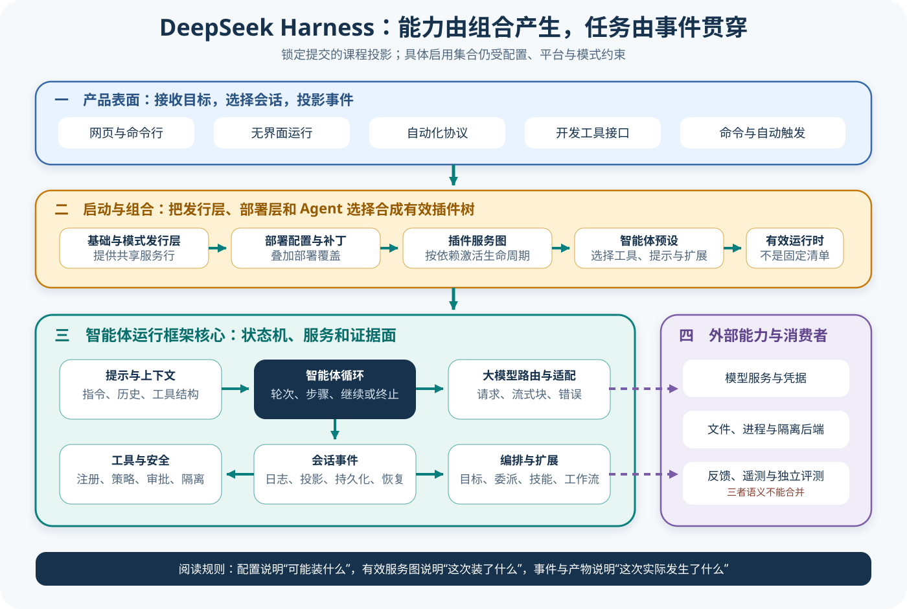

# DeepSeek Harness 源码主线

## 读者会得到什么

这是一条以 Agent Harness 为主、Eval 接入为横切面的源码课程。它不按包名逐个抄说明，而是从一项真实任务出发，追踪 DSH 怎样装配运行时、构造模型请求、接住工具调用、约束副作用、保存会话、继续采样并形成可供反馈或外部评测读取的轨迹。读完入口后，你应该能画出主要边界，并知道后续八篇各自回答哪一个实现问题。

本课程锁定 DeepSeek Harness 提交 `b150a551b8d465e31e418e1b2eaf5e79bbb7d28e`，上游根包版本为 `0.1.1-rc.2`。源码采用 MIT License；这允许本仓库在遵守许可证的前提下分析和引用源码，却不表示 DeepSeek 为本课程背书，也不表示锁定提交等于当前最新版、稳定版或生产部署证明。

这里的「真实」有严格边界：正文中的事件名和示例值来自上游已提交的 ACP 快照夹具，循环结论来自源码与测试；它是可重复的录制/回放证据，不是本仓库现场调用线上模型的性能实验。图中的分层是为了阅读而做的架构投影，不是上游导出的统一协议图。事实、测试覆盖和本仓库推断会分别标注。

先固定证据边界。

先看全景，再沿任务链深入。不要从目录名猜行为，也不要把插件已安装直接等同于能力已启用。

## 系统全景



Claim: deepseek-harness.architecture.composed-runtime

上图把锁定实现投影成四层。产品表面接收用户目标并选择会话；启动与组合层把 bundle、profile 补丁和 agent preset 装进 Cordis；Harness 核心层运行 Agent Loop、Prompt、工具与 Session 服务；外部能力层提供模型服务、文件与进程执行环境，以及可选的遥测或独立评测消费者。各层通过服务或事件连接，不代表它们在源码中都位于同一个包。

先核对分层。

`packages/bundle/base/cordis.patch.yml:24-30,58-67,98-101,163-205` 直接列出 LLM、Session、Agent、持久化、Sandbox、Approval 和 Permission 等基础行。`apps/cli/config/agent-presets/standard/agent.cordis.yml:1-18` 又明确区分 host composition 与 agent-plane preset：注册表、沙箱、审批、持久化和模型路由属于宿主组合，persona、模型可见工具、压缩和委派选择由 preset 贡献。由此可以核对「能力来自组合」这件事，但具体启用集合仍会随 profile、patch、平台、环境变量和 preset 改变。

这也是为什么课程不把 DSH 简化成一个 `while` 循环。循环是执行心脏，却依赖外部组合提供模型适配器、工具注册表、安全边界、会话持久化和产品表面。反过来，Web、ACP 或 SDK 也不应各自复制一套核心状态机；它们应把输入映射到共享的会话和 Agent 能力，再把事件投影成各自协议输出。

组合不是能力证明。

Eval 位于右侧横切接入，而不是循环中的第二个「裁判模型」。DSH 的事件、反馈和遥测可以成为评测输入，但本课程不会把一条点赞、一次 telemetry 上传或一个内置 benchmark 自动称为训练奖励，更不会称为独立发布门禁。要形成可复核 Eval，仍需外部固定 Trial、保存 Artifact、应用 Scorer，并把训练奖励、Checkpoint 选择与发布评测分开。

## 课程状态与顺序

| 顺序 | 模块 | 状态 | 先回答的问题 |
| ---: | --- | --- | --- |
| 00 | 主线入口 | 已复核 | 整个运行时怎样连起来，一项任务怎样穿过边界？ |
| 01 | 启动与 preset | 已复核 | bundle、profile、Cordis 与 preset 怎样得到有效插件树？ |
| 02 | Prompt、Context 与缓存 | 已复核 | 模型输入如何装配，哪些变化会破坏稳定前缀？ |
| 03 | 循环、模型与工具 | 已复核 | 流式响应、工具闭环、重试、取消和终止如何协作？ |
| 04 | [工具安全](04-tools-security.md) | 已复核 | Guard、审批、策略与平台 Sandbox 怎样分层？ |
| 05 | [会话与压缩](05-session-compaction.md) | 已复核 | 原始事件、派生 Context、摘要、Spill 与恢复谁是权威？ |
| 06 | [编排与扩展](06-orchestration-extensions.md) | 已复核 | Plan、Goal、Subagent、Workflow、Skill 与运行时代码怎样接入？ |
| 07 | 产品表面与评测 | 编写中 | Web、ACP、SDK、反馈、遥测和 Eval 接口怎样共享核心？ |
| 08 | 自验证与限制 | 待发布 | 测试、设计记录和门禁能证明什么，不能证明什么？ |

状态表是发布契约，不是进度装饰。只有正文、Claim、图示、来源和自检一起通过门禁，模块才会变成「已复核」。未发布模块的名称先说明阅读顺序，但不会以空链接进入正式导航。

状态先于导航。

推荐按 00→01→02→03→04→05 阅读完整主链，再读 06→07→08。若只排查一次工具调用，应从 03 开始，再回看 04 的安全决策和 05 的持久状态；若只研究产品表面，不应跳过 03，因为协议输出只是核心事件的投影。

再追踪调用链。

## 真实输入与输出

### 输入

上游 `examples/acp-agent/tests/snapshots/tool-call-turn/session.jsonl` 记录的用户要求如下。它要求模型先调用 shell 工具，再只回复一个单词：

```json
{"content":[{"type":"text","text":"Use the bash tool to run exactly: echo SNAPSHOT_OK. Then reply with the single word DONE and stop."}],"source":{"kind":"user"},"role":"user"}
```

这条输入先以 `agent/inbox/spliced` 进入收件箱，随后出现 `turn/start`、`step/start` 和 `user/message`。同一会话还追加一条由插件生成的运行时策略快照，说明当时文件策略为 `danger-full-access`、审批提示禁用。这个快照只能证明该测试会话的模式，不能外推成所有 DSH 会话的默认安全设置。

### 输出

第一次模型响应不是最终文字，而是 `bash` 工具调用；真实会话夹具随后记录调用与结果：

```jsonl
{"type":"tool/call","data":{"turn":1,"step":1,"callId":"call_00_Rn2Mz1y8uZN62ukEXiNO2077","name":"bash","arguments":"{\"command\": \"echo SNAPSHOT_OK\", \"description\": \"Run echo SNAPSHOT_OK\"}"}}
{"type":"tool/result","data":{"turn":1,"step":1,"message":{"content":[{"type":"tool-result","toolCallId":"call_00_Rn2Mz1y8uZN62ukEXiNO2077","content":[{"type":"text","text":"SNAPSHOT_OK\n"}],"isError":false}]}}}
```

第二个 step 才产生文本 `DONE`，最终会话记录为 `turn/end` 且原因是 `completed`。ACP 对外快照则把同一结果投影成 `session/update` 的文本块，并以 `stopReason: end_turn` 完成 JSON-RPC 请求：

结果分两层。

```jsonl
{"jsonrpc":"2.0","method":"session/update","params":{"update":{"sessionUpdate":"agent_message_chunk","content":{"type":"text","text":"DONE"}}}}
{"jsonrpc":"2.0","id":3,"result":{"stopReason":"end_turn"}}
```

这里有三个不同的「完成」：shell 命令成功、Agent Turn 收敛、ACP 请求返回。它们都不是 Eval 通过。只有外部 Scorer 按固定任务契约检查命令副作用、最终回复和轨迹，才能产生评测结论。

三个完成，三种语义。

## 调用链


Claim: deepseek-harness.turn.tool-result-loop

1. 产品表面接收用户目标，选择或创建 Session，并把输入放入 Agent inbox；持久事件 `turn/start` 与 `step/start` 建立本轮边界。
2. Agent Loop 运行 `preStep`，把可见用户消息写入 Session；Prompt 组件、工具注册表和 `session.deriveMessages()` 一起构造本次模型请求。
3. LLM Adapter 将统一请求映射到具体 Provider。流式 chunk 先被记录，再由 `BlockAssembler` 合成 `assistant/message`；一串 chunk 仍只属于一次模型响应。
4. 若响应包含工具调用，Harness 保留调用标识，经过工具注册、参数处理、策略、审批和执行后端，记录 `tool/call` 与 `tool/result`。图中「真实副作用」单独着色，因为模型提出调用不等于副作用已发生。
5. 工具结果通过 Session 的消息投影进入下一次模型请求。锁定测试 `loop.spec.ts:198-232` 断言发生两次模型调用，第二次请求包含 `tool-result`，并且 Session 同时包含 `tool/call` 与 `tool/result`。
6. 当模型不再给出工具调用时，`agent.ts:412-418` 返回 `completed`；外层在每个 step 后写 `step/end`，最终在 `agent.ts:316-320` 写 `turn/end`。取消、错误、最大 token 和工具结论会走不同原因，不能都压成成功。
7. 产品表面把会话事件翻译成 Web、ACP 或 SDK 输出；Trace、Session 日志和任务产物随后可被反馈系统或独立 Eval 读取，但读取者必须保留来源、版本和 Trial 边界。

## 源码证据

锁定循环的关键分支如下。它先构造请求并记录流式事件，合成 assistant message；没有工具调用才直接完成，否则执行工具并根据结果决定是否继续：

```source
packages/core/agent-loop/src/agent.ts:340-418
const { request, preparedCall } = await this.buildRequest(...)
for await (const chunk of stream) {
  chunkSeqs.push(this.session.append('assistant/chunk', { turn, step, chunk }).seq)
  assembler.push(chunk)
}
this.session.append('assistant/message', ...)
const toolCalls = message.content.filter(block => block.type === 'tool-call')
if (toolCalls.length === 0) return { kind: 'completed' }
const { concluded } = await executeToolCalls(...)
return concluded ? { kind: 'completed' } : null
```

上游确定性测试进一步锁定了「结果回送而非只显示在界面」这一行为：

```source
packages/core/agent-loop/tests/loop.spec.ts:198-232
expect(adapter.requests).toHaveLength(2)
const secondMessages = adapter.requests[1]!.messages
const toolResultMessage = secondMessages.find(m =>
  m.content.some(b => b.type === 'tool-result'))
expect(toolResultMessage).toBeDefined()
expect(types).toContain('tool/call')
expect(types).toContain('tool/result')
```

系统架构 Claim 使用 D 级，因为它把多个组合文件和循环服务投影到一张共同图；工具结果闭环 Claim 限定在锁定 DSH 实现，源码与上游测试直接支持，所以使用 B 级。B 级仍只说明这个版本、这个行为面有源码和测试，不表示所有 Provider、平台和真实工具都已端到端验证。

## 失败与限制

第一，组合失败可能早于 Agent Loop。bundle、profile patch、环境变量、平台条件或 preset realm 错误都可能使插件缺失、同名服务冲突或模型看不到预期工具。此时不能只在循环文件里找问题，要检查最终 Cordis 树和服务可用性。

先核对组合。

第二，模型流结束不代表任务完成。Provider 错误、取消、最大 token、半截工具参数和工具要求终止都可能改变后续路径。界面上出现 `DONE` 也不能证明命令真的执行；必须关联 `callId`、工具结果和可观察副作用。

第三，安全能力受模式与平台约束。夹具明确运行在 `danger-full-access` 且 `approval: never`，因此它适合验证工具闭环，不适合证明沙箱隔离。Linux、macOS、Windows 和远程执行后端要分别核对，策略允许、用户批准和 OS 级隔离不能互相替代。

第四，会话日志是重要证据但不是完整世界状态。外部文件可能在日志写入前后被其他进程改变；遥测也可能默认关闭、传输失败或只包含投影。发布 Eval 若依赖副作用，应保存内容哈希、命令退出状态和环境快照，而不是只看 assistant 文本。

第五，本课程锁定一个提交。后续上游若改变 profile、事件 Schema、默认模型或协议投影，本页不会自动保持最新。`last_verified` 表示最近一次对锁定源码核对日期，不是实时兼容承诺。

正常结束不等于任务成功。

## 验证方法

先做静态核对：确认 checkout 的 HEAD 与 frontmatter commit 完全相同；检查 Claim 中每个路径、行号和摘录真实存在；检查 base bundle 与 standard preset 的职责没有被图合并成同一层。若只凭旧文章或设计记录写结论，应降级或删除。

再做确定性行为验证：运行 Agent Loop 的上游工具 round-trip 测试，断言第二次模型请求包含与原调用标识关联的工具结果，并断言 `tool/call`、`tool/result`、`step/end`、`turn/end` 的事件边界。ACP 快照应能重放成 `DONE` 与 `end_turn`，但不得把录制快照标成实时服务实验。

接着注入失败：未知工具、参数错误、策略拒绝、审批不可用、执行超时、取消、最大 token 和第二次模型响应失败都要分别观察。检查副作用是否发生、结果是否写入 Session、是否再次采样、最终原因是否准确；不能用统一「失败」吞掉责任层。

最后验证评测接入：把完整 Session、工具输出和产物绑定到固定 Trial，基础设施恢复另记 Attempt；Scorer 独立检查目标是否完成。若 feedback 或 telemetry 缺少 RewardAdapter 语义，就标成反馈信号或可观测数据，不声称已接入 DPO、GRPO、RFT 或独立发布门禁。

最后查产物。

## 自检

### 问题 1

为什么 standard preset 中出现 `tool-bash`，仍不能直接断言任何会话都能执行 shell？

**答案：** preset 只贡献模型可见工具选择；宿主还要提供工具注册表、shell 执行器、Sandbox、Approval 和 Permission 服务，平台条件与 profile patch 也可能禁用或替换行。必须核对最终组合和当前模式。

### 问题 2

真实夹具里 `tool/call` 后出现 `tool/result`，为什么还需要第二次模型请求？

**答案：** 工具结果是环境对行动的返回，模型只有在下一次请求中看到它，才能基于真实结果形成最终回复。上游测试直接断言第二次请求包含 `tool-result`。

### 问题 3

`turn/end: completed` 是否表示任务通过 Eval？

**答案：** 不是。它只表示锁定 Agent Loop 按自己的终止状态收敛。Eval 还要按固定 Trial 检查任务产物、轨迹和 Scorer；正常终止也可能答错或遗漏副作用。

### 问题 4

为什么系统架构 Claim 是 D 级，而工具结果闭环 Claim 可以是 B 级？

**答案：** 系统图把多个配置与运行时组件映射成课程分层，属于有证据的跨模块推断；工具结果闭环则由锁定源码和上游测试直接断言，且结论严格限定在该版本的 Agent Loop 行为。
