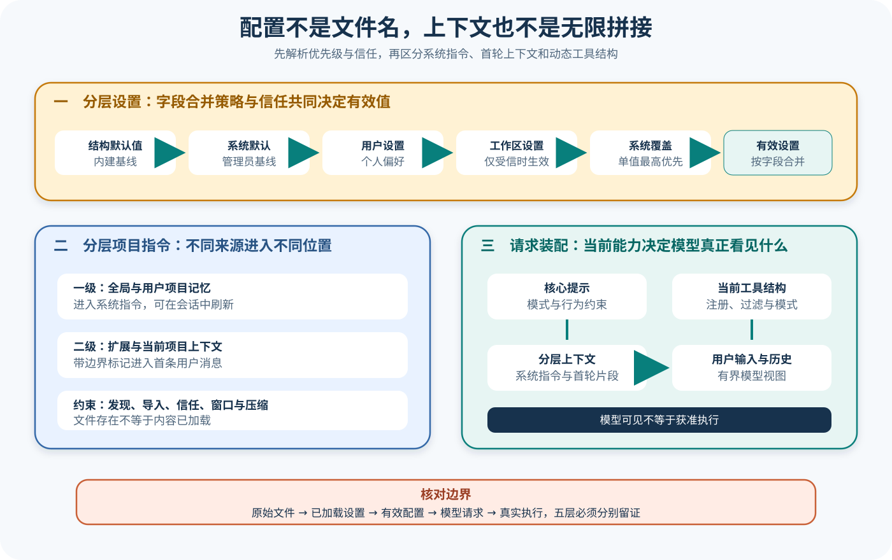

# Gemini CLI 配置、提示与上下文

## 读者会得到什么

读完本篇，你应能从磁盘上的设置文件追到一次运行真正使用的有效配置，再追到模型可见的系统指令、首条用户上下文、工具结构和历史。你会知道为什么工作区设置不是简单覆盖用户设置，为什么系统策略仍可压过工作区，为什么未受信目录的设置应被过滤，以及为什么项目指令文件存在不等于内容已进入请求。

本篇使用锁定源码的 Settings 合并测试与 PromptProvider 测试。它们通过模拟文件系统和 Mock Config 锁定优先级、信任和提示渲染，不代表本机管理员策略、环境变量、线上模型或所有扩展已经验证。

先问：本轮真正生效的值来自哪一层？

## 核心概念

Gemini CLI 的输入链可以分成「设置来源、有效 Core Config、提示与上下文、模型工具声明」四层。设置文件描述候选值，LoadedSettings 在信任和字段策略下合并，CLI 再把结果转换为 Core Config，PromptProvider 才根据当前模式、ToolRegistry 和项目记忆生成模型可见内容。

| 概念 | 所属层 | 主要来源 | 直接证明 |
|---|---|---|---|
| Schema 默认 | 设置 | 设置 Schema | 缺省候选值 |
| system defaults / system | 设置 | 管理员文件 | 组织默认与强制覆盖 |
| user / workspace | 设置 | 用户与项目文件 | 个体和项目候选配置 |
| Folder Trust | 合并边界 | 当前目录信任状态 | 工作区设置是否可参与 |
| LoadedSettings.merged | CLI 有效设置 | 按字段合并 | 当前 CLI 看到的配置视图 |
| Core Config | 运行时 | CLI 转换、环境与参数 | Core 服务实际采用的值 |
| 项目记忆 | 上下文 | GEMINI.md 等 | 候选指导内容及作用域 |
| PromptProvider | 请求构造 | 模式、工具表、记忆 | 系统提示与首条上下文布局 |
| Function Declaration | 模型能力 | 活动 ToolRegistry | 本轮模型可请求的工具 Schema |

优先级必须按字段理解。单值可以按 Schema 默认、系统默认、用户、受信工作区、系统覆盖的顺序合并；列表或对象可能连接、去重或采用自定义策略。系统层既可以给默认值，也可以在最后限制工作区扩大后的集合，例如 MCP allowlist。

Folder Trust 不是文件可读性判断，而是设置是否有资格进入有效视图的安全边界。未受信工作区的原始文件仍保存在 LoadedSettings 中用于展示或重新信任，但普通 merged 使用空工作区替代。若 UI 展示原文件却把它标成已生效，就会造成能力假象。

Core Config 是下一道边界。CLI 可以应用命令行参数、环境白名单、认证选择、远程管理和规范化，某些设置还会因 Feature 或平台被禁用。只检查 `settings.json` 不能回答模型、Sandbox 或 MCP 的真实运行值。

项目记忆也有层次。全局与用户项目记忆进入系统指令，扩展和当前项目内容进入首条用户消息并带边界标记；它们的刷新、作用域和信任不同。文件存在只证明候选来源，PromptProvider 输出或最终请求才证明模型可见。

计划模式进一步说明「提示清单」和「执行能力」的差别。PromptProvider 从当前活动 ToolRegistry 渲染工具名，并给写工具附加计划文件约束；真正 Function Declaration、Policy、Confirmation 和 Sandbox 仍决定调用能否落地。

## 为什么这样设计

第一，分层设置允许组织、用户和项目分别表达约束。用户可选择主题，项目可提供上下文文件和工具偏好，系统层仍能限制 Sandbox 或 MCP 服务，既保留定制又维持管理边界。

第二，按字段 merge strategy 避免把整个对象简单覆盖。工作区新增一个核心工具时不应清除用户的其他工具设置，系统 allowlist 又需要收紧集合；每个字段的语义由 Schema 决定，比统一深合并更安全。

第三，Folder Trust 在合并前清空工作区贡献，阻止陌生目录通过设置自动启用工具、MCP 或环境变量。保留原始文件则支持 UI 解释「检测到但未信任」，信任切换后可以重算而无需重新读取丢失的来源。

第四，CLI Settings 与 Core Config 分离，使终端交互、认证和文件路径处理留在 CLI，模型、工具与调度使用稳定的 Core 接口。这个边界也便于测试：Settings 合并和 Prompt 渲染可以分别使用 Mock。

第五，项目记忆分系统指令与首条用户上下文，可以保留来源和优先级。全局规则作为长期指导，项目和扩展内容以明确边界进入任务上下文；若全部拼成一个字符串，模型和审计者都难以区分来源。

第六，提示根据活动 ToolRegistry 动态生成，避免列出当前不可用工具。计划模式仍保留写计划文件的专门约束，说明模型指导与执行强制互补；提示能减少误用，却不是权限系统。

## 实现思路

教学实现建立一条带 provenance 的配置编译管线。它用于理解锁定行为，不声称 Gemini CLI 内部存在同名 `EffectiveConfigLedger`。

1. **读取来源。** 为 Schema 默认、系统默认、用户、工作区和系统覆盖分别保存路径、原始文本、解析错误与内容哈希。
2. **应用信任。** 未受信工作区以空设置参与 merged，原始来源仍保留；信任变化触发纯重算。
3. **按字段合并。** 查询 Schema 的 merge strategy，分别处理单值、列表、对象和显式清空，生成值与来源链。
4. **编译 Core Config。** 应用 CLI 参数、环境白名单、认证、远程管理、Feature 与平台规范化，保存被拒绝或降级的原因。
5. **发现项目记忆。** 按文件名、目录边界、导入与忽略规则读取，标记全局、用户、扩展和项目作用域。
6. **渲染提示。** PromptProvider 使用审批模式、计划模式、活动 ToolRegistry 和记忆层构造系统指令与首条用户上下文。
7. **捕获请求。** 保存脱敏的最终 systemInstruction、contents 与 Function Declarations，只有这一层回答本次模型看见什么。

```text
layers = load(schema, system_defaults, user, workspace, system)
trusted_layers = filter_workspace_by_trust(layers)
merged = merge_each_field(trusted_layers, schema.strategies)
core = compile_cli_settings(merged, argv, environment, auth, features)
memory = discover_context(core.context_files, cwd, trust)
prompt = render(core.mode, memory, active_tool_registry)
request = assemble(prompt, history, current_user_input, declarations)
```

每个关键字段的记录包含最终值、来源层、合并策略、信任状态和转换原因。秘密字段只保存存在性与不可逆哈希；公开证据不得复制令牌或 `.env` 内容。工作区信任切换前后用同一来源快照重算，便于证明差异来自信任而非文件变化。

上下文正规化报告列出每份记忆的 discovered、loaded、position、truncated 与 omitted 状态。多文件名按确定顺序渲染，导入循环和超限显式报错；模型窗口压缩不能反向删除原始来源。工具表同样保存活动集合哈希与提示清单差异。

测试采用冲突哨兵值：系统、用户和工作区为同一字段设置不同值，避免偶然相同掩盖来源错误。安全字段再加入未受信、远程管理和命令行覆盖，逐步捕获 merged、Core Config 和最终请求。

## 贯穿案例

用户在一个新检出的项目中运行计划模式。用户设置启用 Sandbox 并指定 `USER_CONTEXT.md`，工作区尝试关闭 Sandbox、启用额外 MCP Server 和指定 `PROJECT_GUIDE.md`，系统设置禁止该 MCP 并强制 Sandbox。

1. **未受信启动。** 工作区原始设置被读取但不进入 merged；系统强制 Sandbox，用户上下文仍可参与。UI 标记工作区设置「检测到、未生效」。
2. **编译 Core Config。** 环境白名单过滤项目 `.env`，认证与命令行模型选择进入运行时；被禁 MCP 不出现在活动连接集合。
3. **构造首轮提示。** 全局和用户记忆进入系统指令，未受信项目指导不进入首条用户消息；计划模式只列当前活动工具。
4. **切换信任。** 用户信任目录，LoadedSettings 重新合并工作区；`PROJECT_GUIDE.md` 进入项目上下文，但系统 Sandbox 和 MCP allowlist 继续覆盖。
5. **捕获第二轮请求。** 请求带新的项目上下文与同一系统安全值，工具声明仍不含被禁止 MCP；历史保留第一轮当时的可见边界。
6. **独立验收。** Scorer 检查计划只写指定计划文件，不能因提示列出写工具就允许修改源码。

```json
{"trusted":false,"workspaceApplied":false,"sandbox":true,"mcpAllowed":["server1"],"projectContext":"omitted"}
```

```json
{"trusted":true,"workspaceApplied":true,"sandbox":true,"mcpAllowed":["server1"],"projectContext":"PROJECT_GUIDE.md"}
```

反例一让工作区 JSON 损坏。加载器保留带来源的解析错误，不能静默使用半份配置；根据具体安全策略，启动失败或忽略该层都必须可见。反例二让项目指令超过大小或导入边界，报告 omitted / truncated，不能只显示文件已发现。

最后比较提示与执行：模型请求确实看见 `write_file`，但计划模式只允许计划文件，Scheduler 的 Policy 或确认链拒绝源码写入。Prompt 可见性、工具声明和执行结果分别留证，避免将模型尝试写文件归因成配置合并失败。

远程管理反例在文件合并完成后把某个模型或安全字段改成组织值。证据链同时保存 merged 与最终 Core Config，差异明确归因给远程层；若只导出 merged，会错误声称用户值已生效。远程配置不可达时采用缓存、失败关闭还是本地回退，也要按实际契约记录，不能猜测。

上下文刷新反例在活动 Session 中修改项目指导。实现需要说明新内容从下一 Turn 生效、是否替换旧首条上下文，还是只在新 Session 加载；旧历史不能被无痕改写。本篇锁定测试主要证明初次渲染，因此未覆盖的热刷新语义应标为 partial，再用请求差分实验补证。

最终配置报告不提供一个含糊的「配置正确」结论，而是为模型、Sandbox、MCP allowlist、项目指令和计划工具表分别列出来源、有效值、模型可见值及执行结果。不同字段可以拥有不同证据等级。

## 真实输入与输出

### 输入

上游 `settings.test.ts` 同时模拟系统、用户和工作区三个设置文件。关键冲突如下：

```json
{"system":{"ui":{"theme":"system-theme"},"tools":{"sandbox":false},"mcp":{"allowed":["server1","server2"]}},"user":{"ui":{"theme":"dark"},"tools":{"sandbox":true},"context":{"fileName":"USER_CONTEXT.md"}},"workspace":{"tools":{"sandbox":false,"core":["tool1"]},"context":{"fileName":"WORKSPACE_CONTEXT.md"},"mcp":{"allowed":["server1","server2","server3"]}}}
```

另一个 PromptProvider 测试把项目指令文件名设为默认文件和 `CUSTOM.md`，记忆正文是 `Some memory content`。计划模式测试又提供四个当前活动工具：`glob`、`read_file`、`write_file`、`replace`。

### 输出

合并结果不是「最后读到的文件获胜」。单值主题由系统设置覆盖，工作区上下文文件名覆盖用户值，工作区贡献 `tool1`，系统允许的 MCP 服务又覆盖工作区扩大后的列表：

```json
{"ui":{"theme":"system-theme"},"tools":{"sandbox":false,"core":["tool1"]},"context":{"fileName":"WORKSPACE_CONTEXT.md"},"mcp":{"allowed":["server1","server2"]},"telemetry":{"enabled":false}}
```

PromptProvider 输出中出现 `Contextual Instructions`，同时列出默认文件和 `CUSTOM.md`；在计划模式下，它只根据当前 ToolRegistry 列出活动工具，并给写工具附加计划文件约束。测试断言的是生成后的提示片段，不是某个文件路径本身。

```text
Contextual Instructions (GEMINI.md, CUSTOM.md)
```

有效配置和模型可见请求是两个连续但不同的证据面。

## 调用链



Claim: gemini-cli.config.layered-effective-settings

Claim: gemini-cli.context.gemini-md-is-bounded-input

1. CLI 定位 Schema 默认、系统默认、用户、工作区与系统设置文件，分别保留原始内容、解析结果、错误和来源路径。
2. `mergeSettings` 先按 Folder Trust 把未受信工作区替换为空设置，再按字段的 merge strategy 合并；单值顺序为 Schema 默认、系统默认、用户、工作区、系统覆盖。
3. `LoadedSettings` 同时保留各层文件、`merged` 和不可变快照；信任状态变化会重算工作区和有效设置，而不是修改原始工作区文件。
4. CLI 再把命令行选择、环境、远程管理项和合并设置转换成 Core `Config`。磁盘文件到有效 Config 之间仍可能发生校验、规范化、禁用和运行时覆盖。
5. MemoryContextManager 按来源加载项目指令：全局与用户项目记忆作为一级内容进入系统指令；扩展和当前项目内容带边界标记进入首条用户消息。
6. PromptProvider 读取审批模式、当前 ToolRegistry、项目根目录、会话状态和分层记忆，生成核心系统提示。计划模式的工具清单来自当前活动注册表，不是源码目录清单。
7. 模型客户端最终组合系统指令、会话级上下文、用户输入、历史和工具声明。真实执行仍由 Scheduler、Policy、Confirmation 和 Sandbox 决定，提示中出现工具名不产生权限。

## 源码证据

合并函数直接给出单值优先级，并先过滤未受信工作区：

```source
packages/cli/src/config/settings.ts:253-279
const safeWorkspace = isTrusted ? workspace : ({} as Settings);
return customDeepMerge(... schemaDefaults, systemDefaults, user,
  safeWorkspace, system);
```

`LoadedSettings` 保留原始工作区，并在信任切换时重建有效视图：

```source
packages/cli/src/config/settings.ts:313-389
this._workspaceFile = workspace;
this.workspace = isTrusted ? workspace : this.createEmptyWorkspace(workspace);
setTrusted(isTrusted) { ... this._merged = this.computeMergedSettings(); }
```

上游测试用相互冲突的真实字段验证系统、工作区和用户优先级：

```source
packages/cli/src/config/settings.test.ts:263-341
system taking precedence over workspace, and workspace over user
expect(settings.merged).toMatchObject({
  ui: { theme: 'system-theme' },
  context: { fileName: 'WORKSPACE_CONTEXT.md' }
});
```

Core 对项目指令实行分层注入，而不是全部拼进同一字符串：

```source
packages/core/src/config/config.ts:2573-2613
Global memory and user project memory go in the system instruction;
extension and project memory are placed in the first user message instead.
```

PromptProvider 测试锁定多文件名和当前工具渲染：

```source
packages/core/src/prompts/promptProvider.test.ts:154-206
should handle multiple context filenames in user memory section
should list all active tools from ToolRegistry in plan mode prompt
```

两个 Claim 都使用 B 级，因为源码定义了变换，上游测试又验证代表性行为。它们不证明所有字段都使用同一种合并策略，也不证明提示内容必然被线上模型完整消费。

## 失败与限制

第一，优先级不是一句「工作区覆盖用户」能概括。系统设置对单值拥有最高优先，列表字段可能连接、去重或按 Schema 使用其他策略，远程管理项还能在文件合并后覆盖。评审必须记录具体字段和 merge strategy。

第二，未受信工作区仍可在磁盘上有设置，但普通 `merged` 会忽略它。源码还提供「假设已信任」的查询，用于展示配置；展示结果不能冒充当前已启用能力，否则 MCP 列表和真实执行会产生矛盾。

第三，环境加载具有独立安全边界。未受信目录只允许白名单变量，认证方式又可能决定是否保留某些云项目变量。把 `.env` 内容直接当最终环境，会漏掉过滤、覆盖和恢复行为。

第四，项目指令文件不是无限 Memory。发现受文件名、目录边界、导入、忽略规则和信任影响；进入请求后还会受模型窗口、上下文管理、压缩和会话阶段限制。一级与二级内容位置不同，后续刷新语义也不同。

第五，Prompt 中出现工具名只证明模型可见。计划模式甚至会列出工具并同时添加只允许写计划文件的约束；ToolRegistry、Policy、Confirmation、参数校验和平台 Sandbox 仍可能拒绝真实调用。

第六，测试使用 Mock 文件系统和 Config。它能锁定合并与渲染逻辑，不能证明本机系统设置路径、文件权限、管理员远程控制或外部 MCP 服务配置正确。

文件存在不是生效证明。

## 验证方法

先建立配置来源表：为每个字段记录 Schema 默认、系统默认、用户、工作区、系统覆盖、远程管理和命令行值，并标注 merge strategy。分别在受信和未受信状态导出 `LoadedSettingsSnapshot` 与 Core Config，确认工作区原始内容不被误当成有效值。

再做冲突实验：复现主题、沙箱开关、核心工具、上下文文件名和 MCP allowlist 的上游夹具，再增加连接列表、空值、废弃字段、非法 JSON、只读系统设置和运行时信任切换。检查错误是否保留来源，不允许静默降级成另一个安全模式。

随后验证上下文：给全局、用户项目、扩展和项目目录写入可识别标记，捕获最终系统指令、首条用户消息、后续请求与加载路径。确认一级内容与二级内容位置正确，未受信或超出边界的文件不会进入请求。

最后核对能力：在普通模式和计划模式捕获 ToolRegistry、提示中的工具清单、模型工具声明、Policy 决定和真实执行器。若提示列出工具但执行被拒绝，测试应记录层级差异，而不是把它归为随机模型失败。

验证有效值，不只验证文件。

## 自检

### 问题 1

工作区设置为什么不一定覆盖用户设置？

**答案：** 未受信工作区会被过滤；即使受信，系统设置对单值仍可最高优先，不同字段还可能使用连接等合并策略。

### 问题 2

为什么项目指令不应全部拼进系统提示？

**答案：** 锁定实现把全局和用户项目记忆放入系统指令，把扩展与当前项目上下文放入首条用户消息；它们的来源、刷新和边界不同。

### 问题 3

计划模式提示列出了 `write_file`，是否表示可以任意写文件？

**答案：** 不表示。提示同时附加计划文件约束，真实调用还要经过注册、Policy、Confirmation、参数校验和 Sandbox。

### 问题 4

怎样证明某个设置真正影响了一次模型请求？

**答案：** 要同时保存原始来源、合并快照、Core Config 和最终请求，并用冲突值验证因果；只展示 settings.json 或提示文字都不足够。
