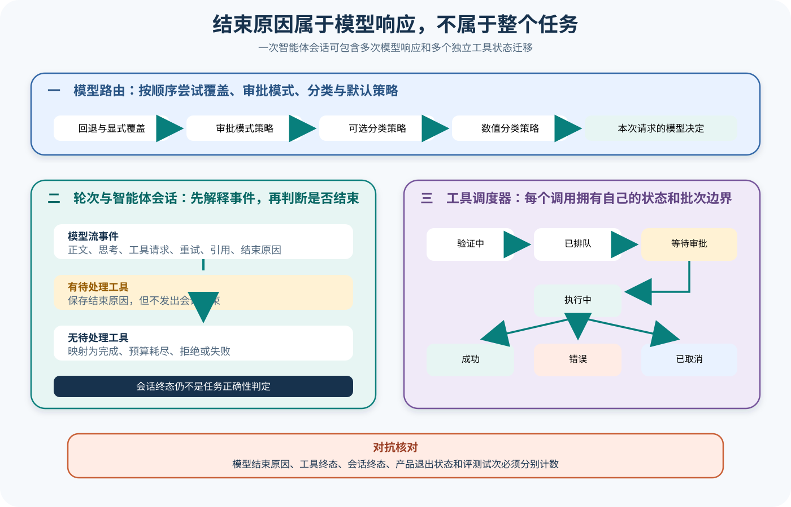

# Gemini CLI 轮次、路由与工具调度

## 读者会得到什么

本篇解决三个常被同一个「轮次」掩盖的问题：模型路由为哪一次请求选择模型，Turn 如何把模型流转换成事件，Scheduler 如何为工具调用维护独立状态。读完后，你不会把一次模型响应、一次工具批次、一次 Agent Session、一次 CLI 交互和一次 Eval Trial 当成相同计数单位。

关键结论是：Finished 属于模型响应。它可以和工具请求同时出现，此时智能体会话仍须继续；工具 Success 也只属于一个调用，不能替整个任务签字。

先确定状态所有者。

## 真实输入与输出

### 输入

上游测试让第一次模型流同时产生工具请求和 STOP，并附带用量：

```json
{"events":[{"type":"tool_call_request","callId":"call-1","name":"read_file"},{"type":"finished","reason":"STOP","usage":{"input":100,"output":30}}]}
```

Scheduler 的重叠批次测试又同步提交 `call-1` 与 `call-2`。第一个执行器被门闩阻塞时，第二个批次必须等待，不能进入同一个活动批次冒充并行完成。

### 输出

Agent Session 保存第一次 Finished 的用量，但没有发出 `agent_end`；Scheduler 结算 `call-1` 后发生第二次模型采样，最终才产生唯一会话结束事件。

```json
{"agentEndCount":1,"intermediateUsage":{"inputTokens":100,"outputTokens":30},"finalReason":"completed"}
```

重叠调度的执行顺序为：

```text
start-batch-1 → end-batch-1 → start-batch-2 → end-batch-2
```

这个顺序证明请求队列的批次边界，不证明批次内所有工具永远串行；批次内策略还取决于具体工具和调度条件。

## 调用链



Claim: gemini-cli.turn.finished-is-not-agent-success

Claim: gemini-cli.scheduler.tool-batch-has-own-state

1. `ModelRouterService` 按固定顺序组合回退、显式覆盖、审批模式、可选分类、数值分类与默认策略，为当前请求返回模型和路由元数据。
2. 客户端使用该决定发起模型流；`Turn.run()` 将响应块转换成正文、思考、工具请求、引用、重试、取消和 Finished 等事件。
3. Turn 只在响应携带 finishReason 时产生 Finished，并保存用量。它不负责判断工具是否已经执行，也不直接完成 Agent Session。
4. Agent Session 收集当前模型流的所有 ToolCallRequest。若集合非空，即使已经看到 STOP，也先调用 Scheduler；只有集合为空时才映射结束原因。
5. Scheduler 为每个调用建立 Validating、Scheduled、AwaitingApproval、Executing 等中间状态，并以 Success、Error 或 Cancelled 作为工具终态。
6. Scheduler 正忙时，新的 `schedule()` 批次进入独立 requestQueue；取消会拒绝待处理 Promise，同时把活动调用终结为 Cancelled 并清理内部队列。
7. CompletedToolCall 返回 Agent Session，函数响应进入下一次模型请求。后续无工具请求时，STOP 才映射为 completed；MAX_TOKENS 映射预算耗尽，多种 Safety 原因映射拒绝，畸形调用等映射失败。
8. 产品表面再把 AgentEnd 投影成文本、JSON、退出码或远程任务状态。Eval 需要额外以目标产物和副作用评分，不能复用任一内部终态当答案。

## 源码证据

路由服务明确规定策略顺序，并将异常决定记录为 fallback 元数据：

```source
packages/core/src/routing/modelRouterService.ts:35-74
strategies.push(new FallbackStrategy());
strategies.push(new OverrideStrategy());
strategies.push(new ApprovalModeStrategy());
...
return new CompositeStrategy([...strategies, terminalStrategy], 'agent-router');
```

Turn 只有看到真实 finishReason 才发 Finished：

```source
packages/core/src/core/turn.ts:380-410
const finishReason = resp.candidates?.[0]?.finishReason;
if (finishReason) yield {
  type: GeminiEventType.Finished,
  value: { reason: finishReason, usageMetadata: resp.usageMetadata }
};
```

Agent Session 把待处理工具置于结束判断之前：

```source
packages/core/src/agent/legacy-agent-session.ts:241-252
if (toolCallRequests.length === 0) {
  this._finishStream(mapFinishReason(finishedReason));
  return;
}
const completedToolCalls = await this._scheduler.schedule(...);
```

FinishReason 到 AgentEnd 的映射并非统一成功：

```source
packages/core/src/agent/event-translator.ts:332-362
STOP -> completed
MAX_TOKENS -> max_budget
SAFETY / RECITATION / ... -> refusal
MALFORMED_FUNCTION_CALL / OTHER / ... -> failed
```

Scheduler 状态与请求队列属于工具域：

```source
packages/core/src/scheduler/types.ts:18-180
Validating, Scheduled, AwaitingApproval, Executing,
Success, Error, Cancelled
```

两个 Claim 使用 B 级：源码直接定义状态机，上游测试验证中间 Finished、重叠批次和取消。测试仍使用 Mock 模型与执行器，不能证明真实工具副作用或线上路由质量。

## 失败与限制

第一，模型路由决定不是质量保证。路由元数据能说明选择来源和理由，却不能证明被选模型最适合任务；路由异常时记录的 fallback 决定也可能只是诊断用结果。Eval 应按路由条件分层报告。

第二，Finished 不是会话完成。中间 Finished 仍会产生用量事件，因此仅以是否有用量或 STOP 判断完成会重复计数。必须同时看待处理工具集合与最终 agent_end。

第三，AgentEnd reason 仍是协议映射。completed 可以来自正常 STOP，也可以来自没有明确 reason 的路径或 STOP_EXECUTION 处理；refusal 聚合多个 Safety 原因。统计时应保留原始 FinishReason，不能只存归约后的四类结果。

第四，工具终态不是会话终态。Success、Error、Cancelled 只属于 callId。一个批次可以部分成功、部分错误，会话也可能把普通错误回给模型后继续恢复。把工具成功率直接当任务成功率会高估表现。

第五，取消有多个观察点。排队批次被拒绝 Promise，活动调用写入 Cancelled，模型流可能产生 UserCancelled，产品表面又可能有退出码。它们需要共享关联键，不能从一个表面的「取消成功」反推所有层都已停止且无副作用。

第六，批次与并行不是同义词。测试证明重叠的 `schedule()` 调用按请求队列处理；批次内部是否并行取决于 Scheduler 规则、工具类型、确认顺序和副作用约束。

先保留原始状态，再做归约。

## 验证方法

为一次固定输入分配 Session、模型请求、Turn 事件、tool call、scheduler batch 与 Trial 六种标识。捕获路由决定、原始 FinishReason、pendingToolCalls、每个 callId 的状态序列、最终 AgentEnd 和产品退出状态。

复现中间 Finished 夹具：第一次流产生工具请求、STOP 和用量，Scheduler 返回结果，第二次流给最终文本。断言只有一个 agent_end，但两次模型响应的用量都保留。

再构造重叠批次与取消：阻塞第一批次，同步提交第二批次，确认第二批次没有提前执行；分别在排队、待审批、执行中和执行完成后取消，核对 Promise、状态、响应和副作用。

最后建立结束矩阵：STOP、MAX_TOKENS、SAFETY、RECITATION、MALFORMED_FUNCTION_CALL、无 reason、流错误和用户取消。保留原始事件及映射结果，再让独立 Scorer 对任务产物评分，确认内部 completed 不会自动变成 Eval pass。

## 自检

### 问题 1

为什么第一次 STOP 不能结束智能体会话？

**答案：** 同一模型响应仍有待处理工具请求；STOP 只结束本次模型生成，Scheduler 结算和结果回送尚未完成。

### 问题 2

Scheduler 的 Success 能证明任务成功吗？

**答案：** 不能。它只说明一个 callId 到达工具成功终态，整个会话、最终产物和安全约束仍需独立判断。

### 问题 3

为什么要同时保存原始 FinishReason 和 AgentEnd reason？

**答案：** 多个原始原因会归约为同一 AgentEnd 分类；只保存归约值会丢失 Safety、预算和协议错误细节。

### 问题 4

重叠 schedule 测试证明了什么？

**答案：** 它证明 Scheduler 忙时新批次进入独立请求队列并按顺序拉取，不证明任意批次内部都必须串行，也不证明真实工具无副作用。
