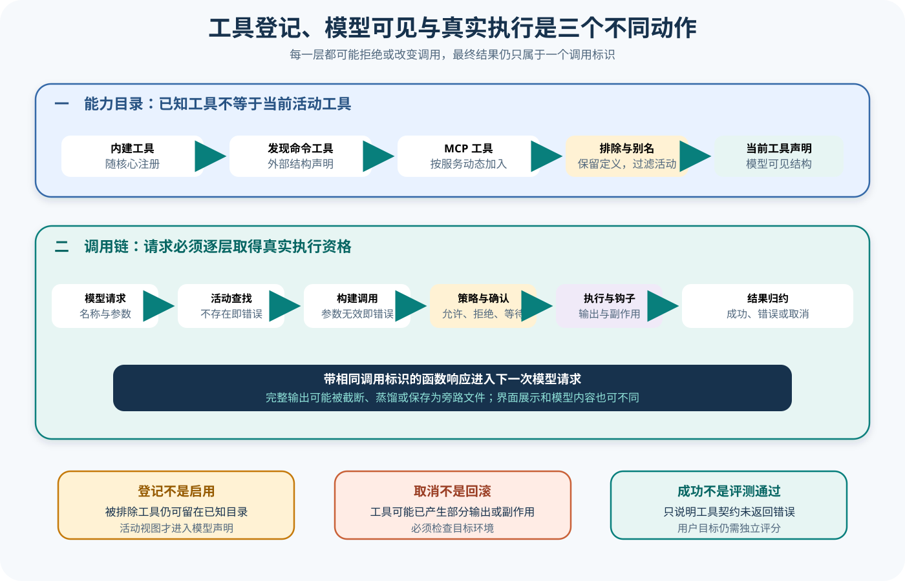

# Gemini CLI 工具注册与执行生命周期

## 读者会得到什么

本篇从 ToolRegistry 的已知目录出发，追踪一个模型工具请求如何经过活动过滤、查找、参数构建、Policy、Confirmation、执行器、Hook、输出处理和函数响应，最终回到下一次模型请求。读完后，你不会再用「仓库里有这个工具」「模型看见这个工具」或「工具返回 Success」替代真实执行证据。

工具系统至少有三张表：已知定义、当前活动工具、当前调用状态。它们的键都可能是工具名，但权威范围不同。

先找真实执行器。

## 核心概念

工具生命周期有三张表和两类输出。`allKnownTools` 保存已发现定义，活动视图应用排除、连接和模式过滤，Scheduler 则为每个 callId 保存运行状态。工具结束后，`responseParts` 面向模型，`resultDisplay` 面向用户，完整长输出还可能保存为旁路工件。

| 概念 | 权威范围 | 产生时点 | 不应直接推出 |
|---|---|---|---|
| 已知工具 | Registry 候选定义 | 注册或发现 | 当前可用 |
| 活动工具 | 当前 Config 与连接过滤 | 构造声明 / 查找 | 模型一定调用 |
| Function Declaration | 本次模型请求 | 按模型与模式投影 | 执行已授权 |
| ToolCallRequest | 模型行动意图 | Turn 解析完整调用 | 参数有效或工具仍存在 |
| ToolInvocation | 真实定义构建的调用对象 | `tool.build(args)` 成功 | Policy 已允许 |
| Scheduler state | 单个 callId 控制状态 | 验证到终态 | 任务整体成功 |
| responseParts | 模型可见函数响应 | Executor 归约 | 与 UI 展示逐字相同 |
| resultDisplay | 产品展示内容 | ToolResult 返回 | 适合作为模型上下文 |
| outputFile | 完整长输出定位 | 截断或旁路保存 | 文件永远存在 |

Registry 保留被排除定义，是为了会话中重新启用和来源管理；所有模型声明和 Scheduler 查找都走活动视图。内部 Map dump 会产生假阳性，真正能力清单要同时记录 known、active、declared 和 exclusion reason。

模型调用是不可信输入。Scheduler 必须用当前活动 Registry 再查工具，以防模型引用旧声明或动态 MCP 已断开；`tool.build(args)` 使用真实定义校验并构造 invocation。未知名称与无效参数都在副作用前转成带 callId 的 CompletedToolCall。

Policy、Confirmation 与 Hook 位于 invocation 和 ToolExecutor 之间。Policy 可以允许、拒绝或修改请求，确认可能等待用户，PreToolUse Hook 可以干预；它们的决定分别记录。模型已看见工具或参数通过 Schema，不会跳过这些层。

ToolExecutor 负责运行与结果归约。Success 表示工具契约没有返回 error，Error 表示工具或执行路径失败，Cancelled 表示取消被观察；三种终态都携带函数响应。Cancelled 不保证回滚，Success 也不判断用户目标。

长输出分层是上下文管理策略。原始输出可以蒸馏、截断或写入旁路文件，模型收到 responseParts，界面显示 resultDisplay。Artifact 必须保存完整输出哈希和定位，否则 Eval 只能看到摘要，无法复核遗漏内容。

## 为什么这样设计

第一，known 与 active 分离，支持动态启停而不重复解析定义。MCP 连接恢复或会话配置变化时，可以重新计算活动集合；模型和 Scheduler 始终查询同一过滤结果。

第二，在 Scheduler 中再次查找和 build，防止模型请求绕过实时状态。Function Declaration 是采样时快照，调用到达时工具可能已被禁用或 Schema 更新；执行边界必须重新验证。

第三，Policy、Confirmation、Hook 与 Executor 分层，让组织规则、用户控制、扩展生命周期和副作用各自可测试。一个统一 `execute()` 布尔值无法解释谁拒绝、是否有人批准以及进程是否启动。

第四，所有分支都生成 CompletedToolCall，确保 Agent Session 能向模型回送结构化结果。未知工具、参数错误和拒绝不是异常丢包，模型可以基于它们修正后续行动，Trace 也保持 callId 闭环。

第五，模型内容、界面内容和完整工件分开，满足不同大小与展示需求。模型窗口有限，UI 需要可读摘要，评测与调试需要原始证据；把一种字符串供所有消费者会在成本和可核对性之间失控。

第六，活动工具和声明可按模型与模式生成，允许计划模式、模型能力和远程连接收窄工具表。工具表哈希进入运行条件后，Eval 才能区分能力变化与模型质量变化。

## 实现思路

教学原型使用 `ToolCapabilityLedger` 与 `ToolCallRecord`。它们是课程蓝图，不表示锁定 Gemini CLI 存在同名类型。

1. **注册候选定义。** 保存工具名、来源、Schema、版本、别名和执行器工厂；重复名称按来源规则拒绝或消歧。
2. **计算活动视图。** 应用 excludeTools、模式、模型、MCP 连接和 Feature，生成 active set 与 exclusion reason。
3. **冻结模型声明。** 为本次采样生成 Function Declarations 和 tool surface 哈希，保存与模型请求关联。
4. **接收并重验调用。** 按 callId 解析名称与参数，用当前 `getTool()` 查找并调用 build；失败立即生成 error response。
5. **运行控制链。** invocation 依次经过 Policy、Confirmation 与同步 Hook，所有修改生成新参数哈希；拒绝路径不启动 Executor。
6. **执行与取消。** ToolExecutor 传入 AbortSignal，记录进程、流式输出、started / terminal 和可观察副作用。
7. **归约多面输出。** 生成 responseParts、resultDisplay、errorType、outputFile 和内容长度；长输出保留完整工件哈希。
8. **回送并评分。** Scheduler 返回 CompletedToolCall，Agent Session 将函数响应送入下一次模型请求；独立 Scorer 读取真实产物。

```text
known = registry.register(definitions)
active = registry.filter(known, config, mode, model, connections)
surface = declare(active)
request = model_output.tool_call
tool = active.get(request.name) 或返回 TOOL_NOT_REGISTERED
invocation = tool.build(request.args) 或返回 INVALID_TOOL_PARAMS
decision = policy_confirmation_hooks(invocation)
result = decision.allowed ? executor.run(invocation) : denied_result
return complete(call_id, result, response_parts, display, artifact_ref)
```

CallRecord 至少保存 request surface version、原参数哈希、Hook 修改后哈希、Policy、确认主体、执行开始与终态、Abort 观察点、responseParts hash 和 artifact refs。秘密参数只保存脱敏摘要，但来源和 callId 不丢。

动态工具刷新采用版本切换。已经发出的模型请求继续绑定旧 surface，调用到达时若当前定义不兼容，则明确返回 unavailable 或按冻结定义执行，不能无痕用新 Schema 解释旧参数。具体选择由产品契约决定，证据必须记录。

长输出测试分别覆盖低于阈值、截断、蒸馏成功、蒸馏失败和旁路文件写失败。responseParts 中的说明要能回到完整工件；文件缺失时不能把截断摘要标为完整证据。

## 贯穿案例

一次模型响应请求三个工具：已排除的 `write_file`、参数无效的 `read_file`、活动的 `run_tests`。Policy 要求测试命令确认，用户批准后执行器产生超过上下文阈值的日志。

1. **冻结工具表。** Registry known 包含三项，active 只有 `read_file` 与 `run_tests`；Function Declaration 不含 `write_file`，surface 哈希写入请求。
2. **处理旧工具请求。** 模型仍输出 `write_file`，Scheduler 当前 `getTool()` 返回空，生成 TOOL_NOT_REGISTERED，不创建文件。
3. **构建参数。** `read_file` 缺少路径，`tool.build()` 抛出校验错误，生成 INVALID_TOOL_PARAMS，不进入 Policy。
4. **确认测试执行。** `run_tests` build 成功，经 Policy 到 AwaitingApproval；用户批准精确命令，Executor 启动进程。
5. **处理长输出。** 完整测试日志写入旁路工件，responseParts 只含摘要和定位，resultDisplay 给界面展示，三者各有哈希。
6. **回送模型。** 三个 CompletedToolCall 都保留原 callId，模型基于两个错误和测试结果修正下一步；Scorer 读取完整日志和工作区。

```json
{"surface":{"known":["write_file","read_file","run_tests"],"active":["read_file","run_tests"]},"calls":["c-write","c-read","c-test"]}
```

```json
{"completed":[{"id":"c-write","error":"tool_not_registered"},{"id":"c-read","error":"invalid_params"},{"id":"c-test","status":"success","outputFile":"artifact-ref"}]}
```

取消变体在测试进程已经写出一半日志后触发。Scheduler 将 c-test 置 Cancelled，保留部分内容与进程终止信息；独立检查器核对是否遗留子进程或文件。Cancelled 不能被解释为没有副作用。

动态 MCP 变体在模型采样后断开服务。工具声明曾可见，调用时 Registry 当前活动视图已移除，系统返回 unavailable；这属于能力漂移，不应归因成模型幻觉。若实验比较模型，必须冻结连接条件或将该 Trial 标为基础设施异常。

教学合成反例定义一个只负责「成功取得测试日志」的 `run_tests` 工具：处理器正常返回 Success，但日志里的断言失败。这里不声称锁定 Gemini CLI 的具体测试工具采用该契约；它只说明工具契约成功与任务 Scorer 仍可 fail，执行器结算不是业务正确性裁决。

## 真实输入与输出

### 输入

上游 Scheduler 测试分别构造不存在工具与无效参数。两个请求都携带稳定的调用标识：

```json
[{"callId":"call-1","name":"missing_tool","args":{}},{"callId":"call-2","name":"mock-tool","args":{"invalid":true}}]
```

ToolRegistry 测试又同时注册允许工具和被排除工具。被排除项仍留在内部已知 Map，以便会话中重新启用；但 `getAllTools()`、函数声明和 `getTool()` 的活动视图都不能返回它。

### 输出

不存在工具被结算成 `TOOL_NOT_REGISTERED`，参数构建失败成为 `INVALID_TOOL_PARAMS`，两者都带与请求关联的 responseParts，而不会进入 ToolExecutor：

```json
{"callId":"call-1","status":"error","errorType":"tool_not_registered","functionResponse":{"error":"Tool not found"}}
```

成功、工具返回错误或取消也都会成为 CompletedToolCall。模型接收的是 responseParts；界面可使用 resultDisplay，完整长输出还可能保存到旁路文件。三个输出面不能假定逐字相同。

## 调用链



Claim: gemini-cli.tools.registration-is-not-execution

Claim: gemini-cli.tools.responses-are-scheduler-settlements

1. Config 注册内建工具，并可通过发现命令、MCP 或扩展补充定义。ToolRegistry 的 `allKnownTools` 包含当前不活动的定义。
2. 活动视图应用 excludeTools、别名、MCP 服务状态和其他配置过滤，再为当前模型生成 Function Declaration。目录存在和注册成功只到这一步。
3. Turn 从模型响应提取工具名、参数、callId、prompt_id 与 traceId，Agent Session 把请求批量交给 Scheduler。
4. Scheduler 用活动 `getTool()` 查找定义。找不到时立即生成 TOOL_NOT_REGISTERED；找到后调用 `tool.build(args)`，构建失败生成 INVALID_TOOL_PARAMS。
5. 有效调用进入 Validating。Policy、Confirmation 与 Hook 可允许、拒绝、修改或等待；所有活动调用处于可执行或终态后，Scheduler 才启动准备好的工具。
6. ToolExecutor 调用 `executeToolWithHooks`，接收实时输出、进程标识和最终 ToolResult。取消、工具错误和异常分别转换为 Cancelled 或 Error。
7. 成功和取消路径也会处理长输出：启用上下文管理时可以蒸馏；否则 Shell 或 MCP 文本超过阈值时保存旁路文件，并用截断说明替代模型内容。
8. Executor 将 llmContent 转成 Function Response，保留 callId、display、errorType、outputFile 与内容长度；Scheduler 终结调用后把 CompletedToolCall 返回 Agent Session。
9. Agent Session 对外发出 tool_response，并把 responseParts 作为下一次模型输入。独立 Eval 仍需核对真实文件、进程、网络和最终答案。

## 源码证据

Registry 明确区分已知与活动工具：

```source
packages/core/src/tools/tool-registry.ts:231-282
// includes tools which are currently not active
private allKnownTools: Map<string, AnyDeclarativeTool> = new Map();
// excluded tools are still registered to allow for enabling them later
```

所有对模型和调度器公开的查询都经过活动过滤：

```source
packages/core/src/tools/tool-registry.ts:546-803
private getActiveTools(): AnyDeclarativeTool[]
getFunctionDeclarations(modelId?: string)
getAllTools()
getTool(name)
```

Scheduler 在真实执行前先处理不存在与参数无效：

```source
packages/core/src/scheduler/scheduler.ts:330-420
const tool = toolRegistry.getTool(request.name);
if (!tool) ... ToolErrorType.TOOL_NOT_REGISTERED
const invocation = tool.build(request.args);
... ToolErrorType.INVALID_TOOL_PARAMS
```

Executor 把工具结果归约为三类 CompletedToolCall：

```source
packages/core/src/scheduler/tool-executor.ts:120-190
signal.aborted -> createCancelledResult
toolResult.error === undefined -> createSuccessResult
toolResult.error -> createErrorResult
```

模型内容、显示内容和旁路文件分别保存：

```source
packages/core/src/scheduler/tool-executor.ts:299-475
responseParts: response,
resultDisplay: toolResult.returnDisplay,
outputFile,
errorType
```

两个 Claim 使用 B 级。源码直接定义目录、过滤和执行归约，上游测试验证排除、未注册和无效参数；真实外部工具、MCP 服务和平台副作用仍未由本课程入口夹具运行。

## 失败与限制

第一，已知工具不等于活动工具。排除项仍可保留定义，MCP 工具又会随服务连接动态加入或移除。若只 dump 内部 Map，会把禁用能力误报成可用能力。

第二，活动工具不等于模型一定看见。声明还可按模型、模式和过滤列表生成；Prompt 的文本清单与实际 Function Declaration 也应分别捕获。

第三，模型请求不等于执行。工具可能不存在、参数无效、策略拒绝、等待确认、Hook 修改、Sandbox 失败或执行器取消。错误必须归属到具体层，不能统一写成「工具调用失败」。

第四，Success 不是任务成功。它只表示工具契约没有返回 error；写错文件、执行错误命令或泄露信息仍可能是 Success。Scorer 必须检查目标产物与安全不变量。

第五，Cancelled 不是事务回滚。工具可能在 AbortSignal 生效前已经产生部分输出或副作用；源码甚至尽量保留取消前的内容。测试必须检查文件、进程和网络，而非只看状态。

第六，模型内容不一定完整。长输出可能被截断、蒸馏或写入旁路文件；responseParts、resultDisplay 和原始输出服务不同消费者。恢复和评测需保存完整工件定位信息。

第七，并行执行会改变可见顺序。只有连续可并行工具才可能成组启动，编辑和主题更新等路径受顺序约束。不能按模型请求数组顺序推断副作用顺序。

工具状态是证据，不是裁判。

## 验证方法

建立能力清单，为每项记录来源、已知定义、活动状态、模型声明、排除原因、MCP 连接、审批模式、Policy 结果、执行器和平台后端。对内建、发现命令与 MCP 工具分别验证。

再建立调用状态表：以 callId 为主键，保存原始名称与参数、别名、build 结果、Hook 修改、Policy、Confirmation、Scheduler 状态、进程标识、实时输出、Complete 结果和 responseParts。

注入不存在、别名冲突、重复注册、无效 JSON Schema、参数构建异常、策略拒绝、用户拒绝、执行异常、长输出、蒸馏失败和取消。断言未进入的层没有副作用，错误 response 仍可关联原请求。

最后对同一固定 Trial 检查三份输出：原始工具结果、模型 Function Response 和界面 display。独立 Scorer 使用目标文件与副作用判定，不接受 Registry 数量、Success 比例或退出零作为替代。

## 自检

### 问题 1

为什么被排除工具还会留在 Registry？

**答案：** 锁定实现保留已知定义，以支持会话中重新启用；活动查询和模型声明会过滤它，因此内部存在不等于当前可用。

### 问题 2

模型已经请求某工具，为什么 Scheduler 还要再次查找和 build？

**答案：** 模型输出不可信且可能过期；Scheduler 必须确认工具仍活动，并用真实定义校验和构建参数后才进入策略与执行。

### 问题 3

Cancelled 为什么不能证明没有副作用？

**答案：** 取消可能在执行开始后生效，工具已产生部分输出、文件或进程；状态只说明最终控制流，目标环境仍需核对。

### 问题 4

为什么 resultDisplay 不能直接回送模型？

**答案：** display 面向用户界面，responseParts 面向模型协议，原始输出又可能保存为旁路工件；三者内容和大小约束不同。
