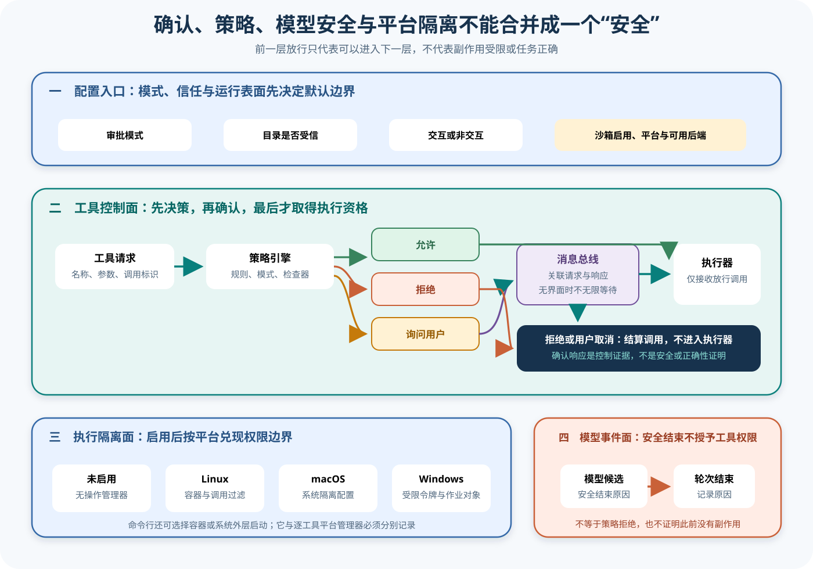

# Gemini CLI 确认、策略、安全与沙箱边界

## 读者会得到什么

本篇把四个经常被写成同一个「安全层」的机制拆开：PolicyEngine 决定允许、拒绝还是询问用户；MessageBus 传递并关联确认；模型的 SAFETY 只是候选结束原因；SandboxManager 才把文件、网络、环境和进程权限落实到平台后端。读完后，你可以从一次工具请求追到执行命令，同时指出每层能证明什么、不能证明什么。

先记住最重要的结论：前一层通过，只表示调用取得进入下一层的资格。用户点了允许，不等于命令安全；Policy 返回允许，不等于沙箱启用；沙箱成功包装，不等于目标结果正确。

## 真实输入与输出

### 输入

上游 MessageBus 测试发送的确认请求包含事件类型、工具调用与关联标识：

```json
{"type":"tool-confirmation-request","toolCall":{"name":"test-tool","args":{}},"correlationId":"123"}
```

另一个真实输入来自 Turn 上游测试：模型候选携带 `finishReason: "SAFETY"` 和文本 `Content blocked`。这个输入属于模型响应面，不是工具确认消息。

### 输出

同一个确认输入由 Policy 决定三个分支。ALLOW 直接产生 `confirmed: true`；DENY 同时发出策略拒绝和 `confirmed: false`；ASK_USER 有界面监听器时转给界面，没有监听器时立即返回 `requiresUserConfirmation: true`，避免 Headless 流程长时间悬挂。

```json
{"type":"tool-confirmation-response","correlationId":"123","confirmed":false,"requiresUserConfirmation":true}
```

这里的 `confirmed: true` 可能来自策略自动允许，并不证明有人点击确认。反过来，`confirmed: false` 也要区分策略拒绝、没有可用界面和用户取消。

模型安全夹具的输出是一条 Content 和一条 Finished；它不会因此生成 Tool Policy 的 ALLOW、DENY 或 ASK_USER，也不会配置平台沙箱。

Linux SandboxManager 的测试输入是 `ls -la`，输出程序改为 `sh`，参数中包含 `exec bwrap`、参数文件和 seccomp 描述符。macOS 测试把 `echo hello` 包装成 `/usr/bin/sandbox-exec -f <临时配置> -- echo hello`。这些是上游单元测试的命令构造证据，不是本仓库在 Linux、macOS 或 Windows 上执行了真实隔离进程。

## 调用链



Claim: gemini-cli.security.confirmation-policy-sandbox-separation

Claim: gemini-cli.security.safety-is-not-tool-authorization

1. CLI 从命令行和设置得到审批模式。YOLO、AUTO_EDIT、PLAN 与 DEFAULT 不是同义词；安全管理设置可禁用 YOLO，未受信目录会把非 DEFAULT 模式压回 DEFAULT。
2. Config 根据 `sandbox.enabled` 创建平台 SandboxManager。未启用时是 Noop；启用后按运行平台选择 Windows、Linux 或 macOS 管理器，未知平台退到 Local 管理器。
3. Scheduler 已完成工具存在性和参数构建后，PolicyEngine 才按工具名、参数、MCP 来源、注解、子代理、审批模式、交互性、规则优先级和检查器计算决定。
4. 没有匹配规则时，交互默认 ASK_USER，非交互默认 DENY。非交互模式不会凭空弹出一个用户界面；上游测试验证交互规则被过滤后落到拒绝。
5. MessageBus 用 correlationId 关联请求与响应。ALLOW 直接确认，DENY 发出策略拒绝，ASK_USER 才交给界面；派生给子代理的总线会移除强制决定和可伪造元数据。
6. Scheduler 收到允许后才进入 Executor；策略拒绝结算为 POLICY_VIOLATION，用户取消结算为 Cancelled，两者都不进入本次工具执行器。
7. 若启用逐工具隔离，Executor 把命令交给 SandboxManager。Linux 生成 Bubblewrap 与 seccomp 包装，macOS 生成 Seatbelt profile，Windows 使用受限令牌、作业对象和低完整性辅助进程。
8. CLI 还存在 Docker、Podman、sandbox-exec、runsc、LXC 与 Windows 原生等外层启动选择。环境变量、命令行、设置、平台和命令可用性决定选择；它与逐工具 manager 的状态必须分别采集。
9. 模型响应若以 SAFETY 结束，Turn 只发布 Finished 原因。独立 Eval 仍需检查是否曾调用工具、目标工件是否正确、沙箱是否真实生效以及是否存在越界副作用。

## 五个边界怎样分工

| 边界 | 权威输入 | 权威输出 | 能阻止什么 | 不能证明什么 |
| --- | --- | --- | --- | --- |
| 目录信任与审批模式 | Settings、命令行、受信目录、管理策略 | 当前审批模式 | 禁止危险模式在不受信环境静默生效 | 某个具体工具一定被拒绝 |
| PolicyEngine | 工具调用、规则、模式、注解、检查器 | ALLOW、DENY、ASK_USER | 不符合策略的调用进入执行器 | OS 权限真的受限 |
| MessageBus 与用户确认 | 策略决定、关联标识、界面监听器 | 确认响应、拒绝事件、用户结果 | 需要人类决定的调用无确认执行 | 人类决定正确，或命令无风险 |
| SandboxManager | 命令、路径、环境、网络、平台后端 | 包装后的程序、参数、环境与清理器 | 后端支持范围内的文件、网络、进程越界 | 业务结果正确或无旁路 |
| 模型 SAFETY | 模型候选与 FinishReason | Turn Finished | 模型侧停止当前候选生成 | 工具策略拒绝、隔离生效或副作用回滚 |

表中的输出都是局部事实。把它们压成一个布尔 `safe=true`，会丢掉拒绝主体、默认模式、用户是否出现、隔离后端和模型结束原因。

## 源码证据

Policy 的默认值显式区分交互和非交互：

```source
packages/core/src/policy/policy-engine.ts:290-298
this.defaultDecision =
  config.defaultDecision ??
  (this.nonInteractive ? PolicyDecision.DENY : PolicyDecision.ASK_USER);
this.sandboxManager = config.sandboxManager ?? new NoopSandboxManager();
```

MessageBus 并不自己发明授权；它先调用 Policy，再按三态路由：

```source
packages/core/src/confirmation-bus/message-bus.ts:104-153
const { decision: policyDecision } = await this.policyEngine.check(...)
case PolicyDecision.ALLOW
case PolicyDecision.DENY
case PolicyDecision.ASK_USER
```

平台管理器只有在 sandbox 启用后才被选择：

```source
packages/core/src/services/sandboxManagerFactory.ts:31-42
if (sandbox?.enabled) {
  win32 -> WindowsSandboxManager
  linux -> LinuxSandboxManager
  darwin -> MacOsSandboxManager
}
return new NoopSandboxManager(options);
```

Linux 后端生成 Bubblewrap 和 seccomp 包装，而非只在状态上写「已隔离」：

```source
packages/core/src/sandbox/linux/LinuxSandboxManager.ts:301-329
const bwrapArgs = await buildBwrapArgs(...)
bwrapArgs.push('--seccomp', '9');
exec bwrap --args 8 ...
```

macOS 后端生成临时 Seatbelt profile 并调用系统程序：

```source
packages/core/src/sandbox/macos/MacOsSandboxManager.ts:172-192
const sandboxArgs = buildSeatbeltProfile(...)
program: '/usr/bin/sandbox-exec'
args: ['-f', tempFile, '--', finalCommand, ...finalArgs]
```

模型 FinishReason 被映射成 Turn Finished；它没有经过工具策略分支：

```source
packages/core/src/core/turn.ts:393-413
const finishReason = resp.candidates?.[0]?.finishReason;
if (finishReason) {
  yield { type: GeminiEventType.Finished, value: { reason: finishReason } };
}
```

两个 Claim 使用 B 级。锁定源码定义分层和默认值，上游测试验证三态消息、非交互拒绝、平台命令包装、SAFETY Finished 与 POLICY_VIOLATION；本仓库没有把这些夹具扩张成线上模型行为或跨平台真实隔离证明。

## 失败与限制

第一，ASK_USER 不保证有用户。Headless 或 ACP 流可能没有确认监听器；当前 MessageBus 会返回 `requiresUserConfirmation`，调用方仍要正确结算，不能把「需要用户」卡成无限等待。

第二，ALLOW 不保证有 Sandbox。Factory 在 sandbox 未启用时返回 Noop。即使启用，后端命令缺失、辅助程序编译失败、profile 错误、容器镜像或挂载配置不当都可能让执行失败。

第三，用户确认不是风险分析。界面展示可能截断命令、隐藏间接副作用或缺失工具注解；ProceedAlways 还可能更新后续规则。评测必须保留确认详情、原始参数和规则更新。

第四，受信目录不是授权通行证。它只是允许某些审批模式和配置参与；Policy 仍可 DENY，沙箱仍可拒绝路径或网络，工具仍可运行失败。

第五，SAFETY 不是 Policy。它来自模型候选的 FinishReason。一个 Turn 可以因 SAFETY 结束，但会话此前已经完成工具调用；也可能工具被 Policy 拒绝，而模型从未返回 SAFETY。

第六，沙箱包装不等于无旁路。允许路径、网络开关、环境白名单、includeDirectories、持久授权、YOLO、容器挂载和宿主进程都改变边界。必须记录最终解析后的命令与权限，而非只记录 `enabled: true`。

第七，平台实现并不等于平台实测。本篇锁定版本含 Linux、macOS 和 Windows 源码及上游测试，但本仓库只渲染文档与校验证据，没有在三类 OS 上运行破坏性逃逸测试。生产结论需要各平台独立夹具和受控环境。

第八，取消不是回滚。策略拒绝能证明本次 Executor 没有启动；确认期间取消或执行后中止仍需检查已启动进程、文件和网络副作用。

安全是分层不变量，不是一枚绿色徽章。

## 验证方法

先建立决策轨迹，以 callId 和 correlationId 关联原始工具请求、审批模式、目录信任、匹配规则、Policy 三态、确认监听器、用户结果、规则更新、Scheduler 终态和是否进入 Executor。分别注入 ALLOW、DENY、ASK_USER、有界面、无界面、用户取消和超时。

再建立隔离轨迹，保存 `sandbox.enabled`、外层 command、平台 manager 类型、原始命令、包装后 program/args、解析后的读写路径、网络、环境清洗、临时文件、清理结果和 denial。不能只截取一条「sandbox enabled」日志。

对 Linux 验证 Bubblewrap 参数、只读工作区、额外路径、网络关闭、seccomp 与拒绝解析；对 macOS 验证 Seatbelt profile、临时文件清理和环境脱敏；对 Windows 验证辅助程序、受限令牌、作业对象、低完整性和拒绝解析。外层 Docker、Podman、runsc 与 LXC 还要核对镜像、挂载、用户、网络和退出码。

最后构造四个反例：Policy ALLOW 但 Noop Sandbox；Policy DENY 且模型正常 STOP；模型 SAFETY 但此前工具已写文件；沙箱包装成功但目标文件内容错误。独立 Scorer 必须分别判定授权、隔离、副作用和任务结果。

## 自检

### 问题 1

`confirmed: true` 为什么不一定代表用户点击了允许？

**答案：** MessageBus 在 Policy 返回 ALLOW 时会直接生成确认成功响应；只有 ASK_USER 分支才需要界面或旧确认流程，因此必须同时记录 Policy 决定和确认来源。

### 问题 2

非交互模式遇到默认 ASK_USER 会发生什么？

**答案：** 锁定 PolicyEngine 的默认决定在非交互模式为 DENY，上游测试也验证交互规则不适用时回落到拒绝，避免不存在的用户界面成为授权来源。

### 问题 3

为什么 `finishReason: SAFETY` 不能证明工具被安全阻止？

**答案：** 它是模型候选结束原因，由 Turn 映射为 Finished；工具授权由 Policy 与 Scheduler 处理，二者事件和时间线都不同，之前的工具还可能已经执行。

### 问题 4

为什么 `sandbox.enabled: true` 还不足以证明隔离有效？

**答案：** 还需证明选择了正确平台 manager 或外层命令、后端实际存在、最终权限与挂载符合预期、包装程序真的启动且没有旁路；源码存在和配置布尔值都只是前置条件。
