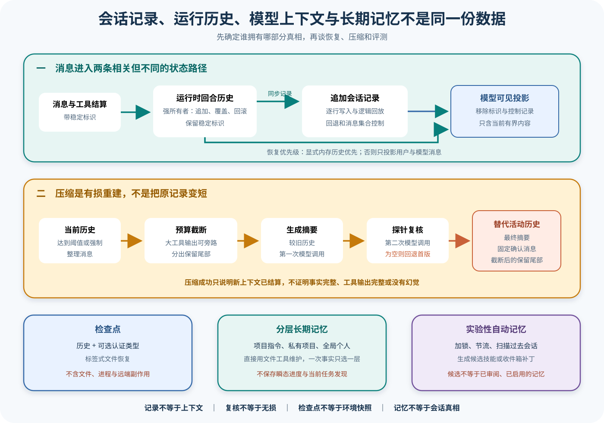

# Gemini CLI 会话记录、历史、压缩与长期记忆

## 读者会得到什么

本篇回答一个看似简单、实际上最容易误判的问题：Gemini CLI 说「会话已保存」时，到底保存了什么？答案不是一个统一的「历史」。ChatRecordingService 维护可回放的 JSONL 记录，AgentChatHistory 持有当前进程内带稳定标识的回合，模型只看到投影后的 `Content[]`，ChatCompressionService 会用摘要替换较旧上下文，Checkpoint 只保存历史和可选认证类型，GEMINI.md 与私有、全局文件则保存跨会话知识。

这些对象有关联，却没有共同的权威范围。记录不等于当前上下文，检查点不等于环境快照，压缩复核不等于无损，长期记忆也不应保存瞬态任务状态。把它们合成一个 `history` 字段，会让恢复、审计和评测同时失真。

## 核心概念

Gemini CLI 至少维护六类状态：物理 JSONL、重放后的逻辑记录、AgentChatHistory、模型 Content 投影、压缩替代历史、Checkpoint 与长期记忆。它们有不同的身份、丢失风险和消费者。

| 对象 | 权威范围 | 是否有损 | 主要用途 |
|---|---|---|---|
| ChatRecording JSONL | 已追加的物理记录 | 追加时尽量无损 | 回放与诊断 |
| 逻辑消息视图 | 应用 `$set` / `$rewindTo` 后的当前记录 | 会排除被回退项 | 恢复当前会话 |
| AgentChatHistory | 活动进程内带 ID 回合 | 可覆盖 / 回滚 | Agent 状态管理 |
| `Content[]` | 模型 API 可见投影 | 去 ID、可截断 | 下一次采样 |
| 压缩历史 | 摘要、确认消息、保留尾部 | 明确有损 | 控制上下文窗口 |
| Checkpoint | history 与可选 authType | 很窄 | 手动恢复点 |
| GEMINI.md / 私有记忆 | 项目或个人长期知识 | 人工选择 | 跨会话指导 |
| 外部 Artifact | 文件、进程、远端副作用 | 不受聊天存储控制 | 任务与安全评分 |

物理 JSONL 行并不等于当前逻辑消息。`$rewindTo` 可以回退，`$set.messages` 可以替换集合；恢复器必须按顺序解释控制记录。磁盘空间耗尽时记录服务可能停止追加而活动会话继续，因此「还能聊天」不能证明「可恢复」。

AgentChatHistory 为每个 HistoryTurn 保留稳定 ID，`getContents()` 去掉 ID，只产生 Gemini API 需要的 Content。恢复数据中的用户和 gemini 消息可以重建 HistoryTurn，其他控制、元数据和工具事件不会原样进入模型上下文。

压缩是有损替代。服务按模型预算把历史分成较旧区域和保留尾部，长工具输出可能先截断或外置；第一次模型生成摘要，第二次探针尝试复核。复核为空时仍可使用初版，因此 verified 不是形式化完备证明。

Checkpoint 不保存工作区、进程、Registry、Sandbox 或远端事务。恢复 history 只能重建对话输入，不能让文件和服务回到保存时状态。工具副作用需要幂等键、补偿或外部探测。

长期记忆按作用域选择：团队共享规则放版本化 GEMINI.md，不应提交的项目知识放私有层，跨项目个人偏好放全局层。一次事实只选一层，临时进度不进入长期记忆；任何记忆仍是下一次 Prompt 的候选上下文。

## 为什么这样设计

第一，追加物理记录与逻辑回放分离，使撤回、回滚和集合替换可以保留审计痕迹。直接删除旧行会丢失发生过什么，也无法解释模型为何在某一时点看见不同历史。

第二，AgentChatHistory 与模型 Content 分开，保留内部稳定 ID，同时满足 API 载荷。ID 用于更新、回滚和关联，模型无需看见；更换投影策略也不会改写运行时身份。

第三，把压缩做成独立服务与明确替代结构，允许在令牌阈值前减小 Context，并保留摘要与尾部边界。失败或膨胀时可以不压缩，避免静默丢失全部历史。

第四，二次模型复核能发现部分摘要遗漏，却不被称为无损验证。设计选择是实用质量检查，不是事实级证明；关键约束仍应结构化保存或在压缩后单独核对。

第五，Checkpoint 保持窄结构，降低格式复杂度和敏感状态复制。代价是它不提供完整环境快照，文档必须明确范围，恢复流程也不能重放工具来假装回到过去。

第六，长期记忆与会话记录分层，避免派生偏好覆盖历史事实。团队规则、项目私有知识和个人偏好有不同共享与生命周期，重复写入多个层会造成冲突和过期清理困难。

第七，外部 Artifact 单独保存，是因为聊天记录无法拥有文件系统和远端服务。记录能关联工具结果与哈希，却不能阻止其他进程改变产物；恢复与 Eval 都需要重新核对环境，而不是信任历史文字。

## 实现思路

教学原型建立 `RecordReplayPipeline`，用于说明提交与派生边界，不表示 Gemini CLI 使用同名统一组件。

1. **追加记录。** 每行含 session、message ID、类型、时间和负载；写失败明确禁用 recording 并发出诊断，不伪造成功。
2. **重放控制。** 顺序应用普通消息、`$rewindTo` 和 `$set.messages`，生成逻辑消息集合与 replay report。
3. **构建活动历史。** 为恢复的 user / gemini 消息分配或保留稳定 ID，显式调用历史优先于恢复记录。
4. **投影模型内容。** 去除内部 ID，过滤非模型事件，应用模态与预算限制，记录 kept / transformed / dropped。
5. **触发压缩。** 达到阈值时分割旧区与尾部，处理长工具输出，生成摘要并做有界复核。
6. **验证替代历史。** 核对目标、权限、未完成项和工具关系，成功后才切换「摘要 + 确认 + 尾部」。
7. **保存 Checkpoint。** 只写声明字段与版本，外部 Artifact 另存哈希；恢复时不执行旧工具。
8. **写长期记忆。** 按共享范围选择一个层级，保存来源和更新时间，拒绝瞬态任务状态。

```text
physical = append_jsonl(event)
logical = replay(physical, rewind_and_set_controls)
history = build_agent_history(logical.user_and_gemini)
contents, report = project_for_model(history, budget)
如果 token_ratio 超阈值:
    summary = summarize_and_probe(old_region)
    如果 required_facts 保留且令牌下降:
        history = summary + confirmation + retained_tail
checkpoint = {history: history.contents, authType}
```

压缩验证器的 required facts 来自结构化状态：当前目标、禁止条件、允许路径、未结算工具和关键 Artifact。它不要求逐字保留，却要求语义可核对；缺一项就保持旧历史或标记压缩失败。

故障矩阵覆盖尾行损坏、磁盘满、`$set` 后崩溃、摘要为空、复核为空、压缩令牌膨胀、旁路文件丢失和 Checkpoint 版本不兼容。每个场景分别检查记录、活动会话和模型 Context，不能只看 UI 重开。

物理追加与逻辑控制要定义提交顺序。普通消息写入成功后才能发布可恢复水位，`$set` 或 `$rewindTo` 作为新行原子追加；索引更新失败可由 JSONL 重建。尾行无法解析时停止在最后完整水位并报告，不静默跳过未知控制记录。

旁路工具文件使用内容哈希、创建 Turn 和保留期引用。压缩后模型只见摘要时，审计者仍能验证原输出；文件清理后引用明确变成 unavailable，而非让摘要冒充完整内容。

## 贯穿案例

用户修改解析器并运行测试，随后回退一条错误建议、压缩历史、保存 Checkpoint 并重启。最后把稳定项目约束写入 GEMINI.md，而不把当前测试进度写进长期记忆。

1. **追加会话。** 用户、模型和工具结果以稳定 ID 写入 JSONL；AgentChatHistory 同步活动回合，外部补丁与测试日志保存哈希。
2. **执行回退。** `$rewindTo` 指向错误建议之前，物理行保留，逻辑消息和模型 Contents 排除被回退后续。
3. **压缩。** 较旧历史摘要必须保留目标文件、测试失败和「不要修改快照」；保留最近尾部，完整工具日志外置。
4. **保存 Checkpoint。** 文件只含当前 history 和 authType；证据明确说明它不含工作区快照。
5. **重启恢复。** 读取逻辑记录或显式 Checkpoint 重建 AgentChatHistory，不重新应用补丁或运行测试。
6. **写长期规则。** 「此项目的生成快照禁止手改」写项目 GEMINI.md；「测试仍失败」属于瞬态状态，不写长期记忆。

```json
{"physicalLines":24,"logicalTurns":12,"rewindTo":"turn-8","compression":"summary-v1","checkpointFields":["history","authType"]}
```

```json
{"workspaceRestoredByCheckpoint":false,"externalArtifactHash":"patch-a1","memoryWrite":"项目规则","transientProgressStored":false}
```

崩溃反例发生在文件已修改、工具结果未写记录。恢复器看到对话缺口，不能默认重放 edit；先比较文件哈希，无法确定就标 unknown。Checkpoint 也不能解决这一点，因为它没有副作用事务。

压缩反例让第二次复核返回空。服务可以回退初版摘要，但课程验证器发现缺少禁止条件，于是不接受替代历史。源码流程结算与教学质量门禁在这里分别记录，避免把「有摘要」冒充「摘要可靠」。

记录失败反例模拟磁盘满。Chat 仍可继续，但 recording 状态变 disabled；若 Trial 要求完整可恢复 Trace，就标为基础设施失败或 partial，不能用最终回答正常覆盖证据缺口。

这次 Trial 的分母保持不变。

## 真实输入与输出

### 输入

运行时历史的基本单元同时带有稳定标识和模型内容：

```json
[
  {"id":"turn-1","content":{"role":"user","parts":[{"text":"读取配置文件"}]}},
  {"id":"turn-2","content":{"role":"model","parts":[{"text":"我先读取文件。"}]}}
]
```

恢复时还可能输入一份会话记录。GeminiChat 先看调用方是否提供了非空内存历史；只有没有显式历史时，才从恢复数据中选择 `user` 与 `gemini` 消息，映射为新的 HistoryTurn。工具事件、元数据和控制记录不会因为出现在 JSONL 中就原样进入模型上下文。

压缩的输入是经过整理的当前历史和模型令牌限制。默认阈值是模型限制的一半，较新的约三成内容作为保留尾部；较旧工具响应若超出预算，会先被截断或把完整输出转存到旁路文件，再交给摘要模型。

### 输出

ChatRecordingService 把每条记录序列化为一行并追加到 JSONL。逻辑回放还会解释 `$rewindTo` 与 `$set.messages`，所以物理行数不是当前消息数：

```json
{"type":"user","id":"turn-1","content":{"role":"user","parts":[{"text":"读取配置文件"}]}}
{"$set":{"messages":[{"type":"user","id":"turn-1","content":{"role":"user","parts":[{"text":"读取配置文件"}]}}]}}
```

AgentChatHistory 的 `getContents()` 会丢弃稳定标识，只返回发给模型 API 所需的内容投影：

```json
[{"role":"user","parts":[{"text":"读取配置文件"}]}]
```

压缩成功后，活动历史不是原历史的缩写副本，而是「最终摘要 + 固定确认消息 + 截断后的保留尾部」。上游测试验证第二次模型调用可给出 `Verified Summary`；若复核响应为空，仍会用 `Initial Summary` 完成压缩。这一输出只能证明压缩流程结算，不能证明摘要保留了所有事实。

Checkpoint 的文件形态也很窄：

```json
{"history":[{"role":"user","parts":[{"text":"读取配置文件"}]}],"authType":"oauth-personal"}
```

它不包含工作区文件、子进程、网络副作用、工具注册表或沙箱状态。

## 调用链



Claim: gemini-cli.state.record-history-context-separation

Claim: gemini-cli.compaction.summary-remains-lossy

1. 用户、模型和工具结算先形成带稳定标识的消息。AgentChatHistory 是当前运行时回合的强所有者，支持追加、覆盖、回滚和清空；`getContents()` 只是去掉标识后的 API 投影。
2. ChatRecordingService 为消息分配持久标识并追加 JSONL。空间耗尽时它会禁用继续记录并报警，但活动会话仍可继续，因此「模型还能回答」不能证明会话已经落盘。
3. 恢复时，GeminiChat 以显式非空内存历史为最高优先级；否则只把恢复记录中的 `user` 与 `gemini` 消息投影回 AgentChatHistory。记录里的控制项、思考、令牌、压缩元数据和其他事件仍属于记录面。
4. 每次同步都可能用 `$set.messages` 写入新的逻辑消息集合；回退则追加 `$rewindTo`。恢复器重放这些控制记录得到当前逻辑视图，而不是把所有物理行当成仍然有效的上下文。
5. 接近令牌阈值时，ChatCompressionService 先按预算截断工具输出，再把历史分成较旧部分和保留尾部。摘要器优先看到未截断的较旧历史；只有输入本身超过模型极限时，摘要器也只能看到截断版本。
6. 第一次模型调用生成摘要，第二次探针调用尝试校验和修正。复核为空会回退首版摘要；摘要为空、压缩后令牌反而膨胀或其他异常会返回失败或不压缩。
7. 成功结果以摘要、固定模型确认和截断尾部重建活动历史。完整工具输出可能只留在旁路文件，旧消息仍可留在记录中，却不再完整进入下一次模型请求。
8. Checkpoint 用标签写入 `history` 与可选 `authType`，用于窄范围恢复。它不是文件系统、进程、工具副作用或产品界面的快照。
9. GEMINI.md、私有项目记忆和全局个人记忆按层级注入提示。系统提示明确要求直接使用通用文件编辑工具写入，不存在独立的 `save_memory` 工具；一次事实只能选择一个层级，不能重复写入。
10. 实验性自动记忆服务还会加锁、节流、扫描过去会话并生成候选 Skill 或收件箱补丁。候选并不等于已批准的活跃记忆，也不应被当作当前任务成功或发布结论。

## 六类状态的权威边界

| 状态面 | 持久性 | 权威内容 | 主要消费者 | 不能推出 |
| --- | --- | --- | --- | --- |
| JSONL 会话记录 | 是 | 追加记录与控制记录经回放后的逻辑会话 | 恢复、审计、会话列表 | 当前模型看到了每一行 |
| AgentChatHistory | 当前进程内 | 带稳定标识的活动回合 | GeminiChat、回滚和同步 | 已成功写入磁盘 |
| 模型可见 `Content[]` | 单次请求 | 当前请求的有界内容投影 | 模型 API | 完整记录、稳定标识和全部工具输出 |
| 压缩结果 | 可同步进记录 | 有损摘要、确认消息、保留尾部 | 后续模型请求 | 事实无遗漏、无幻觉 |
| Checkpoint | 是 | 历史与可选认证类型 | 标签式恢复 | 工作区、进程和副作用可回滚 |
| 长期记忆文件与候选 | 是 | 按作用域维护的跨会话知识 | 提示装配、人工审阅、后续任务 | 当前会话真相或发布授权 |

## 源码证据

运行时历史明确自称回合的强所有者，内容投影则移除标识：

```source
packages/core/src/core/agentChatHistory.ts:19-67
The 'Strong Owner' of chat history turns.
getContents(): Content[] {
  return this.history.map((turn) => turn.content);
}
```

显式历史优先于恢复记录，恢复又只选择用户和模型消息：

```source
packages/core/src/core/geminiChat.ts:331-358
if (history.length > 0) {
  initialHistoryTurns = history;
} else if (resumedSessionData) {
  resumedSessionData.messages.filter((m) => m.type === 'user' || m.type === 'gemini')
}
```

持久记录采用逐行追加；失败时可以停止记录而不终止会话：

```source
packages/core/src/services/chatRecordingService.ts:559-573
const line = JSON.stringify(record) + '\n';
fs.appendFileSync(this.conversationFile, line);
this.conversationFile = undefined;
```

压缩不是单次摘要：源码把历史拆成较旧部分和保留尾部，随后发出第二次探针请求：

```source
packages/core/src/context/chatCompressionService.ts:323-411
const splitIndex = findCompressSplitPoint(...);
const historyToCompress = curatedHistory.slice(0, splitIndex);
const verificationResponse = await config.getGeminiClient().generateContent(...);
```

最终活动历史由摘要、固定确认和截断尾部重新组成：

```source
packages/core/src/context/chatCompressionService.ts:431-480
const newHistory: Content[] = [
  { role: 'user', parts: [{ text: finalSummary }] },
  { role: 'model', parts: [{ text: 'Got it. Thanks for the additional context!' }] },
  ...historyToKeepTruncated,
];
```

Checkpoint 结构只声明历史与可选认证类型：

```source
packages/core/src/core/logger.ts:29-32
export interface Checkpoint {
  history: Content[];
  authType?: string;
}
```

长期记忆提示要求使用通用文件工具直接编辑，并明确不存在专用保存工具：

```source
packages/core/src/prompts/snippets.ts:844-868
Persist long-lived context by directly using `edit` or `write_file`.
There is no `save_memory` tool.
Never save transient session state or task findings.
```

两条 Claim 均为 B 级。源码锁定状态所有权、恢复优先级、压缩算法和记忆层级；上游测试锁定回滚、压缩成功、复核回退、空摘要失败、令牌膨胀拒绝及大工具输出旁路。它们没有证明任意断电点的一致性、摘要事实完整性或自动记忆候选已经通过人工审核。

## 失败与限制

第一，JSONL 的「追加」不等于所有逻辑消息永远有效。`$rewindTo` 与 `$set.messages` 会改变回放结果；审计既要保留原始行，也要使用相同规则重建逻辑视图。直接数行会把已经回退的消息重复算入上下文。

第二，磁盘记录失败不一定终止交互。ENOSPC 会使 recording service 停止写入，后续回答仍可能出现在界面，却不能在重启后恢复。监控必须把「会话继续」和「记录持续可写」设为两个指标。

第三，恢复只重建可表达的历史，不重放副作用。已完成的命令、文件写入、远端 API 和用户确认不能通过重新执行历史调用来「补齐」，否则会产生重复副作用。缺失提交点应显式标成不确定。

第四，压缩一定有损。第二次模型调用只是另一次生成，不是形式化证明；它可能遗漏、改写或虚构事实，空响应还会回退首版摘要。关键约束应写入结构化工件或可核对文件，而不是只存在于聊天早期。

第五，工具输出有两个不同的「完整」。摘要器可能使用未截断的较旧历史，但活动保留窗口仍会截断大工具响应；若原历史本身超过模型极限，摘要器输入也会被截断。旁路文件存在不代表模型自动重新读取了完整内容。

第六，Checkpoint 不是事务恢复。它没有文件哈希、进程树、环境变量、工具目录、沙箱后端和远端幂等键。加载失败或未知格式还会回到空历史，调用方必须显示错误边界，不能把空历史误报为成功恢复。

第七，GEMINI.md 与 Memory 有作用域。项目指令适合团队共享约束，私有项目记忆适合不应提交的项目知识，全局记忆适合跨项目偏好；重复写入会造成冲突和膨胀。瞬态任务发现、当前进度和临时错误不应进入长期记忆。

第八，自动记忆是实验能力。服务可能因功能开关、锁、节流、没有候选会话或提取失败而跳过；生成的候选和收件箱补丁需要独立审阅。测试观察到「没有补丁应用」时，不能反向推断没有发现任何候选知识。

## 验证方法

先建立同一条消息的三联表：JSONL 物理记录、回放后的逻辑消息、AgentChatHistory 的带标识回合。随后捕获模型请求的 `Content[]`，验证稳定标识、控制记录和非消息元数据没有被错误发送，也验证显式内存历史覆盖恢复数据时不会混合两份来源。

再做故障矩阵。在追加前、追加后、`$set.messages` 后、工具结果同步后分别终止进程；模拟 ENOSPC、尾行损坏和记录文件缺失。恢复验收应检查逻辑消息、标识和警告，不应以「界面能打开」作为唯一标准。

压缩测试必须放入可识别哨兵：早期关键约束、大工具输出、相互冲突事实和最新尾部。分别覆盖未达阈值、强制压缩、复核成功、复核为空、摘要为空、令牌膨胀和超大原始历史。既检查返回状态，也检查摘要输入、旁路文件和下一次模型请求。

最后分开测试 Checkpoint 与长期记忆。Checkpoint 只验历史和认证类型，不宣称恢复文件系统。长期记忆要验证层级选择、重复冲突、私有文件是否未提交、实验开关、锁和候选收件箱；任何高风险事实仍须回到原记录或外部权威源核对。

## 自检

### 问题 1

为什么 JSONL 中出现一条消息，不代表当前模型还能看到它？

**答案：** 回放控制记录可以回退或替换逻辑消息；运行时还会投影、截断和压缩历史。JSONL 证明它曾被记录，不证明它仍在当前 `Content[]` 中。

### 问题 2

压缩经过第二次模型复核，为什么仍不能称为无损？

**答案：** 复核仍由生成模型完成，没有逐事实形式化校验；复核为空时还会使用首版摘要，工具输出和保留尾部也可能被截断。

### 问题 3

Checkpoint 能否让已执行的工具副作用回到保存时状态？

**答案：** 不能。其结构只有历史和可选认证类型，没有文件系统、进程或远端事务快照；恢复副作用需要独立的幂等和补偿机制。

### 问题 4

什么时候应写 GEMINI.md，什么时候应使用长期记忆？

**答案：** 团队共享、需要随项目版本管理的指令写入 GEMINI.md；不应提交但长期有效的项目知识放私有项目层，跨项目个人偏好放全局层。一次事实只选一层，瞬态进度不写长期记忆。
