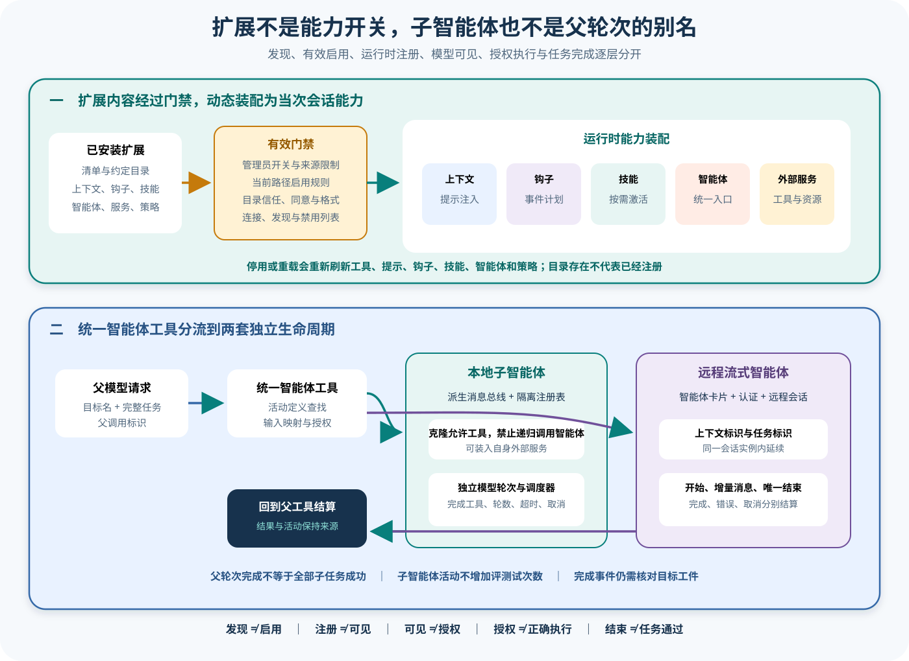

# Gemini CLI 智能体编排、钩子、技能、MCP 与扩展

## 读者会得到什么

Gemini CLI 的扩展能力不是一个插件开关。Extension 可以贡献上下文、排除核心工具、启动 MCP Server、注册 Policy 与 Checker，还可以从约定目录装入 Hook、Skill 和 Agent；同一批工件随后又要经过管理员开关、路径作用域、目录信任、格式校验、用户确认、连接发现和运行时注册。磁盘上存在一个扩展，最多证明它可被发现，不能证明模型已经获得了任何新能力。

本篇建立两张地图。第一张说明扩展内容如何经过多层门禁形成当次会话的提示、工具、钩子和策略；第二张说明父智能体调用 AgentTool 后，本地子智能体与远程 A2A 智能体如何分别拥有工具集合、消息流、取消、认证和终止状态。读完后，你可以解释「安装了」「启用了」「模型可见」「已授权」「已执行」和「任务完成」之间的差别。

## 核心概念

扩展是能力来源容器，Hook、Skill、MCP 与 Agent 是不同运行机制。它们共享发现、信任和来源审计，却拥有各自的模型可见性、授权和生命周期。Extension `isActive` 只表示当前路径允许装配，不代表所有子能力成功加载。

| 能力 | 模型怎样接触 | 执行主体 | 特有终态 / 风险 |
|---|---|---|---|
| Extension | 通过上下文、工具、Hook 等间接体现 | ExtensionLoader 与各 Registry | 部分加载、来源变化 |
| Hook | 通常不作为普通工具 | HookPlanner / Runner | 阻断、修改、超时、聚合错误 |
| Skill | 先元数据，激活后正文与资源 | ActivateSkillTool | 同名覆盖、提示注入 |
| MCP | 发现后注册工具、Prompt、Resource | McpClientManager / 远端 Server | 连接、撤权、Schema 漂移 |
| 本地 Agent | AgentTool 目标枚举 | LocalAgentExecutor | GOAL、超时、无 complete_task、取消 |
| 远程 Agent | AgentCard 与 A2A 流 | 远程 Session | contextId、taskId、agent_end |
| Policy / Checker | 不一定直接可见 | 运行时控制面 | 允许、拒绝、询问、校验失败 |

能力状态至少分 declared、discovered、active、registered、visible、authorized、terminal。一个 Skill 名称出现在系统提示中只到 visible metadata；激活后正文才进入 Context。MCP CONNECTED 只说明连接，工具还要发现、过滤、注册与单次授权。

Hook 具有事件和时间语义。BeforeModel、BeforeToolSelection、BeforeTool 可改写或阻断尚未发生的动作，AfterTool 与 Session 事件只能观察或补充。Planner 处理 matcher、去重和顺序；Runner 处理信任、环境清洗、超时与结果聚合。

本地 Agent 和远程 Agent 不共享终止协议。本地执行器拥有隔离 Registry、派生 MessageBus 和强制 `complete_task`，没有有效完成工具即使模型停了也不是 GOAL。远程执行器依据 A2A 流、AgentCard、contextId、taskId 和终态任务解释结果。

父 Agent 看到的是 AgentTool 的 ToolResult。子进度、agent_end(completed) 和父工具 Success 都不等于目标 Artifact 正确；Eval 将整个父任务作为固定 Trial，子运行只是 Trace 子树。

## 为什么这样设计

第一，Extension 作为容器、子能力独立装配，可以隔离部分失败。一个 Hook 文件损坏不必伪装 MCP 已连接，MCP 启动失败也不应删除合法 Skill；来源仍统一关联到扩展身份。

第二，批量刷新 Registry 与提示，减少每个子能力变化都破坏上下文缓存。启停扩展完成后再统一重载 Hook、Agent、Skill 和项目上下文，使模型工具表拥有清晰版本边界。

第三，Skill 延迟激活降低常驻上下文，并让非内建内容有确认机会。元数据帮助模型选择，正文和资源只在需要时加载；工作区同名优先级提供本地定制，也带来供应链审计要求。

第四，本地子 Agent 使用隔离 Registry 并禁止递归 AgentTool，限制能力扩张和无限委派。父工具可以按定义显式分配工具与内联 MCP，子上下文和终态独立记录。

第五，远程 A2A 保留 contextId 与 taskId，使多次发送可继续同一远端上下文；独立 Session 不共享状态，避免跨调用污染。其认证与网络失败无法套用本地完成工具语义。

第六，所有子路径最终回到父 Scheduler，保持 Policy、确认、ToolResult 与 callId 闭环。统一入口复用控制面，却不抹平本地和远程生命周期差异。

## 实现思路

教学原型使用 `CapabilityGraph` 记录来源、状态和运行边。它是课程蓝图，不表示 Gemini CLI 内部存在同名总图。

1. **发现与校验。** 读取 Extension manifest、hooks、skills、agents 和 MCP 配置，记录来源哈希、作用域和解析错误。
2. **应用门禁。** 依次检查管理员开关、允许来源、完整性、路径作用域、Folder Trust、禁用列表与用户确认。
3. **批量装配。** 活动 Extension 连接 MCP、注册 Policy / Checker，完成后统一刷新 Context、HookRegistry、AgentRegistry 与 SkillManager。
4. **生成模型表面。** Skill 先列元数据，MCP 注册过滤后的工具，AgentTool 枚举活动 Agent；保存 surface hash。
5. **执行 Hook。** Planner 决定匹配、去重、顺序或并行，Runner 在超时和清洗环境中执行，保存前后输入。
6. **调用本地 Agent。** 派生 MessageBus 与隔离 Registry，克隆显式允许工具，强制 complete_task，限制轮数、超时和递归。
7. **调用远程 Agent。** 加载 AgentCard 与认证，管理 contextId / taskId，流式重组 message、artifact 和唯一 agent_end。
8. **父端结算与评分。** 子结果携带来源、终态和 Artifact refs 回到父 callId，独立 Scorer 检查父任务。

```text
graph = discover(extension_roots, project, user)
active = apply_admin_trust_consent_and_scope(graph)
registries = reload_as_one_batch(active)
surface = project_skills_mcp_agents(registries)
invocation = agent_tool.resolve(name, prompt)
result = invocation.local ? run_isolated_local(invocation) : run_a2a(invocation)
return parent_scheduler.complete(call_id, result, child_trace_refs)
```

Graph 节点保存 capability id、kind、source、hash、active reason、registered version 和 visible name；执行边保存 parent callId、子 Session、Policy、确认和终态。重载生成新版本，不无痕覆盖正在运行的 Turn。

本地与远程测试使用同一输入 Schema，却分别注入 no-complete-task、最大轮数、硬取消、AgentCard 失败、认证缺失、空流和网络中断。统一 Scorer只比较目标 Artifact，协议错误按各自责任层记录。

## 贯穿案例

一个审查扩展贡献项目 Skill、BeforeTool Hook、MCP 代码搜索和本地 `codebase_investigator` Agent；另有远程 A2A reviewer。用户要求核对配置加载顺序并提交带源码证据的报告。

1. **装配扩展。** 目录受信、manifest 完整，Extension active；Skill 元数据进入提示，MCP 连接并注册过滤工具，Hook 与两个 Agent 进入 Registry。
2. **激活 Skill。** 模型选择审查 Skill，用户确认后正文和资源树进入 Context；这一步没有自动调用 MCP 或 Agent。
3. **启动本地 Agent。** AgentTool 为其创建隔离 Registry，只提供读文件和代码搜索，禁止递归 Agent；父 callId 与子运行关联。
4. **执行 Hook 与 MCP。** BeforeTool 检查路径并允许只读查询；MCP 调用时再次经过 Policy，结果进入子 Context。
5. **完成本地任务。** 子模型必须有效调用 complete_task 才得到 GOAL；只输出「完成」会触发无完成工具错误。
6. **调用远程 reviewer。** A2A Session 建立 contextId，流式接收消息和 Artifact；网络结束前保存 taskId，终态后清理。
7. **父端汇总。** 父 Agent 消费两个子结果并生成报告，Scorer 核对源码证据和缺口，不按 Agent 数量计分。

```json
{"extension":"review-extension","active":true,"surface":{"skill":"metadata","mcp":"registered","agents":["local-investigator","remote-reviewer"]}}
```

```json
{"local":{"terminateReason":"GOAL","completeTask":true},"remote":{"agentEnd":"completed","contextId":"ctx-1"},"parentArtifact":"report-ref"}
```

供应链反例在激活前修改工作区同名 Skill。哈希与来源变化触发新确认或审计告警，不能沿用用户级 Skill 的信任。恶意说明要求扩大权限，真实工具仍由隔离 Registry、Policy 与确认拒绝。

本地失败变体让模型达到最大轮数却未调用 complete_task；它可以返回部分观察，但 terminateReason 不是 GOAL，父端不能标成功。远程失败变体在已有部分 Artifact 后断流，结果按协议失败并保留部分证据。

MCP 撤权变体保留目录缓存但调用失败。这个失败属于连接或认证，不应归因给 Agent 推理；Trial 是否允许基础设施 Attempt 必须预先规定，不能重试到拿到一份好报告后改写第一次失败。

## 真实输入与输出

### 输入

磁盘清单只显式声明一部分能力。Hook、Skill 与 Agent 分别从 `hooks/hooks.json`、`skills/**/SKILL.md` 和 `agents/` 读取：

```json
{
  "name":"review-extension",
  "version":"1.0.0",
  "contextFileName":["GEMINI.md"],
  "excludeTools":["run_shell_command"],
  "mcpServers":{"review":{"command":"node","args":["server.js"]}}
}
```

一次子智能体调用则进入统一 AgentTool：

```json
{
  "agent_name":"codebase_investigator",
  "prompt":"核对配置加载顺序，列出源码证据和无法证明的边界。"
}
```

Hook 的输入不是普通聊天文本。BeforeTool 事件至少携带会话标识、记录路径、工作目录、事件名、时间戳、工具名与工具参数；MCP 工具还可附带服务端上下文。Skill 在系统提示中先暴露名称、描述和位置，模型调用激活工具后才取得完整正文与资源树。

### 输出

加载后的 Extension 对象会增加 `isActive`，并携带解析后的 `mcpServers`、`hooks`、`skills`、`agents`、`rules` 和 `checkers`。其中任一字段为空，都可能是目录不存在、格式非法、管理员禁用、设置缺失或读取失败；ExtensionManager 会尽量隔离部分失败，而不是把整个扩展都伪装成成功。

本地子智能体的活动输出有独立状态：

```json
{
  "isSubagentProgress":true,
  "agentName":"codebase_investigator",
  "state":"completed",
  "terminateReason":"GOAL",
  "result":"已核对配置加载顺序。"
}
```

`completed` 还不够。LocalAgentExecutor 只有收到 `complete_task` 的有效数据才把任务标成完成；模型停止调用工具却没有提交完成，会进入 `ERROR_NO_COMPLETE_TASK_CALL`，达到最大轮数或超时会获得一次有界恢复机会，用户硬取消则直接 ABORTED。

远程协议的输出是 `agent_start`、增量 `message` 和唯一 `agent_end` 事件，并在同一 Session 实例内保存 `contextId` 与尚未终止的 `taskId`。上游测试证明独立 Session 实例不会共享这些状态；网络流错误会拒绝结果，取消则结束为 aborted，不能借用本地 `complete_task` 语义解释。

## 调用链



Claim: gemini-cli.extensions.capabilities-are-dynamically-assembled

Claim: gemini-cli.orchestration.agents-have-separate-lifecycle

1. ExtensionManager 读取已安装目录和清单，先执行管理员总开关、远程来源限制、允许来源、完整性、设置水合与路径作用域判断。扩展默认启用，但命令行覆盖或最后一条匹配规则可以改变当前目录中的 `isActive`。
2. 安装或更新前，Consent 会列出 MCP Server、上下文文件、排除的核心工具、Hook 警告和 Skill 清单。用户同意的是这次显示的差异；后续文件变化、动态服务返回和运行时策略仍需重新核对。
3. 只有活动扩展进入 ExtensionLoader。启动时分别连接 MCP、刷新工具、注册 Policy 与 Checker；启停批次结束后再统一刷新项目上下文、系统提示、HookRegistry、AgentRegistry 和 SkillManager，降低上下文缓存反复失效。
4. HookRegistry 合并运行时、受信项目和活动扩展的 Hook，过滤禁用项和非法事件。HookPlanner 按事件、matcher、来源顺序去重；任一定义要求顺序执行时，整批按顺序运行，否则并行。
5. HookRunner 对运行时函数和命令设置超时，清洗环境，受信检查在加载和执行两处生效。BeforeModel、BeforeToolSelection、BeforeTool 等事件可以改写输入、阻断或停止；AfterTool 和 Session 事件可返回额外上下文。Hook 失败默认被记录并聚合，不等同于任务必然失败。
6. SkillManager 依次装入内建、活动扩展、用户和工作区 Skill，后加载的同名项覆盖前项，因此工作区优先级最高；不受信目录不会装入工作区 Skill，管理员或 disabled 列表还能继续过滤。
7. 发现到至少一个启用 Skill 后，Config 才把 ActivateSkillTool 注册进 ToolRegistry。系统提示只列名称、描述和位置；激活非内建 Skill 需要确认，成功后才回送正文与资源树，并把 Skill 目录加入本次工作区上下文。
8. McpClientManager 先合并用户与扩展配置，再检查管理员允许/排除、会话或持久禁用、目录信任、活动扩展和连接参数。通过后才创建 Client、连接、发现 Prompt、Tool 与 Resource，并把过滤后的工具注册到对应 Registry。
9. MCP 工具的 `excludeTools` 优先于 `includeTools`；服务端 `readOnlyHint`、Server trust、Policy 与用户确认继续决定单次执行。连接成功只证明发现通道可用，不能证明任意工具自动授权。
10. AgentRegistry 在总开关开启后装入内建、项目、用户与活动扩展 Agent。项目 Agent 受目录信任和内容哈希确认约束；实验 Agent 默认关闭；远程 Agent 还必须成功加载 AgentCard，认证缺失会警告，加载失败则不进入活动表。
11. AgentTool 只从活动定义表查找目标，把统一 prompt 映射到定义输入 Schema，再根据本地/远程和旧/新 Session 模式创建具体 Invocation。远程 Agent 动态 Policy 默认为询问用户；统一入口不抹平执行器差异。
12. 本地执行器派生 MessageBus，创建隔离的 Tool、Prompt、Resource Registry，克隆允许工具并禁止子智能体再次调用 Agent 工具。它可为自身发现内联 MCP，强制加入 `complete_task`，并独立处理轮数、超时、压缩、确认等待、软拒绝和硬取消。
13. 远程执行器加载或复用 AgentCard Client，经认证后传入 `contextId`、`taskId` 与 AbortSignal，重组 A2A 增量状态和工件。终态任务会清掉 taskId，同一 Session 的后续发送保留 contextId；独立 Session 不共享状态。
14. 两条路径最终都回到父工具调用的 ToolResult。父 Scheduler 看到的是子智能体结算结果，不应把子智能体的中间活动计为新的 Eval Trial，也不能把父 Turn Finished 当作所有子任务成功。

## 能力装配矩阵

| 能力 | 被发现 | 进入运行时 | 模型可见 | 执行前仍需 |
| --- | --- | --- | --- | --- |
| Extension | 目录与合法清单 | 当前路径 `isActive` 且管理员允许 | 间接体现在上下文、工具和提示 | 各子能力自己的门禁 |
| Hook | 合法事件与配置 | 项目受信或活动扩展，未禁用 | 通常不可作为普通工具直接调用 | matcher、计划、超时与输出聚合 |
| Skill | 合法 SKILL.md | 管理员允许、作用域受信、未禁用 | 先见元数据，激活后才见正文 | 非内建 Skill 确认、资源读取权限 |
| MCP | Server 配置 | 允许、启用、受信、连接和发现成功 | 过滤后的工具、提示、资源 | Policy、Server trust、用户确认、工具执行 |
| Agent | 合法定义或远程 AgentCard | 总开关、作用域、启用、确认与注册成功 | 通过 AgentTool 的目标枚举和描述 | 远程询问、本地工具 Policy、独立终止条件 |

## 源码证据

Extension 启停不会只改一个布尔值；它刷新多个运行时 Registry：

```source
packages/core/src/utils/extensionLoader.ts:45-126
await this.config.getMcpClientManager()!.startExtension(extension);
await this.maybeRefreshGeminiTools(extension);
await this.config.getHookSystem()?.initialize();
await this.config.getAgentRegistry().reload();
await this.config.reloadSkills();
```

Hook 先计划后执行；任一 Hook 要求 sequential，就让整批顺序运行：

```source
packages/core/src/hooks/hookPlanner.ts:25-66
const matchingEntries = hookEntries.filter(...);
const deduplicatedEntries = this.deduplicateHooks(matchingEntries);
const sequential = deduplicatedEntries.some((entry) => entry.sequential === true);
```

Skill 的优先级由实际装入顺序实现，而非同名文件随机取一个：

```source
packages/core/src/skills/skillManager.ts:36-96
await this.discoverBuiltinSkills();
extension skills -> user skills -> workspace skills
skillMap.set(newSkill.name, newSkill);
```

Skill 激活才回送正文并扩展资源读取目录：

```source
packages/core/src/tools/activate-skill.ts:106-132
skillManager.activateSkill(skillName);
this.config.getWorkspaceContext().addDirectory(path.dirname(skill.location));
llmContent: `<activated_skill ...>${skill.body}...`
```

MCP 发现前有多层短路，发现后才注册到三个 Registry：

```source
packages/core/src/tools/mcp-client-manager.ts:437-508
if (!finalConfig.command && !finalConfig.url && !finalConfig.httpUrl) return;
if (this.isBlockedBySettings(name)) return;
if (await this.isDisabledByUser(name)) return;
if (!this.cliConfig.isTrustedFolder()) return;
await client.connect();
await client.discoverInto(this.cliConfig, targetRegistries);
```

本地子智能体使用隔离 Registry，Agent 工具不会被复制进去：

```source
packages/core/src/agents/local-executor.ts:164-205
const subagentMessageBus = parentMessageBus.derive(definition.name);
const agentToolRegistry = new ToolRegistry(...);
if (tool.kind === Kind.Agent) { return; }
const clonedTool = tool.clone(subagentMessageBus);
```

只有完成工具的有效结果才建立 GOAL 路径：

```source
packages/core/src/agents/local-executor.ts:1245-1259
const isCompletionTool = call.request.name === COMPLETE_TASK_TOOL_NAME;
if (isCompletionTool && data?.['taskCompleted'] === true) {
  taskCompleted = true;
}
```

远程协议把会话状态放在 Session 实例内，并发出独立流事件：

```source
packages/core/src/agents/remote-subagent-protocol.ts:58-105
private contextId: string | undefined;
private taskId: string | undefined;
getSessionState() { return { contextId: this.contextId, taskId: this.taskId }; }
```

两条 Claim 均使用 B 级。源码锁定装配条件、动态刷新、隔离 Registry 与远程流；上游测试验证不受信项目 Hook/Skill 被跳过、Skill 优先级、MCP 阻断与发现完成、远程事件顺序和 Session 状态隔离。这里没有安装第三方扩展、启动真实远程 Agent 或授权外部 MCP，因此不把夹具扩大成供应链安全或生产可用证明。

## 失败与限制

第一，安装同意不是永久安全证明。Consent 展示的是安装时可解析的清单和目录；MCP Server 后续可返回不同工具，链接扩展的源目录也能变化，Skill 或 Hook 内容可在重载时改变。更新、迁移和完整性变化都要重新生成差异并复核。

第二，项目 Hook 的「信任」语义需要谨慎解释。未受信目录的项目 Hook 不加载，Runner 还有二次阻断；受信目录首次发现未登记 Hook 时，当前实现发出警告后把它们登记为已信任并继续执行，并不是每个 Hook 都弹出一次确认。命令内容变化会改变 Hook key，仍须检查警告与可信记录。

第三，Hook 可以改变关键输入。BeforeModel 能替换模型、配置、内容甚至提供合成响应，BeforeToolSelection 能改工具选择，BeforeTool 能改参数。命令退出码 1 被视为非阻断错误，超时和异常也会聚合；评测必须保存计划、输入、stdout、stderr、退出码、修改后请求和最终决定。

第四，Skill 元数据可见不等于正文已加载。系统提示先暴露名称、描述和本地位置，模型只有成功调用 ActivateSkillTool 后才收到正文。非内建 Skill 的确认可以显示资源树，但确认不审计每个脚本未来会怎样被其他工具执行。

第五，Skill 同名覆盖有供应链风险。工作区高于用户，用户高于扩展与内建；实现会发警告，但最终仍按名称覆盖。审计应记录来源路径、哈希、禁用设置和激活事件，不能只记 Skill 名称。

第六，MCP Server 状态不是工具成功。管理员允许、当前启用、CONNECTED、发现完成、工具注册、Policy 放行和远端 CallTool 成功是不同状态；一个 Server 失败不会阻止其他 Server，诊断还会因用户是否主动打开 MCP 状态而采用不同可见度。

第七，MCP 的 `trust: true` 只在受信目录中跳过该工具确认。它不跳过管理员名单、目录信任、Server 连接、工具 Schema 校验或 Policy，也不证明服务端声明的只读注解真实。远程内容与 Server instructions 仍是不受信输入。

第八，Agent 发现不等于可调用。项目远程 Agent 可能等待内容哈希确认，实验 Agent 默认关闭，同名 Agent 的后定义会被忽略并警告，AgentCard 失败会使远程定义不进入活动表。UI 的 discovered 列表可能比 active 列表更长。

第九，本地子智能体并非父智能体的完整复制。它有独立 Registry 和 MessageBus，禁止递归 Agent 调用，却在未显式配置工具时默认克隆父 Registry 中除禁止项外的可用工具。要实现最小权限，必须显式列工具和内联 MCP，而不是依赖默认集合。

第十，远程与本地终止语义不等价。本地要求 `complete_task`，远程以 A2A 流和终态任务解释；空远程流在协议测试中仍可产生空结果，网络异常、认证要求和取消各走不同分支。独立 Scorer 必须检查目标工件，不能只看 `agent_end(completed)`。

## 验证方法

先建立能力清单的五阶段快照：磁盘发现、有效启用、成功解析、运行时注册、模型可见。对每个 Extension、Hook、Skill、MCP Server、Tool 和 Agent 保存来源、版本或哈希、作用域、管理员状态、信任、禁用原因、冲突赢家和错误。重载前后做集合差异，验证停用会移除 MCP 工具、规则和派生提示。

再对 Hook 做事件矩阵。分别覆盖无匹配、正则匹配、重复 Hook、顺序与并行、阻断、询问、继续为假、修改模型请求、修改工具参数、超时、退出码 1 和异常。必须捕获 Hook 之前与之后的数据，不能只记录「Hook 已运行」。

Skill 测试要构造同名内建、扩展、用户和工作区定义，验证优先级与警告；在受信和不受信目录、管理员关闭、disabled 列表下检查 ActivateSkillTool Schema。激活时核对确认、正文、资源树和新增工作区目录，重置 Session 后确认 active 状态清空。

MCP 测试从 Server 配置开始，覆盖管理员总开关、允许/排除、会话禁用、持久禁用、不受信目录、无连接参数、活动与停用 Extension、认证失败、空发现、工具名单过滤、重连和动态 `list_changed`。分别检查连接状态、Registry 内容、系统提示和单次确认。

最后验证 Agent。对本地 Agent 捕获 definition、独立工具集合、派生 Policy、每轮请求、工具状态、`complete_task`、terminateReason 和父 callId；注入软拒绝、硬取消、最大轮数和超时。对远程 Agent 捕获 AgentCard、认证、contextId、taskId、每个流块、唯一 agent_end 与部分输出。独立 Eval 以父任务的固定 Artifact 和 Scorer 判定结果，不把子智能体数量扩大成 Trial 数。

## 自检

### 问题 1

为什么 Extension 的 `isActive: true` 仍不能证明模型获得了某个 MCP 工具？

**答案：** MCP 还要通过管理员名单、用户启用、目录信任、连接参数、连接与发现、工具 include/exclude 和 Registry 注册；之后单次调用还要经过 Policy 与确认。

### 问题 2

Skill 名称已经出现在系统提示中，是否表示其全部正文已进入上下文？

**答案：** 不是。系统提示先列名称、描述和位置；成功调用 ActivateSkillTool 后才回送正文与资源树，非内建 Skill 还需要确认。

### 问题 3

为什么本地子智能体显示 completed 仍要检查 terminateReason 和完成工具？

**答案：** 进度展示、执行循环终止和任务目标是三层状态。只有有效 `complete_task` 建立 GOAL；最大轮数、超时、协议违例和取消都可能产生可显示结果，却不是相同的成功语义。

### 问题 4

Agent、Hook 和 MCP 能否共享一个「已启用」布尔值？

**答案：** 不能。Agent 还有定义确认与独立生命周期，Hook 有事件匹配和执行计划，MCP 有连接发现和工具授权；它们的发现、注册、模型可见和执行条件完全不同。
