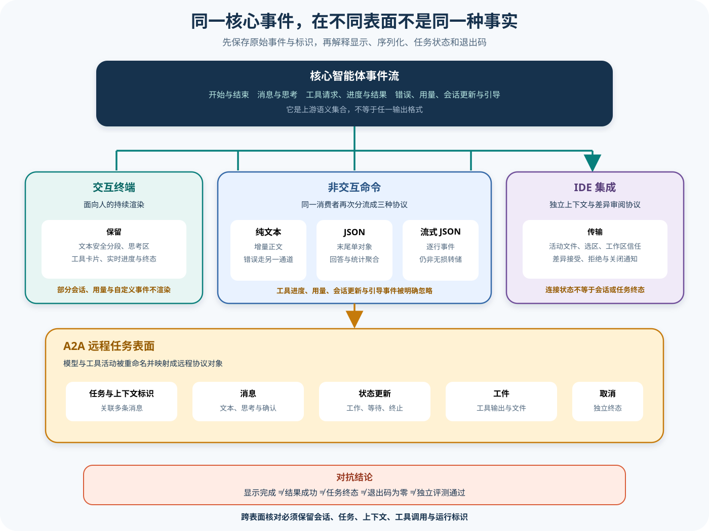

# Gemini CLI 产品表面与输出协议

## 读者会得到什么

Gemini CLI 的交互终端、非交互命令、IDE 集成与 A2A Server 共享部分核心能力，却不是同一条事件流换了外壳。交互终端把 AgentEvent 投影为消息、思考、工具卡片与进度；非交互 Session 只消费其中一部分事件，并进一步投影为 text、json 或 stream-json；IDE 通过 MCP 通知与工具交换编辑器上下文和差异确认；A2A 则维护远程 Task、Message、Artifact 与状态更新。

本篇给出一张可核对的投影表。你将能判断某个字段究竟是核心事实、表面状态还是序列化结果，并解释为什么「终端显示完成」「JSON status 为 success」「进程退出码为 0」「A2A Task 进入 input-required」不能互相替代，更不能直接充当独立 Eval 的通过结论。

## 核心概念

产品表面由输入适配、事件投影、传输和终态契约组成。交互 TUI、非交互 text / json / stream-json、IDE 与 A2A 可以消费同一 AgentEvent，却选择不同字段与身份。表面响应是核心事件的视图，不是无损副本。

| 表面 | 主要身份 | 增量能力 | 自身终态 |
|---|---|---|---|
| 交互终端 | Session、requestId | 文本、thought、tool update | UI Idle / error |
| text | 进程、Session | stdout 文本、stderr | 退出码 / 信号 |
| json | Session | 结束时聚合一次 | 单对象与退出码 |
| stream-json | Session、tool_id | JSONL 增量事件 | result 与退出码 |
| IDE | 连接、workspace、diff | context 与工具通知 | 连接 / diff 决定 |
| A2A | taskId、contextId、messageId | Message、Artifact、status-update | TaskState |
| Core AgentEvent | Session、callId | 完整运行事件集合 | agent_end |

投影有四种操作：保留、重命名、合并和丢弃。json 合并多条消息为最后 response，stream-json 重命名工具事件并忽略 usage / custom 等类型，TUI 把 tool_update 合并到同 requestId 卡片。映射表必须版本化。

stdout、stderr 和退出码属于进程契约。text 的警告可能只在 stderr，EPIPE 因下游提前关闭可退出 0，进程终止也可能没有完整 result。自动化消费者应分别保存字节流、顺序、信号和解析边界。

A2A Task 的 input-required 表示远程任务等待下一步输入或确认，不等于本地 Agent Session 失败；completed 也不是 Scorer pass。IDE 的 diff accepted 只表示一次编辑选择，不证明文件最终内容和测试。

协议完整性和任务正确性是两项门禁。Harness Gate 检查 init / result、JSON 可解析、tool_id 关联和终态映射；独立 Scorer 检查 Artifact。协议 success 可以伴随错误答案，协议不完整也可能留下部分正确文件。

## 为什么这样设计

第一，针对消费者设计投影，可以让 TUI 关注体验、JSON 关注摘要、JSONL 关注流式自动化、IDE 关注编辑上下文、A2A 关注远程任务，而不把内部事件 Schema 直接暴露为永久协议。

第二，稳定的小型 stream-json 枚举降低消费者耦合。代价是它不是完整 Trace，所以系统仍需保存核心事件或录制证据；消费者不能用未定义事件推断全部运行状态。

第三，json 主动保留最后回答，符合一次性脚本需求；中间工具前文本被丢弃则避免把未完成草稿当最终结果。需要审计时选择 stream-json 加 Core Trace，而不是强迫 json 变成事件日志。

第四，IDE 与 A2A 使用独立协议，是因为编辑器交互和远程长任务需要不同身份与状态。将它们压成 stdout 会丢失 diff 确认、Task 恢复和 Artifact 语义。

第五，表面终态与 Eval 分开，允许协议兼容演进而不改变质量标准。Scorer 读取统一 Artifact Schema，Target 记录 surface 与协议版本，结果按表面分层。

第六，显式记录 ignored 与 merged 事件，让信息损失成为协议契约的一部分。客户端可以知道某种格式不含 thought、usage 或工具进度，从而选择 Core Trace 补证，而不是误以为缺失事件从未发生。

第七，进程壳与远程 Task 分开，支持短命令管道和长任务恢复。EPIPE、退出码、taskId、contextId 各自解决不同消费者问题；强行统一会让管道关闭被解释为远程取消，或让 input-required 被解释为进程失败。

## 实现思路

教学适配层建立 `ProjectionLedger`，它是课程蓝图，不表示 Gemini CLI 存在同名统一组件。

1. **冻结 surface。** 记录表面、输出格式、协议版本、输入、取消方式和有效配置。
2. **关联身份。** 建立 runId 到 sessionId、requestId、tool_id、taskId、contextId 和 diffId 的映射。
3. **投影事件。** 每个 AgentEvent 按表面规则保留、重命名、合并或忽略，并记录操作和目标序号。
4. **写多通道输出。** stdout / stderr 分开保存；json 只在结束聚合，JSONL 逐行校验；IDE / A2A 保留协议对象。
5. **映射终态。** 原始 agent_end、错误和取消映射为表面 status / exit code，未知枚举使契约测试失败。
6. **检查完整性。** 验证流首尾、唯一 ID、tool_use / result 配对、A2A Task 状态和 EPIPE 边界。
7. **收集 Artifact。** 保存核心 Trace、表面输出、工作区差异和外部副作用，不能只存最终 response。
8. **独立评分。** Harness Gate 与任务 Scorer分别输出，协议 pass 不覆盖任务 fail。

```text
run = freeze(surface, protocol_version, config)
for event in core_agent_events:
    projection = mapping[surface].apply(event)
    ledger.append(event.id, projection.action, projection.output_ids)
surface_terminal = map_terminal(core_terminal)
protocol_result = validate_projection(surface_output, ledger)
task_result = scorer(artifacts)
```

ProjectionLedger 保留 ignored 事件清单，使「没输出」可解释。敏感 thought 或参数即使不投影，也只在受控 Trace 中保留；公开 Artifact 需脱敏。协议映射变化生成新版本，不无痕改变旧运行。

故障测试注入 EPIPE、stdout 写失败、JSON 序列化错误、无 result、重复 tool_id、IDE 断线、A2A input-required 和终态重入。每次检查核心任务是否继续、表面如何结算和 Artifact 是否完整。

## 贯穿案例

同一任务「读取配置并汇总证据」分别运行 json、stream-json 与 A2A。Core 产生文本、thought、tool_request、tool_update、tool_response、usage 和 agent_end。

1. **json 投影。** 工具前的草稿文本被移出最终 response，结束时输出最后回答、stats 和 warnings；没有逐事件顺序。
2. **stream-json 投影。** 发 init、message、tool_use、tool_result 和 result；thought、usage、tool_update 被 Ledger 标为 ignored。
3. **A2A 投影。** 文本成为 Message，工具进度成为 status-update，输出成为 Artifact；首轮结束进入 input-required 等待用户确认。
4. **注入 EPIPE。** JSONL 消费者在 tool_use 后关闭管道，进程可退出 0，但没有读到 result；Harness Gate 判 incomplete。
5. **恢复 A2A。** 使用相同 taskId / contextId 发送确认，Task 最终 completed；本地进程退出语义不参与。
6. **独立评分。** 三条 Target 都对最终报告运行同一 Scorer，并按 surface 分层报告。

```json
{"surface":"stream-json","received":["init","message","tool_use"],"exitCode":0,"protocolComplete":false}
```

```json
{"surface":"a2a","taskState":"completed","artifact":"report-ref","taskScore":"fail"}
```

json 反例最终对象无 error，但中间工具失败后模型给出错误总结。协议 Gate 通过，Scorer因报告缺少证据判 fail。最终 response 可读不代表工具轨迹正确。

IDE 反例用户接受 diff，随后外部格式化器改坏文件。diff decision 保留 accepted，最终 Artifact测试失败；IDE 决定与工作区终态各自留证。

A2A 反例 Task completed 但 Artifact 丢失。远程协议结算和内容评分分开，不能因 TaskState 绿色跳过产物验证。

## 真实输入与输出

### 输入

非交互入口接收提示、输出格式、恢复数据和取消信号。下面是概念化调用，字段名与真实命令行配置对应：

```json
{
  "input":"检查工作区并返回证据摘要",
  "outputFormat":"stream-json",
  "resume":"可选会话标识",
  "abortSignal":"可选取消信号"
}
```

交互终端接收同类 AgentEvent，但会把增量文本、thought、tool_request、tool_update、tool_response 与 agent_end 映射到不同 UI 状态。IDE 的输入不是完整会话流，而是连接配置、工作区信任、活动文件、选区和差异通知。A2A 的输入则是带 taskId、contextId 和 messageId 的 Message，以及后续工具确认或取消请求。

### 输出

text 直接把模型文本写入标准输出，把警告和错误写入标准错误；它适合人读，却没有稳定事件类型。json 在结束时输出单个聚合对象：

```json
{
  "session_id":"会话标识",
  "response":"最后一段助手回答",
  "stats":{"models":{},"tools":{}},
  "warnings":["可选警告"],
  "error":{"type":"可选错误类型","message":"可选错误信息"}
}
```

遇到工具编排时，json 会清空工具调用前的中间文本，只保留工具返回后形成的最后回答；若工具要求停止执行且没有新回答，才回退到调用前文本。它是一次运行的汇总，不是事件日志。

stream-json 使用 JSONL，每行一个带时间戳的事件。协议枚举只有 init、message、tool_use、tool_result、error 和 result：

```json
{"type":"init","timestamp":"…","session_id":"…","model":"…"}
{"type":"message","timestamp":"…","role":"assistant","content":"增量文本","delta":true}
{"type":"tool_use","timestamp":"…","tool_name":"…","tool_id":"…","parameters":{}}
{"type":"tool_result","timestamp":"…","tool_id":"…","status":"success","output":"…"}
{"type":"result","timestamp":"…","status":"success","stats":{"duration_ms":0,"tool_calls":1}}
```

这仍然不是 AgentEvent 的无损转储。initialize、session_update、agent_start、tool_update、elicitation_request、elicitation_response、usage 和 custom 在非交互消费者中被明确忽略；thought 也没有 stream-json 事件类型。result 的成功只表示该非交互 Session 没有以错误载荷结算，不证明回答正确。

## 调用链



Claim: gemini-cli.surfaces.output-projections-are-not-equivalent

1. LegacyAgentSession 产生 AgentEvent。事件可以表达智能体开始与结束、增量消息、工具请求、工具进度、工具结果、错误、用量、会话更新和引导式交互；这是各表面投影的上游语义，而不是某一种输出格式的 Schema。
2. 交互终端把 agent_start 和 agent_end 映射为 Responding 与 Idle，把消息文本安全分段写入历史，把 thought 放入独立思考区，并以 requestId 维护工具卡片从 Scheduled 到 Executing、Success 或 Error 的状态。
3. 交互终端当前也忽略 initialize、session_update、elicitation_request、elicitation_response、usage 和 custom。可视状态比 text 丰富，却仍不是完整事件归档；重新渲染后的 UI 不能取代原始 Trace。
4. 非交互消费者从同一流中读取 message、tool_request、tool_response、error 和 agent_end。它显式忽略工具进度与若干会话事件，因此表面之间不能按行对齐。
5. text 逐段输出清洗后的助手文本。工具活动默认不形成结构化 stdout；警告、取消和停止原因可能写入 stderr。启用 raw-output 会放弃 ANSI 清洗，代码先发出注入风险警告，除非用户显式接受风险。
6. json 累积 responseText，结束时连同 session_id、完整 SessionMetrics、warnings 和可选 error 一次格式化。工具请求前的中间回答会从最终 response 中移除，说明聚合输出主动丢弃了一部分可见文本历史。
7. stream-json 实时发出 JSONL。它保留用户消息、助手增量、工具请求与结果、错误严重度和最终统计，比 text 和 json 更适合机器消费；但其事件枚举是专门设计的稳定投影，不是 AgentEvent 的全部类型。
8. stdout 的 EPIPE 被视为下游管道提前关闭并以 0 退出。这能避免管道消费者停止读取时制造伪故障，却意味着退出码 0 也可能没有完整 result 事件，消费者必须保存自己实际读到的边界。
9. agent_end aborted 被重建为取消错误；配置的最大轮数会转成 FatalTurnLimitedError；fatal error 会保留类型、code、status 和 exitCode 元数据再交给统一错误处理。工具执行错误通常先回送模型继续恢复，只有特定致命条件立即终止。
10. IDE Client 独立探测编辑器进程，验证工作区路径，通过 HTTP 或 stdio 建立 MCP Client；它订阅 IDE context、workspace trust 和 diff 结果，并调用 openDiff、closeDiff 等 IDE 工具。这里传输的是编辑上下文与人工差异决定，不是 CLI stdout。
11. A2A Executor 以 taskId 和 contextId 装入或创建 Task。Task 将模型文本投影成 A2A Message，把工具进度投影成 status-update，把工具输出投影成 Artifact，并在 working、input-required、completed、canceled 或 failed 等状态之间移动。
12. A2A 的一次 agent turn 正常结束后可以进入 input-required，等待下一条用户消息；这不同于非交互 result success，也不同于本地进程退出。只有各表面的原始标识、事件与终态一起保存，才能重建一次执行。

## 表面与协议差异矩阵

| 表面 | 保留的主要内容 | 主动合并或丢失 | 自身终态 | 不能推出 |
| --- | --- | --- | --- | --- |
| 交互终端 | 文本、思考、工具卡片、进度、错误 | 部分会话、用量与自定义事件不渲染 | UI 回到 Idle | 进程成功、工件正确 |
| 非交互 text | 助手文本、stderr 警告与错误 | 无结构化工具事件、无统计协议 | 输出结束与退出码 | 收到了完整事件序列 |
| 非交互 json | 最后回答、SessionMetrics、警告、可选错误 | 中间文本与事件顺序被聚合 | 单个 JSON 对象加退出码 | 工具每一步按预期执行 |
| 非交互 stream-json | init、消息增量、工具请求/结果、错误、result | 不含全部 AgentEvent 与完整 UI 状态 | result 加退出码 | result success 等于任务正确 |
| IDE | 活动文件、选区、工作区信任、差异接受/拒绝、可用工具 | 不承载完整会话输出 | 连接状态与单次 diff 结果 | CLI 或 A2A 的终态 |
| A2A | Task、Message、Artifact、工具状态、远程取消 | 核心事件被重命名并映射到远程对象 | A2A TaskState | 本地进程退出或 Eval 通过 |

## 源码证据

stream-json 的公开事件集合小于核心 AgentEvent 集合：

```source
packages/core/src/output/types.ts:29-37
INIT, MESSAGE, TOOL_USE, TOOL_RESULT, ERROR, RESULT
```

非交互消费者明确忽略一批事件，而不是把它们序列化：

```source
packages/cli/src/nonInteractiveCliAgentSession.ts:675-684
case 'initialize':
case 'session_update':
case 'agent_start':
case 'tool_update':
case 'elicitation_request':
case 'elicitation_response':
case 'usage':
case 'custom':
  // Explicitly ignore these non-interactive events
```

同一消息事件在三种非交互格式中走三条路径：

```source
packages/cli/src/nonInteractiveCliAgentSession.ts:449-470
if (streamFormatter) { emit MESSAGE delta; }
else if (outputFormat === JSON) { responseText += output; }
else { textOutput.write(output); }
```

交互 UI 保存思考和工具进度，但也有自己的忽略列表：

```source
packages/cli/src/ui/hooks/useAgentStream.ts:159-193
geminiMessageBufferRef.current += part.text;
setThought(parseThought(part.thought));
```

IDE 的差异审阅通过独立工具调用并等待接受或拒绝通知：

```source
packages/core/src/ide/ide-client.ts:204-278
name: `openDiff`
this.diffResponses.set(filePath, resolve);
promise.finally(release);
```

A2A 为状态更新附带自己的 taskId、contextId 和 Message：

```source
packages/a2a-server/src/agent/task.ts:313-360
kind: 'status-update'
taskId: this.id
contextId: this.contextId
status: { state: stateToReport, message }
this.eventBus?.publish(event)
```

本 Claim 使用 B 级证据。源码锁定各投影的字段、过滤和状态映射；上游测试覆盖三种输出、EPIPE、取消、致命错误和停止执行。这里没有接入真实 IDE 扩展、跨网络 A2A 客户端或生产模型，因此不声称所有下游消费者、终端环境和远程服务器都已互操作。

## 失败与限制

第一，stdout 与 stderr 是两个通道。只采集 stdout 会漏掉 text 模式的警告、停止原因和部分错误；把两者无时间戳地合并又会丢失顺序。评测运行器应分别保存字节流、写入顺序、退出码和信号。

第二，json 的 response 不是完整模型转录。工具请求会把此前累积文本移到临时槽，最后只保留工具编排后的回答；STOP_EXECUTION 才可能回退。若审计需要中间解释，应使用 stream-json 并同时保存核心 Trace。

第三，stream-json 的 result 不保证前面事件完整。下游提前关闭会触发 EPIPE 并以 0 退出；进程崩溃或输出截断可能没有 result；重复消费和断点续传也未由 JSONL 本身定义。消费者要验证首尾、逐行解析、事件顺序和唯一标识。

第四，取消不是一种统一成功。stdin 取消最终形成 FatalCancellationError；交互 UI 可能先回到 Idle；A2A 取消会发布 canceled；工具自身 cancelled 在部分 stream-json 兼容路径中仍序列化为成功的 tool_result。必须保留取消来源和原始内部状态。

第五，退出码属于进程壳，不属于模型质量。自定义致命错误可携带 exitCode，普通工具失败可被模型恢复，EPIPE 又能以 0 退出。退出码适合判断命令是否按协议结算，不能判断答案是否正确。

第六，IDE 是上下文与审阅表面，不是安全边界。路径验证、连接令牌、workspace trust、可用工具发现和 diff 决定都要记录；用户接受差异也只证明一次编辑选择，不证明后续文件状态或测试通过。

第七，A2A TaskState 是远程协作状态。input-required 可能只是等待工具确认或下一条消息；completed 也只代表协议终态。Task、Artifact 与本地 Session 之间没有天然一一对应关系，跨表面关联必须显式保存 runId、taskId、contextId、sessionId 和 toolCallId。

第八，上游测试是锁定源码的合成证明。它们不覆盖终端 ANSI 差异、代理断流、真实 IDE 版本、远程认证、负载均衡和持久化恢复。生产验证必须补充端到端夹具，并清楚标记运行环境。

## 验证方法

建立同一固定任务的六路运行矩阵：交互终端、text、json、stream-json、IDE diff 与 A2A。为每一路保存输入、有效设置、模型、sessionId、taskId、contextId、原始 stdout、stderr、协议事件、退出码、信号、工具调用和最终工件。不要先把它们归一化；先确认每个表面真实保留了什么。

对非交互格式注入四类轨迹：纯文本回答、工具成功后继续回答、工具失败后模型恢复、致命错误或取消。验证 text 没有结构事件，json 只给最终聚合，stream-json 保持 init 到 result 的顺序；再注入 EPIPE、无响应、最大轮数与 STOP_EXECUTION，核对 stdout、stderr、result.status 和进程退出码的组合。

对交互 UI 记录 AgentEvent 与渲染状态的双轨 Trace。检查 thought 不进入普通回答、tool_update 只更新同 requestId 卡片、agent_end 会 flushPendingText，以及被忽略事件不会悄悄变成成功提示。视觉快照只能验证渲染，不替代事件断言。

IDE 测试覆盖无编辑器、路径不匹配、HTTP 与 stdio、令牌错误、工作区信任变化、工具发现为空、diff 接受、拒绝、关闭和并发互斥。A2A 测试覆盖新建与恢复 Task、第二条消息、工具确认、Artifact、socket 断开、显式取消、持久化失败和终态重入。

最后增加独立 Eval：以相同 Dataset、Target、Artifact Schema 和 Scorer 读取各表面的最终工件，单独判断正确性；协议完整性由 Harness Gate 判定。这样「输出协议是否完整」和「任务结果是否通过」不会互相污染。

## 自检

### 问题 1

为什么 stream-json 比 json 信息更多，仍不能称为核心事件的无损日志？

**答案：** 它只定义 init、message、tool_use、tool_result、error 和 result；非交互消费者明确忽略 tool_update、usage、session_update、elicitation 等核心事件，thought 也没有对应事件类型。

### 问题 2

json 中出现 response 和没有 error，能否证明工具过程全部成功？

**答案：** 不能。json 聚合最后回答并丢弃事件顺序；普通工具错误可能回送模型后被恢复，最终对象不提供完整的每步工具状态。

### 问题 3

为什么退出码 0 不一定意味着收到了完整输出？

**答案：** stdout 遇到 EPIPE 时实现会把下游提前关闭视为正常并以 0 退出；消费者可能只读到前缀，没有最终 result。

### 问题 4

A2A 的 completed、CLI 的 result success 和 Eval pass 是否相同？

**答案：** 不同。前两者分别是远程任务协议和非交互 Session 的结算状态；Eval pass 必须由独立 Scorer 根据固定工件与判分规则产生。
