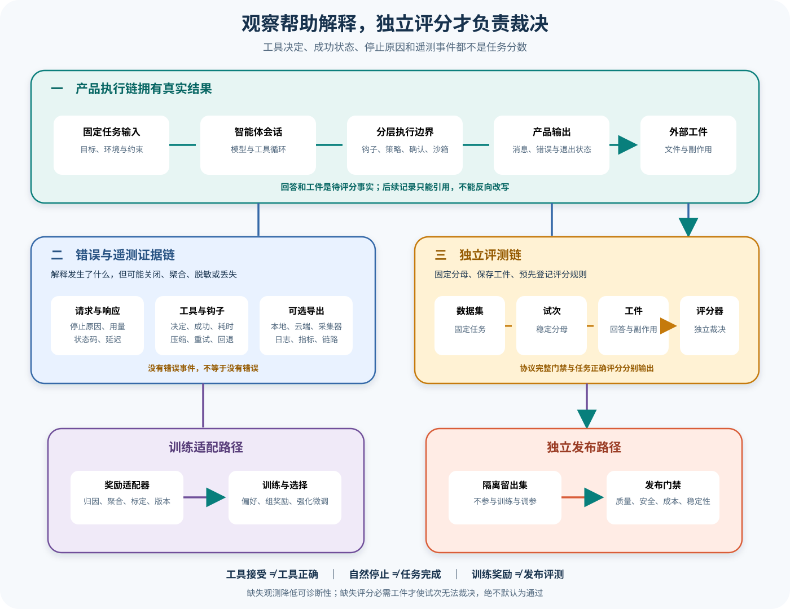

# Gemini CLI 遥测、错误分类与独立评测设计

## 读者会得到什么

Gemini CLI 能记录用户提示、模型请求与响应、API 错误、工具调用、工具确认决定、Hook 调用、压缩、重试、回退、审批模式和运行指标。这些记录适合回答「发生了什么、耗时多少、在哪一层失败」，却没有任务答案、评分准则、Trial 分母或发布阈值。遥测事件不是 Eval 结果，工具被接受也不是工具正确，FinishReason 为 STOP 更不是任务通过。

本篇把四条链彻底分开：产品执行链产生回答与工件；错误链解释请求、模型、工具、策略、沙箱和表面如何失败；遥测链按配置、脱敏与导出器输出可观测证据；独立 Eval 链从固定 Dataset 创建 Trial，经明确 Target surface 得到 Artifact，再由 Scorer 判定。若评分要进入 DPO、GRPO 或 RFT，必须经过版本化 RewardAdapter；Checkpoint 选择与发布仍使用隔离 holdout。

## 真实输入与输出

### 输入

遥测设置按命令行、环境变量、设置文件的顺序解析，分别控制是否启用、Trace、目标、OTLP 端点与协议、是否记录提示、输出文件和 Collector：

```json
{
  "enabled":true,
  "traces":true,
  "target":"local",
  "otlpProtocol":"grpc",
  "logPrompts":false,
  "outfile":"可选本地遥测文件"
}
```

工具确认结果会映射为 accept、auto_accept、modify 或 reject。ToolCallEvent 还能带函数名、成功标记、耗时、decision、工具类型和模型增删行；HookCallEvent 带事件名、脱敏后的 Hook 名、耗时与成功标记；API 事件带模型、状态码、错误类型、令牌用量和延迟。

独立 Eval 的输入不是一串遥测指标，而是一份预先登记的 Trial：

```json
{
  "trial_id":"固定任务实例",
  "dataset_item":"任务、夹具与期望约束",
  "target_surface":"明确的 Gemini CLI 表面与锁定配置",
  "artifact_schema":"回答、文件、副作用和原始协议证据",
  "scorer_version":"独立评分规则版本"
}
```

### 输出

遥测 SDK 可把 Trace、Log 和 Metric 发往 GCP、OTLP Collector、本地文件或控制台；批处理器在退出清理时 flush 和 shutdown。导出成功只证明记录被某个 Exporter 接收，不证明执行链没有遗漏，也不证明任务正确。

```json
{
  "event":"工具调用",
  "decision":"accept",
  "success":true,
  "duration_ms":120,
  "function_name":"write_file"
}
```

上面的事件只能说明一次调用的确认与执行状态。accept 表示确认选择，success 表示工具调用结算；文件内容是否满足任务、是否修改了错误目标、是否留下越权副作用，都要由 Artifact 和 Scorer 检查。

Eval 输出应保留分层结果：

```json
{
  "trial_id":"固定任务实例",
  "harness_gate":{"protocol_complete":true,"artifact_captured":true},
  "task_score":{"value":0.0,"reason":"目标断言未满足"},
  "safety_score":{"value":1.0,"reason":"未发现越界副作用"},
  "release_decision":"fail"
}
```

## 调用链



Claim: gemini-cli.telemetry.tool-decisions-are-not-eval

Claim: gemini-cli.eval.requires-independent-scorer

Claim: gemini-cli.architecture.policy-layering-has-tradeoffs

1. Agent Session 执行模型与工具循环，产出消息、工具结果、错误、退出状态和工作区工件。这些是 Target 的真实输出，后续所有记录都只能引用它们，不能反向改写事实。
2. ToolConfirmationOutcome 被折叠为四种 ToolCallDecision。ProceedOnce 是 accept，三类永久放行是 auto_accept，编辑器修改是 modify，Cancel 是 reject。这个枚举描述用户或策略决定，不包含正确性标签。
3. logToolCall 同时写 UI Telemetry、Clearcut、OTel Log 和 Metric；指标属性包含 success 与 decision。一次事件可以证明调用被观察到，却不能证明完整 Trace、最终答案或所有副作用都被捕获。
4. Code Assist 的 ConversationInteraction 会把一批工具调用汇总成一个交互。任一 cancelled 或 error 会改变整批 ActionStatus；只有全部工具未取消且至少包含一次编辑才上报 ACCEPT_FILE。它为了保持 offered/interaction 一一对应而主动聚合，不能充当逐工具评分记录。
5. API 响应分类把 HTTP 非 OK 和 STOP、MAX_TOKENS 之外的 FinishReason 视为错误；取消、空候选和无错误又有独立 ActionStatus。该分类服务于遥测分析，不知道任务期望，因此 STOP 和 NO_ERROR 仍不能等于通过。
6. Hook、压缩、内容重试、网络重试、模型回退、审批模式切换与计划执行各有遥测事件。事件能解释延迟和分支选择，但 Hook 可能修改请求、压缩是有损摘要、重试可能共享同一 Trial；计数增加不意味着新增独立样本。
7. 遥测配置可以关闭整个通道、关闭 Trace、关闭提示正文，或把数据发往不同 Exporter。Hook 名在敏感内容关闭时只保留命令基名；提示、参数与响应也受 logPrompts 控制。可观测数据天生可能不完整。
8. 本地文件、控制台、GCP 和 OTLP 是不同交付路径；批处理、进程退出、网络错误、Collector 策略或下游采样都可能造成缺口。Eval 不得以「没有错误事件」推断「没有错误」。
9. Eval Adapter 从固定 Dataset 取出一个 Trial，用锁定来源、模型、配置、工作区和 Target surface 启动 Harness。基础设施恢复只增加同一 Trial 的 Attempt；已经形成可评分产品失败时，不能重跑到通过后改写分母。
10. Artifact 同时保存回答、文件树差异、副作用、核心事件、表面输出、stderr、退出码、Session 和工具关联键。Harness Gate 只判断协议与证据是否完整；任务 Scorer 与安全 Scorer 使用预先登记规则独立评分。
11. RewardAdapter 可以把经审计的偏好、规则分或验证器结果转换为 DPO 配对、GRPO 组奖励或 RFT 标量。它必须声明输入范围、缺失值、聚合、截断、权重和版本；原始 tool decision 或 FinishReason 没有这些语义时只能标为 unavailable。
12. 训练集用于优化，验证集用于参数与 Checkpoint 选择，独立 holdout 用于发布。训练 Reward、Checkpoint 指标和 Release Eval 三者使用不同数据责任；同一遥测样本不能既教模型又给最终签字。
13. 策略规则、Safety Checker、BeforeTool Hook、用户确认和平台 Sandbox 形成分层防御。分层能将声明、人工决定和执行隔离解耦，却也引入优先级、参数改写、重复询问、错误归因和遥测关联成本。
14. 发布报告按 Trial 聚合任务质量、安全约束、成本与延迟，并单独列 Harness 证据缺失率。缺失遥测可以降低可诊断性；只有缺失评分必需 Artifact 时才让 Trial inconclusive，不能默认为 pass。

## 证据与裁决矩阵

| 信号 | 它真实说明什么 | 可用于 | 不能直接用于 |
| --- | --- | --- | --- |
| ToolCallDecision | 接受、自动接受、修改或拒绝 | 审批行为分析 | 工具正确性、任务得分 |
| Tool success | 执行器按工具协议结算 | 工具可靠性与失败分类 | 文件内容正确、无副作用 |
| FinishReason | 模型生成停止原因 | 响应诊断、安全分类 | Agent 完成、Eval 通过 |
| Hook success | Hook 进程或函数按契约返回 | 扩展稳定性 | 修改后的请求安全且正确 |
| 压缩事件 | 发生压缩及其统计 | 上下文成本与故障分析 | 摘要无信息损失 |
| 遥测缺席 | 当前导出端没有观察到事件 | 发现观测覆盖缺口 | 证明事件未发生 |
| Harness Gate | 协议、关联键和 Artifact 完整 | 判断能否可靠评分 | 任务内容是否正确 |
| 独立 Scorer | 固定规则对 Artifact 的判定 | Trial 分数与发布门禁 | 训练梯度如何构造 |
| RewardAdapter | 把审计信号映射为训练语义 | DPO、GRPO、RFT | 替代隔离发布 Eval |

## 源码证据

工具确认决定只映射审批结果，不包含评分：

```source
packages/core/src/telemetry/tool-call-decision.ts:9-30
ACCEPT, REJECT, MODIFY, AUTO_ACCEPT
ToolConfirmationOutcome.Cancel -> REJECT
```

工具遥测同时记录 success 与 decision，二者仍是不同字段：

```source
packages/core/src/telemetry/loggers.ts:139-161
recordToolCallMetrics(config, event.duration_ms, {
  function_name, success, decision, tool_type
})
```

Code Assist 会把整批工具调用主动聚合：

```source
packages/core/src/code_assist/telemetry.ts:117-192
if any cancelled -> ACTION_STATUS_CANCELLED
if any error -> ACTION_STATUS_ERROR_UNKNOWN
only 100% accepted and at least one edit -> ACCEPT_FILE interaction
```

模型响应错误分类只检查传输与 FinishReason：

```source
packages/core/src/code_assist/telemetry.ts:232-274
signal.aborted -> CANCELLED
no candidates -> EMPTY
finishReason other than STOP or MAX_TOKENS -> error
```

遥测启用、提示正文和导出目的地都受有效配置控制：

```source
packages/core/src/telemetry/config.ts:47-127
argv -> env -> settings
enabled, traces, target, otlpEndpoint, otlpProtocol, logPrompts, outfile
```

Hook 名脱敏只保留首个命令的基名：

```source
packages/core/src/telemetry/sanitize.ts:7-51
remove full paths, arguments, credentials, tokens and environment values
return basename or command
```

Policy Engine 在规则决定后仍可运行 Checker 并降级或拒绝：

```source
packages/core/src/policy/policy-engine.ts:768-819
for matching safety checker:
DENY -> DENY
ASK_USER -> downgrade decision
checker error -> DENY
```

第一条 Claim 使用 B 级：源码和上游测试共同锁定工具决定、整批聚合、FinishReason 分类与遥测字段。后两条使用 D 级：Gemini CLI 源码证明证据通道和安全层真实存在，但独立 Trial、Scorer、RewardAdapter、holdout 以及分层取舍属于本仓库的评测与架构设计；锁定上游没有内置完整的发布 Eval 或训练奖励适配器。

## 失败与限制

第一，遥测是可选且可降级的。关闭 enabled、Trace 或提示正文会改变可见字段；Exporter、Collector、文件权限、批处理 flush 和网络都可能失败。任何覆盖率报告都要同时记录有效配置和导出健康度。

第二，脱敏不是数据无风险证明。sanitizeHookName 只处理 Hook 命令名，其他事件类型有各自字段策略；启用 logPrompts 会扩大提示、响应和参数暴露。生产评测应最小化收集、设置保留期、限制访问并对 Artifact 再做独立秘密扫描。

第三，工具接受率带有选择偏差。自动批准模式、项目策略、工具种类、用户风险偏好和任务难度都会改变 decision 分布；100% accepted 只是 Code Assist 是否上报某类编辑交互的条件，不是模型质量标尺。

第四，错误分类会合并原因。Code Assist 把多个非 STOP/MAX_TOKENS 的 FinishReason 归为 ERROR_UNKNOWN，一批工具中任一错误又覆盖整批状态。诊断需要保留原始事件、具体 errorType、工具 requestId 和表面错误，不能只看聚合 ActionStatus。

第五，重试不能扩大分母。网络断开、限流和进程基础设施故障可以产生恢复 Attempt；模型已经给出错误答案、工具造成越界副作用或超出内容限制时，重跑属于新的产品采样策略，不能悄悄把同一 Trial 改成 pass。

第六，Harness Gate 不评分内容。协议完整、所有 Claim 可验证、日志齐全，只证明一次运行可审计。目标文件错、答案事实错或安全约束失败时，仍必须由对应 Scorer 判定失败。

第七，RewardAdapter 可能放大代理指标。如果直接把 accept、工具 success、低延迟或 STOP 映射为高奖励，模型会优化易获信号而非任务目标。适配器必须做归因、反作弊、尺度校准和缺失语义处理，并保留原始证据可回放。

第八，独立 holdout 也可能泄漏。相似任务、共享环境模板、Scorer 提示、公共测试和人工复核反馈都可能进入训练。发布报告要记录数据谱系、去重和时间切分，并使用从未参与 RewardAdapter 调参的数据。

第九，分层 Policy 会产生语义漂移。BeforeTool Hook 可能改参数，Policy 对改前或改后参数的匹配、用户看到的确认详情、Sandbox 得到的最终权限和遥测记录必须使用同一关联键；否则不同层都显示「正确」却描述了不同调用。

第十，本篇没有运行真实 GCP/OTLP Exporter、线上模型、DPO、GRPO 或 RFT 训练，也没有以真实发布数据执行 holdout。证据等级不会从源码审计扩大成生产评测或训练效果证明。

## 验证方法

先建立事件目录。为用户提示、模型请求、模型响应、API 错误、工具调用、确认决定、Hook、压缩、内容重试、网络重试和回退列出触发点、关联键、敏感字段、Exporter 与丢失条件；关闭 enabled、traces 和 logPrompts 分别运行，确认缺失行为符合配置。

再做错误注入。覆盖 HTTP 非 OK、STOP、MAX_TOKENS、安全阻断、空候选、用户取消、工具拒绝、工具错误、Hook 阻断、Checker 异常、Sandbox 拒绝、Collector 不可达、文件不可写和退出前未 flush。逐层对齐核心事件、产品输出、ActionStatus、ToolCallDecision、OTel 与最终 Artifact。

然后运行固定 Eval。Dataset 中每个 Trial 只登记一次；Target 固定表面、模型、有效配置、来源 Commit 和工作区镜像。Artifact 保存回答、文件、事件、stderr、退出码、哈希和副作用。Scorer 在执行结束后独立读取，不依赖遥测 success 或 FinishReason 作为答案。

对于基础设施失败，记录 Attempt 原因、恢复点和幂等性；只有没有形成可评分产品结果时才能恢复。对有界随机任务预先定义 pass@k 或 Best-of-N 的统计语义，不能在看到失败后临时增加 k。

若接入训练，RewardAdapter 先通过离线回放验证：对每个输入信号给出数值映射、缺失值和冲突处理，检查与人工或可验证标签的一致性，再分别生成 DPO、GRPO 或 RFT 所需格式。训练完成后由未参与适配器开发的 holdout Scorer 重新评测，并单独报告任务、安全、成本和稳定性。

最后做分层 Policy 一致性测试。保存原始工具请求、Hook 修改后请求、Policy 匹配规则、Checker 结果、确认详情、Sandbox 权限和实际系统调用；故意制造参数修改、规则冲突和 Checker 超时，确认最终决定、执行范围和遥测可以沿同一 callId 复原。

## 自检

### 问题 1

ToolCallDecision 为 accept 且工具 success，是否表示 Trial 通过？

**答案：** 不表示。accept 是确认选择，success 是工具协议结算；只有独立 Scorer 对最终回答、工件和副作用的判定才产生 Trial 结果。

### 问题 2

为什么 FinishReason 为 STOP 仍可能失败？

**答案：** STOP 只描述模型生成停止方式，不知道任务期望。模型可以自然停止在事实错误、遗漏约束或无效代码上。

### 问题 3

遥测里没有错误事件，能否推断运行没有错误？

**答案：** 不能。通道可能关闭、字段被脱敏、Exporter 或 Collector 失败、批处理未刷新、下游采样或对应错误类型根本没有事件。

### 问题 4

为什么训练 Reward 和发布 Eval 必须分开？

**答案：** RewardAdapter 参与模型优化和 Checkpoint 选择，会对其信号产生适配；发布必须使用隔离 holdout 和独立 Scorer 检查未见任务，避免同一数据既训练又裁判。
