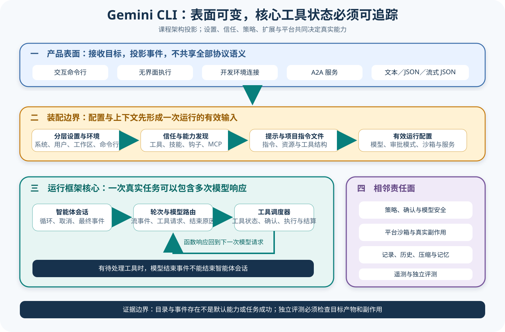

# Gemini CLI 源码课程

[返回学习入口](../../00-start-here.md)

Gemini CLI 用交互表面、Core、Turn、Scheduler（调度器）、工具、Policy、Confirmation 和 Session 接起一条 TypeScript 调用链。模型发出工具请求后，你可以顺着这条链往下追，看 Agent Harness（智能体框架）怎样调度请求、确认权限并交给工具执行，再怎样把结果送入下一轮。阅读时不用急着记住每个类型，先盯紧一条请求携带的数据，看它如何从配置和上下文出发，经过模型路由与事件流变成需要授权的工具调用，最后带着执行结果写回历史。只要数据仍在链上流动，后面遇到 Registry、Hook 或 A2A，即使一时不熟，也能把它们放回正确的位置。



## 这条课程适合谁

如果你已经理解最小 Agent Loop（智能体循环），想继续弄清调度器怎样接住请求、系统又在何处询问用户，就适合从这条路线往下读。两代实现不能混。课程会把旧 Agent Session 与新的 Turn/Scheduler 路径分开讲，免得你把它们硬接成一条源码里并不存在的主链。

## 锁定来源

这门课程锁定 Gemini CLI 提交 `5411f113cafae26161b4969b0237b8e1e024e2c2`，正文里的路径、类型和测试因此都能放在同一个版本里核对。Gemini CLI 还在演进，如果把当前主链与不同版本的 Legacy Agent 证据接在一起，你很容易拼出一条源码从未实现过的调用链。遇到课程描述和本地新版不一致时，先回到这个提交确认差异，再判断是版本变了，还是自己读错了：

- [Turn 实现](https://github.com/google-gemini/gemini-cli/blob/5411f113cafae26161b4969b0237b8e1e024e2c2/packages/core/src/core/turn.ts)
- [Scheduler 实现](https://github.com/google-gemini/gemini-cli/blob/5411f113cafae26161b4969b0237b8e1e024e2c2/packages/core/src/scheduler/scheduler.ts)
- [Legacy Agent Session](https://github.com/google-gemini/gemini-cli/blob/5411f113cafae26161b4969b0237b8e1e024e2c2/packages/core/src/agent/legacy-agent-session.ts)
- [Legacy Agent Session 测试](https://github.com/google-gemini/gemini-cli/blob/5411f113cafae26161b4969b0237b8e1e024e2c2/packages/core/src/agent/legacy-agent-session.test.ts)

## 先看一项任务

用户输入进入 Core 后会形成 Turn，模型流随后可能吐出文本、工具请求或错误。模型一旦发出工具请求，Scheduler 就会接过去，等 Policy 与 Confirmation 作出判断后再调用具体工具，执行结果则写回会话，并进入后续模型输入。

```text
CLI 输入
  → Core / Turn
  → Gemini 请求与流
  → Scheduler
  → Policy / Confirmation
  → Tool 执行
  → Session 历史与下一轮
```


课程会分别标出哪些证据属于当前 Turn/Scheduler 主链，哪些来自 Legacy Agent Session。先确认它走的是哪条路径。这样读到不同实现时，你就不会把两个时期的对象硬拼成一套源码里不存在的流程。

## 仓库地图

| 区域 | 首轮关注点 |
| --- | --- |
| `packages/cli` | 用户输入和 Core 的连接 |
| `packages/core/src/core` | Turn、模型流和主要状态 |
| `packages/core/src/scheduler` | 工具调度、完成和取消 |
| Tools 相关目录 | 工具声明、调用和结果类型 |
| Policy、Safety、Confirmation | 请求怎样获得允许或用户确认 |
| Session 与压缩相关目录 | 历史怎样保存和缩短 |
| Hooks、Agents、Skills、MCP | 核心之外的扩展接缝 |

第一次读时，可以先放下终端渲染、主题、认证提供商和所有遥测导出，这些分支固然重要，但你还没看清主链就钻进去，只会被细节带跑。先把一次 Turn 走完。

## 三层读法

- **Starter**：读前三篇，认识 Turn、模型流、Scheduler 和工具结果回填。
- **Builder**：继续追踪 Policy、Confirmation、Session、压缩与扩展介入点。
- **Maintainer**：核对新旧路径、取消与错误事件，并判断 Telemetry 能支持哪些结论。

## 阅读顺序

1. [配置、Prompt 与 Context](01-config-prompt-context.md) 先从 Settings 的信任过滤与合并开始，追到系统指令、首条用户上下文和活动工具；它们共同形成模型请求；这为下一篇进入 Turn 备齐输入。
2. [Turn、Scheduler 与路由](02-turn-scheduler-routing.md) 接住已经成形的请求，区分 Model Router 的模型决定、Turn 的流式事件和 Scheduler 的调用状态，再把问题推进到每个工具请求如何完成。
3. [工具生命周期](03-tools-lifecycle.md) 沿 Scheduler 展开 Registry、活动工具、Invocation 与 Executor，辨清工具协议成功与任务完成的区别之后，下一步自然要核对执行是否获得授权。
4. [Confirmation、Policy、Safety 与 Sandbox](04-confirmation-policy-safety-sandbox.md) 四条边界的位置不同。顺着工具执行前的授权问题，分开 Policy Decision、用户确认、模型 Safety 与平台 Sandbox，然后才能讨论这些结果如何进入 Session。
5. [Session、历史、压缩与 Memory](05-session-history-compression-memory.md) 接住工具结果和后续请求，划清运行时历史、模型投影、JSONL 记录、Compression 与跨会话 Memory，为扩展机制介入 Context 留出边界。
6. [Agents、Hooks、Skills 与 MCP](06-agents-hooks-skills-mcp.md) 从这些边界继续追踪 Extension 如何刷新多个 Registry，以及 Hook、Skill、MCP 和 Agent 各自怎样进入运行时，随后再看不同表面如何投影同一运行。
7. [CLI、输出与协议表面](07-surfaces-output-protocol.md) 把 Core Events 投影到交互 CLI、非交互格式、IDE 与 A2A，明确各表面的事件和停止语义后，最后才有条件判断 Telemetry 能解释什么。
8. [Telemetry、错误与 Eval 接缝](08-telemetry-errors-eval-design.md) 汇合前面各层留下的路由、确认、工具与输出证据，区分运行观测和独立评分，完成从执行链到 Eval Artifact 的复盘。

## 用贯穿任务复盘

复盘时从 CLI 输入起步，先看 Config 和 Prompt 怎样拼出 Turn，再跟着模型流里的 Tool Call 进入 Scheduler，找出 Policy 与 Confirmation 在哪里插手，然后看 Tool Result 怎样写回 Session，以及压缩或 Memory 会如何改变后续 Context。把这条链走完以后，再分别列清 Tool Success、Turn 结束和任务通过各要什么证据，这三种「完成」就不会混在一起。

引用 Legacy Agent Session 时，必须说明它走的是另一条可以单独核对的路径，否则读者会误以为新旧对象同时存在于一条运行链上。不要悄悄把它接进当前 Turn/Scheduler 主链。

## 完成课程后应该能回答

- Turn 消费模型流时维护了什么状态；
- Scheduler 怎样接收工具请求并等待结果；
- Policy、Confirmation 和执行环境的判断顺序；
- Session 历史怎样进入下一轮或压缩；
- Hooks、Skills 与 MCP 能改变哪些阶段；
- 新旧 Agent 路径的证据应如何分开。

[从第一篇开始：配置、Prompt 与 Context](01-config-prompt-context.md)
