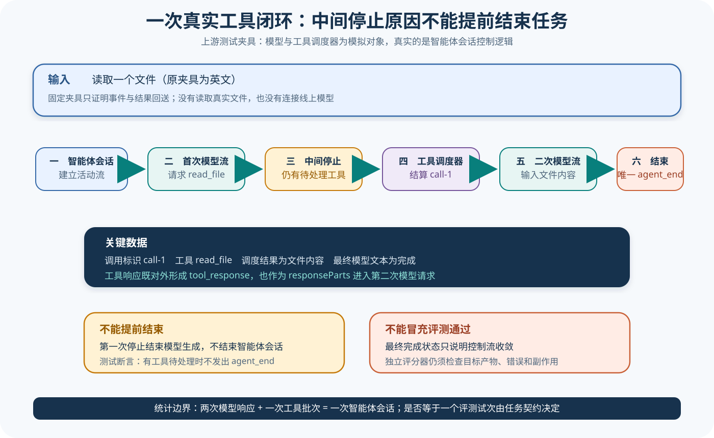

# Gemini CLI 源码课程

[返回学习入口](../../00-start-here.md)

Gemini CLI 把交互表面、Core、Turn、Scheduler、工具、Policy、Confirmation 和 Session 组织成一条可追踪的 TypeScript 调用链。它很适合观察「模型产生工具请求后，Harness 如何调度、确认、执行并继续下一轮」。


## 这条课程适合谁

如果你已经理解最小 Agent Loop，想继续阅读调度和确认机制，可以选择这条路线。文章会把旧 Agent Session 与新的 Turn/Scheduler 路径分开，避免把不同代际实现拼成一条不存在的主链。

## 锁定来源

课程基于 Gemini CLI 提交 `5411f113cafae26161b4969b0237b8e1e024e2c2`：

- [Turn 实现](https://github.com/google-gemini/gemini-cli/blob/5411f113cafae26161b4969b0237b8e1e024e2c2/packages/core/src/core/turn.ts)
- [Scheduler 实现](https://github.com/google-gemini/gemini-cli/blob/5411f113cafae26161b4969b0237b8e1e024e2c2/packages/core/src/scheduler/scheduler.ts)
- [Legacy Agent Session](https://github.com/google-gemini/gemini-cli/blob/5411f113cafae26161b4969b0237b8e1e024e2c2/packages/core/src/agent/legacy-agent-session.ts)
- [Legacy Agent Session 测试](https://github.com/google-gemini/gemini-cli/blob/5411f113cafae26161b4969b0237b8e1e024e2c2/packages/core/src/agent/legacy-agent-session.test.ts)

## 先看一项任务

用户输入进入 Core 后形成 Turn。模型流可能产生文本、工具请求或错误；工具请求交给 Scheduler，经过 Policy 与 Confirmation 后进入工具实现，结果再回到会话和后续模型输入。

```text
CLI 输入
  → Core / Turn
  → Gemini 请求与流
  → Scheduler
  → Policy / Confirmation
  → Tool 执行
  → Session 历史与下一轮
```



课程会分别标注当前 Turn/Scheduler 主链与 Legacy Agent Session 证据，避免把两个时期的对象拼成一条不存在的流程。

## 仓库地图

| 区域 | 首轮关注点 |
| --- | --- |
| `packages/cli` | 用户输入和 Core 的连接 |
| `packages/core/src/core` | Turn、模型流和主要状态 |
| `packages/core/src/scheduler` | 工具调度、完成和取消 |
| Tools 相关目录 | 工具声明、调用和结果类型 |
| Policy、Safety、Confirmation | 请求怎样获得允许或用户确认 |
| Session 与压缩相关目录 | 历史怎样保存和缩短 |
| Hooks、Agents、Skills、MCP | 核心之外的扩展接缝 |

首次阅读不必追踪终端渲染、主题、认证提供商和所有遥测导出。

## 三层读法

- **Starter**：读前三篇，认识 Turn、模型流、Scheduler 和工具结果回填。
- **Builder**：继续追踪 Policy、Confirmation、Session、压缩与扩展介入点。
- **Maintainer**：核对新旧路径、取消与错误事件，并判断 Telemetry 能支持哪些结论。

## 阅读顺序

1. [配置、Prompt 与 Context](01-config-prompt-context.md)
2. [Turn、Scheduler 与路由](02-turn-scheduler-routing.md)
3. [工具生命周期](03-tools-lifecycle.md)
4. [Confirmation、Policy、Safety 与 Sandbox](04-confirmation-policy-safety-sandbox.md)
5. [Session、历史、压缩与 Memory](05-session-history-compression-memory.md)
6. [Agents、Hooks、Skills 与 MCP](06-agents-hooks-skills-mcp.md)
7. [CLI、输出与协议表面](07-surfaces-output-protocol.md)
8. [Telemetry、错误与 Eval 接缝](08-telemetry-errors-eval-design.md)

## 用贯穿任务复盘

从 CLI 输入开始，说明 Config/Prompt 怎样形成 Turn，模型流里的 Tool Call 怎样进入 Scheduler，Policy 与 Confirmation 何时介入，Tool Result 怎样回到 Session，压缩或 Memory 如何改变后续 Context。最后分别写出 Tool Success、Turn 结束和任务通过需要什么证据。

若引用 Legacy Agent Session，必须明确这是另一条可核对路径，不能把它的对象无说明地接进当前 Turn/Scheduler 主链。

## 完成课程后应该能回答

- Turn 消费模型流时维护了什么状态；
- Scheduler 怎样接收工具请求并等待结果；
- Policy、Confirmation 和执行环境的判断顺序；
- Session 历史怎样进入下一轮或压缩；
- Hooks、Skills 与 MCP 能改变哪些阶段；
- 新旧 Agent 路径的证据应如何分开。

[从第一篇开始：配置、Prompt 与 Context](01-config-prompt-context.md)
