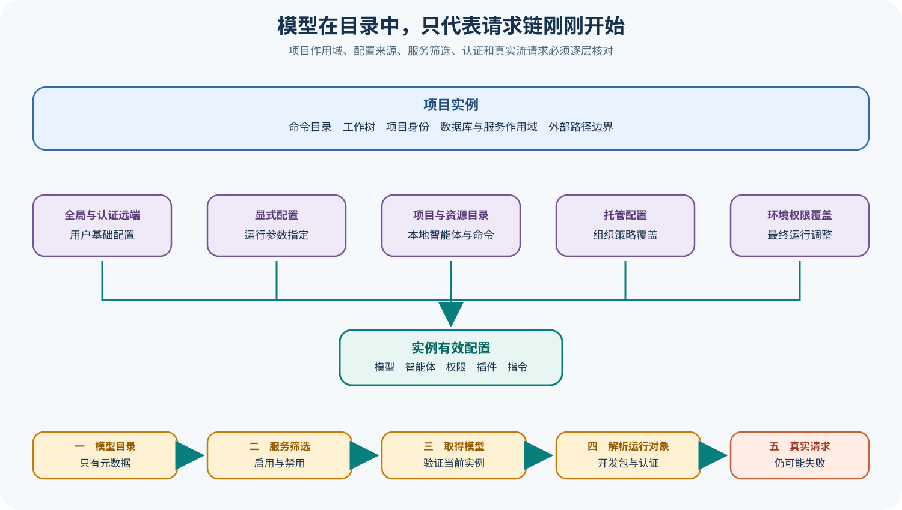

# OpenCode 入口、项目、配置与模型服务

## 读者会得到什么

本篇从进程入口追到可以创建模型请求之前，解释 OpenCode 怎样确定「在哪个项目、用哪份配置、以哪个 Agent、调用哪个 Provider/Model」。这几步共同构成运行实例，却不能缩写成一条模型名。

CLI 解析命令后会把目录交给 Project/Instance 层。Instance Context 至少保存 `directory`、`worktree` 和 Project 信息；兼容 Promise/异步局部存储的桥接入口最终仍委托 Instance Store。外部目录判断也依赖这个 Context：文件在当前目录或有效 Worktree 内时不触发外部目录权限，非 Git 项目的 `/` Worktree 不能被误用为「所有绝对路径都在项目内」。

Config 是按实例加载的合并结果。锁定源码先读全局配置和显式配置文件，再沿项目到 Worktree 查找本地配置与 `.opencode` 资源，合并 Command、Agent、Plugin 等内容，最后还会处理托管配置、环境权限覆盖和旧 Tool 布尔设置。数组字段与普通字段使用不同合并策略；来源先后会影响最终值，所以文章或 Bug 报告必须保存有效配置及来源，而不能只贴某一个文件。

Provider 层又有三种不同事实：模型可能存在于目录，Provider 可能因认证、环境变量、Plugin 或配置进入当前实例，Language Model 运行对象还要在真正使用时解析 SDK 与 Provider Options。`enabled_providers` 和 `disabled_providers` 会筛选当前实例；`getModel()` 会拒绝未加载 Provider 或不存在模型；`getLanguage()` 才解析 SDK 和具体模型运行对象。目录命中只是请求链第一步。

## 核心概念

OpenCode 的 Instance 是项目作用域容器。它绑定当前 `directory`、有效 `worktree` 与 Project 身份，让配置缓存、Provider、数据库和文件边界围绕同一上下文解析。一个进程可以接触多个目录，但任何依赖项目状态的操作都应在正确 Instance 中执行；否则全局缓存或异步任务可能读取到另一项目的配置。

Effective Config 是多来源归约结果。全局文件、显式配置、目录层级、`.opencode` 资源、托管配置与环境覆盖按既定顺序进入合并，数组和对象具有不同策略。它并非某个 `opencode.json` 的别名。复现问题时必须保存最终字段与来源，尤其是 Agent、Plugin、Instructions 和 Permission 等会改变运行表面的内容。

模型目录、加载的 Provider 和 Language Model Runtime 是三级状态。目录回答「有哪些元数据」，Provider Map 回答「当前实例装入哪些服务」，`getLanguage()` 才回答「能否用 SDK、认证和选项构造运行对象」。真实 Stream 还会经历网络、区域、配额和服务错误，因此运行时可用性不能由前两级推断。

| 概念 | 主要责任 | 形成条件 | 常见误判 |
| --- | --- | --- | --- |
| Directory | 当前命令处理的目录 | CLI 参数或调用方传入 | 等同仓库根目录 |
| Worktree | Project 识别出的有效工作树 | Git/项目发现完成 | 非 Git `/` 覆盖所有路径 |
| Instance Context | 绑定 Directory、Worktree 与 Project | 进入实例作用域 | 全进程只有一个项目 |
| Config Source | 提供部分配置与资源 | 文件、托管或环境存在 | 单个文件就是有效配置 |
| Effective Config | 合并后供当前实例消费的配置 | 所有来源按规则归约 | 所有字段都是后者覆盖前者 |
| Model Catalog | 保存模型与能力元数据 | 目录加载或缓存可见 | 账户已获调用权限 |
| Provider Map | 当前实例已加载的服务集合 | 筛选、认证、Plugin 和配置满足 | 任意目录模型都可用 |
| Language Runtime | SDK 模型、Header、Key 与选项 | `getLanguage()` 成功 | Stream 一定成功 |

## 为什么这样设计

以 Instance 隔离项目状态，可以让 Server 或长寿命进程同时服务多个目录，并让配置、数据库和文件判断复用同一作用域。若所有状态放在进程全局，异步请求容易串项目；若每个函数重复传递全部参数，调用链又会变得脆弱。实例上下文在二者之间提供明确边界，同时要求正确处理进入、退出与 Dispose。

分层配置满足个人默认、项目约定、组织托管与临时覆盖的不同治理需求。数组拼接适合 Instructions 和 Plugin 扩展，标量覆盖适合模型等单值选择，Permission 又需要保留有序规则。统一用浅覆盖会丢失语义，因此 OpenCode 采用字段感知的合并流程；代价是调试必须观察 Provenance。

目录与 Provider Runtime 分离，允许 UI 在无凭据时展示模型信息，也允许 Plugin 或企业配置动态增加服务。模型元数据可缓存，认证和 SDK 则按实例、环境与请求解析。这样的懒加载减少启动成本，却把失败点分散到 getModel、getLanguage 和 Stream，课程需要逐层验证。

启用与禁用筛选提供组织和用户控制，但黑白名单只约束 Provider 是否进入 Map，不验证端点健康。把筛选结果、认证来源和真实请求分别记录，才能区分配置拒绝、运行时装载失败与远端服务故障。

## 实现思路

课程化实现可以构造一个 Instance Snapshot，把项目身份、配置来源和 Provider 阶段同时保存。下面类型用于说明分析数据，不是 OpenCode 上游的同名结构。敏感认证只记录来源类别与哈希，不保存正文。

Snapshot 的路径字段应做可移植化处理，只保留相对项目位置或路径类别；公开 Artifact 不泄露用户目录。与此同时，内部复现实验仍要保留可映射的真实 Worktree 身份，否则同名项目和多个 Worktree 会被错误合并。

```ts
interface InstanceSnapshot {
  directory: string;
  worktree: string;
  projectId: string;
  configSources: Array<{ kind: string; pathClass: string; digest: string }>;
  effectiveConfigDigest: string;
  providers: Array<{ id: string; loadReason: string; authClass: string }>;
  requestedModel?: string;
}
```

1. 规范化 CLI 传入目录，识别 Project 与 Worktree。非 Git 目录的特殊 Worktree 值不得让外部路径检查放宽到整个文件系统。
2. 进入 Instance Context 后再初始化配置、数据库与 Provider。异步子任务必须携带或恢复正确实例，退出时按生命周期 Dispose。
3. 按真实顺序加载全局、显式、目录、`.opencode`、托管和环境来源。为每个来源保存摘要，解析失败与认证失败形成诊断。
4. 使用字段感知合并：标量覆盖、数组去重拼接、Agent/Command/Plugin 保留来源，Permission 保留最终有序规则。
5. 从模型目录、内建加载器、Plugin、Auth、环境和配置构建 Provider Map，再应用 enabled/disabled 筛选及模型 disabled 标记。
6. `getModel()` 只在当前 Provider Map 中查询，失败标成 catalog/provider 阶段；不要自动改用同名模型或其他 Provider。
7. `getLanguage()` 解析 SDK、Base URL、Header、认证和模型选项，生成无密钥 Runtime 摘要。SDK 导入或模型构造失败属于 language 阶段。
8. 用本地测试 Provider发起确定性 Stream，再在显式授权下测试真实 Provider。保存区域、响应模型、原始错误和时间，不能用目录命中代替健康证据。

每次 Reload 后生成新 Snapshot Revision。旧 Session 若继续使用旧 Provider 或配置，要明确标注；若强制切换，也要记录迁移点。文件时间变化本身不能证明缓存已经刷新。

实例缓存还要定义失效源。配置文件变化、认证更新、Plugin 安装和托管策略刷新可能分别影响不同组件；单纯重读一个 JSON 文件不足以重建 Provider SDK 或资源目录。测试应逐项触发变化，比较新旧 Revision 的 Effective Config、Provider Map 和实际请求路由。

## 贯穿案例

假设用户在子目录启动 OpenCode，请求 `anthropic/claude-sonnet-4-6`。项目配置允许 Anthropic，全局配置禁用它，托管配置又限定 Provider 白名单；环境里没有认证。界面模型目录仍能显示该模型，运行请求却必须失败。这个案例用来区分来源优先级、Provider 筛选和认证阶段。

实验同时创建第二个 Worktree，并在其中放置不同项目配置。两个 Instance 使用相同模型 ID，却应得到不同 Effective Config 和 Provider Map；任何跨实例缓存命中都应被测试捕获。这一步证明 Instance Context 不是纯日志标签，而是配置与运行时状态的实际作用域。

输入快照如下：

```json
{
  "directory":"repo/packages/app",
  "sources":[
    {"kind":"global","disabled_providers":["anthropic"]},
    {"kind":"project","enabled_providers":["anthropic"]},
    {"kind":"managed","enabled_providers":["openai","anthropic"]}
  ],
  "requestedModel":"anthropic/claude-sonnet-4-6",
  "auth":"missing"
}
```

1. Project 发现把 Directory 绑定到仓库 Worktree，外部路径判断以这两个边界为准。若在非 Git 临时目录运行，测试额外确认 `/etc` 或其他外部路径不会因 Worktree 占位值而被视为内部。
2. Config Loader 按锁定顺序合并来源，输出最终 enabled/disabled 集合及 Provenance。审查者不从项目文件单独猜最终动作。
3. Provider 初始化应用筛选。如果 Anthropic 被最终 disabled 规则排除，`getModel()` 即使能在目录看到元数据，也返回当前实例不可用；流程不进入认证。
4. 调整配置让 Provider 进入 Map 后再次调用，`getModel()` 可成功；`getLanguage()` 因认证缺失或 SDK 问题失败，说明前一阶段成功未越过运行时条件。
5. 换成本地假 Provider，验证实例、模型与 Stream 连接。该结果只证明装配路径，不证明 Anthropic 真实服务可用。
6. 在获得真实凭据授权后才做线上探针，并将认证来源、区域和响应错误作为受控 Artifact；不提交密钥。

最终状态记录把每层分开：

```json
{
  "project":"resolved",
  "effectiveConfig":"captured-with-provenance",
  "catalog":"model-present",
  "provider":"loaded-after-config-change",
  "language":"failed-missing-auth",
  "stream":"not-attempted",
  "taskVerdict":"unavailable"
}
```

这个案例还揭示缓存问题：修改配置后若 Instance 未 Reload，旧 Provider Map 可能继续生效。验证必须比较 Revision 并显式 Dispose/Reload，不能看到文件已保存就宣称配置更新。项目身份、有效配置、Provider 装载和真实请求共同构成可复现运行环境。

再加入远端配置失败变体：托管来源返回无法解析内容时，系统应留下来源错误和最终降级行为。若继续使用本地配置，Snapshot 标为 degraded；若拒绝启动，则标为 blocked。两种策略都比静默忽略更可审计，也不能由一次本地 Provider 成功掩盖。

最后检查模型元数据漂移。目录中的 Context Limit 或 Tool 能力改变后，旧 Session 可能仍保留先前假设；真实请求返回的响应模型也可能不同。课程把目录版本、请求模型和响应模型分别保存，比较时按同一 Revision 配对，而不是把相同显示名称视为相同运行条件。

至此，模型可见、实例装载、运行对象可构造和远端请求成功拥有四个独立状态，排错与复现均以这四栏为准。

## 真实输入与输出

### 输入

```json
{
  "directory":"示例仓库",
  "config_sources":["全局配置","显式配置","项目配置","托管配置","环境覆盖"],
  "agent":"build",
  "requested_model":"anthropic/claude-sonnet-4-6"
}
```

### 输出

```json
{
  "instance":{"directory":"示例仓库","worktree":"仓库根","project":"已识别"},
  "effective_config":{"model":"anthropic/claude-sonnet-4-6","permission":"合并后规则"},
  "provider_state":{"catalog":"可能存在","loaded":"需满足筛选和认证","language":"延迟解析"}
}
```

## 调用链



Claim: opencode.config.layers-build-instance

Claim: opencode.provider.catalog-is-not-runtime-availability

1. CLI 解析命令和目录，创建或复用 Project Instance。
2. Instance Context 固定 Directory、Worktree 和 Project，并为配置、数据库、文件边界提供作用域。
3. Config 依次合并全局、认证远端、显式文件、项目层级、资源目录、Console/托管配置和环境权限覆盖。
4. Agent 与 Command Markdown 被装入最终配置；Plugin 来源还需保留全局或本地 Provenance。
5. Provider 初始化从模型目录、内建加载器、Plugin、Auth、环境变量和配置构建当前实例的 Provider Map。
6. 启用/禁用筛选先移除不允许的 Provider，模型自身的 `disabled` 标记还会再过滤目录。
7. `getModel()` 验证当前 Provider 与模型；`getLanguage()` 解析 SDK、Base URL、Header、Key 和模型选项。
8. 真正 Stream 时仍可能遇到认证、网络、区域、Header Timeout、SSE Timeout、配额或 Provider Response Error。

## 源码证据

配置加载以 `merge()` 把来源合并进实例结果，并分别处理全局和本地范围：

```source
packages/opencode/src/config/config.ts:351-429
const merge = (source: string, next: Info, kind?: ConfigPlugin.Scope) => {
  result = mergeConfigConcatArrays(result, next)
}
```

托管目录和系统管理偏好在项目资源之后继续合并，环境权限覆盖还会改写最终 Permission。这意味着「项目配置中写了什么」不能单独代表有效配置。

Provider 先应用白名单和黑名单：

```source
packages/opencode/src/provider/provider.ts:1420-1427
if (enabled && !enabled.has(providerID)) return false
if (disabled.has(providerID)) return false
```

`getModel()` 只在当前实例 Provider Map 中查找；目录里存在但 Provider 未加载时仍返回 ModelNotFoundError。`getLanguage()` 随后解析 SDK，并可能因底层 `NoSuchModelError` 再次失败。

```source
packages/opencode/src/provider/provider.ts:1843-1900
const provider = s.providers[providerID]
if (!provider) return yield* new ModelNotFoundError(...)
const sdk = await resolveSDK(model, s, envs)
```

## 失败与限制

第一，配置合并不是简单的「最近文件覆盖一切」。Instructions 等数组会去重拼接，Agent、Command、Permission 和 Plugin 来源有专门逻辑；调试时必须输出字段 Provenance。

第二，远端 Well-known 或 Console 配置可能依赖认证并可能返回错误内容。源码会处理部分重新认证和解析错误，但不能因此宣称远端配置永久可达。

第三，模型目录是元数据，不是健康检查。Release Date、Tool Call 能力或 Context Limit 字段也不证明服务当前开放、账户有权使用或请求语义完全一致。

第四，Provider 已加载仍不等于某个模型可以 Stream。SDK 包导入、配置选项、认证、区域端点、网络和服务端状态均可能失败。

第五，测试使用假配置、临时目录或测试 Key；它们证明合并和错误分支，不证明生产凭据与真实 Provider。

第六，Instance 复用可以减少重复装配，也会让缓存和来源漂移更难观察。配置或认证变化后必须验证 Reload/Dispose 语义，不能假定所有服务自动刷新。

## 验证方法

在临时 Git 仓库建立全局、显式、项目、父目录、`.opencode`、托管和环境覆盖七层配置，为同一字段设置不同标记。读取有效配置与目录清单，验证标量优先级、Instructions 拼接、Permission 顺序和 Plugin Provenance。

Provider 实验准备四类模型：目录存在但 Provider 未加载、Provider 加载但 Model 被禁用、模型可取但认证缺失、完全可用的本地测试 Provider。分别调用 List、GetModel、GetLanguage 和 Stream，记录失败发生在哪一层。

目录边界实验覆盖正常仓库、子目录、Worktree、非 Git 目录和外部路径。确认外部目录权限不会因非 Git 的 `/` Worktree 被绕过。

生产前还需冻结有效配置、Provider/Model ID、SDK 版本、Base URL、Region、认证来源和无密钥的 Header 摘要；真实请求结果与测试 Provider 结果分开保存。

## 自检

### 问题 1

为什么只贴项目里的 `opencode.json` 不能复现有效配置？

**答案：** 全局、显式、目录层级、资源、托管与环境覆盖都会参与合并，数组和权限还有专门语义。

### 问题 2

模型在目录中存在是否意味着能立即调用？

**答案：** 不意味着。还要 Provider 进入当前实例、未被筛除、模型有效、SDK 可解析、认证和网络成功。

### 问题 3

`getModel()` 成功是否等于 Stream 成功？

**答案：** 不等于。它只取得模型信息；`getLanguage()` 与真实 Stream 仍可能在 SDK、认证、端点或服务端失败。

### 问题 4

怎样证明配置变更真正生效？

**答案：** 记录 Instance Reload/Dispose 前后的有效配置与来源，并用本地测试 Provider 发起可观察请求，而不是只检查文件时间。
