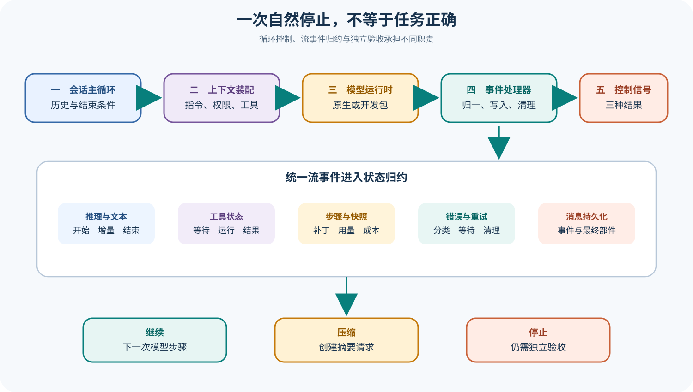

# OpenCode 会话循环、模型流与事件处理器

## 读者会得到什么

本篇解释一条用户消息怎样变成可以持续执行工具的会话，而不是把 OpenCode 简化成一次 `streamText()`。主循环负责读取有效历史、判断上一轮是否真正结束、组装系统指令与工具；LLM 层选择运行后端并发起流请求；Processor 把异构流事件归一成消息部件、工具状态、快照、用量和错误，再向主循环返回继续、压缩或停止。

三个边界必须分开。模型产生 `stop` 只是一种服务结束原因；如果同一助手消息仍有未清理的工具调用，主循环要继续把工具结果送回模型。Processor 返回 `continue` 也不是任务正确，而是当前流未触发阻断或压缩。最终答案是否满足用户目标，必须由产物检查或独立 Evaluator 判定。

这里还有一条容易被忽略的数据边界：会话消息不是模型流的原样转储。流中的 Reasoning、Text 和 Tool 事件会被转换为带标识、时间、父消息和状态的 Part；Step Finish 才把用量、成本与结束原因归档，Snapshot 差异则形成单独 Patch Part。界面订阅到的是这些可持续更新的投影，数据库中最终保存的是处理后的会话事实。调试时应同时保留原始 Provider 事件、Processor 转换结果和最终消息，三者缺一就很难定位错误究竟出在服务、适配还是状态归约。

## 真实输入与输出

### 输入

```json
{"session":"会话标识","user_message":"修复测试失败","history":"压缩过滤后的消息","agent":"build","model":"当前实例模型","tools":["read","edit","bash"]}
```

### 输出

```json
{"assistant_message":{"parts":["推理","文本","工具","补丁"],"finish":"服务结束原因","error":"可选错误"},"loop_outcome":"continue | compact | stop","task_verdict":"尚未由独立评测给出"}
```

## 调用链



Claim: opencode.session.processor-interprets-stream-events

Claim: opencode.session.stop-is-not-task-correctness

1. `runLoop()` 把会话标成忙碌，读取过滤压缩后的消息，并找出最近用户、助手与待办状态。
2. 主循环检查上一助手消息的 Finish Reason 与工具部件；存在有效 Tool Call 时不会仅因 Provider 报 `stop` 就退出。
3. 系统环境、项目指令、MCP 指令、Skills、历史消息、模型、权限和工具被组装为一次 Processor 输入。
4. LLM 层准备 Provider 参数、消息和工具，选择原生运行时或 AI SDK，随后启动统一事件流。
5. Processor 按事件类型维护 Reasoning、Text、Tool、Step、Patch、Token、Cost 和 Snapshot，并把增量发布到会话存储。
6. 工具失败、服务错误、取消和上下文溢出进入不同错误或重试路径；清理逻辑保证未完成部件不会长期伪装成运行中。
7. Processor 根据 `needsCompaction`、Blocked 和 Assistant Error 返回 `compact`、`stop` 或 `continue`。
8. 主循环创建压缩请求、继续下一步或退出；退出后仍只有运行结果，没有任务正确性结论。

## 源码证据

主循环显式保留带工具调用的轮次，即便 Provider 的结束原因不是 `tool-calls`：

```source
packages/opencode/src/session/prompt.ts:1081-1130
while (true) {
  const hasToolCalls = lastAssistantMsg?.parts.some(...)
  if (lastAssistant?.finish && !hasToolCalls) break
}
```

Processor 消费统一流，并把内部状态归约成三个控制信号：

```source
packages/opencode/src/session/processor.ts:630-681
const stream = llm.stream(streamInput)
if (ctx.needsCompaction) return "compact"
if (ctx.blocked || ctx.assistantMessage.error) return "stop"
return "continue"
```

事件分支并非只拼接文本。`tool-call` 会建立 Running 状态并检测重复调用；`tool-result` 规范化附件；`step-finish` 写入 Finish、Token、Cost、Snapshot Patch，并检测是否需要压缩。

```source
packages/opencode/src/session/processor.ts:331-483
case "tool-call": {
  yield* ensureToolCall(value)
}
case "step-finish": {
  ctx.assistantMessage.finish = value.reason
}
```

## 失败与限制

第一，流事件可能缺失、乱序或由 Provider 特殊实现产生。源码会丢弃没有 Start 的部分孤立 Delta，也会修复部分工具名；这属于兼容处理，不是完整协议证明。

第二，自动重试只应恢复传输或明确可重试错误。重试后的成功不能把第一次副作用从轨迹中抹掉，尤其是已经执行一半的 Shell、网络或文件工具。

第三，Context Overflow 可以请求压缩，但摘要会改变下一轮可见信息。Processor 返回 `compact` 表示容量治理，不表示任务取得进展。

第四，Finish Reason 来自模型服务或适配层。`stop`、`length`、`content-filter` 与 `tool-calls` 描述生成结束方式，不描述测试、文件或用户验收结果。

第五，取消与 Permission Reject 会影响循环退出。会话进入 Idle 只能证明这次处理已终止，不能证明所有子进程、副作用或后台任务均已安全结束。

第六，锁定测试使用可控模型流，能够验证事件转换和重试分支，却不能覆盖每个真实 Provider 的边缘事件序列。

## 验证方法

构造一个确定性模型流，依次发出 Text、Tool Call、Tool Result、Step Finish 和 Finish。订阅会话事件并读取持久化消息，核对增量顺序、部件最终状态、Token、Cost、Patch 与 Processor 返回值。

再注入四种故障：未知 JSON 错误、可重试限流、上下文溢出、用户取消。记录每次 Attempt 的流事件、工具副作用、重试等待与最终错误；不能只保留最后一次成功响应。

最后让模型返回普通 `stop`，但同时留下一个有效工具调用。验证主循环继续把结果送回模型。另设一个内容正确性错误的案例：模型自然停止但修改了错误文件，确认独立检查仍判失败。

## 自检

### 问题 1

为什么 `streamText()` 不是完整 Agent Loop？

**答案：** 它只负责一次模型流；历史投影、工具状态、权限、副作用、压缩、重试和跨轮退出由外层会话与 Processor 负责。

### 问题 2

Provider 返回 `stop` 时一定退出吗？

**答案：** 不一定。若助手消息仍含有效工具调用，主循环需要继续，把工具结果送回模型。

### 问题 3

Processor 返回 `continue` 证明任务有进展吗？

**答案：** 不证明。它只表示当前流没有要求压缩、阻断或带错误停止。

### 问题 4

怎样验证重试没有掩盖副作用？

**答案：** 以 Attempt 为单位保存事件和工具执行记录，为副作用设置幂等键，并让最终 Evaluator 检查真实产物。
