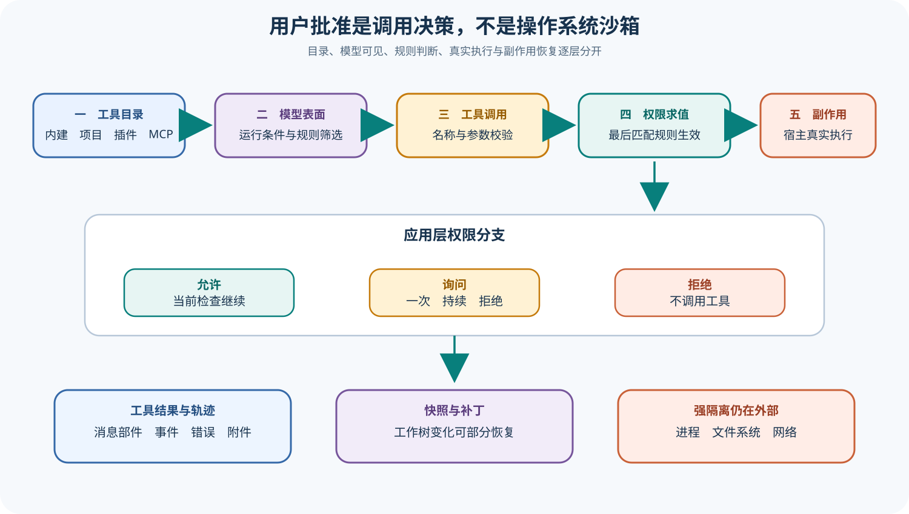

# OpenCode 工具注册、权限询问与副作用边界

## 读者会得到什么

本篇追踪工具从注册到执行的完整决策链。内建工具、自定义文件、Plugin 和 MCP 可以进入工具目录；Provider、模型、Feature Flag、Agent 与 Permission Ruleset 再决定模型实际看到的定义。模型选择工具后，参数校验、权限规则、用户答复、外部目录检查和真实执行仍是后续阶段。目录中存在一个工具，既不等于模型可见，也不等于它可无条件执行。

权限系统使用有序规则，最后一个同时匹配 Permission 与 Pattern 的规则生效；没有匹配时默认 `ask`。`allow` 让当前检查继续，`deny` 直接返回拒绝错误，`ask` 则发布待答事件并等待一次或持续批准。这个机制约束 OpenCode 是否调用能力，却没有创建容器、操作系统用户、网络命名空间或内核沙箱。因此「询问过用户」与「进程被强隔离」不能混为一谈。

Question Tool 又是另一类人机交互：它允许模型向用户提出结构化问题，不应与 Permission Prompt 混写。Snapshot/Patch 可以记录和部分恢复工作树变化，但它不是所有工具副作用的事务回滚；网络请求、外部数据库、Shell 子进程和项目外写入仍需各自的隔离与幂等策略。

审计工具调用时还要保存「模型看到的 Schema」。Registry 中的原始定义可能被 Plugin Hook 改写，Edit、Write 与 Apply Patch 也会随模型切换。仅凭最终 Tool Part 无法判断模型当时有哪些选择、参数约束是否一致；可复现实验应冻结目录、筛选条件、最终 Schema、Ruleset 和用户答复事件。

## 真实输入与输出

### 输入

```json
{"tool_catalog":["内建","项目自定义","插件","MCP"],"model":"当前模型","call":{"name":"bash","args":{"command":"执行命令"}},"rules":["allow","ask","deny"],"user_reply":"once | always | reject"}
```

### 输出

```json
{"model_visible":"经过筛选的工具定义","decision":"允许 | 询问 | 拒绝","execution":"成功、错误或未执行","record":"工具部件、事件、快照补丁","os_isolation":"未由应用层权限自动提供"}
```

## 调用链



Claim: opencode.tools.registry-is-model-surface

Claim: opencode.permission.ask-is-not-os-sandbox

1. Tool Registry 汇总内建定义、项目工具文件、Plugin 工具和可用 MCP 工具。
2. 当前客户端、Feature Flag、Provider/Model 与 Agent 规则筛选工具；Definition Hook 还可改写描述和 Schema。
3. 处理器把可见工具定义交给模型，模型返回 Tool Call 后进行名称与参数归一。
4. 工具实现通过 `ask()` 提交 Permission、Pattern、Metadata 与可持续允许项。
5. Permission 按顺序寻找最后一个匹配规则；`deny` 失败，`allow` 继续，`ask` 发布事件并挂起当前 Effect。
6. 用户回复 `once` 只完成当前请求，`always` 把允许 Pattern 加入实例批准列表，并可释放同会话中匹配的待答请求。
7. 工具在宿主环境执行，把输出、附件、截断信息、错误与时间写回 Tool Part。
8. Snapshot 记录工作树差异供补丁展示或恢复；独立验收检查真实文件和测试，外部副作用另行核对。

## 源码证据

工具目录把内建与自定义定义合并，但传给模型前仍会按模型和运行特性过滤：

```source
packages/opencode/src/tool/registry.ts:256-339
const filtered = (yield* all()).filter((tool) => {
  if (tool.id === ApplyPatchTool.id) return usePatch
})
```

权限求值采用最后匹配规则，空集合或无匹配回退到询问：

```source
packages/opencode/src/permission/index.ts:28-38
.findLast((rule) => Wildcard.match(permission, rule.permission) && Wildcard.match(pattern, rule.pattern)) ?? {
  action: "ask"
}
```

运行时不会把 `ask` 当作隐式允许。它发布请求并等待 Deferred；`always` 才把选定 Pattern 放入当前实例批准列表。

```source
packages/opencode/src/permission/index.ts:67-105
if (rule.action === "deny") return yield* new PermissionV1.DeniedError(...)
yield* events.publish(Event.Asked, info)
return yield* Deferred.await(deferred)
```

## 失败与限制

第一，工具可见性不是权限执行结果。某工具对模型隐藏可以降低误调用概率，但 Plugin、Hook、Code Mode 或配置变化会改变表面；必须冻结有效目录和 Ruleset。

第二，规则是顺序敏感的。更宽的通配规则若放在后面，可以覆盖更具体的拒绝项。审计不能只检查「是否写过 deny」，还要按真实合并顺序计算最终动作。

第三，`always` 是实例内批准规则，不是跨平台强制访问控制。工具内部若绕过约定的 `ask()`，应用层规则无法替代操作系统能力限制。

第四，External Directory Permission 约束被正确实现的工具访问项目外路径；它不自动阻止任意 Shell 命令、子进程、符号链接竞态或已授权工具自身的漏洞。

第五，Snapshot 主要覆盖工作树文件。它无法撤销已经发送的网络请求、数据库写入、包发布、外部目录删除或后台进程。

第六，用户批准证明的是某次界面答复，不证明用户理解全部展开命令，也不证明实际执行内容与展示摘要完全相同。高风险操作还需固定参数、最小权限和执行后取证。

## 验证方法

建立包含内建、自定义、Plugin 与 MCP 工具的测试实例，切换模型、Code Mode、Question Tool Flag 和 Agent Permission。保存 `registry.ids()` 与真正交给模型的 Tool Schema，验证目录和模型表面没有被混写。

对同一 Bash Pattern 依次排列 `allow -> deny` 与 `deny -> allow`，确认最后匹配规则生效；再测试空 Ruleset、未知 Permission、`once`、`always`、Reject 和多个并发待答请求。

副作用实验使用临时仓库、项目外临时目录和受控本地 HTTP 服务。分别执行文件编辑、Shell 外部写入和网络请求，再调用 Snapshot Restore；记录哪些变化被恢复、哪些仍存在。若需要强隔离，应在容器、受限账户或专用沙箱中重复，而不是把 Permission Prompt 当作隔离证据。

## 自检

### 问题 1

工具出现在 Registry 中就会交给模型吗？

**答案：** 不会。模型、Provider、Feature Flag、Agent、Permission 和 Code Mode 还会改变最终可见表面。

### 问题 2

没有匹配权限规则时会怎样？

**答案：** 默认动作是 `ask`，系统发布待答事件并等待用户答复。

### 问题 3

Permission `allow` 是否等同于操作系统沙箱放行？

**答案：** 不等同。它只是应用层调用决策，本身不创建进程、文件系统或网络隔离。

### 问题 4

Snapshot Restore 能否撤销所有工具副作用？

**答案：** 不能。它主要面向工作树文件，网络、数据库、外部路径和后台进程要单独治理。
