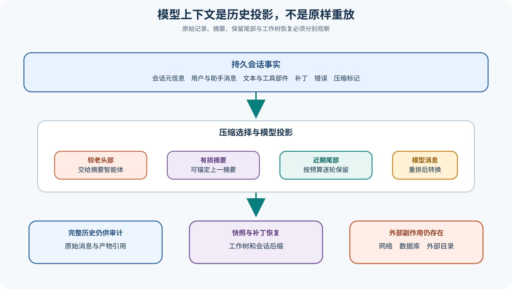

# OpenCode 会话存储、历史投影、压缩与恢复

## 读者会得到什么

本篇区分四份经常被统称为「历史」的数据：数据库中的 Session/Message/Part 记录、按时间读取的完整会话流、经过压缩筛选后交给主循环的有效历史，以及最终转换成 Provider Model Messages 的请求上下文。它们服务于审计、界面、控制和推理等不同目的，顺序与内容不保证相同。

压缩不是删除整个旧会话。OpenCode 可以选择近期 Turn 作为保留尾部，把较老头部交给专用 Compaction Agent 生成 Summary，再用 Compaction Marker、Summary 与 Retained Tail 重建模型上下文。工具输出 Prune 又是另一条路径：达到阈值后标记较早、非保护工具结果为 Compacted，以减少后续上下文负担。原始消息记录、模型所见投影与摘要必须分别观察。

Revert 同时涉及会话逻辑位置和工作树 Snapshot。它定位目标 Message/Part，收集后续 Patch，恢复或反向应用文件变化，保存 Revert State 与 Diff；Cleanup 才移除目标之后的消息或部件。Unrevert 可以从保存的 Snapshot 恢复，但这仍不覆盖网络、数据库、项目外文件或后台进程等非工作树副作用。

## 真实输入与输出

### 输入

```json
{"stored_history":"消息与部件流","context_budget":"模型窗口与保留预算","compaction":{"tail_turns":2,"prune":true},"revert_target":"消息或部件标识"}
```

### 输出

```json
{"model_projection":["压缩标记","摘要","保留尾部","后续消息"],"storage":"仍可审计的会话记录","revert":{"snapshot":"工作树锚点","diff":"文件差异"},"external_side_effects":"不保证恢复"}
```

## 调用链



Claim: opencode.history.model-messages-are-derived

Claim: opencode.compaction.summary-is-not-lossless-history

1. Session Service 持久化会话元信息，Message 与 Part 保存用户、助手、文本、工具、补丁、压缩和错误状态。
2. 会话读取形成完整消息流；`filterCompacted()` 从已完成摘要寻找 Compaction Marker 与 Tail Start。
3. 为模型消费时，函数可重排成 Compaction User、Summary Assistant、Retained Tail 与 Continue User，而不是简单按数组位置取最新。
4. `toModelMessagesEffect()` 再把内部 Part 转成 Provider 消息，截断或替换不适合直接发送的内容。
5. 达到上下文阈值时，Compaction Selector 按 Token Budget 和 Tail Turns 划分 Head 与 Tail，必要时在一个 Turn 内寻找可保留起点。
6. Compaction Agent 只总结 Head，并可锚定 Previous Summary；成功后主循环使用摘要与近期尾部继续。
7. Prune 扫描较早工具结果，跳过保护工具和近期 Turn，达到阈值才标记 Compacted。
8. Revert 以 Snapshot 和 Patch 恢复工作树并保存逻辑截断点；Cleanup 才清理后缀消息，独立审计仍要检查外部副作用。

## 源码证据

有效历史会发生有意重排，源码也明确警告数组位置不再等于时间顺序：

```source
packages/opencode/src/session/message-v2.ts:521-598
return [
  ...result.slice(compactionIndex, summaryIndex + 1),
  ...result.slice(tailIndex, compactionIndex),
]
```

压缩选择按近期预算从后往前保留 Turn，而不是固定删除多少条消息：

```source
packages/opencode/src/session/compaction.ts:223-263
const budget = preserveRecentBudget({ cfg: input.cfg, model: input.model })
if (total + size <= budget) keep = { start: turn.start, id: turn.id }
```

Revert 恢复 Snapshot、反向应用后续 Patch，并把 Revert Point 与 Diff 写回 Session；Cleanup 再清理消息后缀。

```source
packages/opencode/src/session/revert.ts:38-126
rev.snapshot = session.revert?.snapshot ?? (yield* snap.track())
yield* snap.revert(patches)
yield* sessions.setRevert({ sessionID: input.sessionID, revert: rev, summary: ... })
```

## 失败与限制

第一，Summary 是模型生成的有损表示。未解决约束、失败尝试、精确参数或细小文件语义可能被遗漏；Previous Summary 锚定能改善连续性，但不能恢复丢失事实。

第二，Retained Tail 受 Token 估算、模型限制、媒体大小和 Turn 划分影响。估算与真实 Provider 计费 Token 可能不同，边界附近仍会再次溢出。

第三，Prune 标记的是工具输出，不等于删除所有来源事实。若后续推理依赖被压缩的长输出，应保存 Artifact 引用或重新读取权威文件。

第四，模型上下文顺序可以为了摘要语义重排，因此不能用数组最后一项盲猜最新完成消息；源码提供 `latest()` 以时间与 ID 规则计算状态。

第五，Revert 期间会话必须非 Busy，否则并发模型流与工作树恢复会产生竞态。即便断言通过，也要考虑外部进程在恢复后继续写入。

第六，Snapshot Revert 不是通用事务。Git 忽略文件、项目外路径、网络和数据库副作用可能保持不变；Cleanup 删除消息后缀还会改变用户可见审计表面，应在执行前另存证据。

## 验证方法

创建至少四个 Turn，其中包含大工具输出、图片附件和文件补丁。记录完整 Message/Part 流、`filterCompacted()` 结果与最终 Model Messages；触发压缩后确认 Summary 只接收 Head，Tail 仍逐条存在，重复压缩只引用一次 Previous Summary。

调整 `tail_turns`、`preserve_recent_tokens`、模型 Context Limit 与 Prune 开关，覆盖无尾部、完整 Turn 尾部、Turn 内拆分和媒体超预算。每个案例核对 Tail Start、Summary Parent、工具 Compacted 时间和下一轮真实请求。

恢复实验同时修改工作树文件、项目外临时文件并调用本地 HTTP 服务。Revert、Unrevert 和 Cleanup 后分别读取三类结果，明确标注可恢复工作树、会话逻辑后缀和仍存在的外部副作用。

## 自检

### 问题 1

数据库中的消息顺序就是模型收到的顺序吗？

**答案：** 不一定。压缩筛选会重排摘要与保留尾部，随后还要转换成 Provider Model Messages。

### 问题 2

压缩摘要能否代替原始审计记录？

**答案：** 不能。摘要是有损生成结果，原始消息、工具输出和产物引用仍应保留。

### 问题 3

Prune 与 Compaction 是同一件事吗？

**答案：** 不是。前者主要标记旧工具输出，后者用摘要加近期尾部重建模型上下文。

### 问题 4

Revert 为什么不能视为完整回滚？

**答案：** 它主要恢复工作树与会话逻辑位置，无法保证撤销网络、数据库、外部目录和后台进程副作用。

