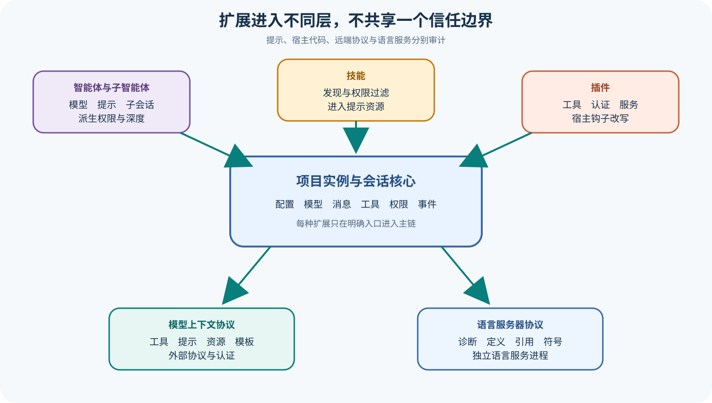

# OpenCode 智能体、技能、插件、MCP 与 LSP 扩展

## 读者会得到什么

本篇把五类扩展映射到各自的运行层。Agent 定义模型、提示、模式与权限；Task Tool 为 Subagent 创建或复用子会话。Skill 是可发现并按 Agent Permission 过滤的指令资源。Plugin 可以贡献 Tool、Auth、Provider 和 Hook，直接改写运行表面。MCP 连接远端或本地服务，把 Tool、Prompt、Resource 与 Resource Template 转换为当前实例能力。LSP 则按文件与项目根启动语言服务器，提供诊断、定义、引用与符号信息。

这些能力不应被压成一个「插件系统」。Skill 内容进入提示上下文但通常不直接获得进程能力；Plugin 代码运行在宿主进程边界，风险更高；MCP Tool 跨协议调用外部服务；LSP 是独立子进程和协议客户端。Agent/Subagent 又引入新的会话、模型和 Permission Scope。安装、发现、连接、模型可见与成功执行是五个不同状态。

Subagent 权限尤其需要精确理解。锁定实现从父 Session 继承 Deny 与 External Directory 规则，再由子 Agent 自身权限决定能力，并在未显式允许时追加 TodoWrite 与 Task Deny。Task 调用本身还需权限检查和深度限制。父 Agent 的全部 Allow 并不会被无条件复制给子会话；反过来，子 Agent 自身规则也不能越过继承的关键拒绝项。

## 核心概念

Agent 是模型、提示、模式与权限的组合定义；Subagent 是由 Task Tool 创建或复用的独立子会话。父会话获得子任务结果投影，但子会话拥有自己的消息、工具、压缩和错误。把 Subagent 当普通函数会丢失轨迹、权限和并发副作用，也无法解释恢复 Task ID 的语义。

Skill、Plugin、MCP 和 LSP 位于不同信任域。Skill 主要提供可读指令资源，Plugin 是宿主进程内代码，MCP 通过协议调用外部服务，LSP 是面向代码智能的独立子进程。发现某资源只是第一状态；启用、模型可见、连接、执行与结果正确仍要逐层验证。

Subagent Permission 采用收窄继承。父会话的 Deny 与 External Directory 规则进入子会话，子 Agent 自身规则继续生效，未显式允许的递归 Task/Todo 追加拒绝；Task Tool 还执行调用权限和深度检查。这能减少权限膨胀，却不等于操作系统隔离，子工具仍受宿主能力支配。

| 扩展类型 | 运行位置 | 改变的表面 | 主要风险 |
| --- | --- | --- | --- |
| Agent | 当前实例配置 | 模型、提示、模式与 Permission | 规则组合和模型漂移 |
| Subagent | 独立 Child Session | 子任务工具循环与结果 | 权限、深度、并发副作用 |
| Skill | 提示资源路径 | 模型可读指令与工作流 | 指令注入、来源漂移 |
| Plugin | 宿主进程内 | Tool、Auth、Provider 和 Hook | 高权限代码与数据外发 |
| MCP | 本地/远端协议服务 | Tool、Prompt、Resource、Template | 远端身份、授权和副作用 |
| LSP | 语言服务器子进程 | Diagnostic、Definition、Reference | 配置过时与子进程权限 |
| Permission Scope | 父子 Ruleset | 可调用能力边界 | 应用层规则不等于沙箱 |
| Extension Snapshot | 版本、状态和最终 Schema | 可重放证据 | 发现列表不证明运行成功 |

## 为什么这样设计

多种扩展机制各自服务不同需求。Skill 让知识以文本资源复用，Plugin 允许深度定制运行时，MCP 连接跨进程生态，LSP 提供语言专用分析，Subagent 并行或分解任务。统一成一个插件接口会模糊权限与生命周期，也让故障无法定位。

子会话而非同一上下文中的嵌套调用，使 Subagent 能独立选择模型、保留历史和恢复任务。父会话只接收结果可以降低上下文压力，但必须保存 Child Session ID；否则父回答无法回到子工具证据。深度限制和默认 Task Deny 防止无界递归。

关键拒绝继承体现最小权限方向。父层禁止的外部目录和能力不应因委派消失，父层的 Allow 也不自动扩张子 Agent。真正有效权限由继承规则、子 Agent Ruleset 和运行时边界共同决定，需要用实际派生结果验证。

MCP Capability 探测与 LSP Root 发现采用动态方式，是为了适配不同服务和项目。连接成功不意味着所有能力存在，找到 Binary 也不意味着 Root 与配置正确。状态机和分页结果必须保留，不能用「已连接」一个布尔值覆盖认证、能力和执行。

Plugin Hook 的顺序同样属于运行语义。多个 Hook 可以依次改写系统提示、工具定义或压缩内容，后一项看到的是前一项输出；只保存插件集合而不保存顺序，无法重放最终表面。

## 实现思路

教学实现为每种扩展生成独立清单，并在创建模型请求时汇总为 Extension Snapshot。以下结构只表示证据关系，不声称上游存在同名类型。

Snapshot 对远端对象采用内容哈希与服务器身份双重绑定。MCP 工具同名但来自不同服务器时不得合并，LSP 同一语言由不同 Root 启动也要分开；名称只是显示字段，不能作为全局身份。

```ts
interface ExtensionSnapshot {
  agents: Array<{ name: string; mode: string; permissionDigest: string }>;
  skills: Array<{ name: string; origin: string; allowed: boolean }>;
  plugins: Array<{ id: string; version: string; hooks: string[] }>;
  mcp: Array<{ server: string; status: string; capabilities: string[] }>;
  lsp: Array<{ server: string; root: string; status: string }>;
}
```

1. 从 Config 与目录发现 Agent、Skill、Plugin、MCP 和 LSP 定义，保留 origin、版本、诊断与信任决定。
2. 合并 Agent 默认与用户规则，计算 Primary/Subagent/All 模式、模型、提示和最终 Permission Digest。
3. Skill 按来源去重并应用 Agent `skill` Permission；只把允许且可读取的资源交给模型，保存内容哈希。
4. Plugin 在受控入口初始化，记录 Tool/Auth/Provider/Hook。Hook 前后保存脱敏摘要，异常不能静默跳过后仍声称相同表面。
5. MCP 按 Stdio、SSE 或 Streamable HTTP 建连，记录认证状态和 Server Capabilities，分页读取每类资源并命名空间化 Tool。
6. Task Tool 检查功能开关、调用权限与嵌套深度，派生父 Deny/External Directory 和子规则，创建带 Parent ID 的 Child Session。
7. LSP 按文件识别 Root 与 Server，启动 Client、发送打开通知并等待诊断；Binary 缺失与无匹配 Root 分开报告。
8. Eval 关联父子 Session、Extension Snapshot、MCP 回执、LSP 诊断和最终文件。扩展可用与任务正确分别给出结论。

运行中扩展变化应产生新 Revision。Plugin 改写 Tool Definition、MCP 重连后 Schema 改变或 LSP 切换 Root 时，正在进行的 Tool Call 使用开始时版本；下一轮模型请求再采用新 Snapshot。

子会话关闭时要汇总但不删除其 Trace。父会话收到文本结果、Artifact 引用、最终权限摘要和 Child Session ID；若子任务被取消，父层先核对已提交副作用再决定是否重新委派。

外部 Skill 获取需要固定来源、版本和内容哈希。下载成功只说明资源可读，不能证明指令安全；公开课程默认使用本地夹具，真实远端来源需要单独供应链审查。

## 贯穿案例

假设主 Agent 委派 Subagent 修复 TypeScript 错误。项目提供同名 Skill，Plugin 改写测试工具描述，本地 MCP 暴露只读 issue 资源，LSP 提供诊断。父 Session 拒绝外部目录，子 Agent 自身允许 Read/Edit，但没有显式允许递归 Task。

实验为父子会话分配独立工作区变更日志，并让受控文件锁检测同时编辑。这样可以区分权限派生正确但并发冲突失败的情况；Subagent 能运行不等于协作调度正确。

```json
{
  "parentPermission":[{"permission":"external_directory","pattern":"*","action":"deny"}],
  "childAgent":{"allow":["read","edit"],"task":"unspecified"},
  "resources":{"skill":"project-overrides-builtin","mcp":"local-readonly","lsp":"typescript"},
  "plugin":"test-tool-definition-hook"
}
```

1. Skill Service 选择项目版本并按 child Agent Permission 过滤，Snapshot 保存 origin 与哈希；发现不等于模型已读取正文。
2. Task Tool 验证父调用权限和深度，创建 Child Session。派生规则保留 external_directory deny，并追加 Task Deny，防止子 Agent 继续递归。
3. Plugin Hook 修改测试工具 Schema，模型请求保存最终定义。若 Hook 抛错，当前 Revision 标记失败，不能退回旧 Schema 后假装一致。
4. MCP 建连后只声明 Resource 能力，没有 Tool；客户端分页读取 issue 内容，不能因为连接成功就展示不存在的工具。
5. LSP 以正确项目 Root 启动并报告两个诊断。子 Agent 编辑后诊断归零，但这只是一项信号，仍需运行测试。
6. 子 Agent 尝试项目外路径被继承规则拒绝，尝试递归 Task 被默认 Deny；父会话收到结果投影与 Child Session ID。

```json
{
  "child":{"session":"recorded","externalDirectory":"denied","recursiveTask":"denied"},
  "skill":{"origin":"project","allowed":true},
  "plugin":{"toolSchemaRevision":"captured"},
  "mcp":{"resources":1,"tools":0},
  "lsp":{"diagnosticsAfter":0},
  "eval":{"tests":"required","verdict":"pending"}
}
```

故障变体让 MCP Resource 分页第二页失败。已取得第一页不应被写成完整目录；状态标为 partial，并阻止依赖完整列表的结论。另一个变体让父子同时编辑同一文件，最终 Diff 需要冲突检查，Subagent 完成通知本身不能解决合并。

案例最后运行构建、测试和目标断言。即使 LSP 零诊断、MCP 正常、Plugin Hook 成功、子会话 Idle，只要测试失败，Trial 仍失败。扩展机制提供能力与证据，不拥有最终质量判定权。

再让 Plugin 在 Tool Call 前改写参数。模型看到的 Schema、模型给出的参数和最终执行参数分别保存；若高风险字段改变，旧 Permission 失效并重新询问。Plugin 运行在进程内，宿主秘密不能默认注入其环境。

MCP 故障实验在调用提交后断线。客户端无法确定远端副作用时记录 unknown，并用服务器幂等键或查询接口核对；盲目重连重试可能重复创建对象。远端服务没有查询能力时，Trial 保持 inconclusive。

LSP 故障实验故意选择错误 Root。诊断可能仍为零，但构建在真实项目根失败，说明启动成功和零诊断都不足以证明代码健康。Snapshot 保存 Binary、Root、配置和文档版本，便于定位。

最后测试父 Session 取消。子会话若仍运行，系统必须显式传播取消或记录脱离状态；父 UI 显示停止不能证明子进程和 MCP 请求收敛。发布前检查所有 Child Session 终态与未决远端调用。

Skill 内容还可能引用不存在的工具或过期路径。加载成功后应验证所需能力与当前 Tool Surface 的兼容性，并把缺失项写入诊断；模型遵循错误 Skill 导致的失败属于资源语义问题，不能归因成模型随机性。

扩展总审最终输出一张状态矩阵：discovered、enabled、connected、model-visible、executed、verified。每个格子引用独立证据，避免用绿色「扩展已安装」图标覆盖后续失败。

这张矩阵也用于版本漂移复核。

## 真实输入与输出

### 输入

```json
{"agent":"主智能体定义","subagent":"子智能体类型","skills":["本地","外部拉取"],"plugins":["工具与钩子"],"mcp":["本地或远端服务"],"file":"等待语言诊断的源码文件"}
```

### 输出

```json
{"child_session":"独立会话与权限范围","prompt_resources":"许可后可用技能","runtime_mutations":"插件钩子与工具","remote_capabilities":"已连接 MCP 表面","code_intelligence":"LSP 诊断与导航"}
```

## 调用链



Claim: opencode.extensions.change-runtime-surfaces

Claim: opencode.subagent.permission-is-scoped

1. Config 与目录发现装入 Agent、Skill、Plugin 和 MCP 定义，LSP Server Catalog 按环境解析可用实现。
2. Agent Service 合并默认与用户规则，确定 Primary/Subagent/All 模式、模型、提示和 Permission Ruleset。
3. Skill Service 从内建、项目、用户与允许的外部位置发现资源，同名本地 Skill 可覆盖内建项，Agent Deny 会过滤可用列表。
4. Plugin 初始化取得客户端、目录、工作树与服务输入，注册 Tool/Auth/Provider/Hook；Hook 可在系统提示、工具定义、文本完成和压缩等节点改写数据。
5. MCP Client 通过 Stdio、SSE 或 Streamable HTTP 连接，检查服务能力并分页读取 Tool、Prompt、Resource 与 Template。
6. MCP Tool 被命名空间化并转换成统一动态工具，调用时仍受超时、取消、协议错误和 Permission 约束。
7. Task Tool 检查调用权限与嵌套深度，创建带 Parent ID 的子会话，并派生关键拒绝与外部目录规则。
8. 文件被读取或编辑时，LSP 按文件寻找 Root/Server/Client，发送打开通知并等待诊断；结果进入工具或事件表面，而不是自动证明代码正确。

## 源码证据

子会话只继承父会话中的关键拒绝与外部目录规则，并为未显式允许的递归 Task/Todo 添加 Deny：

```source
packages/opencode/src/agent/subagent-permissions.ts:14-26
return [
  ...input.parentSessionPermission.filter(
    (rule) => rule.permission === "external_directory" || rule.action === "deny"
  )
]
```

Task Tool 另外执行背景功能开关、嵌套深度、调用 Permission、Agent 存在性和子 Session 创建检查：

```source
packages/opencode/src/tool/task.ts:90-170
if (depth >= (cfg.subagent_depth ?? 1)) return yield* Effect.fail(...)
const childPermission = deriveSubagentSessionPermission(...)
```

Skill 的发现结果并非全部交给每个 Agent；可用列表还要计算 `skill` Permission。

```source
packages/opencode/src/skill/index.ts:253-318
return list.filter((skill) => Permission.evaluate("skill", skill.name, agent.permission).action !== "deny")
```

MCP Catalog 根据服务能力分页读取资源，并把 Tool Schema 与 Call Tool 转成统一执行表面；连接存在不意味着某个 Capability 存在。

```source
packages/opencode/src/mcp/catalog.ts:38-155
if (!client.getServerCapabilities()?.resources) return Promise.resolve([])
return paginate((cursor) => client.listResources(...))
```

## 失败与限制

第一，发现不等于启用。Skill 可因外部发现开关或 Permission 消失；MCP 可停留在认证、客户端注册、失败或断开状态；LSP 可能找不到 Binary 或 Project Root。

第二，Plugin 是高信任代码。它能贡献工具并修改 Hook 输出，风险不止提示注入；来源、版本、安装脚本与运行权限都要审计。

第三，Subagent 是独立会话，不是普通函数。它可能选择不同模型、产生自己的工具副作用、上下文压缩和错误；父会话只收到结果投影，仍要保存 Child Session ID 与完整轨迹。

第四，背景 Subagent 受实验开关与并发协作约束。通知完成不能证明父子任务没有修改同一文件，也不能自动解决合并冲突。

第五，MCP Tool 的远端执行与本地 Permission 分属不同边界。允许调用只代表发出请求，远端服务的身份、数据保留、权限和副作用需独立核对。

第六，LSP Diagnostic 是语言服务器观点，可能过时、配置错误或只覆盖静态规则。零诊断不等于测试通过，更不等于行为正确。

## 验证方法

建立一个主 Agent 与两个 Subagent：一个显式允许 Task，一个没有。给父会话配置 External Directory Allow 与特定 Deny，启动子任务后读取 Child Session Permission，验证继承与默认拒绝；再测试深度上限、恢复 Task ID 和背景功能开关。

准备同名内建/项目 Skill、一个改写 Tool Definition 的测试 Plugin、一个提供 Tool/Resource 的本地 MCP Server，以及可控 LSP Fixture。分别记录发现列表、Agent 可用列表、模型最终 Tool Schema、MCP Status/Capabilities 和 LSP Client Root。

故障注入覆盖 Plugin Throw、MCP 认证失败与超时、资源分页失败、LSP Binary 缺失和 Child Session 工具失败。所有案例按扩展层保存错误，不用「扩展不可用」一个状态吞掉根因。

## 自检

### 问题 1

Skill、Plugin 和 MCP 有什么核心差异？

**答案：** Skill 主要提供指令资源，Plugin 在宿主内改写运行表面，MCP 通过协议连接外部能力。

### 问题 2

父 Agent 的 Allow 会全部复制给 Subagent 吗？

**答案：** 不会。实现重点继承 Deny 与 External Directory 规则，子 Agent 自身规则决定其能力，并追加必要默认拒绝。

### 问题 3

MCP 已连接是否说明 Tool、Prompt 和 Resource 全部存在？

**答案：** 不说明。每种能力由服务器 Capability 声明和列表请求分别决定。

### 问题 4

LSP 零诊断能否作为发布门禁唯一依据？

**答案：** 不能。它只是静态代码智能信号，还需构建、测试、产物和独立任务评分。
