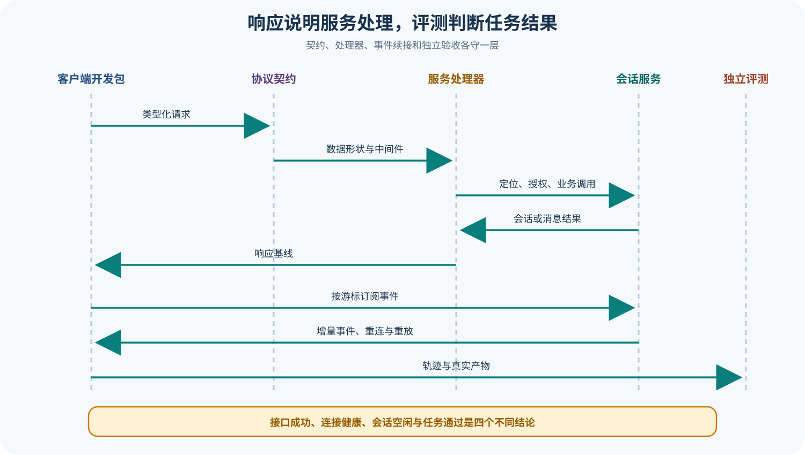

# OpenCode 服务协议、处理器、开发包与事件流

## 读者会得到什么

本篇解释 OpenCode 如何把同一服务核心暴露成可编程接口。Protocol Package 定义 API Group、Endpoint Schema、中间件位置与 OpenAPI 表面；Server Package 注入具体服务标识、Location/Session Location、Authorization 和 Handler；Routes 再组装应用服务并生成 Web Handler。客户端开发包消费的是这些协议契约，不是直接调用 Session 内部对象。

请求与事件承担不同职责。创建会话、提交 Prompt、切换 Agent/Model、压缩、等待、恢复和中断走请求响应；Session Events 与 Global Events 用流持续推送状态变化。客户端必须先取得初始快照或 History Cursor，再按 Event ID 续接并处理断线、重放和重复。只监听事件而没有基线，会漏掉订阅前状态；只做轮询，又会丢失细粒度 Tool/Permission/Question 转换。

HTTP 成功也不等于编码任务成功。`session.prompt` 可以成功接受并运行一次会话，但助手消息仍可能带 Error，文件可能错误，测试可能失败；`session.wait` 只表示运行不再活跃。服务器健康检查、Schema 解析和授权通过属于传输与服务门禁，最终任务 Verdict 仍需独立 Evaluator 读取会话轨迹与真实产物。

## 真实输入与输出

### 输入

```json
{"request":{"method":"POST","path":"会话提示接口","payload":"用户消息"},"headers":{"authorization":"可选凭证","workspace":"实例定位"},"event_cursor":"最近已处理事件"}
```

### 输出

```json
{"response":{"status":200,"data":"会话或消息结果"},"stream":["连接事件","会话事件","工具与权限变化"],"task_verdict":"不由 HTTP 状态自动给出"}
```

## 调用链



Claim: opencode.protocol.groups-separate-contract-from-handler

Claim: opencode.server.response-is-not-task-success

1. Protocol 以 Location、Agent、Session、Message、Model、Provider、Permission、File、Command、Skill、Event 等 Group 组合默认 API。
2. 每个 Group 声明路径、方法、Path/Query/Payload Schema、Success 与 Error Schema，并在需要时放置 Location 或 Session Location Middleware。
3. Server 使用同一 Protocol Factory 注入具体 Middleware Key，保持契约包不依赖下游 Core Service 身份。
4. Routes 提供 Handler、Authorization、Schema Error、Location、数据库、Session Execution 与事件服务，生成 HTTP Web Handler 和 OpenAPI。
5. 请求先经过授权与 Schema 解码，再由 Location/Session Location 找到正确项目实例和会话归属。
6. Session Handler 把列表、创建、Prompt、Compact、Wait、Revert、History、Events、Interrupt 与 Message 请求转给 Session Service。
7. 客户端开发包把协议操作包装成类型化调用；事件端点以服务端事件流持续返回 Event Envelope。
8. 调用方合并响应基线与增量事件，处理 Cursor、重连和幂等；独立 Evaluator 再检查任务产物与结果。

## 源码证据

Protocol 明确拥有 Middleware Placement，并把具体服务 Key 留给 Server 注入：

```source
packages/protocol/src/api.ts:25-64
return HttpApi.make("opencode")
  .add(makeSessionGroup(sessionLocationMiddleware))
  .add(eventGroup)
  .middleware(Authorization)
```

Server API 文件本身很薄，只用具体 Session Location Middleware 实例化默认协议；行为实现在各 Handler 与 Service。

```source
packages/server/src/api.ts:1-8
export const Api = makeDefaultApi({
  sessionLocationMiddleware: SessionLocationMiddleware,
})
```

Session Handler 把协议名称映射到业务服务，Prompt 与 Events 仍是两种不同返回形态：

```source
packages/server/src/handlers/session.ts:140-173
"session.prompt",
(ctx) => Effect.map(session.prompt(...), (data) => ({ data }))
```

```source
packages/server/src/handlers/session.ts:333-366
"session.history",
"session.events",
session.events({ sessionID: ctx.params.sessionID, after: ctx.query.after })
```

## 失败与限制

第一，Schema 契约只能保证解码形状与已声明错误，不证明业务状态没有竞态。Session 可在 Location Lookup 后被移动、删除或中断，处理器必须返回明确错误。

第二，Authorization 是否开启取决于服务器配置。无密码的本地服务若绑定到非预期网络接口，会扩大攻击面；部署时必须核对监听地址、反向代理和凭证策略。

第三，事件流会断开。客户端需要保存 Cursor、支持重连、处理重复事件和过期 History；不能把单一长连接当作可靠消息队列。

第四，Global Event 与 Session Event 的作用域不同。多项目客户端若丢失 Directory/Workspace/Session 关联，会把事件应用到错误视图。

第五，HTTP 200 可能只说明请求被处理。Prompt 返回的 Message、Tool Part、Error、Patch 和测试产物仍需分别判断；Wait/Idle 也只代表当前执行生命周期结束。

第六，开发包类型跟随锁定 Protocol 版本。服务端与客户端版本漂移、实验路由变化或未覆盖的 Event Definition 都可能产生兼容问题，应记录版本和 OpenAPI 摘要。

## 验证方法

从同一锁定提交生成或读取 OpenAPI，枚举每个 Group 的路径、Middleware 与 Success/Error Schema；启动测试服务器，通过真实 HTTP Client 验证健康、授权缺失、非法 Session ID、正确 Session Location 和 Schema Error。

建立会话后先读取 History，再订阅 Events，发起 Prompt 与 Tool Call。中途断开连接，保存最后 Event ID 后重连，核对事件没有永久缺失且重复可幂等消费。再用错误 Cursor、删除会话和移动实例制造边界情况。

最后准备两个 HTTP 200 案例：一个正确修改文件并通过测试，一个自然结束但产物错误。确认客户端传输层两者都成功，而独立 Evaluator 给出不同 Verdict，避免把服务可达性写成任务质量。

## 自检

### 问题 1

Protocol 与 Server Handler 为什么要分开？

**答案：** 前者拥有路径、Schema 与中间件位置，后者注入具体服务并实现业务行为，便于客户端共享稳定契约。

### 问题 2

只订阅事件流能否得到完整当前状态？

**答案：** 不能保证。应先读取快照或历史基线，再用 Cursor 合并后续增量。

### 问题 3

`session.wait` 成功意味着任务通过吗？

**答案：** 不意味着。它只表示执行生命周期不再活跃，产物与测试结果仍需独立检查。

### 问题 4

服务端没有配置密码时就一定安全吗？

**答案：** 不一定。还取决于监听接口、网络暴露、代理配置和宿主访问边界。

