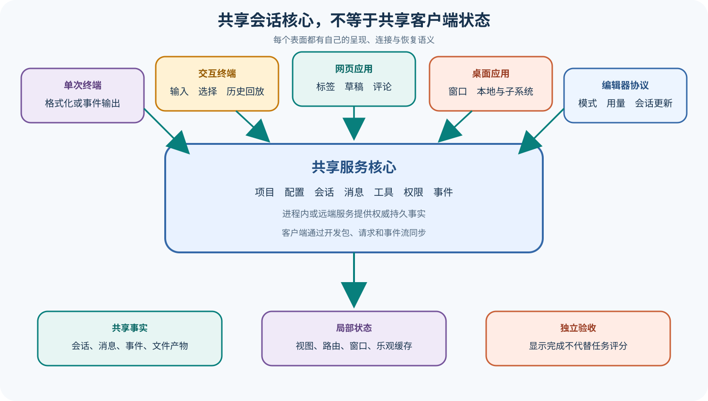

# OpenCode 终端、桌面、网页与编辑器协议表面

## 读者会得到什么

本篇比较 OpenCode 的多种使用表面，但不把界面差异误写成多套 Agent Runtime。非交互 Run、Mini 交互模式和 TUI 可以启动进程内服务，也可以 Attach 到已有 Server；App 以 Server/Directory/Session Scope 组织网页状态，Desktop Renderer 复用 App 并增加本地或 WSL 连接与原生能力；Agent Client Protocol Adapter 则把 OpenCode Session 映射为编辑器可消费的协议会话。

共享核心意味着这些表面可以指向同一 Server、Project 和 Session，读取相同持久消息与事件。它不意味着客户端状态完全共享。终端格式、TUI 选中项、网页 Tab/Draft/Comment、桌面窗口与 Server Connection、编辑器协议中的 Mode/Variant/Usage 都有独立生命周期。客户端断开或重启时，服务端 Session 可能继续存在，局部乐观状态则可能被丢弃或需要重新同步。

ACP 不是会话事件的透明转发。Adapter 实现 Initialize、New/Load/List/Resume/Close Session、Set Mode/Model、Prompt 与 Cancel，再把 OpenCode Message/Part/Tool/Permission 等事件转换成 Protocol Session Update。某个更新在编辑器中显示成功，只证明映射和传输完成；原始事件、服务端消息和文件产物仍是核对任务结果的来源。

## 真实输入与输出

### 输入

```json
{"surface":"单次终端 | 交互终端 | 桌面 | 网页应用 | 编辑器协议","server":"进程内或远端","directory":"项目目录","session":"新建、继续或派生","prompt":"用户请求"}
```

### 输出

```json
{"shared":{"project":"服务端项目","session":"持久会话","events":"核心事件"},"local":{"view_state":"每个客户端独立","transport":"进程、HTTP 或标准输入输出"},"verdict":"仍需检查真实产物"}
```

## 调用链



Claim: opencode.surfaces.project-shared-but-state-distinct

Claim: opencode.acp.events-are-projections

1. CLI 解析 Run/Mini/TUI 的 Directory、Session、Continue、Fork、Attach、Model、Agent 和输出格式。
2. 本地模式启动进程内 Server/Worker，Attach 模式连接已有地址；两者都通过客户端开发包操作 Session。
3. Run 创建或恢复会话，先订阅事件，再发 Prompt/Command；循环输出 Message Part、Tool、Error、Permission，并在 Session Idle 时结束。
4. TUI 通过 Worker Fetch 与 Global Event Source 构建交互客户端，维护选择、输入、弹窗、历史回放和终端尺寸等局部状态。
5. App 以 Server Key 决定重挂载边界，再按 Directory 建立 SDK/Sync Provider；Session、Draft、Tab 和 Comment 使用不同持久化键。
6. Desktop Renderer 提供本地与 WSL Server Connection，把原生生命周期和 Web UI 组合起来，但会话数据仍由所选服务端提供。
7. ACP Agent 接受编辑器请求，ACP Service 选择或创建 OpenCode Session，并启动 Event Subscription；核心事件被转换为 Session Update。
8. 每种客户端显示结果后，验证程序回到服务端消息、工作树、测试与 Artifact，避免用某个表面的动画或 Stop Reason 代替任务结论。

## 源码证据

Run 源码在文件头就区分单次、进程内交互和远端 Attach；事件循环追踪父会话与子会话，并以目标 Session Idle 结束输出。

```source
packages/opencode/src/cli/cmd/run.ts:693-835
for await (const event of events.stream) {
  if (event.type === "session.created" && event.properties.info.parentID) ...
  if (event.properties.status.type === "idle") break
}
```

TUI 的网络或进程内传输都被包装成 Fetch 与 Event Source，界面层消费统一事件而不是直接持有 Session Service。

```source
packages/opencode/src/cli/cmd/tui.ts:24-52
function createWorkerFetch(client: RpcClient): typeof fetch
function createEventSource(client: RpcClient): EventSource
```

App 明确以 Server Identity 控制 Provider Remount，再在 Directory Scope 建立数据同步；这说明 Server State 与 UI Route/Tab State 是不同层。

```source
packages/app/src/app.tsx:119-124
<ServerSDKProvider server={conn}>
  <ServerSyncProvider server={conn}>{props.children}</ServerSyncProvider>
</ServerSDKProvider>
```

ACP Agent 只是协议入口，所有方法继续委托 Service 并统一映射错误。

```source
packages/opencode/src/acp/agent.ts:26-89
newSession(params: NewSessionRequest) {
  return run(this.service.newSession(params))
}
prompt(params: PromptRequest) {
  return run(this.service.prompt(params))
}
```

## 失败与限制

第一，Attach 的 Directory 是远端服务端路径，不一定存在于客户端本机。显示相同字符串不能证明两端文件系统一致，尤其在 WSL、容器或远程主机中。

第二，事件先订阅再 Prompt 可以减少竞态，但断线仍需基线与重放。终端输出若只保留格式化文本，会丢失原始 Event ID、Tool Metadata 和 Error Shape。

第三，App 的乐观更新和客户端缓存用于交互速度，不是权威持久记录。多窗口或多客户端修改同一 Session 时要处理重复、乱序、归属和清理。

第四，Desktop 与 Web 复用 UI 不代表安全边界相同。Desktop 可拥有原生桥接、进程启动和本地文件权限；浏览器受 Origin、网络和服务端授权约束。

第五，ACP 的 Stop Reason、Tool Kind、Content Block 与 Usage 是协议投影。映射可能丢失 OpenCode 私有 Metadata，也可能因协议版本对新事件没有表达。

第六，不同表面可以使用相同 Session，却采用不同 Agent/Model/Variant 或本地输入附件。复现实验必须记录操作表面、连接方式和当时有效配置。

## 验证方法

启动一个测试 Server，分别用单次 Run、TUI Attach、App 和 ACP 连接同一 Directory。创建会话后从另一客户端恢复它，核对 Session ID、Message/Part 与文件产物一致，同时确认 Tab、选中项、窗口和协议 Mode 等局部状态不会互相冒充服务端事实。

在 Tool Call 中途断开 Run 与 ACP，随后重新连接并读取 History/Events。保存原始事件与各表面的呈现结果，对比文本、工具状态、权限请求、附件、Usage、Error 和 Stop Reason 映射。

再用本机路径、WSL 路径和远端路径测试 Directory Scope，确认客户端没有把本地路径错误发送给远端服务。最后让两个客户端并发操作同一会话，验证事件幂等、归属过滤和冲突可见性。

## 自检

### 问题 1

多个表面是否运行多套不同 Agent Loop？

**答案：** 通常不是。它们可共享服务端项目、会话和事件核心，但拥有不同传输与客户端状态。

### 问题 2

客户端 Tab 或 Draft 属于服务端 Session 事实吗？

**答案：** 不一定。它们多是界面局部或客户端持久状态，需与服务端消息分开。

### 问题 3

ACP Session Update 是原始 OpenCode Event 吗？

**答案：** 不是透明原样转发，而是 Adapter 对核心状态的协议投影。

### 问题 4

Attach 时 Directory 应按哪台机器解释？

**答案：** 按远端 Server 的文件系统解释，不能默认等同于客户端本地路径。

