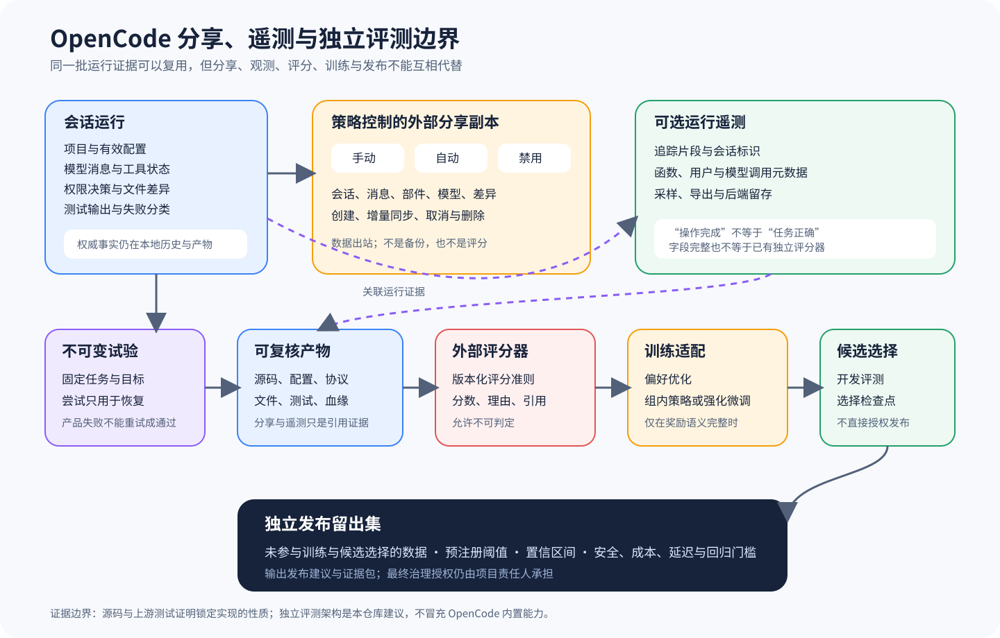

# OpenCode 分享、遥测与独立评测边界

## 读者会得到什么

本篇把五类经常混在一起的对象拆开：分享副本回答「怎样让他人查看一次会话」，遥测回答「运行时发生了什么」，上游测试回答「锁定夹具下某段代码是否满足断言」，评测回答「固定任务上的产物是否正确」，训练与发布则分别回答「怎样改变候选模型」和「候选版本能否进入目标环境」。它们可以复用同一批运行证据，却不能相互替代。

OpenCode 的 Share 不是只能手动触发。Session Share Service 会读取配置：`disabled` 拒绝分享，`auto` 或运行标志会在根会话创建后异步创建分享，普通策略下仍可手动 Share。ShareNext 随后把 Session、Message、Part、Model 和 Session Diff 同步到外部服务，并保存远端 ID、Secret 与 URL；Unshare 会调用删除端点并清理本地索引。

OpenTelemetry 也是可选运行能力。模型流只有在实验配置开启且注入 Tracer 时才建立追踪，并给 Span 加入 Session ID；传给模型开发包的遥测元数据还包含函数标识、用户和会话。Span 成功只说明某个被观测操作完成，不包含任务 Rubric、正确答案、发布阈值或错误成本。

本篇后半段给出本仓库建议的 Eval Harness 契约。它不是 OpenCode 已内置的发布系统，而是利用 OpenCode 可导出的消息、工具状态、差异、文件产物、配置和测试结果，构造可复核 Artifact，再交给版本化外部 Scorer。证据边界必须保留：能采集不等于已评分，单次评分不等于统计稳定，训练奖励不等于独立发布授权。

## 真实输入与输出

### 输入

```json
{"分享策略":"手动、自动或禁用","会话":"根会话标识","模型流":"提示、工具与响应事件","遥测配置":"是否启用及追踪器","工作区":"文件与差异"}
```

### 输出

```json
{"试验单元":{"任务":"固定数据集条目","目标":"锁定的 OpenCode 表面","尝试":"恢复记录"},"产物":{"来源提交":"固定","有效配置":"已归档","消息与工具":"原始证据","文件与测试":"结果"},"外部评分":{"评分器版本":"固定","分数":"带理由"},"决策":{"训练奖励":"可选","候选检查点":"独立选择","发布留出集":"最终门禁"}}
```

这里的 Trial 是统计分母，一个任务与目标配置对应一个不可变 Trial。Attempt 只是同一 Trial 下的恢复尝试，网络中断或基础设施故障可以生成新 Attempt，但产品性失败不能靠重复尝试变成多个样本，也不能挑选最好一次冒充 Trial 通过。Canonical Attempt 的选择规则必须预先声明并留下租约、幂等与提交证据。

Artifact 至少应保存来源 Commit、OpenCode 版本、有效配置摘要、Provider/Model、Prompt、工具与权限决策、原始 Message/Part/Event、工作树补丁、最终文件、测试输出、遥测关联标识和失败分类。敏感字段要做受控脱敏，但不能只保存一段经过格式化的终端文本，否则评分者无法复核工具参数、拒绝原因和实际文件副作用。

## 调用链



Claim: opencode.share.policy-controls-external-copy

Claim: opencode.telemetry-and-tests-are-not-release-eval

1. 运行入口创建或恢复根 Session；配置和运行标志共同决定是否自动分享，手动命令仍可创建或取消分享，禁用策略必须阻断请求。
2. ShareNext 创建远端对象并保存 ID、Secret、URL，首次全量发送 Session、Message、Part、Model 和 Diff；后续监听事件，把同类更新排队同步。
3. 模型流在可选 OpenTelemetry 配置下生成 Span，以 Session ID 关联调用；消息、工具、权限、文件差异和测试输出仍分别保留原始证据。
4. Eval Runner 从固定 Dataset 创建 Trial，锁定 Target Surface、来源提交、配置和模型，并把每次恢复执行登记为 Attempt，而不是新 Trial。
5. Artifact Writer 选择规范 Attempt，保存运行协议、文件、测试、失败分类和血缘；分享链接或遥测查询地址只能作为引用，不能成为唯一证据。
6. 独立 Scorer 读取 Artifact，按版本化 Rubric 输出 Score、Reason、证据引用和不可判定状态；评分进程不依赖被测智能体的自我陈述。
7. RewardAdapter 只有在语义声明完整时，才把 Scorer 输出转换成 DPO 偏好对或 GRPO/RFT 可验证奖励；训练集、调参与评测留出集隔离。
8. Checkpoint Selector 在开发评测上选候选，独立 Release Eval 再对未用于训练和选择的 Holdout 运行；只有预注册阈值、置信区间和风险门槛都满足时才形成发布建议。

## 源码证据

分享入口明确区分禁用、手动与自动策略。自动分支只作用于根会话，并异步调用同一个 Share 操作。

```source
packages/opencode/src/share/session.ts:26-45
if (conf.share === "disabled") throw new Error("Sharing is disabled in configuration")
if (!(flags.autoShare || conf.share === "auto")) return result
```

ShareNext 监听会话、消息、部件、差异和删除事件；首次全量同步也包含这些对象及模型描述。这证明 Share 是向外部服务复制一组会话投影，而不是只生成本地书签。

```source
packages/opencode/src/share/share-next.ts:179-200
yield* watch(MessageV2.Event.Updated, ...)
yield* watch(MessageV2.Event.PartUpdated, ...)
yield* watch(Session.Event.Diff, ...)
```

创建和取消分享分别调用远端创建、同步与删除端点，并维护本地分享表。同步返回错误只写告警，因此本地会话与远端副本存在暂时不一致的可能。

```source
packages/opencode/src/share/share-next.ts:310-358
const result = yield* HttpClientRequest.post(...)
yield* full(sessionID).pipe(...)
yield* HttpClientRequest.delete(...)
```

模型流的 OpenTelemetry 是条件性注入；Session ID 被写入 Span，模型开发包收到函数、用户和会话元数据，但没有 Rubric、Score 或 Release Decision 字段。

```source
packages/opencode/src/session/llm.ts:208-218
const tracer = cfg.experimental?.openTelemetry ? ... : undefined
span.setAttribute("session.id", input.sessionID)
```

```source
packages/opencode/src/session/llm.ts:344-352
experimental_telemetry: {
  functionId: "session.llm",
  metadata: { userId: ..., sessionId: input.sessionID }
}
```

上游分享测试验证创建请求、数据库记录、删除调用和差异合并。它们提供锁定 Commit 的可执行证据，但测试夹具中的模拟服务与断言范围不能外推为生产分享后端、安全治理或任务正确率。

```source
packages/opencode/test/share/share-next.test.ts:138-209
it.live("create posts share, persists it, and returns the result", ...)
it.live("remove deletes the persisted share and calls the delete endpoint", ...)
```

## 失败与限制

第一，分享是数据出站。自动策略可能在用户没有再次点击按钮时发生，部署者要审计合并后的有效配置、运行标志、企业地址、认证组织和环境禁用开关，不能只看某一份配置文件。公开 URL、Secret 和远端删除语义也需要单独威胁建模。

第二，Unshare 不等于可证明的全域擦除。本地代码会调用远端删除并清理索引，但缓存、日志、被访问者下载的内容和服务端保留政策不由该调用本身证明。敏感任务应默认禁用分享，并在接入外部服务前完成数据分类。

第三，遥测缺失既可能是功能未执行，也可能是开关关闭、Tracer 未注入、导出失败、采样或后端丢弃。反过来，Span 状态正常只描述观测操作，不保证文件内容正确、权限合规或用户意图满足。

第四，上游测试使用固定夹具与模拟 Provider/HTTP 服务。通过这些测试能支持「锁定实现满足特定代码断言」，不能支持「所有真实模型稳定可用」「企业分享已合规」或「该智能体适合生产发布」。

第五，外部 Scorer 也可能有偏差、提示泄漏、非确定性和不可判定样本。必须版本化 Rubric 与依赖，保存评分理由和证据引用，对主观任务进行复评与一致性分析，并把基础设施失败与产品失败分开统计。

第六，RewardAdapter 不是通用数值转换器。DPO 需要可比较偏好对，GRPO/RFT 需要声明奖励范围、聚合、缺失值、拒绝和截断语义；若 Scorer 只给自然语言反馈或语义不完整，适配能力应标为部分可用或不可用。

第七，Checkpoint 在开发集领先可能来自过拟合或选择偏差。训练 Reward、开发评测和独立发布评测必须使用隔离数据与不同职责；最终 Gate 还要结合安全、成本、延迟、回归和置信区间，而不是只取平均分最高者。

## 验证方法

先在隔离环境分别设置手动、自动和禁用策略，创建根会话与子会话，观察是否发出创建请求；随后更新消息、部件和文件差异，核对远端同步的数据类型、Secret 使用和错误日志。执行 Unshare 后同时检查远端删除响应、本地分享表和 Session Share 字段，主动模拟网络失败验证不一致是否可见。

再分别在遥测关闭、开启但无 Tracer、开启且有导出器三种条件下运行同一任务，检查 Span、函数标识和 Session ID。把消息、事件、差异、最终文件与测试输出归档到同一 Artifact，确认遥测查询结果只是关联证据之一，而不是 Artifact 的替代品。

最后建立一个包含成功、产品失败、可恢复基础设施失败和不可判定样本的小型固定 Dataset。每个条目只创建一个 Trial，故障恢复登记 Attempt；让外部 Scorer 盲评 Artifact，随后验证 RewardAdapter、Checkpoint 选择与独立 Holdout 使用不同数据和明确阈值。故意重试产品失败，门禁应拒绝把最好一次挑成通过结果。

## 自检

### 问题 1

OpenCode 分享是否只能由用户手动开启？

**答案：** 不是。锁定实现支持手动、自动和禁用策略，根会话还可能因运行标志自动分享；必须核对最终有效配置。

### 问题 2

分享链接能否作为完整评测 Artifact？

**答案：** 不能。它是外部会话投影，可能同步失败、被删除或受服务策略影响；Artifact 还要保存锁定配置、原始协议、文件、测试和血缘。

### 问题 3

OpenTelemetry Span 成功是否证明任务成功？

**答案：** 不证明。Span 描述被观测操作和元数据，没有任务 Rubric、正确性评分或发布阈值。

### 问题 4

上游测试全部通过是否等于可发布？

**答案：** 不等于。它们证明锁定夹具的代码性质；真实任务还需要固定 Trial、外部 Scorer、统计门槛和独立 Holdout。基础设施恢复可以新增 Attempt，但产品失败不能靠重试变成通过；训练奖励、开发选择与发布门禁也必须使用隔离数据和分别声明的职责。
