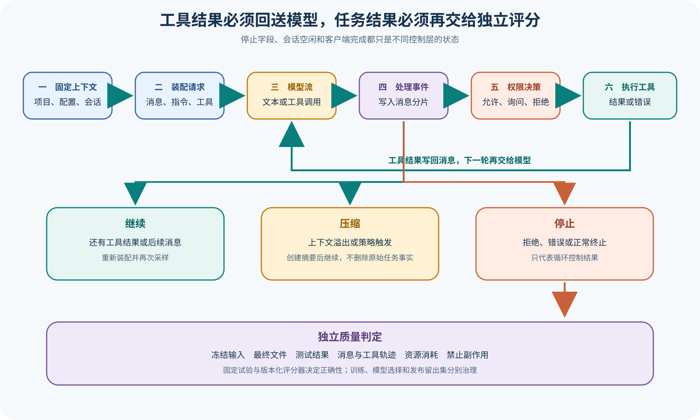

# OpenCode 源码课程

[返回学习入口](../../00-start-here.md)

OpenCode 围绕服务化 Session 组织运行过程：Project 和 Config 先选定这次运行要用的环境，Provider（模型提供商）接好模型接口，Session Prompt 再驱动主循环，让 Processor（处理器）接住模型流和工具结果，最后由 Server 与 Protocol 把这套核心能力交给多个客户端使用。


## 这条课程适合谁

如果你已经读完基础导读，想看 TUI（终端用户界面）、Desktop、Web 和协议客户端怎样共用一个 Agent 核心，OpenCode 很适合作为下一站。它没有停在最小 Loop 上，还把 Project、Server 和持久化边界摆到了同一条运行链里。

## 锁定来源

课程基于 OpenCode 提交 `3a31c4ea801915c0b050df4b3842997ea62b6e93`：

- [程序入口](https://github.com/anomalyco/opencode/blob/3a31c4ea801915c0b050df4b3842997ea62b6e93/packages/opencode/src/index.ts)
- [Session Prompt](https://github.com/anomalyco/opencode/blob/3a31c4ea801915c0b050df4b3842997ea62b6e93/packages/opencode/src/session/prompt.ts)
- [Session Processor](https://github.com/anomalyco/opencode/blob/3a31c4ea801915c0b050df4b3842997ea62b6e93/packages/opencode/src/session/processor.ts)
- [模型调用层](https://github.com/anomalyco/opencode/blob/3a31c4ea801915c0b050df4b3842997ea62b6e93/packages/opencode/src/session/llm.ts)
- [Protocol API](https://github.com/anomalyco/opencode/blob/3a31c4ea801915c0b050df4b3842997ea62b6e93/packages/protocol/src/api.ts)

## 先看一项任务

客户端先在某个 Project 里创建或选中 Session，Prompt 主链随后把消息、Agent 配置和工具组到一起，再向 Provider 发起模型请求。模型开始流式返回后，Processor 会逐项处理事件和工具状态，权限询问则跟着 Session 事件送到客户端，用户给出的结果还会写回原来的 Session。

```text
TUI / Desktop / Web / ACP
  → Server / Protocol
  → Project 与 Session
  → Prompt / LLM
  → Processor 与 Tools
  → Permission / Question
  → Message Store 与下一轮
```



图里的客户端只负责展示询问和结果，服务核心才真正维护 Session 状态。即使同时接入多个客户端，也不会因此复制出多套 Agent Loop（智能体循环）。

## 仓库地图

| 区域 | 首轮关注点 |
| --- | --- |
| `packages/opencode/src/project` 与 Config | 工作区和配置怎样建立 |
| `packages/opencode/src/provider` | 多 Provider 怎样归一化 |
| `packages/opencode/src/session` | Prompt、LLM、Processor、消息和压缩 |
| Tools 与 Permission | 工具副作用和用户询问 |
| Agent、Skills、Plugins、MCP、LSP | 运行时扩展和上下文来源 |
| `packages/server` 与 `packages/protocol` | 多客户端怎样共享服务核心 |
| TUI、Desktop、Web、ACP | 同一事件在不同表面怎样呈现 |

Permission（权限）规则可以决定产品是否放行某个动作，用户询问也能在执行前把流程停下来，但这两层都不会自动变成操作系统 Sandbox，进程到底被隔离到什么程度，仍要看宿主和另行配置的执行环境。这两层不能混。

## 三层读法

- **Starter**：先读 Runtime、Session Prompt 和工具权限，跟完一次请求。
- **Builder**：继续读 Storage、Compaction、Revert 与扩展，解释状态怎样被改写。
- **Maintainer**：检查 Server、Protocol、Share、Telemetry 与多客户端一致性边界。

## 阅读顺序

1. [Runtime、Project、Config 与 Provider](01-runtime-config-provider.md)
2. [Session Prompt、LLM 与 Processor](02-session-llm-processor.md)
3. [Tools、Permission、Question 与 Patch](03-tools-permission-patch.md)
4. [Storage、Compaction 与 Revert](04-storage-compaction-revert.md)
5. [Agents、Skills、Plugins、MCP 与 LSP](05-extensions-subagents.md)
6. [Server、Protocol 与多产品表面](06-server-protocol-surfaces.md)
7. [Share、Telemetry 与 Eval 边界](07-share-telemetry-eval.md)

## 用贯穿任务复盘

复盘时从客户端选择 Server/Directory 开始，沿着一次真实运行往下讲：Project、Config 和 Provider 怎样把实例建起来，Session Prompt 怎样驱动 LLM 与 Processor，Permission Question 怎样送到客户端，Message 和 Part 怎样落盘，Compaction（上下文压缩）与 Revert 又怎样改写模型下一轮真正能看到的历史。最后再看各种产品表面怎样从同一个 Server 读取事实。

读到最后，你还要逐个判断 Share 同步、OpenTelemetry Span、Session Idle 和独立测试到底各自能证明什么。它们都能关联到同一个 Session，但这几类证据不能互相替代。

## 完成课程后应该能回答

- Project、Config、Provider 和 Session 的创建顺序。
- Prompt 怎样形成模型请求，Processor 怎样消费结果。
- 工具和权限事件怎样跨服务端与客户端。
- Message、History、Compaction 和 Revert 如何改变 Session。
- 多种产品表面共享了哪些协议和状态。
- Share、Telemetry 和测试能支持哪些核对，哪些仍需外部 Eval。

[从第一篇开始：Runtime、Project、Config 与 Provider](01-runtime-config-provider.md)
