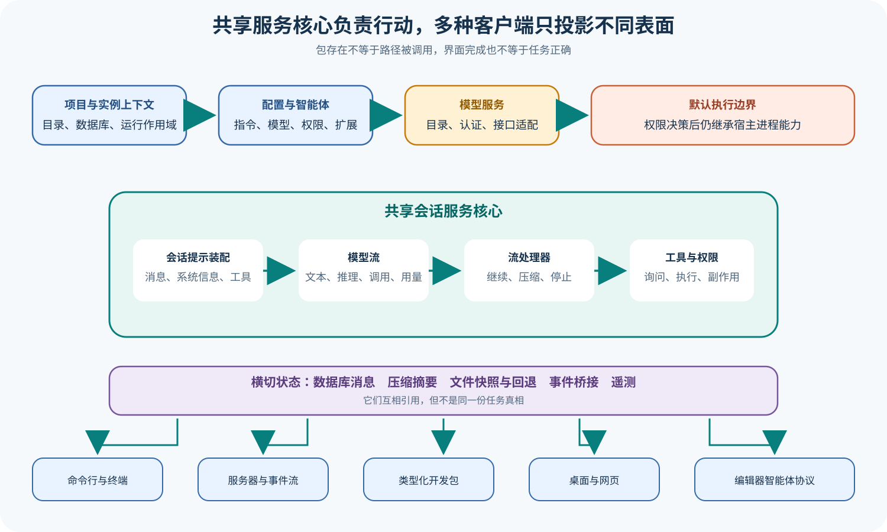

# OpenCode Agent Harness 主线

## 读者会得到什么

这条主线解释 OpenCode 怎样把一个项目目录和用户目标变成有状态、可远程访问、可被多个客户端投影的编码任务。重点不是命令数量，而是责任链：配置从哪里来，模型怎样选中，Session Loop 何时继续，工具在什么权限下执行，消息和文件副作用落在哪里，以及某个客户端显示完成后还缺哪些独立核验。

OpenCode 的服务化任务主链从 Project/Config 进入 Provider，再由 Session Prompt 和 Processor 驱动模型、工具与消息状态。`SessionPrompt` 同时依赖 Session、Agent、Provider、Compaction、Permission、MCP、LSP、Tool Registry、Database 和 Event Bridge；这说明它是组合点，却不意味着所有依赖在每个请求中都会实际调用。课程会继续沿入口、条件和上游测试核对每条分支。

服务核心之上有多种表面。CLI Run 可以执行一次非交互任务，TUI 维护终端交互状态，Server 通过 Protocol Group 和 Handler 提供 HTTP/Event 表面，SDK 生成类型化调用，Desktop/Web 组合客户端界面，ACP 把同一类 Session 行为映射给编辑器协议。表面共享项目和 Session 能力，但连接方式、缓存、取消、权限答复和错误展示并不相同。

权限边界尤其需要收紧。OpenCode 有规则匹配、Agent 权限、用户询问、一次性或持久答复，也会检查外部目录；这些机制决定 Harness 是否继续某个工具调用，却不是操作系统沙箱。若进程运行在宿主环境，已经获准的 Shell、Write、Edit 或插件代码仍继承宿主可见资源。强隔离需要另行部署容器、虚拟机或策略边界，并以拒绝探针验证。

测试、Telemetry 与 Share 能留下运行证据，但不能替代独立评测、Scorer 和发布门禁。上游测试可以证明锁定夹具中的状态机行为，OpenTelemetry 可以记录请求 Span，Share 可以生成外部副本；三者都没有自动判断用户目标、补丁正确性、不可接受副作用或发布风险。

## 系统架构



Claim: opencode.architecture.service-core-multiple-surfaces

图中央是一次任务真正共享的服务核心。Project/Instance 固定工作目录和运行上下文，Config/Agent 提供模型、权限、指令与扩展选择，Provider 解析模型与认证，SessionPrompt 组装消息和工具，LLM 产生流事件，SessionProcessor 将文本、推理、Tool Call、Tool Result、Usage、错误与终止原因写回 Session。

Storage、Snapshot、Compaction 和 Event Bridge 属于横切层。数据库保存 Session 与 Message/Part；Snapshot 与 Revert 管理文件副作用；Compaction 为下一次模型请求生成有损上下文；Event Bridge 把状态变化发送给服务与客户端。它们互相连接，但没有任何单个表能独占「任务真相」。

## 课程状态与顺序

<!-- course-navigation:start -->
| 顺序 | 模块 | 状态 | 先回答的问题 |
| ---: | --- | --- | --- |
| 00 | [主线入口](README.md) | 已复核 | 服务核心、任务链、多表面、权限和评测出口怎样连接？ |
| 01 | [入口、项目、配置与 Provider](01-runtime-project-config-provider.md) | 已复核 | 当前工作目录、配置来源、认证和模型可用性怎样确定？ |
| 02 | [Session Prompt、LLM 与 Processor](02-session-prompt-llm-processor.md) | 已复核 | 流事件、工具状态和多种终止信号怎样驱动循环？ |
| 03 | [工具、权限、询问与补丁](03-tools-permission-question-patch.md) | 已复核 | 注册、模型可见、询问、批准、执行和 OS 隔离怎样分层？ |
| 04 | [存储、历史、压缩与恢复](04-storage-history-compaction-revert.md) | 已复核 | 数据库历史、模型 Context、摘要、快照和回退谁是权威？ |
| 05 | [Agent、Skill、Plugin、MCP 与 LSP](05-agents-skills-plugins-mcp-lsp.md) | 已复核 | 子任务和扩展怎样改变模型可见与真实执行表面？ |
| 06 | [Server、Protocol、SDK 与 Event](06-server-protocol-sdk-events.md) | 已复核 | Schema、Handler、HTTP、事件流和客户端状态怎样连接？ |
| 07 | [TUI、Desktop、Web 与 ACP 表面](07-tui-desktop-web-acp-surfaces.md) | 已复核 | 多个客户端共享什么，又分别维护什么？ |
| 08 | [Share、Telemetry 与 Eval 边界](08-share-telemetry-eval-boundaries.md) | 已复核 | 外部副本、观测、测试、评分、训练和发布怎样分开？ |
<!-- course-navigation:end -->

九篇课程已作为一个批次完成来源核对、内容门禁、中文图示与对抗复核，并进入正式导航。后续若锁定来源漂移，受影响页面必须先退出导航并重新审核。

## 真实输入与输出

### 输入

一次任务输入不只是 Prompt。它还绑定 Project、Session、Agent、Provider/Model、权限规则、工具集合、格式要求和可能的父 Session：

```json
{
  "project":"示例仓库",
  "session":"会话-01",
  "agent":"build",
  "model":{"providerID":"test","modelID":"test-model"},
  "parts":[{"type":"text","text":"修复解析器失败测试"}],
  "permission":[{"permission":"*","pattern":"*","action":"ask"}]
}
```

### 输出

Processor 输出的是持续变化的 Message/Part 和 Session 状态，而不是单一字符串：

```json
{
  "message":{"role":"assistant","finish":"stop","error":null},
  "parts":["reasoning","text","tool-call","tool-result"],
  "usage":{"tokens":"已记录","cost":"按模型元数据估算"},
  "side_effects":{"files":"由快照与差异另行核对"},
  "task_correctness":"尚未由独立评分器判断"
}
```

## 调用链


Claim: opencode.task.session-processor-closes-loop

1. 入口解析工作目录和命令，建立 Project/Instance Context，加载全局、项目、托管与运行覆盖配置。
2. Session 记录用户 Message/Part，并解析 Agent、Provider、Model、指令、Skill、MCP 和工具集合。
3. `SessionPrompt.run` 读取未被压缩排除的消息；即使 Provider 返回普通 Stop，只要仍有未完成 Tool Call，也继续循环以便回送 Tool Result。
4. LLM 层解析认证和模型，准备系统信息、模型消息、工具 Schema 与 Telemetry，再产生统一 Stream Event。
5. Processor 把推理、文本、工具输入、工具调用、工具结果、Usage、Finish 与 Error 逐项写回 Message/Part。
6. 工具在执行前经过规则匹配；Ask 会等待用户或客户端答复，Deny 会阻断，Allow 才进入真实副作用。
7. Processor 返回 `continue`、`compact` 或 `stop`。Compact 会插入压缩请求；Continue 发起下一次模型采样；Stop 结束本轮。
8. 循环结束后异步裁剪旧工具输出并返回最后一条 Assistant Message；客户端把事件投影成自己的界面状态。
9. 独立 Eval 读取冻结输入、最终文件、测试、Trace 与错误，才能判断任务是否正确及是否允许发布。

## 源码证据

`SessionPrompt` 的 Layer 直接取得 Session、Agent、Provider、Processor、Compaction、Plugin、Permission、MCP、LSP、Tool Registry、Database 和 Event Bridge。这是当前组合点的源码证据，不是按目录名推测。

```source
packages/opencode/src/session/prompt.ts:113-143
const sessions = yield* Session.Service
const provider = yield* Provider.Service
const processor = yield* SessionProcessor.Service
```

主循环读取消息后，同时检查 Finish Reason 和未完成 Tool Call。只有 Finish 已终结、没有待回送工具结果且父子消息正确对齐时才退出。

```source
packages/opencode/src/session/prompt.ts:1081-1130
while (true) {
  ...
  if (lastAssistant?.finish && !hasToolCalls) break
}
```

Processor 消费 LLM Stream，并把 Compaction、Blocked/Error 与正常继续映射成三个控制结果：

```source
packages/opencode/src/session/processor.ts:630-681
if (ctx.needsCompaction) return "compact"
if (ctx.blocked || ctx.assistantMessage.error) return "stop"
return "continue"
```

## 失败与限制

第一，工作区含有多个 core、server、protocol、sdk 和客户端包，且存在兼容层与迁移路径。课程只以锁定 Commit 的实际入口和调用者为准，不用包名推断默认架构。

第二，模型目录和 Provider 配置存在不等于当前环境可以请求。认证、区域、网络、配额、接口兼容、模型状态和 Header 都可能在运行时失败。

第三，Permission `allow` 只表示 Harness 规则允许继续；它不会自动限制子进程、插件、网络、环境变量或已挂载文件。Ask 也只是控制流，不是强隔离。

第四，Assistant Finish 或 Session Idle 只说明 Loop 停止。内容过滤、结构化输出缺失、工具失败、文件错误或测试失败仍可能让任务不正确。

第五，数据库历史、模型可见消息和压缩摘要不是同一个对象。Compaction 会选择近期 Turn 并清理旧 Tool Output，不能把当前 Context 当无损历史。

第六，HTTP 2xx、SSE 正常结束、SDK Promise Resolve 或客户端显示完成，只证明各自协议层成功。服务端副作用与任务断言必须另行核验。

第七，锁定测试使用本地测试 Provider 和夹具。它们能证明状态机分支，不证明真实供应商、生产客户端或外部分享系统部署成功。

## 验证方法

以本地测试 Provider 构造四类响应：纯文本 Stop、Tool Call 后 Stop、Context Overflow、Content Filter。固定 Project、Session、Agent、Permission 和工具，然后保存 Message/Part/Event 顺序，验证循环只在工具结果已经回送后终止。

权限实验对同一 Shell 或 Write 调用分别使用 Allow、Ask、Deny；Ask 再覆盖一次允许、持久允许和拒绝。将进程置于普通宿主与外部容器中重复无破坏探针，证明 Harness 决策与 OS 隔离是两层控制。

历史实验先生成多轮工具输出，再触发 Compaction、Prune、Snapshot 和 Revert。比较数据库记录、模型消息、当前文件树、分享副本和 Eval Artifact 的 Hash，确认它们不会被错误当成同一份权威状态。

最终发布实验固定 Dataset 与 Trial，Attempt 只恢复基础设施失败。独立 Scorer 读取最终文件、测试与禁止副作用；训练 RewardAdapter、Checkpoint 选择集和发布 Holdout 分别版本化。

## 自检

### 问题 1

为什么 `SessionPrompt` 依赖某个服务不等于每次任务都调用它？

**答案：** Layer 依赖只证明组合时可获得该服务；真实调用还取决于配置、消息、Agent、工具和错误分支。

### 问题 2

Provider 返回 Stop 后为什么 Loop 仍可能继续？

**答案：** 如果 Assistant Message 仍含未完成 Tool Call，Harness 必须执行工具并把 Tool Result 回送模型，不能只看 Stop 字段。

### 问题 3

用户批准一次工具调用后是否获得沙箱？

**答案：** 没有。批准只允许 Harness 继续；实际进程仍受宿主或另行部署的操作系统隔离约束。

### 问题 4

客户端显示完成能否证明补丁正确？

**答案：** 不能。还要核对最终文件、测试、错误、副作用和独立 Scorer 的版本化判定。
