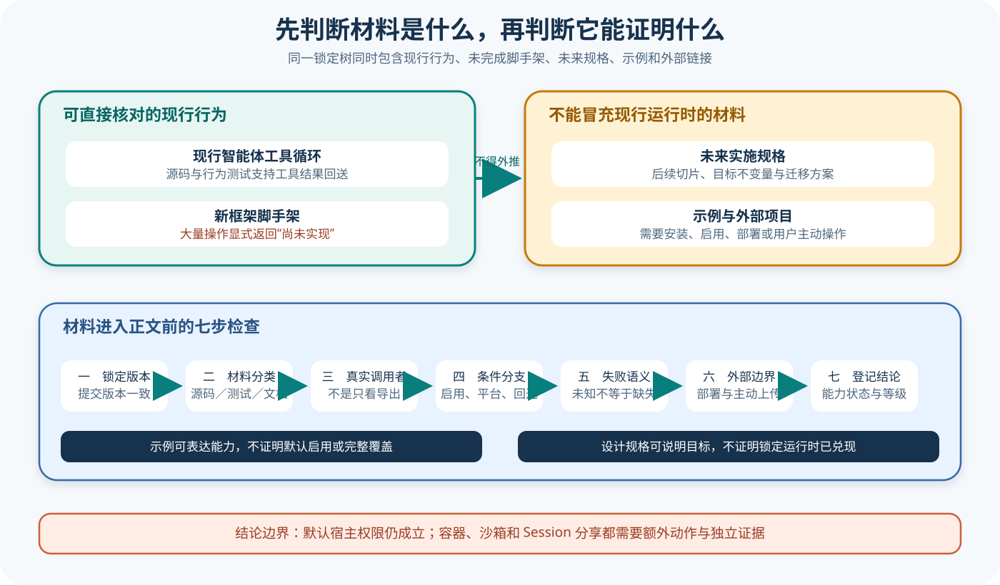

# pi 运行时、设计文档与外部边界

## 读者会得到什么

读完本篇，你能判断一段 pi 结论究竟来自现行 Runtime 源码、上游测试、未来实施规格、Extension 示例、部署文档，还是外部项目。关键能力在于识别材料边界，并在证据强度不足时停止外推。

pi 的锁定树同时存在两套容易混淆的 Agent 路径。`packages/agent/src/agent-loop.ts` 是有上游行为测试支持的现行工具循环；`packages/agent/src/harness/**` 则包含新的 AgentHarness Scaffold，而 `packages/agent/docs/harness.md` 描述比 Scaffold 更完整的未来状态机。三者同仓并不表示它们在锁定版本中已经合并。

上游测试自己使用「AgentHarness v2 scaffold」命名，并要求大量公开操作显式抛出 `HarnessNotImplemented`。与此同时，实施规格写明这一批 Scaffold 源码和测试在第一个切片可以直接删除。这个强烈信号要求课程逐项检查调用者和测试，不能从规格的完整接口表反推当前 Runtime 已经兑现。

安全材料也有相同问题。`examples/extensions/sandbox` 展示怎样替换 Bash 工具并接入操作系统沙箱；`docs/containerization.md` 说明怎样运行 Gondolin、Docker 或 OpenShell。它们证明可选方案和集成路径，不证明默认 CLI 已经隔离。

Session 分享更外一层。根 README 指向单独的 `pi-share-hf` 项目，并要求用户准备外部账户和命令行工具。这个说明证明上游鼓励自愿分享，却不能证明 Coding Agent 默认上传 Session，也不能为外部仓库的当前实现提供本地源码证据。

证据层级决定句子的主语和时态。

## 真实输入与输出

### 输入

下面是一条真实可调用的 Scaffold 操作。锁定测试创建 AgentHarness 后调用 `prompt("hello")`，并把操作名加入 unfinished 列表：

```json
{"surface":"AgentHarness v2 scaffold","operation":"prompt","input":"hello"}
```

### 输出

测试期望 Promise 拒绝，错误对象携带 `HarnessNotImplemented` 和操作名 `prompt`。锁定测试把这种拒绝定义为当前契约：

```json
{"name":"HarnessNotImplemented","operation":"prompt","message":"AgentHarness.prompt is not implemented yet"}
```

因此，实施规格里关于持久操作、重试、工具恢复、收件箱、导航和迁移的完整流程只能写成「计划设计」。如果文章把这个输入画成已经运行完整状态机，就与当前测试直接冲突。

## 调用链



Claim: pi.evidence.design-doc-is-not-runtime

Claim: pi.security.examples-are-not-default-boundaries

1. 先固定 Commit，并列出所分析文件是 Source、Test、Design Doc、Example、Deployment Doc 还是 External Link。
2. 对 Source 查找真实调用者和导出；类名、接口或目录存在只说明代码可见，不说明产品入口已经使用。
3. 对 Test 读取输入、断言和 Mock 边界。锁定 Scaffold 测试明确把多个公开操作定义为尚未实现。
4. 对 Design Doc 检查未来时态、切片表和迁移说明。规格要求第一个切片可删除当前 Harness Scaffold，说明它不是对现行完整行为的描述。
5. 对 Example 检查安装、显式启用、平台和失败回退。Sandbox 示例需要 `-e` 启用，初始化失败时会调用本地 Bash。
6. 对 Deployment Doc 记录额外进程、挂载、网络、凭据和网关。容器方案必须实际部署后才形成强边界。
7. 对 External Link 只记录公开关系和用户动作；没有把外部仓库锁入来源时，不描述其内部实现。
8. 最后把结论写成带条件的 Claim，并把未知项保留为 unknown，而不是用设计目标补齐。

## 源码证据

Scaffold 的错误类型直接把未实现状态编码进 Runtime：

```source
packages/agent/src/harness/agent-harness.ts:74-81
export class HarnessNotImplemented extends Error {
  constructor(operation: string) {
    super(`AgentHarness.${operation} is not implemented yet`);
    this.name = "HarnessNotImplemented";
  }
}
```

这里用全角符号重建模板字符串，只为避免把课程文本解释成真实插值；准确短摘录由 Claim 绑定锁定行号。

上游测试枚举了 prompt、skill、compact、navigate、resume、abort、队列、watch 和 lane 等未完成操作，并逐项断言拒绝：

```source
packages/agent/test/harness/agent-harness-scaffold.test.ts:145-188
it("rejects every unfinished public operation explicitly", async () => {
  for (const [operation, invoke] of unfinished) {
    await expect(Promise.resolve().then(invoke), operation)
      .rejects.toMatchObject({ name: "HarnessNotImplemented", operation });
  }
});
```

未来规格又给出更强边界：`packages/agent/docs/harness.md:2798-2815` 把 R3 到 R12 列为后续实施切片，并明确 `packages/agent/src/harness/**` 在切片 1 可直接删除。规格保留旧 `agent-loop.ts` 行为，说明旧 Loop 与未来 Harness 不能被揉成同一现行路径。

Sandbox 示例的 `execute` 也暴露默认回退。如果 `sandboxEnabled` 或 `sandboxInitialized` 为假，它直接执行 `localBash`；Session 启动时，命令行禁用、配置禁用、平台不支持或初始化异常都会令这两个条件失败。示例证明可扩展安全路径，也证明「文件存在」远远不够。

## 失败与限制

第一，不能因为 Scaffold 不完整就说 pi 没有 Agent Harness。现行 `Agent` 与 `agent-loop.ts` 已有完整工具循环；结论只限定新的 AgentHarness v2 Scaffold 和其未来规格。

第二，不能把设计文档全部降为无用。规格对目标不变量、持久化和迁移提供重要设计证据，也能指导将来漂移复核；它只是不足以证明锁定 Runtime 已兑现。

第三，Sandbox 示例在支持平台、依赖齐全、配置有效且初始化成功时可以形成操作系统级 Bash 边界。本篇否定的是默认启用和全工具覆盖，不否定该方案本身。

第四，Docker 的挂载可能把宿主工作区直接暴露给容器，Gondolin 只重定向特定工具，OpenShell 又依赖网关和策略。把三者统一写成「已沙箱化」会丢失威胁模型。

第五，Session 分享的公开链接不证明默认遥测。是否上传、上传哪些字段、如何脱敏、许可证和删除机制都要在外部项目锁定后另行核对；当前只能确认用户需要主动设置。

第六，上游 Commit 会变化。未来某个版本可能完成 Scaffold、改变默认工具或内建权限；届时应把文章标为 stale 并重核调用者，不能自动用新文档改写旧 Claim。

一个仓库可以同时包含过去、现在和未来。

## 验证方法

运行静态证据检查时，先确认 Lock 和 Checkout HEAD。随后搜索 AgentHarness 的产品调用者、`HarnessNotImplemented`、测试标题和设计文档的切片表；将每个公开操作标记为已实现、显式未实现或未知。

对 Sandbox 示例，只做无密钥的源码和目标测试核对：确认需要显式加载、确认初始化条件、列出支持平台，并追踪所有回退到 `localBash` 的分支。不要因为默认配置 `enabled: true` 就忽略 Extension 本身尚未安装或加载。

如果实际验证容器化，分别运行最小临时仓库，记录宿主与容器文件差异、挂载、网络、凭据可见性和策略拒绝。没有完成这些实验时，Claim 保持 C 级，不写成已验证隔离。

对 Session 分享，只验证根 README 的外部链接和主动动作，不执行上传，也不推断外部数据格式。真正的数据治理实验需要单独授权、脱敏夹具和可删除的测试账户。

先分类材料，再允许结论进入正文。

## 自检

### 问题 1

为什么新的 AgentHarness 类存在仍不能证明完整状态机已经运行？

**答案：** 锁定源码和上游测试明确让大量公开操作抛出 HarnessNotImplemented，未来规格还允许在第一切片删除当前 Scaffold；必须等待具体实现和调用者证据。

### 问题 2

Sandbox 示例的默认配置是 enabled，为什么仍不是默认隔离？

**答案：** Extension 需要安装和显式加载；即使加载，禁用标志、配置、平台或初始化失败都会回退本地 Bash。配置默认值只在 Extension 已进入运行时后生效。

### 问题 3

本篇是否否定 pi 现行 Agent Loop？

**答案：** 不否定。旧 agent-loop.ts 有源码和行为测试支持；本篇只阻止把未来 AgentHarness v2 规格写成现行完整实现。

### 问题 4

根 README 的 Session 分享段落能证明什么？

**答案：** 它证明上游推荐一个需要用户主动设置的外部分享项目；不能证明默认上传，也不能证明外部项目内部字段和治理行为。
