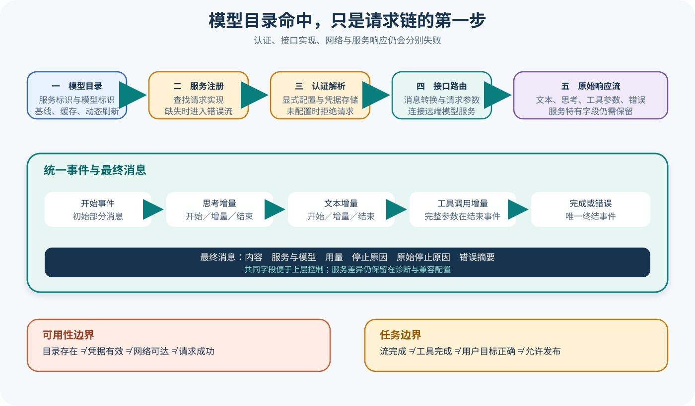

# pi 多 Provider 与流归一化

## 读者会得到什么

本篇解释 pi-ai 怎样把不同模型服务的请求和流响应投影成 Agent Core 可以消费的共同协议。你会看到模型目录、Provider 注册、认证解析、消息上下文、事件流、工具调用、用量、停止原因和错误分别承担什么责任。

所谓归一化，并不表示 Provider 能力完全一致。pi 保留 `api`、`provider`、`model`、`responseModel`、`rawStopReason`、思考签名和兼容配置等差异；共同类型只让上层能用稳定分支处理文本、思考、工具调用、结束和失败。

`Models.getModel()` 只查找目录项。真正请求还会经过 `requireProvider()`、`applyAuth()` 和对应 API Stream；未知 Provider、未配置认证或缺少 API 实现都会在更晚阶段失败。模型名称显示在列表里，不能直接证明当前账户可调用。

流协议把增量与终结分开。文本、思考和工具参数各有 start、delta、end；最终必须以 `done` 或 `error` 收敛。`AssistantMessageEventStream.result()` 返回最终 AssistantMessage，但这个消息仍只表示模型层终态，Agent Loop 是否继续取决于工具调用、队列和 Hook。

用量也需要限定。`Usage` 统一输入、输出、缓存读写、推理 Token 与成本字段，不过 Provider 未报告的细分会保持未定义，价格也依赖锁定模型元数据。不能把字段存在写成所有服务都准确提供。

先把流变成共同语法，再由 Agent 解释共同语法。

## 真实输入与输出

### 输入

Faux Provider 测试构造一个确定性 Assistant 响应，按顺序含思考、文本和工具调用，并指定停止原因为 `toolUse`：

```json
{"content":[{"type":"thinking","thinking":"go"},{"type":"text","text":"ok"},{"type":"toolCall","id":"tool-1","name":"echo","arguments":{}}],"stopReason":"toolUse"}
```

### 输出

`stream()` 将它展开成固定事件序列。工具参数可以由多个 delta 组成，`toolcall_end` 才提供完整 ToolCall，最后 `done` 携带最终 AssistantMessage：

```json
{"events":["start","thinking_start","thinking_delta","thinking_end","text_start","text_delta","text_end","toolcall_start","toolcall_delta","toolcall_end","done"]}
```

这组测试不需要真实 API Key，适合证明共同事件协议。它没有验证 Anthropic、OpenAI、Google 或其他线上服务当前返回完全相同的原始 Frame。

## 调用链



Claim: pi.ai.provider-stream-is-normalized

Claim: pi.ai.model-catalog-is-not-runtime-availability

1. 调用方按 Provider ID 和模型 ID 查询 `Models`；目录可以来自内建基线、动态刷新或持久缓存。
2. 请求进入 `stream()` 或 `streamSimple()`，先用模型中的 Provider ID 查找已注册 Provider。
3. `applyAuth()` 解析显式 Key、凭据存储、OAuth、环境和 Provider 特定认证；调用方显式选项按字段覆盖解析结果。
4. Provider 根据模型的 `api` 选择对应 Stream 实现；缺少实现时返回错误流。
5. Provider 适配器把共同 Context 转换成远端请求，并把远端增量解析为思考、文本与工具调用事件。
6. `AssistantMessageEventStream` 排队交付事件；出现 `done` 或 `error` 时解析最终 AssistantMessage。
7. 最终消息携带统一 Usage、StopReason、错误、原始停止原因和 Provider 身份，交给 Agent Core。
8. Agent Core 再根据 `toolUse`、`length`、`error`、`aborted` 或 `deferred` 决定执行工具、恢复、结束或等待；模型层本身不判定任务正确。

## 源码证据

共同类型同时保留统一字段和 Provider 差异：

```source
packages/ai/src/types.ts:372-467
export interface ToolCall { type: "toolCall"; id: string; name: string; arguments: Record<string, any>; }
export interface Usage { input: number; output: number; cacheRead: number; cacheWrite: number; totalTokens: number; }
export type StopReason = "pending" | "stop" | "length" | "toolUse" | "error" | "aborted" | "deferred";
export interface AssistantMessage { provider: ProviderId; model: string; usage: Usage; stopReason: StopReason; }
```

Models 在调用 Provider 前强制解析认证；未配置认证不会因为目录命中而跳过：

```source
packages/ai/src/models.ts:628-679
const provider = this.providers.get(model.provider);
if (!provider) throw new ModelsError("provider", ...);
const resolution = await this.getAuth(model, ...);
if (!resolution) throw new ModelsError("auth", ...);
return provider.stream(requestModel, context, requestOptions);
```

事件流只把 `done` 和 `error` 识别为终结事件。Faux Provider 的固定分块测试进一步锁定了 start、thinking、text、toolcall 和 done 的顺序；另一个 Models Runtime 测试确认未知 Provider 形成 error AssistantMessage，而成功测试得到 start、done 和 stop。

Context Overflow 也不是单一字符串。`isContextOverflow()` 依次检查已知错误模式、成功但 Usage 超过窗口的静默溢出，以及 length 且没有输出的近满窗口分支。自定义 Provider 的错误文本可能无法命中，因此分类仍有 unknown。

## 失败与限制

第一，目录命中只说明模型元数据可见。认证可能缺失，Provider 可能未注册，API 实现可能不匹配，网络和区域也可能拒绝请求。

第二，共同 StopReason 会压缩 Provider 差异。调试时应同时保存 `rawStopReason`、错误正文的安全摘要、HTTP 状态和 Provider 身份；不可把所有 error 合并成模型质量差。

第三，`done` 表示流协议收敛。它无法证明工具已经执行、用户目标完成或最终文件正确，后续 Agent 与 Eval 仍有独立终态。

第四，Usage 的共同字段不保证同口径。缓存、推理 Token、服务端计费和响应模型可能由不同 Provider 采用不同定义；跨 Provider 成本比较必须固定版本和计价来源。

第五，Abort 可能来自调用方 Signal、网络中断或 Provider 响应。统一 `aborted` 有利于控制流，但恢复策略仍要判断副作用是否已经发生。

第六，真实跨 Provider Handoff 测试依赖各服务凭据，会按环境跳过或产生外部成本。本篇没有执行它，因此不会把目录里的 Provider 列表写成全部已验证。

共同协议降低上层复杂度，也要求保留原始诊断。

## 验证方法

先静态核对 `types.ts`、`models.ts`、具体 Provider 和事件流实现，确认模型的 API 值能路由到真实 Stream，并记录认证分支。随后运行 Faux Provider 和 Models Runtime 的无密钥测试，保存完整事件序列。

向测试 Provider 注入未知 Provider、缺少认证、缺少 API 实现、error、aborted、length、deferred 和不完整工具参数。逐项检查最终 StopReason、错误消息、事件是否终结以及 `result()` 是否可解析。

真实 Provider 实验必须单独授权并记录版本、区域、端点、模型、认证来源、请求选项、原始停止原因和响应模型；密钥正文不得进入 Artifact。一个 Provider 的成功不能替代其他 Provider。

Eval 以统一 AssistantMessage 和原始诊断为 Trace 输入，但评分器检查目标产物。训练 Reward、Checkpoint 选择与独立发布 holdout 继续使用不同数据和决策记录。

归一化协议，保留差异证据。

## 自检

### 问题 1

`getModel()` 返回对象后，为什么请求仍可能失败？

**答案：** 它只证明目录命中；真正请求还要找到 Provider、解析认证、匹配 API 实现，并通过网络、区域和配额检查。

### 问题 2

`done` 与 `stop` 能证明 Agent 任务完成吗？

**答案：** 不能。它们描述模型流和模型响应终态；Agent 还可能执行工具、处理队列，Eval 还要检查目标产物。

### 问题 3

Faux Provider 测试提供了什么强证据？

**答案：** 它用确定性夹具锁定共同内容结构、增量事件顺序和终结语义，不证明任何线上 Provider 当前可用。

### 问题 4

为什么跨 Provider 比较要保存原始停止原因和 Provider 身份？

**答案：** 共同 StopReason 会压缩服务差异；保留原始字段才能判断错误分类、兼容分支和成本口径是否真的可比。

