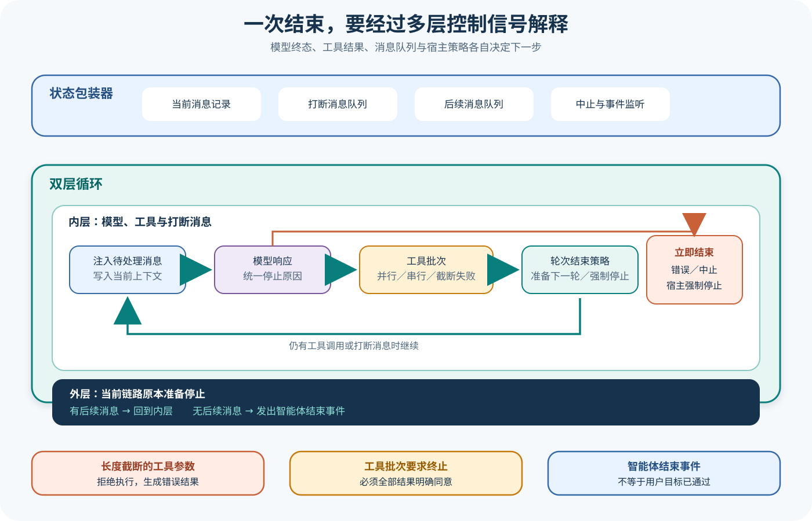

# pi Agent Loop、状态与工具执行

## 读者会得到什么

本篇拆开 pi Agent Core 的状态包装器、双层循环、消息队列、模型流、工具批次和终止分支。读完后，你应能解释一次工具调用为什么可能触发第二次模型采样，steering 与 follow-up 在何时注入，以及 `stop`、`length`、`terminate`、Abort 和 `shouldStopAfterTurn` 为什么不是同一种结束。

`Agent` 是有状态包装器。它持有当前 Transcript、监听器、Abort Controller、steering 队列和 follow-up 队列，并把模型、转换器与工具执行策略交给底层 Loop。队列的 `one-at-a-time` 与 `all` 决定一次 Drain 取一条还是全部；消息排队时尚未写入公开 Transcript。

底层 Loop 有两层。内层处理模型采样、工具批次和 steering；外层只在 Agent 原本准备停下时检查 follow-up。这个结构让「打断下一轮」与「本轮完成后继续」保持不同语义。

工具批次可并行或串行。工具自身标记为 sequential 时，即使全局策略是 parallel，也会走串行路径。并行完成事件可以按真实完成时间发出，但 Tool Result 会恢复到源调用顺序再写入上下文，避免下一次模型采样看到不稳定的历史排列。

终止判断分散在多个层次。模型 `error` 或 `aborted` 会立即结束；`length` 且带 Tool Call 时拒绝执行可能被截断的参数；工具结果只有全部 `terminate=true` 才终止整个批次；`shouldStopAfterTurn` 则在 Turn 已完成后强制结束，并且不再轮询 follow-up。

所以，Agent Loop 不是「请求模型直到 stop」的简单 while；它是一个解释模型终态、工具副作用、消息队列与宿主策略的控制状态机。

## 核心概念

pi 的 `Agent` 与 `agent-loop` 分担不同责任。`Agent` 保存可变 Transcript、当前配置、监听器、Abort Controller，以及 steering 和 follow-up 两个待处理队列；底层 Loop 接收这些能力并推进一次 Active Run。把状态包装与控制循环分开后，产品层可以订阅事件、替换模型或排队消息，而核心循环仍只处理当前上下文怎样从一个 Turn 走到下一个 Turn。

一次 Turn 包含输入消息、一次模型响应和可能发生的工具批次。工具结果写入 Context 后，Loop 通常需要再次采样模型，因此一次 Prompt 可以产生多个 Turn。steering 是要在内层循环下一次采样前插入的干预，follow-up 则只在本轮工具链和 steering 清空、Agent 即将结束时进入外层循环。两种消息都可能来自用户或宿主，但时机不同，不能合并为一个普通队列。

终止也是组合判断。模型 `error` 或 `aborted` 可以立即结束；`length` 且包含 Tool Call 时，参数可能被截断，Loop 生成失败 Tool Result 而不执行副作用；工具批次只有全部最终结果都要求 `terminate` 才整体终止；`shouldStopAfterTurn` 是宿主在 Turn 边界施加的停止策略。最后的 `agent_end` 仅说明这次控制循环收敛，产品目标还需独立验证。

| 概念 | 保存或解释的内容 | 进入时机 | 离开条件 |
| --- | --- | --- | --- |
| Agent State | Transcript、模型、工具、监听器和运行状态 | 产品调用 `prompt()` | 状态更新或 Run 结束 |
| Active Run | Abort Signal 与本次事件流 | Prompt 被接受 | `agent_end` 或异常收敛 |
| Context | 当前送入 Loop 的 Agent Message 投影 | 每个 Turn 开始前 | 模型响应与工具结果追加 |
| Steering Queue | 下一次内层采样前的干预消息 | Run 进行中随时排队 | 按队列模式 Drain |
| Follow-up Queue | Agent 原本准备结束后继续的新消息 | 外层循环边界 | 无 follow-up 时结束 |
| Model Response | 文本、工具调用、Usage 与 StopReason | 一次模型流收敛后 | 被终止判断或工具阶段消费 |
| Tool Batch | 同一响应中的一组工具调用 | 允许执行 Tool Call 时 | 所有结果 Finalize 并稳定排序 |
| Termination Policy | error、abort、length、terminate 与宿主停止 | 多个控制边界 | 生成明确的 Agent 终态 |

## 为什么这样设计

双层循环首先解决交互时序。用户在工具链进行中追加「改用另一种方法」，应该在下一次模型采样前成为 steering；用户在一个回答结束后追加「再生成摘要」，则更像 follow-up。若只用单个队列，Loop 要么过早把 follow-up 插入当前推理，要么等到结束后才处理紧急 steering，都会改变用户可观察的行为。

工具结果恢复到源调用顺序，是为了让并发不破坏会话确定性。两个并行工具的完成先后受文件大小、调度和网络影响；如果按完成顺序写入 Transcript，同一输入可能形成不同历史，后续模型采样和 Session 重放都会漂移。pi 允许事件按真实时间到达，同时在形成消息列表时按原 Tool Call 顺序排列，兼顾实时可观测与稳定上下文。

`length` 工具调用防护体现副作用优先原则。被截断的 JSON 仍可能恰好通过 Schema，例如路径字符串或布尔值尾部缺失但仍是合法值。若只做 Schema 验证，Loop 可能执行模型未完整表达的动作。把 `length + toolCall` 视为不可执行并回送错误结果，可以让模型重新发起完整调用，成本是多一次采样，收益是避免不确定意图直接变成副作用。

多种终止信号保持独立，是因为它们代表不同控制者。模型决定本次输出为何停止，工具可以建议任务在批次后结束，宿主可以在 Turn 边界实施预算或产品策略，Abort 则由外部请求取消。将它们压成一个布尔值会丢失恢复语义，也无法回答「是否执行过副作用」「是否还应读取 follow-up」等关键问题。

## 实现思路

下面是课程化的双层循环蓝图，用来表现控制边界，不是 pi 上游源码的替代实现。实现时要把消息追加、事件发射和副作用提交当作不同动作；每个退出分支都应生成可诊断终态，不能用裸 `break` 抹掉原因。

Loop 还要为一次运行分配稳定 ID，并把模型 Turn、Tool Call 与 Tool Result 关联起来。事件监听器可以观察进度，却不应反过来成为唯一状态存储；恢复或重放应以已提交 Transcript 和明确的副作用记录为准，避免 UI 漏事件就改变控制结果。

```ts
async function runAgent(initial: AgentMessage[], cfg: LoopConfig) {
  let pending = initial;

  while (true) {                         // follow-up 外层
    while (pending.length || cfg.hasToolWork()) { // steering / tool 内层
      cfg.appendPending(pending);
      const assistant = await cfg.sample();
      if (assistant.stopReason === "error" || assistant.stopReason === "aborted") {
        return cfg.finish(assistant.stopReason);
      }
      await cfg.handleToolBatchSafely(assistant);
      if (await cfg.shouldStopAfterTurn()) return cfg.finish("host-policy");
      pending = await cfg.drainSteering();
    }
    pending = await cfg.drainFollowUp();
    if (!pending.length) return cfg.finish("idle");
  }
}
```

1. `Agent.prompt()` 建立 Active Run，冻结本次所需配置并创建 Abort Signal。若已有不允许并行的 Run，应返回明确状态，而不是复用旧 Abort Controller。
2. 把初始消息加入 pending，在进入模型前依次经过 Context Transform 和模型消息转换。Transform 只影响投影，不应无声删除持久 Transcript。
3. 收集完整 AssistantMessage 并解释 StopReason。`error` 与 `aborted` 直接收敛；`length` 与 Tool Call 的组合进入专门失败路径，不调用工具实现。
4. 对正常 Tool Call 做准备、Schema 校验和 Hook。按全局策略及工具的 sequential 标志拆分批次，发出 start 事件后执行。
5. 工具结束后运行 Finalize/after Hook，保存 `isError`、内容、Usage 和 `terminate`。并行事件可按完成时间发出，写入 Context 前恢复源调用顺序。
6. Turn 结束后执行 `prepareNextTurn` 和 `shouldStopAfterTurn`。宿主强制停止时不得继续读取 follow-up，否则预算或人工停止会被绕过。
7. 若继续，先 Drain steering 并回到内层；只有工具链和 steering 都为空，才在外层 Drain follow-up。
8. 队列为空时发出 `agent_end`，同时记录结束原因、模型调用数、工具批次数和 Abort 状态。产品成功字段由独立验证器填写。

测试要围绕状态转移而非只看最终文本。至少覆盖正常工具闭环、并行完成顺序、强制 sequential、steering、follow-up、全部与部分 terminate、length 截断、error、abort 和宿主停止，并核对每条路径的模型调用次数与副作用次数。

## 贯穿案例

假设用户要求「读取两个配置文件，比较后给出结论」，模型第一次同时发起两个只读 Tool Call。工具 A 很快完成，工具 B 稍慢；B 执行期间用户排入 steering：「忽略测试环境字段」。初步回答完成后，用户又排入 follow-up：「把结论压缩成三点」。这个场景同时覆盖并发排序、双队列与多轮终止。

案例把两个工具设为无副作用只为聚焦 Loop 语义。若换成写文件或远端请求，还要额外记录幂等键、提交点和 Abort 后的真实目标状态；队列和事件顺序正确，并不自动解决副作用恢复问题。

第一次模型响应如下：

```json
{
  "stopReason":"toolUse",
  "content":[
    {"type":"toolCall","id":"a","name":"read_file","arguments":{"path":"config-a.json"}},
    {"type":"toolCall","id":"b","name":"read_file","arguments":{"path":"config-b.json"}}
  ]
}
```

1. Loop 按 parallel 策略启动 A 和 B。A 的 end 事件先出现，B 的 end 事件后出现；这是真实完成时序，可用于性能诊断。
2. 两个结果 Finalize 后，Loop 按原 Tool Call 顺序把 `toolResult(a)`、`toolResult(b)` 写入 Context。即使多次运行完成时序变化，下一次模型看到的角色和调用顺序保持稳定。
3. B 运行期间到达的「忽略测试环境字段」进入 steering 队列。工具批次结束后，内层循环先 Drain steering，再采样比较结论；它不会等到 Agent 原本准备结束。
4. 模型返回 `stop` 且没有新工具，内层准备收敛。外层此时才读取「压缩成三点」的 follow-up，并开启新的 Turn。
5. follow-up 响应结束且两个队列为空，Loop 发出 `agent_end`。验证器随后检查结论是否真的忽略测试字段、三点是否基于两个文件，而不是只看 `stop`。

稳定的 Transcript 投影应类似：

```json
{
  "eventCompletionOrder":["toolResult:a","toolResult:b"],
  "contextOrder":["user","assistant(tool:a,b)","toolResult:a","toolResult:b","steering","assistant","followUp","assistant"],
  "agentTerminal":"idle",
  "productVerdict":"由独立断言填写"
}
```

再加入一个故障变体：模型因输出上限得到 `stopReason: length`，却包含看似合法的 `read_file` 参数。Loop 不执行该调用，而是生成说明截断风险的错误 Tool Result，再让模型重发。若第二次调用完整，工具执行次数仍应为一次；若 Provider 错把截断映射为 `toolUse`，这层防护可能失效，Trace 必须保留 rawStopReason 以便定位适配问题。

这个案例说明，响应结束、工具结束、Loop 结束和任务成功是四个不同事件。双层循环决定消息何时进入，稳定排序决定模型看到什么历史，长度防护决定副作用是否允许发生，独立 Eval 才决定用户目标是否兑现。任何一层都不能替下一层宣布成功。

## 真实输入与输出

### 输入

上游测试让第一次模型响应返回一个 `echo` Tool Call，第二次响应返回最终文本：

```json
{"turn":1,"stopReason":"toolUse","toolCall":{"id":"tool-1","name":"echo","arguments":{"value":"hello"}}}
```

### 输出

工具实际执行一次，结果作为 `toolResult` 追加，随后模型看到更新后的上下文并结束：

```json
{"executed":["hello"],"roles":["user","assistant","toolResult","assistant"],"finalStopReason":"stop"}
```

另一个测试把同样的 Tool Call 标成 `length`。即使残缺参数仍能通过 Schema，工具也不会执行；Loop 生成错误 Tool Result，再给模型一次重新发起完整调用的机会。

## 调用链



Claim: pi.agent.loop-interprets-multiple-stop-signals

Claim: pi.agent.length-truncated-tool-is-not-executed

1. `Agent.prompt()` 建立 Active Run 和 Abort Signal，将新用户消息与当前状态交给底层 Loop。
2. Loop 先取 steering 队列；内层每次开始时把待处理消息发出 start/end 事件并写入当前上下文。
3. `transformContext` 可以裁剪 Agent Message，`convertToLlm` 再转换成模型兼容消息；两步不会直接改写持久 Transcript。
4. 模型流被折叠成 Assistant Message。`error` 与 `aborted` 发出 Turn End、Agent End 后立即返回。
5. 存在 Tool Call 时，`length` 分支生成错误 Tool Result；其他情况按并行或串行策略准备、执行并 Finalize 工具。
6. 每个工具经过 start、可选 Hook、execute、可选 Hook、end 和 Tool Result Message；结果随后追加到 Context。
7. Turn End 之后，宿主可用 `prepareNextTurn` 改写下一轮 Context、Model 或推理等级，再用 `shouldStopAfterTurn` 强制收敛。
8. 若未强制结束，Loop 轮询 steering；工具链与 steering 都清空后，外层才取 follow-up。
9. 没有新 follow-up 时发出 Agent End。此时只证明控制循环收敛，不能证明目标产物正确。

## 源码证据

Agent 明确拥有两个队列，并为每个队列设置独立 Drain 模式：

```source
packages/agent/src/agent.ts:125-177
class PendingMessageQueue { enqueue(...); drain(...); clear(...); }
private readonly steeringQueue: PendingMessageQueue;
private readonly followUpQueue: PendingMessageQueue;
```

双层循环先消费 steering，再执行模型与工具；Agent 原本准备结束时才查询 follow-up：

```source
packages/agent/src/agent-loop.ts:169-274
while (true) {
  while (hasMoreToolCalls || pendingMessages.length > 0) { ... }
  const followUpMessages = (await config.getFollowUpMessages?.()) || [];
  if (followUpMessages.length > 0) { pendingMessages = followUpMessages; continue; }
  break;
}
```

Tool Call 并非只要存在就执行。锁定实现对 `length` 使用专门失败路径，并在错误结果中说明输出 Token 上限可能截断参数。上游测试确认 `executed` 为空，同时 Loop 进行了第二次模型调用。

普通工具测试则确认 `echo` 执行一次，start/end 事件存在，经过 `afterToolCall` 修改的 Usage 被写入 Tool Result。它证明 Core 的工具闭环和 Hook 位置，不证明真实命令、文件或网络工具的安全性。

并行与串行路径最终都返回 `{messages, terminate}`。`shouldTerminateToolBatch()` 要求批次非空且每个最终结果都显式 `terminate=true`；一个工具要求终止而另一个没有，Loop 仍可继续。这条规则避免并行批次被首个快速结果提前截断。

## 失败与限制

第一，Assistant Message 的 `stop` 只表示本次模型输出结束。队列里可能还有 follow-up，宿主也可能从产品层开启新的 Prompt。

第二，工具 start 事件不等于副作用成功。真正结果要看 end 事件、`isError`、Tool Result 内容和目标系统状态；Abort 发生时还要核对副作用是否已部分落地。

第三，`length` 防护只覆盖被明确标记为长度截断的 Assistant Message。Provider 若错误映射 StopReason，Core 无法仅凭参数外观知道内容是否完整。

第四，`beforeToolCall` 与 `afterToolCall` 可以 Block、改写结果或要求终止。Hook 是策略接入点，不自动等于审批、隔离或审计；具体产品必须证明它注册了什么策略。

第五，Context Transform 影响送入模型的投影，不应被描述成原始会话已经删除。持久化与压缩将在会话课程中单独分析。

第六，上游测试使用 Mock Stream 和进程内 echo 工具。它锁定事件与状态语义，没有连接真实 Provider，也没有验证 Shell、文件或网络副作用。

## 验证方法

先运行 Agent Core 的无密钥测试，保存事件顺序、模型调用次数、Tool Result 顺序和最终角色序列。分别覆盖普通 Tool Call、两个并行 Tool Call、强制 sequential、steering 注入、follow-up、`shouldStopAfterTurn`、全部 terminate、部分 terminate、error、aborted 与 length。

然后构造一个可观测但无破坏性的文件工具，在临时目录执行。为每次调用记录 Tool Call ID、开始时间、结束时间、返回顺序和最终写入 Transcript 的顺序，确认并行事件与稳定历史投影之间没有混淆。

恢复测试必须在 Abort 后检查真实目标，而非只看 `aborted`。如果工具可能产生外部副作用，使用幂等键、提交记录或补偿动作区分「未开始」「已完成」「状态未知」。

Eval 应把一次 Trial 的目标产物作为统计单位，Attempt 只记录恢复过程。重试不能把第一次已经发生的产品错误从 Trial 分母中删除；模型终止、Loop 终止和发布通过需要三个独立字段。

## 自检

### 问题 1

steering 与 follow-up 的核心差异是什么？

**答案：** steering 在内层循环的下一次模型采样前注入；follow-up 只在当前工具链和 steering 都清空、Agent 原本准备停下时由外层循环取得。

### 问题 2

为什么 `length` 响应中的 Tool Call 即使通过 Schema 也不执行？

**答案：** 输出可能在参数中间被截断，部分内容仍可能碰巧符合 Schema；执行会把不完整意图变成真实副作用，因此 Core 先返回错误 Tool Result，让模型重新发起完整调用。

### 问题 3

并行工具中一个结果设置 `terminate=true`，为什么未必结束？

**答案：** 批次终止要求所有最终结果都明确要求终止；这样不会因单个快速完成的工具而跳过同批其他结果或后续归档。

### 问题 4

收到 `agent_end` 后可以宣布任务成功吗？

**答案：** 不可以。它只证明当前 Agent Loop 收敛；还要核对工具副作用、目标文件、产品断言和独立 Eval Gate。
