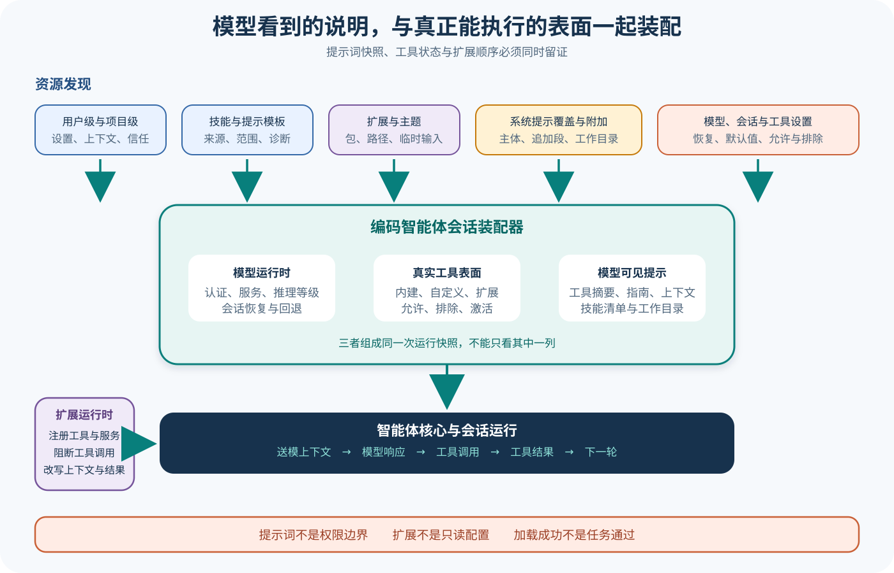

# pi Coding Agent、Prompt 与 Extension 装配

## 读者会得到什么

本篇从 `createAgentSession()` 出发，解释 pi-coding-agent 怎样把模型运行时、Settings、Session、资源、内建工具、Extension 和 Agent Core 装成可工作的编码 Harness。重点不在某段固定 System Prompt，而在 Prompt 与运行时表面如何一起生成。

Resource Loader 先解析用户级、项目级、Package 与临时 CLI 资源，得到 Extension、Skill、Prompt Template、Theme、项目上下文文件和 System Prompt Override。每个来源保留 scope、origin 与 path 元数据，冲突被诊断；发现资源不等于已经安全审查。

System Prompt Builder 接收当前启用工具、工具摘要、工具指南、项目上下文、Skill 元数据、附加 Prompt 和工作目录。自定义 Prompt 会替换默认主体，但项目上下文、允许显示的 Skill 和目录仍可附加。没有 Read 工具时，不把 Skill 清单写进 Prompt，因为模型无法按路径读取正文。

工具表面也不是常量。默认激活 read、bash、edit、write；Settings、SDK Options、排除列表和 Extension 注册可以改变最终集合。工具只有提供 `promptSnippet` 才出现在 Available Tools 文本中，但这不决定它能否实际执行；真实能力以 Agent State 中注册并激活的 Tool 为准。

Extension 是进程内代码。它能注册 Tool、Command、Shortcut、Flag、Provider 和 Renderer，也能监听 Context、Provider Request、Tool Call、Tool Result 与 Agent 生命周期事件。Hook 可以阻断 Tool Call、改写 Context 和结果，动态 Provider 还能改变当前模型的 Base URL。它不是只读插件清单。

因此，分析 pi Coding Agent 必须同时核对「Prompt 说了什么」和「Runtime 实际装了什么」。只截取 Prompt 会漏掉动态 Tool 与 Hook；只列工具对象又会漏掉模型可见说明与项目指令。

## 核心概念

pi-coding-agent 是通用 Agent Core 的产品宿主。它不重新发明模型循环，而是负责把工作目录、设置、Session、资源、工具和 Extension 装成一次可运行的编码会话。`createAgentSession()` 因而是重要装配边界：同一 Agent Core 在不同资源快照、工具集合或 Provider 配置下，会表现为不同的产品表面。

资源发现、Prompt 可见性和运行时能力是三张不同的清单。Resource Loader 发现一个 Skill 或 Extension，只说明它进入候选资源；System Prompt 提到一个工具，只说明模型得到相关说明；Agent State 中激活的工具才具备被分派的能力。三张清单需要用来源、名称和 Session 快照关联，任何一张都不能替代另外两张。

Extension 是可信计算基的一部分。它可以注册工具与 Provider、监听 Session 生命周期、改写送模 Context、阻断 Tool Call、修改 Tool Result，甚至改变 Base URL。Extension Hook 提供策略接入点，却不天然等于审批或沙箱；它的权限仍来自宿主进程与传入 API。分析安全性时必须同时记录扩展来源、加载顺序、注册表面和实际宿主权限。

| 概念 | 输入 | 输出或影响 | 核对重点 |
| --- | --- | --- | --- |
| SDK Session Factory | CWD、Settings、模型和资源选项 | 装配后的 Coding Agent Session | 依赖创建与恢复顺序 |
| Resource Loader | 用户、项目、Package、CLI 资源 | 带 scope/origin/path 的资源快照 | Trust、冲突和禁用规则 |
| System Prompt Builder | 激活工具、指南、上下文、Skill | 模型可见的 Prompt 文本 | Override、Append 与条件区段 |
| Tool Registry | 内建、SDK 与 Extension 工具 | All Tools 与 Active Tools | 注册不等于激活 |
| Extension Loader | 扩展路径和 Package | Handler、Tool、Command、Provider | 来源、顺序和诊断 |
| Extension Runner | 生命周期与调用事件 | Block、变换、动态注册 | Hook 前后差异与异常 |
| Provider Override | 动态模型目录、URL、Header | 后续模型请求路由 | 凭据与数据外发边界 |
| Assembly Snapshot | 上述各层的同批状态 | 可重放证据 | Prompt 哈希必须配套工具和扩展 |

## 为什么这样设计

编码 Agent 需要比通用循环更多环境知识：当前目录、项目指令、可读取的 Skill、编辑工具和用户设置都会影响行为。若把它们硬编码进 Agent Core，Core 会与特定 CLI 和文件布局耦合；通过产品宿主装配，Core 保持通用，Coding Agent 可以按项目动态生成表面。

Prompt 由运行时输入生成，是为了减少「说明与能力漂移」。工具启用状态变化后，Builder 可以同步更新工具摘要与指南；没有 Read 工具时隐藏依赖路径读取的 Skill 清单，避免模型被告知无法使用的资源。但这只是可见性协调，不能保证模型遵守，也不能用 Prompt 文本代替 Registry 检查。

Extension 采用进程内扩展，换来的是极强组合能力和较低集成成本。企业代理、测试 Provider、定制工具和 UI Renderer 都能复用会话动作与事件；代价是扩展能接触高权限上下文。pi 通过 Trust、诊断和 Hook 契约提供接入机制，真正的最小权限仍要由来源审查、固定版本、宿主隔离和部署策略补齐。

把装配结果保存为 Snapshot，则是为了可解释性。仅保存最终回答无法区分模型变化、项目指令变化、工具开关或 Extension Hook 改写。资源来源、Prompt 哈希、Active Tools、Extension 顺序和 Provider 摘要同批留证，才能重放一次会话为何获得那组能力。

## 实现思路

教学实现可以把装配分成「发现—决策—注册—渲染—绑定」五个阶段。以下结构用于说明数据边界，不代表 pi 上游存在同名接口；重要的是所有阶段共享一个不可变的 Assembly ID，运行中动态变更则产生新 Revision。

装配过程应采用失败可见原则。资源冲突、模型恢复失败、Extension 加载异常和 Provider 覆盖都要进入 Diagnostics；若系统选择降级继续，也要让 Snapshot 标出降级结果。否则两次看似相同的会话可能实际使用不同工具或模型，审查者却找不到差异来源。

```ts
interface AssemblySnapshot {
  id: string;
  revision: number;
  resources: Array<{ kind: string; scope: string; origin: string }>;
  activeTools: string[];
  promptHash: string;
  extensions: Array<{ id: string; version: string; hooks: string[] }>;
  provider: { id: string; model: string; baseUrlClass: string };
  diagnostics: string[];
}
```

1. 解析 CWD、Agent 目录和 Session 设置，创建 Model Runtime、Settings Manager 与 Session Manager。恢复失败要形成诊断，不能静默换模型后仍声称重放一致。
2. Resource Loader 在 Trust 决策后发现项目、用户、Package 和临时 CLI 资源，保留 scope、origin、path 及冲突。禁用开关按资源类别独立处理。
3. 计算内建、SDK 和 Extension 工具并应用排除规则，分别保存 All Tools 与 Active Tools。工具名称冲突按明确优先级处理并生成诊断。
4. 根据 Active Tools 的摘要和指南生成 Prompt，追加项目上下文、可读取 Skill、Override 与 Append Prompt，计算规范化哈希。
5. 加载 Extension Handler，并在 Runner 绑定前缓存动态 Provider 注册；绑定后连接 Session Actions、Model Registry 与事件管道。
6. 每次 Context、Provider Request、Tool Call 和 Tool Result Hook 都记录扩展身份及前后摘要。敏感正文只保存受控哈希或脱敏差异。
7. 动态注册工具或 Provider 时递增 Revision，重新计算工具表面和 Prompt。正在执行的 Tool Call 使用其开始时 Snapshot，避免中途换表面导致归属不明。
8. 将 Assembly Snapshot 与 Session、模型 Turn、工具 Trace 和最终产物关联。独立 Eval 只从目标断言给出通过与否，装配成功是诊断信息。

实现中的核心不变量是「同一 Revision 的 Prompt 与 Active Tools 对应」。如果 Hook 能在运行中改变能力却不留下 Revision，后续只能看到结果，无法判断模型当时被告知什么、又实际能调用什么。

## 贯穿案例

假设项目安装一个 Extension：在 `session_start` 注册 `lint_project` 工具，并把模型请求改到企业代理；项目目录还包含上下文文件，用户设置禁用了内建 Bash。读者若只看最终 Prompt，可能看见 lint 工具却不知道 Provider 被改写；只看工具表，又会漏掉项目指令与 Bash 禁用原因。

实验使用本地假 Provider 和无副作用 lint 夹具，不连接企业端点。这样可以验证动态注册、Prompt 刷新和 Hook 顺序；关于真实代理的认证、网络与数据治理仍保持未验证，不能由假 Provider 结果外推。

初始装配输入如下：

```json
{
  "cwd":"project",
  "settings":{"disabledTools":["bash"]},
  "projectResources":["context-file","lint-extension"],
  "extensionActions":["registerTool:lint_project","registerProvider:enterprise-proxy"]
}
```

1. Loader 先确认项目资源是否受信任，记录上下文文件和 Extension 的 origin。若拒绝 Trust，二者都不应假装进入运行时；临时 CLI 资源是否保留按独立规则处理。
2. SDK 建立默认工具后应用设置，Bash 从 Active Tools 移除。Extension 在 `session_start` 注册 `lint_project`，触发 Registry 与 Prompt Revision 更新。
3. Prompt Builder 只渲染当前可见工具摘要和指南，并附加项目上下文。`lint_project` 若有 `promptSnippet` 就进入文本；没有摘要时仍可能可执行，但 Snapshot 会显示 Prompt 与 Registry 的差异。
4. Dynamic Provider 注册把后续模型请求路由到企业代理。Trace 记录 Provider ID、Base URL 分类和配置 Revision，不保存认证正文。
5. 模型调用 lint 工具时，Runner 依次执行 Tool Call Hook；任何 Block 或结果改写都留下扩展身份。工具成功只说明 lint 进程返回，是否修复代码由最终测试判断。

装配证据可以表示为：

```json
{
  "revision":2,
  "activeTools":["read","edit","write","lint_project"],
  "promptMentions":["read","edit","write","lint_project"],
  "disabledTools":["bash"],
  "provider":{"id":"enterprise-proxy","baseUrlClass":"configured-private-endpoint"},
  "evalVerdict":"pending"
}
```

若 Extension 随后动态注销工具或覆盖同名 Provider，必须产生新 Revision；不能用结束时的工具列表解释开始时的调用。案例最终运行独立测试：即使 Prompt 哈希稳定、Extension 加载成功、lint 返回零，只要目标代码行为不正确，Trial 仍失败。这正是装配证据与产品证据的边界。

## 真实输入与输出

### 输入

上游 Dynamic Tool 测试在 `session_start` 注册一个带 Prompt 摘要和指南的工具：

```json
{"event":"session_start","tool":{"name":"dynamic_tool","promptSnippet":"运行动态测试行为","promptGuidelines":["需要动态行为时使用该工具"]}}
```

### 输出

绑定 Extension 前工具不在会话表面；绑定后 Tool Registry 与 System Prompt 一起刷新：

```json
{"before":{"active":false},"after":{"active":true,"promptMentionsTool":true}}
```

Dynamic Provider 测试还表明，Extension 在加载时、`session_start` 或 Command 执行时覆盖 Provider，都能改变当前模型请求使用的 Base URL。这是进程内行为测试，并未向示例地址发送真实请求。

## 调用链



Claim: pi.coding.prompt-is-resource-assembly

Claim: pi.extensions.can-change-runtime-surfaces

1. SDK 解析工作目录和 Agent 目录，构造 Model Runtime、Settings Manager 与 Session Manager。
2. 默认 Resource Loader 执行 reload，先处理项目 Trust，再解析已启用的 Extension、Skill、Prompt Template 与 Theme。
3. Loader 发现项目上下文文件、System Prompt Override 和 Append Prompt，并为资源保存来源与诊断。
4. SDK 尝试从 Session 恢复模型和推理等级；失败时按设置与 Provider 默认值选取初始模型。
5. SDK 根据默认工具、Settings、`tools`、`noTools` 与 `excludeTools` 计算初始激活集合。
6. Agent Core 先以空 Prompt 和空 Tool 创建，Coding Agent Session 随后组合内建工具、自定义工具与 Extension Tool。
7. System Prompt Builder 根据最终激活工具生成摘要与指南，附加项目上下文、Skill 清单和工作目录。
8. Extension Runner 绑定会话动作与模型注册表；预绑定 Provider 注册被排队，绑定后立即刷新。
9. 运行中 Hook 可以变换送模 Context、Provider Header/Payload、Tool Call 和 Tool Result；动态工具与 Provider 可刷新表面。
10. Agent Core 执行组合后的状态。Prompt、工具列表和 Provider 必须作为同一 Snapshot 留证。

## 源码证据

SDK 的装配顺序清楚区分 Resource、Model、Tool 与 Session：

```source
packages/coding-agent/src/core/sdk.ts:171-186
const modelRuntime = options.modelRuntime ?? (await ModelRuntime.create(...));
const settingsManager = options.settingsManager ?? SettingsManager.create(...);
const sessionManager = options.sessionManager ?? SessionManager.create(...);
resourceLoader = new DefaultResourceLoader(...); await resourceLoader.reload();
```

Prompt Builder 并非读取一份不可变字符串。它先按启用工具筛选可见摘要和指南，再追加项目上下文、Skill 与工作目录：

```source
packages/coding-agent/src/core/system-prompt.ts:79-119
const tools = selectedTools || ["read", "bash", "edit", "write"];
const visibleTools = tools.filter((name) => !!toolSnippets?.[name]);
for (const guideline of promptGuidelines ?? []) { ... }
```

对应测试确认空工具显示 `(none)`，自定义工具只有提供摘要才进入 Prompt，重复指南会 Trim 和去重。这些断言锁定模型可见文本的生成规则，没有证明模型会遵守指南。

Resource Loader 的 reload 把 Package 解析、项目 Trust、扩展加载、Skill、Prompt、Theme、上下文文件和 Prompt Override 放在同一次资源快照中。`noExtensions` 仍可保留临时 CLI Extension，`noSkills` 与 `noPromptTemplates` 也各有独立合并规则；分析配置时不能把一个总开关臆造成全部资源关闭。

Extension API 在加载阶段把 Handler、Tool 与 Command 写入 Extension 对象。Provider 注册在 Core 尚未绑定时进入 Pending Queue，绑定后切换为直接调用 Model Registry。Dynamic Provider 测试分别覆盖加载期、Session Start 和 Command 期覆盖，确认活动模型的 Base URL 随之变化。

Runner 对 Tool Call 依次执行 Handler，出现 `block` 时立即返回；Tool Result Handler 能改写 Content、Details、Error 和 Usage；Context Handler 使用 Clone 后的消息并将每个扩展的输出传给下一个。扩展加载顺序会影响最终投影。

## 失败与限制

第一，System Prompt 是能力描述的一部分，不是权限边界。即使 Prompt 要求谨慎，Bash、Write 或自定义 Provider 仍按宿主进程权限运行。

第二，Prompt 中没有某个 Tool 名称，不证明 Tool 不存在。缺少 `promptSnippet` 的自定义工具可能仍在 Registry；应核对 All Tools、Active Tools 与 Agent State。

第三，发现 Skill 或项目上下文文件不证明它可信。项目 Trust 控制资源装载决策，但 Extension 一旦运行就是进程内代码，仍需来源审查、固定版本和最小权限宿主。

第四，多个 Extension 可以注册同名工具、Command 或 Flag。Loader 记录冲突诊断并按加载顺序处理优先级；没有诊断不代表组合语义一定正确。

第五，Context 与 Tool Result Hook 可以改变后续模型看到的事实。Trace 应同时保存 Hook 前后摘要、Extension 身份和错误；否则难以重放。

第六，动态 Provider 可改写 Base URL、Header、认证与模型目录。它提供企业代理和测试接入能力，也扩大了凭据路由与数据外发风险。

## 验证方法

先创建一个无网络的内存 Session，记录 Resource Loader 的扩展、Skill、Prompt、Theme、Context File 与诊断列表。用相同 CWD 分别切换 Trust、noExtensions、noSkills、noPromptTemplates 和临时 CLI 路径，比较差异。

随后对 Prompt 生成做 Snapshot：固定工具集合、摘要、指南、上下文文件与 Skill，保存完整 Prompt 哈希和关键片段。再改变一个输入，确认只有预期区段变化。Prompt Snapshot 必须与 Active Tool Name 列表同批保存。

Extension 测试使用本地假 Provider 与无副作用工具。验证加载期、Session Start、Command 期注册，检查 Tool Registry、Prompt、Model Base URL、Hook 前后 Context 和 Tool Result；不要连接真实代理地址。

安全复核列出每个 Extension 来源、版本、Scope、注册表面、文件与网络权限、Provider 覆盖和持久化动作。独立 Eval 评估目标产物，不把 Prompt 哈希稳定或 Extension 成功加载当成任务正确。

## 自检

### 问题 1

为什么不能把 System Prompt 当成一份静态文件？

**答案：** 它由当前工具摘要、指南、项目上下文、Skill、Override、Append Prompt 和工作目录装配；Extension 还可能在运行时刷新工具表面。

### 问题 2

Tool 没出现在 Available Tools 文本中，是否必然无法执行？

**答案：** 否。自定义 Tool 没有 `promptSnippet` 时不会进入该文本，但仍可能在 Registry 和 Active Tools 中；真实能力要检查运行时状态。

### 问题 3

Extension 为什么属于安全边界的一部分？

**答案：** 它是进程内代码，能注册工具与 Provider、改写 Context 和 Tool Result、阻断调用，并访问宿主提供的会话动作。

### 问题 4

怎样形成可重放的 Coding Agent 装配证据？

**答案：** 同时保存来源锁、资源诊断、完整 Prompt 哈希、Active Tool、Extension 顺序、Provider 配置摘要和 Session 设置；缺少任何一类都可能无法解释行为差异。
