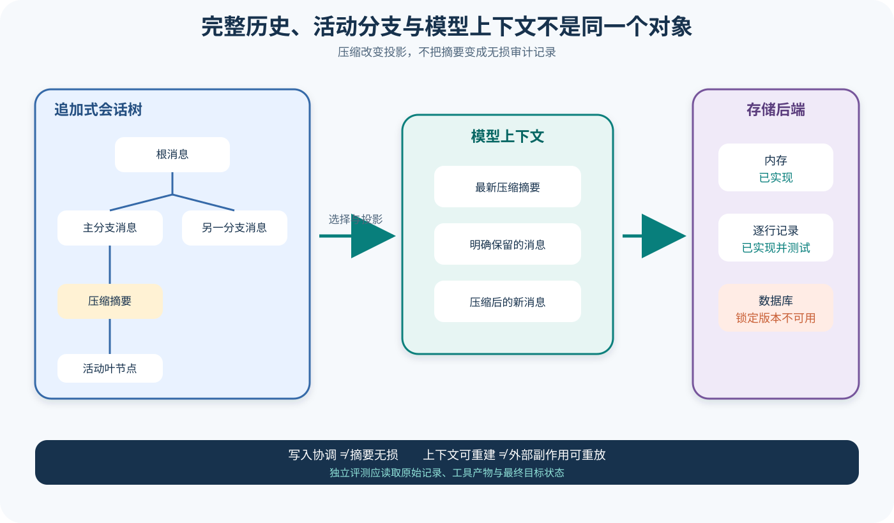

# pi Session、Context、Compaction 与存储

## 读者会得到什么

本篇区分四个常被混成「历史」的对象：持久 Session Tree、当前 Branch Path、送入模型的 Context Projection，以及 Compaction Summary。它们相互关联，但信息量和用途不同。

现行 Coding Agent Session 使用追加式 JSONL Entry，每个 Entry 以 `parentId` 组成树，Leaf 决定活动分支。Message、Model Change、Thinking Level、Compaction、Branch Summary 与 Custom Entry 都可以存在文件中；只有部分 Entry 会投影成 LLM Message。

`buildSessionContext()` 从活动 Leaf 逆向找根，恢复沿途模型与推理设置，再把最新 Compaction、保留区间和其后 Entry 投影为消息。普通 Custom Entry 被忽略，Summary 则成为特殊 Message。于是「文件中存在」不等于「模型当前看见」。

Compaction 保留原 Session Entry，同时为后续 Context 选择最新 Summary 和 `firstKeptEntryId` 之后的消息。Summary 是有损模型生成物；它可能漏掉文件名、失败原因或约束，不能替代原始事件作审计证据。

锁定树还包含 AgentHarness v2 的 Session Abstraction、Memory Backend 与 JSONL v4 Backend。JSONL 有尾行恢复、持久前缀校验、分支与 Lane 测试。源码没有 SQLite Backend；接口允许未来 Backend 扩展，不应写成当前已支持 SQLite。

Session Repo 的注释要求 open 获取后端 Writer Claim，但锁定 JSONL Repo 展示的是同进程 Create/Fork 目标预留与追加队列，并非跨进程数据库租约。Writer Claim 只能协调写入所有权，不能让 Summary 变成无损记录。

## 核心概念

Session Tree 是持久事实集合，Branch Path 是从某个 Leaf 回到根的一条选择，Context Projection 是当前准备送给模型的消息视图，Compaction Summary 是替代一段旧消息的有损表示。四者的信息量逐层收缩。恢复 Session 时可以从 Tree 重新选择 Branch，也可以按最新 Compaction 重新构造 Context；模型无法仅凭当前 Context 还原所有原始 Entry。

追加式存储让分支和审计更清晰。新 Entry 通过 `parentId` 连接当前 Leaf，切换分支只改变后续追加的父节点，不覆盖原路径。Model Change、Thinking Level、Label、Custom Entry 和 Message 可以共存，Context Builder 再决定哪些 Entry 转换为模型消息。这种结构将「保存什么」与「送模什么」分开，也要求验证工具明确检查两套结果。

Compaction 解决上下文预算，不负责完整归档。Summary 由模型生成，`firstKeptEntryId` 划定仍按原文保留的区段，后续消息继续正常投影；旧 Entry 留在 JSONL 中。Summary 可能把精确路径、否定约束、失败时间线或未决问题概括掉，所以它适合续写上下文，不适合作为唯一审计与 Eval 输入。

| 概念 | 形态 | 主要用途 | 不能替代 |
| --- | --- | --- | --- |
| Session Entry | 带 ID、Parent、类型和内容的追加记录 | 持久事件与状态变化 | 外部副作用提交记录 |
| Session Tree | 全部 Entry 的父子结构 | 分支、导航与审计 | 当前模型上下文 |
| Lane / Leaf | 当前追加位置与活动路径终点 | 选择分支和后续父节点 | 删除其他分支 |
| Branch Path | Leaf 到根的有序 Entry | 重建当前路径状态 | 整棵 Tree |
| Context Projection | 可参与模型请求的消息列表 | 下一次采样 | 原始持久历史 |
| Compaction Summary | 一段旧消息的有损摘要 | 缩短送模 Token | 精确证据与最终 Artifact |
| Writer Claim | 写入所有权协调 | 防止不兼容写者并发 | 内容语义正确性 |
| JSONL Backend | Header 与记录的追加文件 | 可移植持久化与尾部恢复 | 数据库事务或跨进程租约保证 |

## 为什么这样设计

把 Session 保存成树而非单线文本，是为了支持回退、分支和重新探索。用户可以从旧节点继续而不销毁后来路径，界面也能展示不同 Leaf。追加式 Entry 让历史变更可追踪，避免就地修改掩盖旧状态；代价是读取时必须重建路径，并谨慎处理损坏与并发。

Context Projection 独立存在，是因为模型窗口和持久历史的目标相反：历史希望尽量完整，模型输入必须受预算限制并只保留可消费消息。普通 Custom Entry、Label 或后端元数据无需送入模型，但对审计可能重要。转换函数显式决定投影，能避免存储格式被直接当作 Provider 消息格式。

Compaction 采用 Summary 加保留区间，让会话能在窗口压力下继续，同时保留原始 Entry 供人或工具复核。设计不承诺摘要无损，因为自然语言摘要本就不能可靠保存每个细节。正确的系统做法是把「可继续交互」和「可证明历史」分开：前者读取 Context，后者读取原 Entry、工具 Artifact 和校验值。

后端能力也要分层描述。JSONL 适合本地追加、可读检查和尾部修复；Memory 适合测试与短生命周期；接口预留的未来 Backend 只说明扩展方向。Writer Claim、目标预留与追加队列分别解决不同并发范围，不能把同进程保护扩写成跨进程数据库级一致性。

## 实现思路

教学实现应先定义不可变 Entry，再分别实现 Tree 操作、Context Builder 和 Backend。以下类型只用于解释责任，不声称是 pi 上游原样接口。Entry 内容采用判别联合，后端只负责合法追加与读取；如何把 Entry 转成模型消息由独立投影器决定。

每次生成 View 时还应记录 Projection Manifest：目标 Leaf、采用的 Compaction ID、保留起点、参与投影的 Entry ID 和转换器版本。Manifest 不需要复制敏感正文，却能在模型行为异常时回答「当时究竟选了哪条路径、用了哪份摘要」。

```ts
interface SessionEntry {
  id: string;
  parentId: string | null;
  seq: number;
  type: "message" | "model" | "thinking" | "compaction" | "branchSummary" | "custom";
  payload: unknown;
}

interface SessionView {
  leafId: string;
  path: SessionEntry[];
  modelMessages: unknown[];
  model?: string;
  thinkingLevel?: string;
}
```

1. Backend 打开文件时先验证 Header 和合法记录前缀。仅在损坏明确位于未完成尾行时截断；中间损坏或合法完整但非法语义的记录应拒绝并保留原文件。
2. 追加 Entry 时分配连续 Sequence、唯一 ID 和当前 Leaf 的 `parentId`，写入完成后再移动 Lane Leaf。写失败不得让内存 Leaf 假装提交成功。
3. 构建 Context 时，从目标 Leaf 沿 Parent 回溯到根并反转，得到 Branch Path。另行解析最近的 Model Change 与 Thinking Level。
4. 在 Path 中查找最新 Compaction。把 Summary 转成特殊消息，从 `firstKeptEntryId` 开始保留原消息，再追加 Compaction 后的可投影 Entry。
5. 对每种 Entry 明确定义是否进入模型：Message、Custom Message、Branch Summary 和 Compaction 可转换，普通 Custom、Label 与后端状态保持只存储。
6. 每次投影保存来源 Entry ID 列表、Summary ID 和 Context 哈希，便于解释模型看到了什么；不把哈希当内容保真证明。
7. Branch 只更新活动 Leaf，不删除其他 Entry；Fork 到新目标时验证目标预留、写入完整前缀，再发布可见性。
8. Eval 关联 Trial、Attempt、原始 Entry、工具 Artifact 与最终产物。Compaction Summary 可作为诊断输入，但不得成为唯一评分事实源。

并发实现必须写清作用域。同进程队列只能串行化当前进程的 Append；若要宣称跨进程单写者，需要文件锁、租约或数据库事务的实现与故障测试。接口注释中的目标语义不能替代具体 Backend 证据。

存储写入与外部工具副作用还应使用不同提交标识。Session 记录成功追加，只证明本地历史保存；远端请求或文件修改可能已经发生、尚未发生或状态未知。恢复流程先核对真实目标，再决定是否重试，不能仅根据最后一条 Session Entry 推断幂等性。

## 贯穿案例

假设一次修复任务产生两个分支。主分支先记录「禁止修改公共 API」，随后尝试方案 A 并失败；用户回到较早节点开启方案 B。随着消息增多，系统对旧区段生成 Compaction Summary，但 Summary 漏掉了「禁止修改公共 API」。如果 Eval 只读当前 Context，可能把违反约束的修改误判为合理。

实验提前把四项关键事实列为保真断言：禁止修改公共 API、目标测试名称、方案 A 的失败原因和方案 B 的验收条件。压缩后逐项比对摘要与保留区间，只要既未出现在 Summary、也未落在原文保留区间，就判为语义丢失，而不是等最终产物出错后才发现。

持久 Tree 的简化记录如下：

```json
{
  "entries":[
    {"id":"e1","parentId":null,"type":"message","text":"修复问题，禁止修改公共 API"},
    {"id":"e2","parentId":"e1","type":"message","text":"方案 A"},
    {"id":"e3","parentId":"e2","type":"message","text":"测试失败"},
    {"id":"e4","parentId":"e1","type":"message","text":"改走方案 B"},
    {"id":"e5","parentId":"e4","type":"compaction","summary":"需要修复问题，当前采用方案 B"}
  ],
  "activeLeaf":"e5"
}
```

1. Tree 仍包含方案 A 的失败路径和方案 B 的活动路径。切换到 `e4` 没有删除 `e2/e3`，因此审查者还能重建失败原因。
2. Context Builder 沿 `e5 -> e4 -> e1` 建立活动 Path，并按最新 Compaction 规则生成送模消息。方案 A 不在当前路径，属于预期分支差异。
3. 摘要遗漏公共 API 禁止项，属于信息保真失败。结构测试仍可能通过，因为 Summary、保留区间和后续消息都可加载；语义测试必须单独断言关键约束。
4. Agent 若据此修改公共 API，工具 Trace 与最终 Diff 会暴露真实副作用。Eval 回到原始 `e1` 和 Artifact 判定失败，不能让摘要覆盖用户原约束。
5. 若文件尾因进程中断留下半行，Backend 只截断该未完成尾部并保留前缀哈希；若 `e4` 中间损坏，则拒绝打开并要求受控修复。

一次正确的验证记录应区分两种结果：

```json
{
  "storageRecovery":"passed-valid-prefix-preserved",
  "contextStructure":"passed-latest-compaction-selected",
  "summaryFidelity":"failed-missing-public-api-constraint",
  "productVerdict":"failed-constraint-violation"
}
```

该案例说明「能恢复文件」「能构建 Context」「摘要保真」和「任务正确」各自需要断言。JSONL 尾部恢复不能证明 Summary 正确，Writer Claim 不能证明外部文件副作用可重放，Session Resume 也不能把原先失败的 Attempt 从 Trial 记录中删除。

若未来增加 SQLite Backend，仍需重复同一案例并比较 Projection Manifest、Branch 结果和损坏恢复，而不能仅凭接口兼容宣布等价。后端迁移的成功标准是语义与故障行为有证据地保持，不只是数据能被导入。

## 真实输入与输出

### 输入

上游测试构造两轮旧消息、一次 Compaction、再加一轮新消息：

```json
{"entries":["用户一","助手一","用户二","助手二","压缩摘要","用户三","助手三"],"firstKept":"用户二"}
```

### 输出

Context 由摘要、被保留的第二轮和压缩后的第三轮组成；原 JSONL 仍保留旧 Entry：

```json
{"contextRoles":["compactionSummary","user","assistant","user","assistant"],"durableEntryCount":7}
```

JSONL 恢复测试还向文件尾追加半行 JSON。重新打开时 Backend 截断损坏尾行、保留合法前缀，并让下一条 Entry 使用连续 Sequence。

## 调用链



Claim: pi.session.context-is-derived-projection

Claim: pi.session.sqlite-backend-is-unavailable

1. Session 追加 Entry，并把新 Entry 的 Parent 指向当前 Lane Leaf。
2. Branch 只移动 Leaf；后续追加形成新子树，不覆盖原分支。
3. Context Builder 沿当前 Leaf 到根建立活动 Path，同时解析 Model 与 Thinking Level 的最近值。
4. 没有 Compaction 时，Path 中可参与上下文的 Entry 直接转换为 Message。
5. 有 Compaction 时，只采用最新 Compaction Summary、它标记的保留 Entry 和压缩后 Entry。
6. Agent 把 Context Projection 交给模型；完整 Tree 继续用于导航、审计和重新投影。
7. JSONL Backend 追加 Header、Entry、Lane 和 Record；重新打开时验证合法前缀并处理可恢复尾部。
8. Eval 从原始 Entry、工具 Artifact 和最终产物取证，Summary 仅作为辅助视图。

## 源码证据

Context Builder 明确先构造活动路径，再单独选择上下文 Entry：

```source
packages/coding-agent/src/core/session-manager.ts:334-469
const path = buildSessionPath(entries, leafId, byId);
const messages = buildContextEntries(entries, leafId, byId).flatMap(sessionEntryToContextMessages);
return { messages, thinkingLevel, model };
```

`sessionEntryToContextMessages()` 只转换 Message、Custom Message、Branch Summary 和 Compaction；普通 Custom Entry、Label 与其他状态 Entry 返回空数组。上游测试确认没有压缩时加载所有消息，单次压缩时首条是 Compaction Summary，多次压缩只采用最新 Summary。

AgentHarness Session Interface 把 Tree Entry 与运行 Record 分开，并定义 Lane、Branch Query、Open Operation 和全局 Name/Label。`SessionRepo.open()` 的契约提到 Writer Claim，具体 Backend 仍需证明如何实现。

锁定的 `JsonlSessionRepo` 实现 Create、Open、List、Delete 和 Fork。同进程 Destination Set 防止相同 `{cwd,id}` 的 Create/Fork 竞态；JSONL 测试覆盖缺失换行修复、损坏尾行截断、非法中间行拒绝和追加失败后队列可继续。

在 `packages/agent/src/harness/session` 导出树中可以找到 Memory 与 JSONL，没有 SQLite 模块、导出或测试。因此 SQLite 状态为 unavailable，不从设计接口推断存在。

## 失败与限制

第一，Summary 可能语义丢失。即使 Token 显著减少且测试通过结构断言，也不能证明所有约束保真。

第二，JSONL Parser 对现行 Coding Agent 的损坏行处理与 AgentHarness v2 JSONL v4 Backend 不完全相同；分析时必须注明所处模块，不能混写成一套实现。

第三，Tail Repair 只处理可识别的尾部损坏。中间行损坏会拒绝打开，人工修复必须保留原文件副本与校验值。

第四，同进程 Destination Reservation 不等于跨进程 Writer Lease。两个进程、网络文件系统和异常退出需要额外一致性测试。

第五，Session Resume 证明上下文可重建，不证明外部 Tool Side Effect 可重放。文件、命令和远端请求需要独立幂等记录。

第六，SQLite 在锁定版本中不可用。若未来加入，仍需迁移、事务、并发、损坏恢复和 JSONL Parity 证据。

## 验证方法

构造带两条 Branch 的 Session Tree，分别选择不同 Leaf，保存 Context Entry ID、模型消息角色和完整 Tree Entry 数。确认切换分支不会删除另一分支。

对 Compaction 做信息保真测试：在旧消息中放入文件路径、禁止项、未决错误和验收标准，生成 Summary 后逐项断言。结构可加载只是最低门槛，关键事实缺失应判失败。

对 JSONL 使用临时目录注入缺失尾换行、半行 JSON、非法完整尾部、中间损坏与追加失败。每次恢复后比较合法前缀哈希、Sequence 连续性和后续追加能力。

并发实验至少用两个进程同时 Open/Append；在没有真实跨进程 Claim 证据前，把结果标记为未验证。Eval 使用 Trial ID 关联原始 Session、Attempt、Artifact 和最终 Gate，不以 Summary 作为唯一输入。

## 自检

### 问题 1

Session 文件中有一条 Entry，模型是否一定能看见？

**答案：** 不一定。模型只看到活动 Branch、最新 Compaction 规则和 Entry-to-Message 转换共同产生的 Context Projection。

### 问题 2

Compaction 会删除旧历史吗？

**答案：** 现行追加式 Session 保留旧 Entry；Compaction 改变后续送模投影，用 Summary 代替被压缩区段。

### 问题 3

为什么 Writer Claim 不能证明 Summary 无损？

**答案：** Claim 协调谁能写；Summary 是否遗漏事实是内容语义问题，两者属于不同层。

### 问题 4

锁定 pi 是否支持 SQLite Session Backend？

**答案：** 没有可核对的模块、导出或测试；当前状态是 unavailable，只确认 Memory 与 JSONL 路径。
