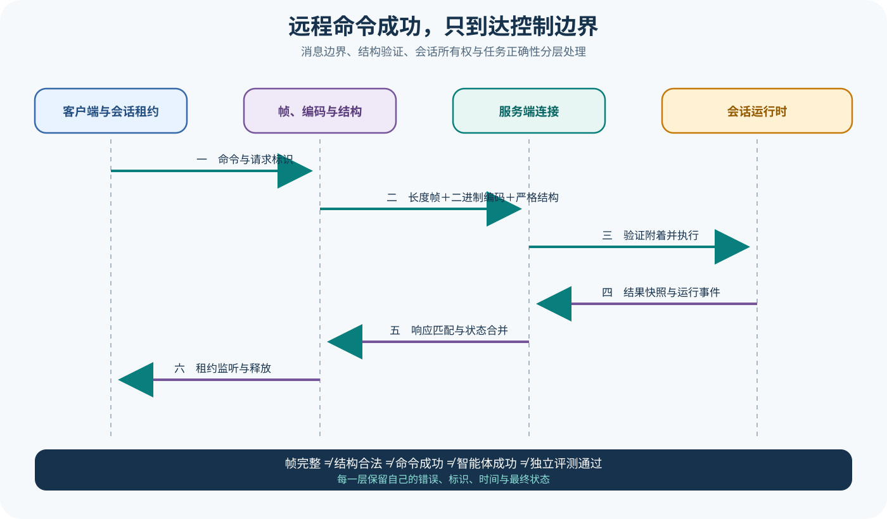

# pi Protocol、Server 与 Client

## 读者会得到什么

本篇解释 pi 怎样把进程内 Session Runtime 暴露成远程可控服务。链路分为长度 Framing、CBOR Codec、严格 Schema、Connection、Server Command Router、Session Runtime、Snapshot/Event 和 Client Lease；每一层解决不同问题。

Wire Frame 使用四字节大端长度前缀。Frame Decoder 能处理一个 Frame 被拆成多个 Chunk，也能从一个 Chunk 中还原多个 Frame，并对空 Frame、超长、截断和结束时残留做检查。Framing 只决定消息边界，不知道 Payload 语义。

Codec 把结构化 Envelope 编码为 CBOR，再封装 Frame；解码反向执行并用 TypeBox Schema 验证。JSON 形态适合日志和说明，但锁定的网络 Codec 是 CBOR，不应写成可任意切换的 JSON Wire Codec。

Schema 区分 Hello、Request、Response 与 Event。Request 有唯一 ID 和 Command；Response 必须回显同一 ID，并让 Result Command 与原 Command 匹配。Event 没有 Request ID，用于 Server Snapshot、Session Snapshot、Progress 和 Removal。

Server 要求首个 Frame 是版本 Hello，随后才执行 List、Create、Attach、Detach、Prompt、Steer、Abort、Set Model 和 Set Thinking。Session Command 需要 Connection 已 Attach；Response 说明 Command 被 Server 接受并返回 Snapshot，不证明 Agent 目标完成。

Client 的 Session Lease 进一步管理本地所有权。Shared Lease 可多实例共用，Exclusive Lease 与其他 Lease 互斥；最后一个 Shared Lease 释放后才发 Detach。Lease 解决本地协调，不是远端任务成功凭证。

## 真实输入与输出

### 输入

Client 发出一个带 Request ID 的 Prompt Command，编码后经过 Unix Transport：

```json
{"type":"request","id":"request-7","request":{"command":"prompt","sessionId":"s-1","text":"检查测试"}}
```

### 输出

Server 先返回匹配 Response，运行时进度和更新后的 Session Snapshot 通过独立 Event 继续到达：

```json
{"response":{"id":"request-7","command":"prompt"},"events":["session_progress","session_snapshot"]}
```

Protocol 测试把两个 Frame 拆分、合并后喂入 Decoder，仍按顺序得到原消息；截断或超过最大 Frame 则抛出 Protocol Validation Error。

## 调用链



Claim: pi.protocol.frame-codec-schema-are-distinct

Claim: pi.protocol.session-lease-is-not-task-success

1. Client Lease 检查本地 Attached 与 Active 状态，构造 Session Command。
2. Client 分配 Request ID，将 Envelope 先过 Schema，再编码 CBOR 和 Length Frame。
3. Transport 发送 Byte Stream；Server Connection 的增量 Decoder 恢复完整 Frame。
4. Codec 解 CBOR，Schema 拒绝额外字段、非法 Command、错误版本和越界值。
5. Server 将 Command 交给 Session Coordinator；Create/Attach 获得 Runtime，其他 Session Command 要求 Connection 已附着。
6. Runtime 执行 Prompt、Steer、Abort 或设置变更，Server 返回 Result Snapshot。
7. Runtime 后续 Progress 与状态变化形成 Event，广播给已附着 Connection。
8. Client State 合并 Snapshot Revision，并把 Session Event 分发给对应 Lease Listener。
9. 最终 Lease 释放触发 Detach；断线或 Session Removal 使相关 Lease 失效。

## 源码证据

Frame 与 Codec 是两层：

```source
packages/protocol/src/codec.ts:64-113
const frame = encodeFrame(encodeCbor(validated, { maxByteLength: maxFrameLength }));
for (const frame of this.frames.push(chunk)) {
  messages.push(this.parse(decodeCbor(frame, { maxByteLength: this.maxFrameLength })));
}
```

Frame Decoder 独立维护 Header、期望 Payload 长度与分块缓冲；`end()` 在残留不完整 Frame 时失败。Protocol Test 确认 Fragmented 与 Coalesced 输入可恢复，Schema-invalid CBOR、截断和超长会被拒绝。

Schema 将 Command Result 和原 Command 关联。Client 收到 Response 后不仅按 Request ID 查 Pending Request，还检查 `message.result.command` 与原 Command Name 一致；不匹配会使 Connection 失败，避免串错异步响应。

Server Session Coordinator 在 Create 后自动 Attach，Prompt/Steer/Abort 前调用 `requireAttached()`。Runtime Progress 走 Event，而同步 Response 只携带命令完成时 Snapshot。

Client Lease Test 证明多个 Shared Lease 只产生一次 Attach，最后释放才产生 Detach；Shared 存在时拒绝 Exclusive，Exclusive 存在时拒绝 Shared。Detach 失败时显式 Detach 可恢复 Active 以重试，Dispose 走清理语义。

## 失败与限制

第一，Frame 完整只证明 Byte Boundary 正确；CBOR 仍可能损坏，Schema 仍可能不匹配，Command 仍可能被业务拒绝。

第二，Response Success 不等于 Agent Success。Prompt Command 可被接受，模型随后仍可能 Error、Abort、工具失败或产生错误文件。

第三，Snapshot 是状态投影。Event 与 Response 可能交错，Client 要按 Revision 和 Attachment 生命周期合并，不能用到达顺序猜全局因果。

第四，Lease 主要是单个 Client 内的所有权协调。Server Runtime 的独占获取、跨 Client 竞争和断线恢复属于另外一层。

第五，Unix Transport 限制本机连接范围，但 Socket 文件权限、目录权限和同机用户模型仍需部署配置；Transport 本身不提供内容授权。

第六，最大 Frame 限制防止无界缓冲，却不能替代请求速率、事件背压、慢消费者断开和总体内存预算。

## 验证方法

对 Protocol 做性质测试：随机切分和合并同一 Byte Stream，确认消息序列不变；注入零长度、超长、截断、无效 CBOR、额外字段、错误版本和 Result Command Mismatch。

对 Server 用 Testing Service 验证 Hello 必须第一、未 Attach Command 被拒绝、Create 自动 Attach、Detach 后命令失败，以及 Runtime Error 会移除 Session。

对 Client 记录 Attach/Detach Request 数量，覆盖多个 Shared、Exclusive 冲突、Detach 失败重试、断线失效与 Reacquire。远程端到端测试必须同时保存 Request/Response、Event、Snapshot Revision 和最终 Session Artifact。

Eval 不把 Protocol 200 式成功作为评分。独立 Gate 读取目标文件、测试结果和业务断言；Protocol Trace 只帮助定位 Transport、Server、Agent 或 Tool 哪一层失败。

## 自检

### 问题 1

Framing、Codec 与 Schema 分别做什么？

**答案：** Framing 划分 Byte 消息边界；Codec 在结构与 CBOR 间转换；Schema 验证 Envelope 与字段语义。

### 问题 2

锁定 Protocol 是否提供 JSON Wire Codec？

**答案：** 没有。可读示例是 JSON 形态，实际 Codec 使用 CBOR 加四字节长度帧。

### 问题 3

Prompt Response 成功后为什么仍不能宣布任务完成？

**答案：** Response 只证明 Server 接受并执行了命令边界；Agent、工具和最终产物仍可能失败，后续状态还会通过 Event 更新。

### 问题 4

Shared Lease 何时发送 Detach？

**答案：** 同一 Session 的最后一个 Shared Lease 释放时；单个 Lease 释放不会影响仍活动的其他 Shared Lease。

