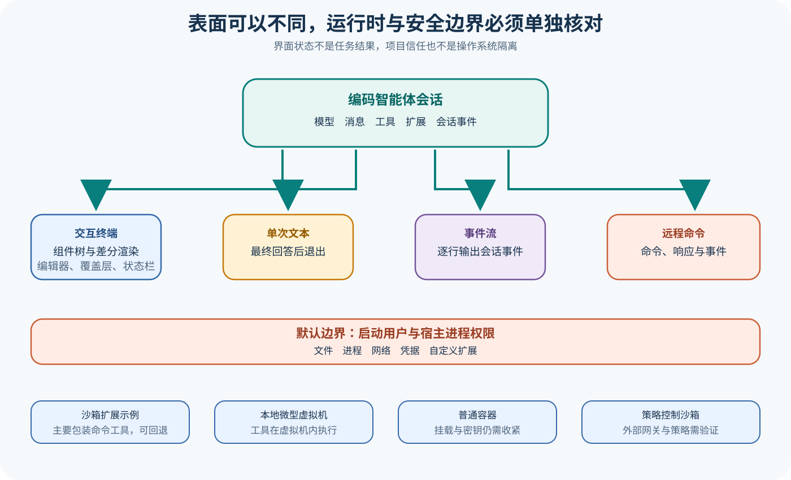

# pi CLI、TUI、权限与隔离边界

## 读者会得到什么

本篇把 pi 的产品表面与安全边界分开。Interactive TUI、单次 Print、JSON Event Stream 和 JSONL RPC 共用 Coding Agent Session，却采用不同输入输出协议；界面差异不应被误写成 Agent Core 能力差异。

`resolveAppMode()` 先尊重 RPC 与 JSON 参数，再根据 Print Flag、stdin/stdout 是否是 TTY 选择 Print 或 Interactive。管道输入会把原本交互模式切到 Print。RPC 使用 stdin/stdout 逐行 JSON Command，Print JSON 输出 Session Event；两者协议不同。

TUI 将 Session Event 转换成 Component Tree，再 Render 为终端行。Main Screen 保留 Previous Lines，宽高变化、内容缩短或特殊终端情况可能触发 Full Redraw；普通更新走 Differential Compare。差分渲染是表现层优化，不改变 Session Transcript 与 Tool Result。

权限方面，上游 README 明确说明默认没有内建 Permission System，进程继承启动用户对文件、进程、网络和凭据的权限。Project Trust 决定是否装载项目级设置、Extension 和 Skill，不限制已启用 Bash、Read、Edit 或 Write 的操作系统权限。

仓库给出四类可选边界：Sandbox Extension、Gondolin 微型虚拟机、Plain Docker 和 OpenShell。它们的覆盖面不同。Sandbox Example 主要替换 Bash 与 `!` Command，而且未初始化、禁用或平台不支持时回退 Local Bash；容器化整个进程才覆盖内建 Tool 与 Extension Tool，但挂载目录和注入密钥仍会暴露相应资源。

## 真实输入与输出

### 输入

同一个 Prompt 可以经四种表面进入：

```json
{"interactive":"终端编辑器","print":"参数或管道","json":"事件流","rpc":"逐行命令"}
```

### 输出

它们共享 Session Message 与 Tool Event，但投影不同：Interactive 更新组件，Print Text 只给最终文本，JSON 输出全部事件，RPC 输出 Command Response 与 Event。

```json
{"shared":"AgentSession","projections":["组件树","最终文本","事件对象","命令响应"]}
```

## 调用链



Claim: pi.tui.differential-rendering-is-presentation

Claim: pi.security.examples-are-not-default-boundaries

1. CLI 解析参数、TTY 与 Pipe 状态，确定 Interactive、Print、JSON 或 RPC。
2. 四种模式创建同类 Resource、Model、Session 与 Agent Core。
3. Agent Event 在 Interactive 模式更新消息组件、状态栏、Overlay 和 Editor。
4. TUI Render 生成新行，先合成 Overlay，再比较 Previous Lines；必要时 Full Redraw。
5. Print Text 订阅事件但只输出最终文本；JSON Print 将事件转为结构化行。
6. RPC 解析 stdin Command、调用 Session API，并向 stdout 写 Response 与 Event。
7. 无论表面如何，Tool 默认在宿主进程权限下执行。
8. 显式启用外部隔离后，副作用边界由 Sandbox、VM、Container 或 Policy Gateway 决定。

## 源码证据

模式选择是产品入口逻辑：

```source
packages/coding-agent/src/main.ts:110-119
if (parsed.mode === "rpc") return "rpc";
if (parsed.mode === "json") return "json";
if (parsed.print || !stdinIsTTY || !stdoutIsTTY) return "print";
return "interactive";
```

TUI Main Screen 先 Render 全部 Component 与 Overlay，再决定 Full Render 或差分更新。首次渲染、宽度变化和部分高度变化触发 Full Redraw；因此终端写入次数不能直接当 Agent Turn 数。

```source
packages/tui/src/tui-main-screen.ts:180-273
let newLines = this.render(width);
if (this.hasOverlayEntries) newLines = this.compositeOverlays(...);
if (widthChanged) { fullRender(true); return; }
```

README 对默认安全边界给出直接声明：pi 没有用于限制文件系统、进程、网络或凭据的内建权限系统，默认继承启动进程权限。这个结论比「出现 Trust Prompt」更强，因为 Trust 只治理项目资源加载。

Containerization 文档列出 Gondolin、Plain Docker 与 OpenShell；Sandbox Extension 源码则显示 `sandboxEnabled` 或 `sandboxInitialized` 为 false 时调用 Local Bash。Example 可用不等于默认强制。

## 失败与限制

第一，JSON Print 与 RPC 都使用逐行 JSON 外观，但语义不同。前者是 Agent Event 输出，后者包含双向 Command/Response；消费端不能混用 Decoder。

第二，TUI 显示 Done 或停止 Spinner 只说明界面状态。最终文件、测试和发布 Gate 仍需独立核验。

第三，Project Trust 不是 OS Sandbox。它减少未信任项目资源自动执行风险，却不约束用户主动启用的工具和 Extension。

第四，Sandbox Example 回退 Local Bash 是可用性选择，也是安全降级。要求强隔离时，初始化失败必须 Fail Closed，而非静默回退。

第五，Docker Bind Mount 会把宿主目录直接暴露给容器；把 Provider Key 注入容器也扩大凭据面。容器存在本身不代表最小权限。

第六，OpenShell 与 Gondolin 属于外部系统。仓库文档证明集成方案存在，不证明本地环境已经部署或策略正确。

## 验证方法

用同一 Faux Provider 和临时目录分别运行四种模式，按 Session ID 对齐 Event，确认模型消息与工具结果一致，同时记录表面特有输出。不要用屏幕行数推断 Turn。

TUI 测试注入宽度变化、Overlay、长输出、Unicode 与图像占位，记录 Full Redraw Count 和 Differential Write；目标是表现正确，不是 Agent 正确。

安全实验先建立能力矩阵：文件读写、子进程、网络、环境变量、宿主 Socket 与挂载。分别在默认宿主、Sandbox Example、Gondolin、Docker 和 OpenShell 中执行无破坏探针；失败回退必须显式记录。

发布 Gate 要求隔离配置 Artifact、实际探针结果和目标产物测试都通过。Prompt 中的安全文字、Trust Decision 或容器进程启动成功都不能单独放行。

## 自检

### 问题 1

Print JSON 与 RPC 有什么不同？

**答案：** Print JSON 是单次运行的事件输出；RPC 是双向逐行 Command、Response 与 Event 协议。

### 问题 2

差分渲染失败是否一定意味着 Agent Loop 失败？

**答案：** 不一定。它属于表现层；Session 与工具可能正常，但用户看到的行不正确，仍是产品缺陷。

### 问题 3

项目已被 Trust 后是否获得隔离？

**答案：** 没有。Trust 允许加载项目资源；工具仍继承宿主权限，除非另行启用并验证隔离边界。

### 问题 4

怎样验证容器化而不是只证明容器启动？

**答案：** 对文件、网络、进程、凭据和挂载逐项做允许与拒绝探针，并保存实际策略与结果。

