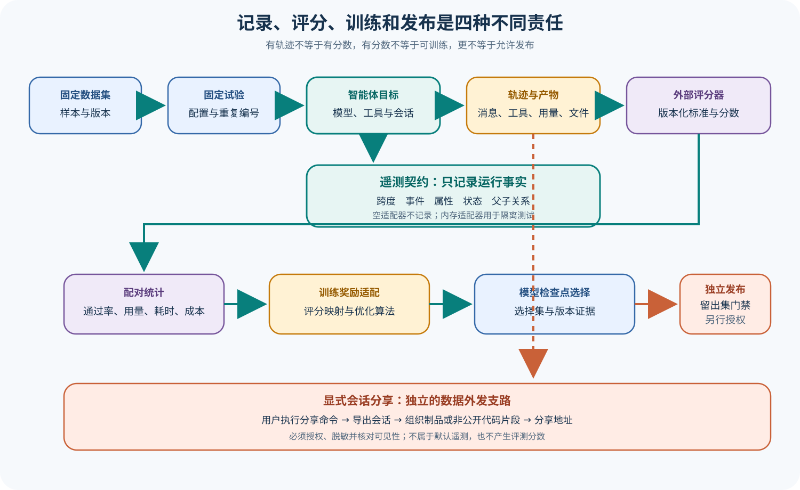

# pi 遥测、评测与数据契约

## 读者会得到什么

本篇回答三个容易混在一起的问题：一次 Agent 运行怎样被观察，一条 Eval 样本怎样被执行和留证，以及谁有权把产物变成分数、训练信号或发布决定。

pi 的 `TelemetryContext` 只有开启 Span、增加 Event、设置 Attributes 和 Status 的职责。Schema 进一步约束 Span 名称、父子关系、必填字段、敏感性与错误条件；Noop Adapter 让未配置后端的应用仍可执行，Memory Adapter 为测试保存进程内快照。这是一份可移植的观测契约，不是 Scorer。

`packages/evals` 把 Coding Agent 包装成 Vitest Eval Harness：选择模型、创建隔离临时目录和无 Extension Session、执行 Prompt、归一 Transcript Event 与 Usage，并把 `session.jsonl` 作为 Artifact 保存。Summary 接收已经标为 `scored` 的 Observation，再计算基线与候选的通过率、Token、耗时和成本差异；遇到 `unscored` 只登记 `missing-score`。因此 Summary 会消费分数，却不产生任务判定规则。

完整质量链必须在仓库能力之外继续：固定 Dataset 与 Trial 身份，调用 Target，保存 Trace/Artifact，由独立 Scorer 产生分数，再做统计与发布判断。若要训练，还需要显式 RewardAdapter 把评分变成 DPO、GRPO 或 RFT 可消费的信号，并独立选择 Checkpoint。训练集分数、Checkpoint 选择集和发布 Holdout 不能互相替代。

Session 分享同样是另一条数据出口。交互界面的 `/share` 命令先导出 Session，再显式上传到 Radius 或私有 Gist；它不是 Telemetry 默认上传，也不是 Eval Artifact 自动发布。分享前必须核对对话、文件片段、工具输出与凭据是否可外发。

## 核心概念

Telemetry、Eval Harness、Scorer、RewardAdapter 和 Release Gate 是一条质量链上的不同角色。Telemetry 记录运行中发生了什么；Eval Harness 固定任务并调用 Target；Scorer 根据 Rubric 判断产物；RewardAdapter 把分数转换为训练接口；Release Gate 在独立留出集上作发布决策。pi 锁定源码覆盖其中的观测契约、Target 包装、Artifact 和部分汇总，不应由此声称完整训练或发布系统已部署。

Trial 是统计单位，Attempt 是恢复记录。一次产品任务即使因基础设施问题重跑，也不能删除第一次结果或改变 Trial 分母；系统应预先定义哪个 Attempt 是 canonical，或把状态标为 inconclusive。模型 `stop`、Agent `agent_end`、Harness `completed`、Scorer `passed` 和 Release `approved` 是五种终态，必须分别存储。

Artifact 是不可变证据包，而 Summary 是对已评分 Observation 的统计视图。Session JSONL、补丁、测试结果、环境清单和配置快照可供 Scorer 复核；Summary 只能消费已有分数和诊断。Telemetry Span 即使结构完整，也不包含任务 Rubric；`missing-score` 必须保留为缺失，不能从正常退出猜成通过。

| 角色 | 输入 | 输出 | 权限边界 |
| --- | --- | --- | --- |
| Telemetry Adapter | Span、Event、Attribute 和 Status | 运行轨迹或 Noop | 不产生任务分数 |
| Eval Harness / Target | Case、配置和 Prompt Step | Transcript、Usage、Session Artifact | 不定义最终发布标准 |
| Artifact Store | 运行文件、哈希和环境信息 | 可复核证据包 | 不解释语义正确性 |
| Scorer | Artifact 与版本化 Rubric | 分数、理由或 unscored | 不修改原运行证据 |
| Summary | 已评分 Observation | 通过率、成本和差异 | 不补造缺失分数 |
| RewardAdapter | Scorer 输出与训练契约 | DPO/GRPO/RFT 信号 | 不代替独立发布评测 |
| Checkpoint Selector | 选择集统计 | 候选 Checkpoint | 不使用发布 Holdout 调参 |
| Release Gate | 独立 Holdout、风险规则和预算 | 发布/拒绝/不确定 | 不被训练分数自动授权 |

## 为什么这样设计

观测与评分分离，可以让同一运行轨迹支持不同 Rubric，也避免 Telemetry 后端决定产品目标。Noop Adapter 下 Agent 仍应正常工作，Memory Adapter 只增加测试快照；如果切换遥测实现会改变任务结果，说明观测代码侵入了控制流。Scorer 则可以独立升级并保留版本，旧 Artifact 仍可重评。

Trial/Attempt 分离防止选择性重试。把失败 Attempt 丢弃、只保留成功重跑，会夸大通过率并隐藏恢复成本。固定 Trial 身份、预算和 canonical 规则后，基础设施恢复可以发生，却不能改变统计分母；产品错误不能通过重复采样「重试成通过」。

训练与发布使用不同数据，是为了阻止反馈泄漏。Scorer 可以经 RewardAdapter 变成优化信号，选择集可以挑选 Checkpoint，但这些数据都已影响模型。发布 Holdout 必须独立，且 Scorer 与风险规则需要版本化；否则训练提升可能只是记住评测，而不是获得可泛化能力。

分享路径独立于 Telemetry 和 Eval，是数据治理需要。用户显式 `/share` 才触发导出和上传，说明它具有不同授权、可见性与删除要求。把私有 Gist 当「本地保存」或把 Eval Artifact 当「自动分享」都会模糊数据出站边界。

## 实现思路

教学数据契约应从稳定身份开始。Dataset Case、Trial、Attempt、Run、Trace、Artifact、Score 和 Gate Decision 分别有 ID，并用哈希连接，不允许后续阶段原地改写前序记录。下面的结构用于展示关系，不代表 pi 上游已经提供同名数据库模型。

身份设计还要处理重复与并发。相同 Attempt 的 Artifact 提交应具备幂等键，只有一个 canonical commit 能进入评分；迟到或重复上传保留为诊断，不能覆盖已经引用的哈希。这样 Summary 和 Gate 才能在重跑后保持可追溯。

```ts
interface TrialRecord {
  trialId: string;
  caseId: string;
  targetDigest: string;
  attempts: Array<{ attemptId: string; runId: string; outcome: string }>;
  canonicalAttemptId?: string;
}

interface ScoreRecord {
  trialId: string;
  artifactDigest: string;
  rubricVersion: string;
  outcome: "scored" | "unscored";
  value?: number;
}
```

1. 固定 Dataset 版本、Case ID、Target 配置、随机种子、预算和 Scorer Contract，生成不可变 Trial ID；重跑只新增 Attempt。
2. Eval Harness 为每个 Attempt 创建隔离工作区与无 Extension Session，选择明确模型并执行 Prompt Step。缺少模型时显式失败。
3. Agent 通过注入的 Telemetry Context 记录类型化 Span；Noop 与 Memory Adapter 下控制结果应一致，敏感字段按 Schema 处理。
4. 将 Transcript、Tool Call、Usage、Session JSONL、初始源、补丁、测试结果和环境清单写成 Artifact，计算哈希并绑定 Run ID。
5. Scorer 只读 Artifact，按版本化 Rubric 输出 scored 或 unscored，并保存断言级理由。缺失关键 Artifact 时不得猜分。
6. Summary 配对基线与候选 Observation，计算通过率、Token、耗时和成本；缺失分数进入 Diagnostic，分母规则预先固定。
7. 训练路径通过显式 RewardAdapter 声明支持 `full/partial/unavailable` 及映射语义，再用于 DPO、GRPO 或 RFT；选择集记录 Checkpoint 决策。
8. 发布路径使用未参与训练和选择的 Holdout，独立运行 Scorer 与安全门禁。Gate 输出 approved、rejected 或 inconclusive，并引用证据哈希。

分享功能走另一条授权流程：先预览将上传的 Session、运行脱敏检查、确认目标和可见性，再显式提交。Eval 或普通启动不得因安装了分享依赖而产生出站请求。

## 贯穿案例

假设要比较基线与候选模型修复同一个解析器错误。每个候选运行两次以估计波动，其中一次因临时文件创建失败需要恢复。数据链要保证恢复不会删除失败记录，Summary 不会替缺失评分造结果，训练和发布也不会复用同一批 Case。

案例把基础设施错误与产品错误预先分类：Target 启动前的工作区失败允许创建新 Attempt，模型生成错误补丁则属于产品结果，不能重试成通过。分类依据提交点和 Artifact，在看到结果后临时选择会污染统计。

预注册内容如下：

```json
{
  "dataset":"parser-fixes-v3",
  "caseId":"case-17",
  "trialId":"case-17@candidate-b@repeat-1",
  "attemptBudget":2,
  "scorer":"patch-tests-and-api-contract-v2",
  "releaseHoldout":"parser-holdout-v1"
}
```

1. Attempt 1 在 Target 启动前遇到临时目录错误，记录 outcome 为 infrastructure-failed 和完整诊断。系统按预定预算创建 Attempt 2，不覆盖 Attempt 1。
2. Attempt 2 运行 pi Eval Harness，保存 Session JSONL、补丁和测试结果。Agent 正常 `agent_end`，但一个 API 兼容断言失败，因此 Target completed 与产品 Score 分开。
3. Scorer 读取 Artifact，给出 0 分及失败断言。若补丁 Artifact 缺失，则输出 unscored；Summary 记为 `missing-score`，不按零分或一分擅自填补。
4. 候选在训练选择集上的分数可经 RewardAdapter 形成训练信号，适配记录声明映射和缺失值处理。该分数不授权发布。
5. 选定 Checkpoint 后，在独立 Holdout 重新运行固定 Trial。任何 Holdout Case 泄漏、Scorer 版本不匹配或样本缺失都使 Gate inconclusive 或 rejected。
6. 若研究者想分享 Session，需另行执行 `/share`、检查敏感片段并确认上传目标；评测完成本身不触发分享。

最终记录可以清楚展示不同终态：

```json
{
  "trial":{"attempts":2,"canonicalAttempt":"attempt-2","denominator":1},
  "target":{"outcome":"completed","agentTerminal":"idle"},
  "score":{"outcome":"scored","value":0,"reason":"公共 API 断言失败"},
  "training":{"rewardAdapter":"partial","usedForSelection":true},
  "release":{"holdout":"independent","decision":"rejected"},
  "sharing":{"triggered":false}
}
```

这个案例中 Telemetry 可以全部正常、Harness 可以完整退出、Artifact 可以成功写入，最终产品仍失败。反过来，即使任务结果看似正确，缺少 Scorer 或 Holdout 证据也不能发布。角色分离不是额外术语，而是阻止证据越权的控制结构。

## 真实输入与输出

### 输入

一次可复现 Trial 至少固定以下字段：

```json
{
  "dataset_case_id": "修复-解析器-001",
  "trial_id": "修复-解析器-001@候选版本@重复-01",
  "target": {"harness": "pi", "provider": "固定服务", "model": "固定模型"},
  "input": [{"type": "prompt", "content": "修复失败测试并解释原因"}],
  "scorer_contract": "产物测试与补丁约束-v1"
}
```

### 输出

Target 输出不是只有最终文本，还应保留运行身份、Transcript、Tool Call、Usage、Session Snapshot、错误与环境版本。Scorer 在这些不可变 Artifact 之上追加判断：

```json
{
  "trial_id": "修复-解析器-001@候选版本@重复-01",
  "target_outcome": "completed",
  "artifacts": ["session.jsonl", "source.patch", "test-result.json"],
  "score": {"value": 1, "rubric": "产物测试与补丁约束-v1"},
  "release_gate": "由独立留出集另行决定"
}
```

## 调用链



Claim: pi.telemetry.contract-is-not-scorer

Claim: pi.eval.artifact-is-not-release-gate

Claim: pi.session.sharing-is-external-and-opt-in

1. Dataset Case 与配置生成不可变 Trial ID；失败重跑要生成 Attempt，不得改写原 Trial 分母。
2. pi Eval Harness 创建临时工作区、选择 Target 模型并执行一个或多个 Prompt Step。
3. Agent 运行时把 Provider、模型、Stop Reason、Usage、工具与 Session 变更写入有类型的 Telemetry Span。
4. Eval Adapter 把 Message、Tool Call、Tool Result 与 Usage 归一成 Transcript 和结果对象。
5. Session JSONL、输入源、补丁、测试结果及环境信息按 Run ID 固化为 Artifact。
6. 外部 Scorer 按版本化 Rubric 读取 Artifact，产生分数或明确的 `unscored`。
7. Summary 只对可配对且已有分数的基线与候选计算统计，缺失或错误样本进入 Diagnostic。
8. 训练路径由 RewardAdapter 映射评分并选择 Checkpoint；发布路径使用未参与训练和选择的独立 Holdout。
9. `/share` 是用户显式触发的外发路径，不参与上述自动质量判定。

## 源码证据

通用遥测接口没有分数、奖励或发布字段；它只描述观测生命周期：

```source
packages/telemetry/src/index.ts:14-22
startSpan(options, callback)
addEvent(name, attributes)
setAttributes(attributes)
setStatus(status)
```

Agent Schema 把一次模型请求的 Provider、模型、Stop Reason、HTTP 状态、Token、成本、首块延迟与错误类型标准化。`startHarnessSpan()` 只是将这些有类型字段委托给注入的 Telemetry Context。

```source
packages/agent/src/harness/telemetry.ts:42-115
"pi.ai.response.stop_reason"
"pi.ai.usage.total_tokens"
"pi.ai.stream.time_to_first_chunk_ms"
```

Eval Harness 负责运行与留证：它拒绝未选择模型，创建临时目录和无 Extension Session，把消息转成 Transcript Event，并在结束时保存 Session JSONL。Artifact Writer 按 Run ID 将 Session 与 Source 写到权限收紧的目录。

```source
packages/evals/src/pi-harness.ts:109-218
setArtifact("runId", sessionManager.getSessionId())
setArtifact(PI_SESSION_SNAPSHOT_ARTIFACT, await readFile(sessionPath, "utf8"))
```

Summary 对 `scored` Observation 计算比较；`unscored` 被明确归类为 `missing-score`。这说明分数是它的输入契约，而不是由 Summary 从 Transcript 自动推导。

```source
packages/evals/src/vitest-evals/summary.ts:164-180
else if (observations[0].outcome === "unscored") {
  reason = "missing-score";
}
```

分享路径只有在交互命令调用 `handleShareCommand()` 后才导出并上传；Radius 不可用时才检查 `gh` 并创建非公开 Gist。这个显式命令路径与安装遥测开关、Eval Artifact 路径彼此独立。

## 失败与限制

第一，Span 状态为 `ok` 只表示被观测操作没有按契约报错，不代表用户目标正确。Telemetry 完整也不能替代结果测试。

第二，Harness 能正常返回 Assistant Text 只证明 Target 完成了协议流程。工具副作用、补丁质量和真实任务成功仍须由 Artifact 与 Scorer 核对。

第三，Summary 中 `score >= 1` 的通过率是已提供分数的统计规则。若 Rubric、数据集版本或缺失样本处理不同，跨运行数字不可直接比较。

第四，重试不能把产品失败从分母中删除。Trial 是统计单位，Attempt 只描述基础设施恢复；最终必须保留每次尝试和选取规则。

第五，训练 Reward 与发布分数的用途不同。RewardAdapter 可以为可验证任务提供训练信号，但不能让训练使用过的数据重新充当独立发布 Holdout。

第六，Session JSONL 和分享页面可能含用户消息、源代码、文件路径、工具输出和环境信息。私有 Gist 仍是外部数据出口，必须先脱敏并获得授权。

第七，锁定源码与确定性测试证明接口和夹具行为，不证明真实 Provider、外部评分器、训练流水线或生产发布系统已经部署。

## 验证方法

先用 Faux Provider 构造成功、工具错误、Abort、缺少分数和重复 Observation 五类 Trial。为每个 Trial 固定 Dataset 版本、Target 配置、随机种子、超时、最大 Turn 和 Scorer 版本，并验证 Artifact Hash 在重放前后稳定。

然后分别注入 Noop 与 Memory Telemetry Context。两种情况下 Agent 结果应一致；Memory 只增加 Span 快照。删除 Score 后，Summary 应报告 `missing-score`，而不是猜测通过。篡改 Session Attachment 名称或 Run ID 时，Artifact Writer 应拒绝或忽略不匹配数据。

训练实验必须保存 `Scorer -> RewardAdapter -> 优化算法 -> Checkpoint` 的版本链。发布实验另用独立 Holdout 与独立 Scorer，验证没有 Case 泄漏，并把失败样本原样纳入分母。

分享测试只在隔离假数据上显式执行 `/share`，检查上传目标、可见性、取消与临时文件清理。默认启动和普通 Eval 不得产生分享请求。

## 自检

### 问题 1

为什么完整的 Telemetry 不能直接证明任务成功？

**答案：** Telemetry 描述运行发生了什么；任务正确性需要 Dataset、Rubric、目标产物和独立 Scorer 的语义判断。

### 问题 2

pi 的 Summary 是否会替未评分的运行生成分数？

**答案：** 不会。它把 `unscored` 记为 `missing-score`，只汇总已经提供的分数。

### 问题 3

单次 Eval 通过后能否直接把该 Checkpoint 发布？

**答案：** 不能。还要核对固定 Trial、覆盖率、统计不确定性，并通过未参与训练和选择的独立发布 Holdout。

### 问题 4

Session 分享是否属于默认遥测？

**答案：** 不是。它由用户显式触发 `/share` 后导出并上传，是需要授权和脱敏的数据出口。
