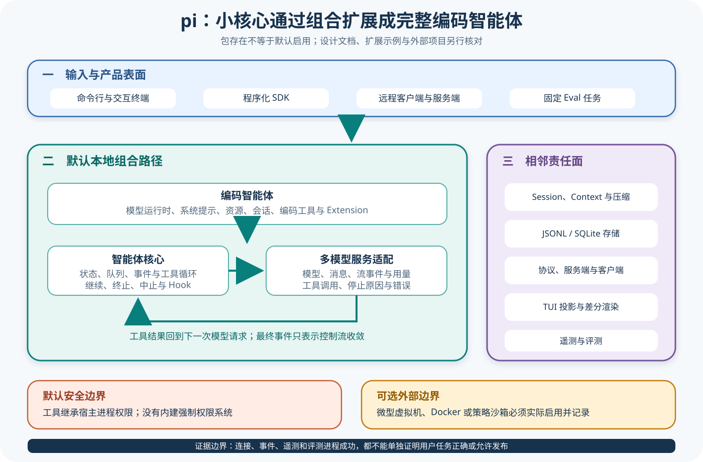
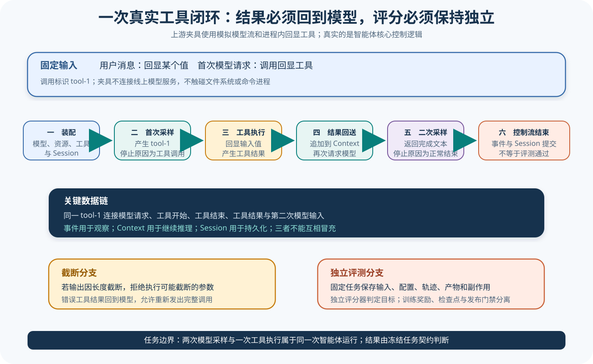

# pi 源码课程

[返回学习入口](../../00-start-here.md)

先看清三层。pi 的价值在于分层清楚，底层 AI 包负责 Provider 与流式消息，Agent 包提供最小循环，而 Coding Agent 再把工具、Session 和交互表面组合起来。课程会沿着这条组合关系向上阅读，同时分清核心运行时代码、设计文档、扩展示例和外部环境。



## 这条课程适合谁

如果你想从较小的核心开始，而不是立刻钻进大型产品代码，pi 很适合作为第一条源码课程。Starter 可以先读 AI、Agent 和 Coding Agent 三层，Builder 再进入队列、工具批次、Session Tree 和 Protocol，而 Maintainer 最后检查 Lease、权限与宿主隔离边界。

## 锁定来源

课程基于 pi 提交 `c1279a65b3ef6b0b19950ed1771d5933241c240f`：

- [Agent Loop](https://github.com/earendil-works/pi/blob/c1279a65b3ef6b0b19950ed1771d5933241c240f/packages/agent/src/agent-loop.ts)
- [Agent 状态对象](https://github.com/earendil-works/pi/blob/c1279a65b3ef6b0b19950ed1771d5933241c240f/packages/agent/src/agent.ts)
- [Coding Agent SDK](https://github.com/earendil-works/pi/blob/c1279a65b3ef6b0b19950ed1771d5933241c240f/packages/coding-agent/src/core/sdk.ts)
- [Agent Loop 测试](https://github.com/earendil-works/pi/blob/c1279a65b3ef6b0b19950ed1771d5933241c240f/packages/agent/test/agent-loop.test.ts)

## 先看一项任务

循环从这里启动。Coding Agent 接收任务后，会先组合 AI Provider、Agent Core 和工具，而 Agent Loop 消费流式响应时，一旦遇到工具调用，就把它交给注册工具执行，再将结果加入消息。Session 和协议表面围绕这条核心循环工作，为它补上持久化与外部控制能力。

```text
Coding Agent / Protocol / TUI
  → Agent 对象
  → Agent Loop
  → AI Provider Stream
  → Tool 执行
  → Message 与 Session
```



图中的 Coding Agent 组合了 Agent Core，并没有另起一套平行循环，而 Protocol 和 TUI 也只是面向不同场景的控制表面。

## 仓库地图

| 区域 | 首轮关注点 |
| --- | --- |
| `packages/ai` | Provider、消息与流式事件的统一形状 |
| `packages/agent` | 状态、Loop、工具执行和事件 |
| `packages/coding-agent` | 编码工具、Prompt、Session 和 SDK |
| Protocol 与 Server/Client | 外部应用怎样驱动 Agent |
| CLI/TUI | 用户交互和权限提示 |
| Telemetry 与 Evals | 可观察信息和外部验证接缝 |

pi 默认沿用启动它的宿主权限，而权限提示和工具接口本身不能证明文件、进程、网络或凭据已经隔离，所以要说明真实边界，还需要把外部容器或 Sandbox 一并纳入判断。

## 三层读法

- **Starter**：前三篇，读懂 Provider 流怎样进入 Agent Loop，并被 Coding Agent 组合。
- **Builder**：加入 Session Tree、Compaction、Protocol 和 Client Lease，理解长期任务状态。
- **Maintainer**：检查取消、工具失败、权限提示、宿主隔离和 Telemetry 的证据边界。

## 阅读顺序

1. [三层架构、Provider 与流归一化](01-layers-provider-stream.md)
2. [Agent Loop、双队列与工具批次](02-agent-loop-tools.md)
3. [Coding Agent、Prompt 与 Extensions](03-coding-agent-extensions.md)
4. [Session Tree、Compaction 与 JSONL](04-session-compaction-storage.md)
5. [Protocol、Server 与 Client Lease](05-protocol-server-client.md)
6. [CLI、TUI、权限与外部隔离](06-surfaces-permissions-isolation.md)
7. [Telemetry、Evals 与证据边界](07-telemetry-evals-boundaries.md)

## 用贯穿任务复盘

复盘可以从 Coding Agent 组合 AI Provider、Agent Core 和工具开始，跟着 `read/edit/test` 依次经过流归一化、双层 Loop、工具批次和 Session Tree，再假设客户端通过 Protocol 远程控制同一 Session，说明 Attach、Event、Response 和 Lease 怎样共同保持身份。走完这条链路后，再区分宿主权限、交互批准、Telemetry 和 Eval Score 各自说明了什么。

复盘时必须分清 AI Stream 的 `done`、Agent Run 收敛、TUI 显示完成和任务通过——它们描述的是不同层次的终态。

## 完成课程后应该能回答

- AI、Agent 和 Coding Agent 三层分别提供什么；
- Agent Loop 怎样处理流式文本和工具调用；
- Coding Agent 怎样组合 Prompt、工具和 Session；
- Protocol 表面怎样复用核心状态；
- 权限提示与宿主系统权限为什么不同；
- Telemetry 与 Eval 在源码中能观察哪些事实。

[从第一篇开始：三层架构、Provider 与流归一化](01-layers-provider-stream.md)
