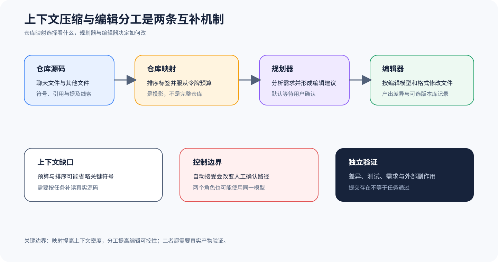

# Aider：Repository Map 与 Architect Editor 分工

## 为什么值得单独看

Aider 提供两个值得单独提炼的机制。Repository Map 在有限令牌预算内投影仓库结构，帮助模型看到不在聊天文件中的相关符号；Architect 模式把方案形成与文件编辑分为两个阶段，并可使用不同模型和编辑格式。一个回答「上下文里放什么」，另一个回答「建议怎样交给编辑器实施」。

这两个机制都提升了大型代码库中的可操作性，却不会消除证据缺口。压缩后的 Map 可能省略关键文件，Architect 的建议可能基于不完整上下文，Editor 也可能错误应用方案。本文只陈述锁定源码的选择和交接逻辑，不把模型性能、提交存在或测试一次通过升级为任务正确证明。

## 机制一：Repository Map；机制二：Architect 与 Editor

`RepoMap.get_repo_map` 首先检查令牌预算和其他文件集合；预算为零或没有其他文件就不生成映射。它接受聊天文件、其他文件、被提及文件和标识符，并调用排序标签映射。没有聊天文件时，可以在上下文窗口减去预留空间的约束内扩大仓库视图。

Repository Map 的本质是排序后的上下文投影。它用符号和引用提高单位令牌的信息密度，但不包含完整文件内容，也不保证每个依赖都被选中。`map_tokens`、上下文窗口、提及线索和排序结果共同决定模型看见什么，因此复现实验要保存最终 Map 内容或哈希，而不只是保存预算配置。

ArchitectCoder 继承 AskCoder，先形成架构或修改建议。回复完成后，如果内容非空且没有开启自动接受，就询问用户是否编辑文件；获准后选择主模型配置中的 editor_model，没有独立 Editor 时退回主模型，并设置 editor_edit_format。随后创建新的 Coder，把 Architect 内容作为消息交给 Editor 执行。

这个交接把自然语言方案与结构化编辑协议解耦。Architect 可以擅长分析，Editor 可以擅长应用 diff 或整文件格式；两者也可以是同一个模型对象。是否经过人工确认取决于 `auto_accept_architect`，所以「Architect 模式有人审」只能在有效配置关闭自动接受且交互实际发生时成立。

Editor 完成后，Architect 接收总成本与 Aider 产生的提交哈希，并把当前消息移回上文。这里的提交哈希属于产物血缘，说明某次编辑形成了 Git 对象；它不说明需求满足，也不说明测试没有被错误修改。应把 Git 记录与任务评分分开。

## 从哪里开始读源码

从 [`RepoMap.get_repo_map`](https://github.com/Aider-AI/aider/blob/5dc9490bb35f9729ef2c95d00a19ccd30c26339c/aider/repomap.py#L103-L135) 开始，核对提前返回条件、预算放大和 `get_ranked_tags_map` 调用。若需要解释排序，再继续进入标签图、缓存与排名实现，并记录哪些文件被当作 chat_files 与 other_files。只看最终 Map 文本很难解释遗漏原因。

再读 [`ArchitectCoder.reply_completed`](https://github.com/Aider-AI/aider/blob/5dc9490bb35f9729ef2c95d00a19ccd30c26339c/aider/coders/architect_coder.py#L6-L48)。这段集中显示空回复处理、人工确认、Editor 模型选择、编辑格式、Coder 创建、建议交接与提交哈希回收。继续分析时要连到模型配置，确定 editor_model 是独立模型还是主模型别名。

## 把两段源码连成因果链

Repository Map 与模型上下文的接缝不是 `map_tokens` 配置本身，而是最终 Map 文本进入哪一次请求。教学实现应保存候选文件集合、符号排序、预算裁剪和最终内容哈希，并把该哈希关联到 Architect 请求。这样当方案漏掉依赖时，复核者能区分源文件未被扫描、排名太低、预算裁剪或模型忽略了已提供信息。

Architect 与 Editor 的接缝是一份带来源的建议消息。交接对象至少记录 Architect 模型、输入 Map、原始建议、确认决定、Editor 模型、编辑格式和新 Coder 标识；拒绝时不得创建 Editor。若两阶段使用同一模型，也要保留两个调用边界，不能因为模型 ID 相同就把规划与编辑合成一次不可解释请求。

编辑器与产物的接缝落在文件差异、命令结果和提交哈希。提交可以提供不可变引用，但未追踪文件、工作树残留和外部副作用仍需单独收集。最小实验故意让 Architect 建议正确而 Editor 错改一行，再让另一轮 Map 漏掉关键符号；两类失败应分别落到交接和上下文投影，而不是统一归为模型失败。

## 沿一次任务走完整链

1. 入口确定聊天文件、其他仓库文件、提及文件与标识符，并计算 Map 预算。
2. RepoMap 对符号与引用排序，生成受上下文窗口约束的仓库投影。
3. Architect 读取任务、聊天文件和 Map，输出可执行的修改建议。
4. 根据有效配置等待用户确认或自动接受，再选择 Editor 模型与编辑格式。
5. Editor Coder 接收建议，修改文件并可能运行命令、测试或创建 Git 提交。
6. 外部验收比较最终差异、测试与需求，独立决定任务是否通过。

可观测性至少要保存 Map 预算、最终 Map、Architect 原始建议、确认决定、Editor 模型与格式、文件差异、命令和提交哈希。若只保留最终提交，就无法判断错误来自上下文选择、规划还是编辑；若只保留聊天，又无法证明磁盘产物。

## 它补充了六条主课程的什么

Aider 作为扩展样本补充代码上下文压缩与规划编辑分工。六条一级主线分别覆盖更完整的运行时、会话、权限和产品表面；这里不进行综合排名，也不把 Repository Map 视为所有 Harness 都应复制的唯一方案。它提供可迁移的问题框架：上下文投影如何产生，缺口如何发现，角色交接如何保留血缘。

在独立核对中，Map 和 Architect 建议属于运行 Trace，文件差异和 Git 对象属于环境产物。Evaluator 应读取冻结任务与最终产物，而不是把 Architect 建议、Editor 结束或 Git 提交直接计为通过。

## 什么时候值得采用

Repository Map 适合符号关系丰富、完整仓库无法放入上下文的代码任务；对少量文件、非代码资源、解析器不支持的语言或依赖主要来自运行时配置的项目，Map 可能增加成本却仍遗漏核心事实。预算扩大也不是无限增益，更多符号会挤占任务、历史和工具结果，需要按任务验证。

Architect/Editor 分工适合方案需要复核、编辑格式专门化或模型角色可分配的场景。极小修改可能因额外调用增加延迟和误差，自动接受则失去人工检查边界。本文只覆盖锁定源码中的 Map 与交接机制，不评价 Aider 全部模式、真实模型质量或任何部署的默认安全；迁移时应复制问题与记录方式，不照搬类名。

## 最容易误判的地方

Map 的主要风险是信息选择偏差。关键实现可能因预算、解析失败或图排名较低而缺席，模型却会把可见投影误当完整仓库。第二个风险是角色标签造成能力幻觉：Architect 与 Editor 名称不证明它们使用不同模型，也不证明方案经过人工复核。

第三个风险是把 Git 当作完成门槛。自动提交能提高可追溯性，却可能包含错误更改、遗漏未追踪文件或修改测试以迎合结果。命令返回零和提交生成都只是运行信号，必须与冻结任务、禁止项和独立测试一起解释。

## 怎样亲手核对

准备一个跨三个文件的受控任务，其中关键符号不在聊天文件。分别使用足够与极小 Map 预算运行，记录最终 Map 是否包含关键符号及其对方案的影响。实验只用于验证上下文投影链，不把单个模型结果当成普遍性能结论。

Architect 实验关闭自动接受，确认拒绝时不创建 Editor；再批准一次并固定独立 editor_model 与格式，检查 Editor 收到的内容等于 Architect 建议。最后用外部测试验证文件产物，并故意构造一个「成功提交但需求错误」案例，确保门禁不会把提交当通过。

## 读完后做四个判断

### 问题 1

Repository Map 是完整源码吗？

**答案：** 不是，它是受预算和排序约束的符号投影。

### 问题 2

Architect 与 Editor 一定使用不同模型吗？

**答案：** 不一定，没有独立 Editor 时会回退主模型。

### 问题 3

Architect 模式一定有人确认吗？

**答案：** 不一定，自动接受配置会改变这条边界。

### 问题 4

生成 Git 提交能否计为完成？

**答案：** 不能，仍需按任务契约验证差异、测试和副作用。
