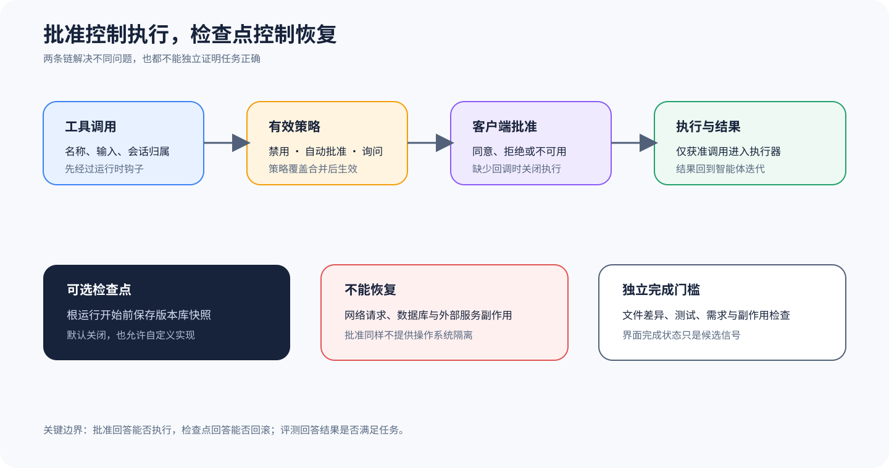

# Cline：工具批准与可恢复工作区

## 为什么值得单独看

Cline 这个扩展样本要拆开两个常被混为一谈的问题：Tool 能不能执行，文件改动能不能恢复，这两条链不能混。Runtime（运行时）里的工具 Policy（策略）、Client 的 Approval 回调和 Executor 一起回答前一个问题，Git 提供的可选 Checkpoint 机制负责后一个问题。分清以后，你才不会看到用户点了批准就认定系统安全，也不会看到可以 Revert 就以为所有副作用都能撤销。

锁定源码里同时有 SDK 化的 Agent Runtime、Core（核心层）、Shared 类型和多种 Host（宿主）Surface。本文只总结能沿锁定路径核对的公共机制，不会拿 EditorUI 里的按钮、Provider 列表或能力说明，去推断每个宿主默认怎样运行。批准策略和 Checkpoint 都很依赖有效 Config，所以一定要查到 Runtime 里的实际值。

## 两条不能混用的链：批准与 Checkpoint

Agent Runtime 在执行工具前，会把基础工具策略和 Runtime 的覆盖规则合在一起。最终策略如果禁用了工具，Runtime 就生成 `skipReason`。如果策略只是关掉自动批准，Runtime 会通过 `requestToolApproval` 把 Session、Agent、迭代、Tool Call（工具调用）ID、名称、输入和策略发给宿主。宿主一旦拒绝，也会生成 `skipReason`，执行路径就收不到这个工具调用。

工具要求批准而宿主没配回调时，这条路径会关闭执行并返回 `approved: false`。回调抛出异常时，它也会返回 Deny（拒绝）Result 和原因。这样能避免界面失联后默认放行，但只约束这条 SDK Runtime 路径。宿主如果还有别的执行入口，仍要单独核对。

批准和 Sandbox 管的不是一回事，用户或策略说「可以执行」，也只代表应用层放行。Command 究竟能访问哪些文件、网络、凭证和外部服务，还要看进程身份、操作系统隔离与工具实现。批准界面展示的参数也可能在执行前被转换，所以审计时要同时保存请求、决定和执行记录。

Checkpoint 管文件恢复，Core 配置规定，根 Agent Run（Agent 运行）开始时可以捕获一份可恢复的工作区 Snapshot。内置实现用 Git stash 和私有 ref 来保存，也允许调用方提供自定义创建函数。源码把默认值明确写成 `false`，所以你得主动启用 Checkpoint，它才会工作。

即使启用了 Checkpoint，它主要也只管工作区文件，文件恢复有边界。它能比较运行前后的 Diff，也能恢复追踪和未追踪文件，却撤不回已经发出的网络请求、数据库写入、云资源变更或外部 Message。文件回来了，对话语义、模型端 Cache 和下游系统状态也不会自动复原。因此，文件恢复和副作用补偿必须分开设计。

## 从哪里开始读源码

先读 [`Agent Runtime` 的工具策略与批准请求](https://github.com/cline/cline/blob/09ee9026393e681a4834d8acbf4d9d5fdfa8664a/sdk/packages/agents/src/agent-runtime.ts#L1744-L1808)，重点追踪五条分支：`policy.enabled`、`policy.autoApprove`、批准回调缺失、回调拒绝和回调异常，看它们最后怎样生成 `skipReason`。然后继续读后面的执行函数，确认带着 `skipReason` 的 Call 确实到不了工具 Handler。

再读 [`Checkpoint` 配置契约](https://github.com/cline/cline/blob/09ee9026393e681a4834d8acbf4d9d5fdfa8664a/sdk/packages/core/src/types/config.ts#L184-L218)，这里直接写着默认值、调用时机和自定义契约。要验证具体实现，就沿 `hooks/checkpoint-hooks.ts` 查看代码怎样建立 Git Snapshot 和私有 ref，再用对应的上游测试核对未追踪文件、重复运行与恢复动作。

## 把策略、执行和快照连起来

批准链在策略算出结果以后，才把工具调用交给 Handler。记录实现时，要同时保存基础策略、Runtime 覆盖、最终的 `enabled/autoApprove`、调用参数哈希、批准请求和 `skipReason`。Handler 只能收到没有 `skipReason`，而且参数未变的调用。批准回调缺失、明确拒绝或抛错时，Runtime 都要生成结构化的拒绝观察，让 Agent 有机会调整，不能悄悄丢掉，也不能退回默认允许。

Checkpoint 会在根 Agent Run 建立前接入。只有有效配置已经启用，代码才创建 Snapshot，并把 ref、Run 标识和工作树基线写进 Session 元数据。子迭代不该反复创建无人管理的 Snapshot。恢复时，先列出哪些追踪文件和未追踪文件会变化，再执行 Git 层恢复，最后重新计算 Diff。Snapshot 和批准 Event 虽然共用一个 Run ID，却不能合成一个含糊的安全状态。

教学实现可以在临时 Git 仓库里接一个本地计数服务，让工具既改文件，又调用外部服务，然后再恢复 Checkpoint。此时文件应当回到基线，外部计数却仍然增加，系统还要明确提示用户补做补偿。如果 UI 显示「全部回滚」，产品文案就夸大了真正能恢复的范围。

## 沿一次受控编辑走完整链

1. 模型产生工具调用，Runtime 先运行输入转换与前置钩子。
2. Runtime 合并工具的基础策略和当前覆盖，禁用策略直接阻断。
3. 需要批准时，宿主客户端收到带会话与调用归属的请求并返回决定。
4. 只有没有 skipReason 的调用进入真实工具执行器，结果再回到 Agent 迭代。
5. 若显式启用 Checkpoint，根运行开始前保存工作区快照并登记到会话元数据。
6. 失败后可选择比较或恢复文件；外部副作用由独立补偿与验证流程处理。

一条能审计的 Trace 至少要把工具调用 ID、输入哈希、策略来源、批准者或自动策略、最终执行参数、返回值和文件 Diff 关联起来。Checkpoint 还得另记 ref、创建时间、`runCount` 和恢复操作。Trace 里没有批准 Event，不能自行解释成自动批准。没有 Checkpoint，也不能推断工作区没变。

## 它补充了六条主课程的什么

Cline 这个扩展样本补充了 Editor 宿主怎样让人控制工具，又怎样恢复文件。一级主线已经分别讲过不同 Harness（位于模型外部，负责输入装配、工具、权限、状态和产品表面的程序）里的 Permission、Session 和工具生命周期。这里不把 Cline 扩成一条全面主线，只借这个案例分清四层：应用批准、OS 隔离、文件 Snapshot 和任务 Eval。

Runtime Trace 和 Checkpoint Diff 都是运行证据。Evaluator 还要读取最终工作区、必要测试和禁止出现的副作用，不能只看到一次批准、一次成功执行或一个可恢复 Snapshot，就判定任务做对了。

## 什么时候值得采用

出错就关闭执行的批准回调，适合嵌入式或多宿主 SDK。宿主失联时，它不会顺势扩大执行权。不过，它替代不了参数语义检查、最小进程权限和操作系统隔离。已经受约束的低风险工具可以自动批准，危险命令、对外发送和不可逆操作仍要采用更窄的策略，并交给外部控制。

Git Checkpoint 适合处理受版本控制的工作区改动，也适合预览 Diff 和恢复文件。数据库、远端 API、后台进程、项目外目录以及被忽略的大对象，并不在它天然覆盖的事务范围内。本文不覆盖所有 Cline 宿主和 UI，也不会把 Checkpoint 说成完整的 Session 恢复。选用这项机制时，必须让用户看清哪些动作能撤销，哪些后果要另行补偿。

## 最容易误判的地方

最常见的误判，是把批准当成安全审查。用户可能看不到完整参数，策略可能放得太宽，工具也可能在获批后扩大作用范围。另一个误判是认为 Checkpoint 默认存在，可锁定配置明确把它关掉了。即使 Git 工作区已经恢复，外部 API、数据库和消息系统也可能早就留下无法撤销的状态。

还要把 Session 状态和任务是否做对分开。宿主界面显示完成、Runtime 正常停止、所有工具都获批，只能说明运行没有在这些位置出错。模型仍可能改错文件、漏掉需求，甚至删测试来制造绿色结果。独立验收不能省。

## 怎样亲手核对

批准实验可以给同一个无副作用工具设置三种策略：自动批准、请求批准后拒绝、要求批准却不提供回调。验证时确认后两种策略都不会调用 Tool Handler，并保存各自的 `skipReason`。再让批准回调主动抛出异常，检查 Runtime 是否仍会关闭执行。实验还要固定锁定提交和配置，不能只截一张 UI 图当证据。

做 Checkpoint 实验时，先在临时 Git 仓库里准备追踪文件和未追踪文件，再分别用关闭与启用两种配置启动根 Run。关闭时应当没有 Snapshot，启用时则要拿到能比较的 ref，并验证恢复动作只影响工作区。最后模拟一次外部副作用，用实际结果证明 Git 恢复不会自动补偿它。

## 读完后做四个判断

### 问题 1

工具获批后是否说明安全？

**答案：** 不说明。批准是应用授权，仍需验证执行参数、进程权限和沙箱。

### 问题 2

Checkpoint 默认开启吗？

**答案：** 没有。锁定配置明确为选择启用。

### 问题 3

恢复快照能撤销 API 调用吗？

**答案：** 不能。它主要覆盖工作区文件，外部副作用需要补偿机制。

### 问题 4

Cline 为什么是扩展样本？

**答案：** 这里提炼的是批准与恢复分层，不承担对整个产品和所有宿主的一级全景分析。
