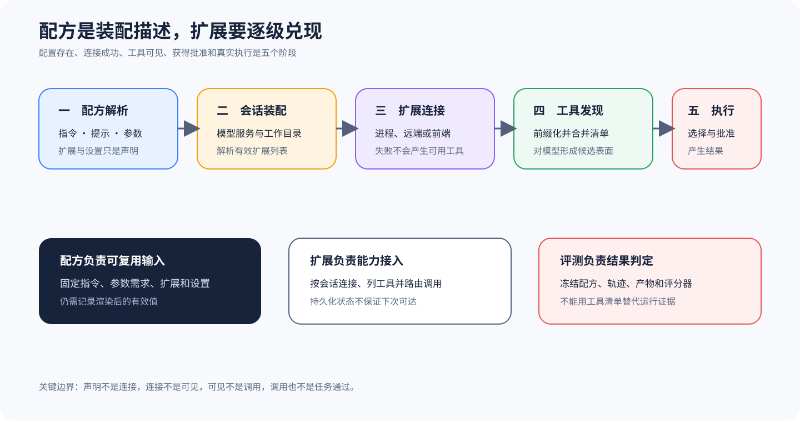

# goose：Recipe 与 Extension 的分阶段装配

## 为什么值得单独看

goose 这个样本的独特之处，是把可复用的工作流输入与外部能力装配放进同一条可核对链。Recipe 负责描述标题、指令、启动提示、参数、扩展和设置，Agent 与 ExtensionManager 再把扩展连接到具体会话并汇总工具。这样的结构方便复用任务，却也很容易让人误以为「配置里写了扩展，所以模型一定能调用」。

本文把扩展能力拆成五个阶段，依次观察配置是否被发现和解析、扩展能否连接成功、工具是否对模型可见，以及工具有没有获准并真实执行。只有把这些阶段完整记录下来，才能判断失败究竟发生在配方、依赖、协议、模型选择还是权限层。Recipe 不是评测结果。工具清单也不是完成证据。

## Recipe 如何变成会话中的真实工具

`Recipe` 数据结构要求提供版本、标题和描述，同时允许加入模型 instructions、启动 prompt、extensions、settings 与活动提示。由于源码注释要求 instructions 或 prompt 至少出现一个，所以配方既能设置持续指令，也能直接启动一次会话。

Recipe 把扩展配置与模型输入装进同一个可移植对象，却没有把扩展的运行结果写死，因为参数替换、嵌套配方、工作目录与用户配置都可能改变最终值。实验血缘因此要保存解析后的有效 Recipe，不能只留下原始 YAML。活动提示只是交互展示。它同样不能充当执行阶段的证据。

会话构建器会先把待加载扩展整理成名称与配置对，然后调用加载函数，而 Agent 的 `add_extension` 只有在内部装载成功后才持久化扩展状态。普通扩展会连同会话工作目录一起交给 ExtensionManager，前端扩展则走独立的插入分支，随后 `list_tools` 从 ExtensionManager 取得带前缀的工具，并与前端工具合并。

这个顺序不能打乱——配置被发现只说明候选存在，装载成功只能说明客户端或前端已经注册，而列出工具也只是说明当前会话拥有候选表面。模型能否看到这些工具还取决于上下文构造与过滤，之后是否真实调用，又要看模型选择、权限和执行结果。状态可以持久化。可用性却不能随之保存，因为下次进程启动时，外部命令、网络和凭证可能已经失效。

## 从哪里开始读源码

可以先读 [`Recipe` 数据结构](https://github.com/block/goose/blob/c5e5929a641ffc0edbccad476e18f726e9024f70/crates/goose/src/recipe/mod.rs#L42-L70)，据此建立字段与责任表，再沿 builder 和验证代码继续阅读，重点核对参数需求、模板渲染以及子配方怎样形成最终指令。不要从示例 Recipe 推断默认配置，因为示例只能证明一种允许的写法。

扩展链最容易从 [`Agent` 的扩展装载路径](https://github.com/block/goose/blob/c5e5929a641ffc0edbccad476e18f726e9024f70/crates/goose/src/agents/agent.rs#L1453-L1587) 观察，因为成功装载、按会话持久化、前端与普通扩展分支、工作目录传递和工具汇总都集中在同一段。如果还要研究协议细节，再进入 `extension_manager.rs` 与 MCP client，核对连接、工具命名和调用路由。

## 把配置、连接和工具投影连起来

Recipe 与会话靠一份解析后的有效对象衔接，实现应当在参数替换、嵌套配方和用户设置合并完成后生成哈希，并分别保存原始来源与有效值。模型指令、启动 Prompt 和 ExtensionConfig 都要引用这个哈希，这样同名 Recipe 因参数或工作目录不同而产生行为差异时，复核者就不会只看到相同的文件名。

ExtensionConfig 能否进入工具表取决于装载结果，普通扩展只有连接成功后才进入 ExtensionManager，前端扩展则由宿主登记。只有当前会话里装载成功的实例才能贡献带前缀的工具，而工具 Schema、服务版本和连接时间应当形成快照，再由上下文构造器决定最终对模型可见的集合。持久化的扩展配置只是下次恢复时的候选——不能绕过重新连接和能力枚举。

工具调用还要经过第三个接缝，它先从模型可见名称解析到具体扩展实例，再应用权限、发送协议请求，最后返回带有原调用 ID 的结果。如果服务在工具枚举后重启或改变 Schema，调用就应明确失败或重新协商，不能把旧缓存参数继续发给未知版本。教学实验可以在枚举完成后关闭服务，检查「列表存在」是否会被误报成执行成功。

## 沿一次 Recipe 启动走完整链

1. CLI、桌面或调度入口取得 Recipe，并解析参数、指令、启动提示与扩展列表。
2. 会话建立 Provider、工作目录和有效提示，整理需要加载的 ExtensionConfig。
3. 普通扩展由 ExtensionManager 建立客户端，前端扩展由宿主登记；失败保持显式错误。
4. 成功装载后记录会话扩展状态，再汇总前缀化工具与前端工具。
5. 工具表进入模型可见能力，模型产生调用后再经过权限、检查与真实执行。
6. 轨迹、产物与冻结 Recipe 进入独立评分，判断这次任务结果。

每个扩展最好分配一个稳定名称，同时记录配置哈希、连接方式、服务版本、发现工具列表、过滤后工具列表、调用 ID、权限决定和返回结果。面对动态 MCP 服务时，还要额外记录连接时刻与能力变化，否则很容易拿启动后才出现的新工具去解释启动前的运行。

## 它补充了六条主课程的什么

goose 不会成为第七条一级主线，它补充的是 Recipe 驱动编排与会话级扩展装配，而这两个机制恰好可以反向检验六条一级主线。核对时要问配置是不是只被发现，扩展是否真的建立连接，工具有没有进入模型请求，权限是否在调用时生效，以及失败有没有完整留在轨迹里。

Recipe 是很好的可复现实验输入，但实验仍要固定来源 Commit、Provider、模型、扩展服务和工作目录，而 Evaluator 也必须读取真实产物。用同一 Recipe 成功启动多个会话，只能说明这套装配可以重复，不能推出任务结果必然相同。

## 什么时候值得采用

Recipe 适合把重复任务、参数、指令和依赖扩展打包成可审核的输入，也适合团队共享受控工作流。如果任务高度依赖交互、扩展使用短期凭据，或者运行环境经常变化，Recipe 就只能固定意图，无法固定在线能力。运行清单仍要记录实际 Provider、服务、工具和工作目录。

会话级 Extension 装配适合动态 MCP 与前端工具，不过它会增加供应链、命名冲突、连接恢复和权限治理成本，而小型离线任务可能更适合静态内建工具。本文只讲锁定源码中的 Recipe 和装载次序，不能据此证明任意 Recipe 都安全、扩展默认受到隔离，或者恢复后仍然可达。迁移时要保留五阶段状态。失败诊断也要保留。

## 最容易误判的地方

第一类风险是把目录当成能力，发现 Recipe 或 Extension 配置并不能证明已经装载。第二类风险是把连接当成调用，MCP 握手和工具列表成功也不能证明模型收到、选择或获准使用某个工具。第三类风险是把持久化当成稳定，即使扩展状态已经写入会话，外部二进制、端口、凭证和网络仍可能在恢复时失效。

Recipe 还可能携带不受信任的指令和文件参数，因此解析成功不等于内容安全，扩展返回的文本也可能继续影响模型后续决策。实验需要把输入来源、信任级别、工作目录和权限策略一同冻结，并为高风险工具增加外部隔离。

## 怎样亲手核对

可以建立一个只提供只读工具的测试扩展，再建立一个故意连接失败的扩展，然后用同一份 Recipe 分别运行。结果应当显示失败扩展没有进入工具表，成功扩展则被加上前缀并绑定当前会话。随后禁止这个工具，确认系统能够正确区分可见与可执行，同时保存解析后的 Recipe 和每个阶段的事件。

再做一次恢复实验，在成功装载后关闭外部服务并恢复会话，检查持久化状态会不会被误判成当前可达。任务评测仍要单独检查期望文件或结构化输出，不能因为 Recipe 已加载，或者工具调用返回成功，就提前判定通过。

## 读完后做四个判断

### 问题 1

Recipe 中声明 Extension 是否等于启用？

**答案：** 不等于，还要解析、连接并进入当前会话工具表。

### 问题 2

工具出现在列表中是否一定被模型调用？

**答案：** 不一定，还受上下文、模型选择、权限和执行错误影响。

### 问题 3

扩展状态持久化是否保证恢复成功？

**答案：** 不保证，外部依赖可能已经变化或不可达。

### 问题 4

Recipe 能否直接作为发布评测？

**答案：** 它是可复现输入的一部分，仍需独立任务、评分器和发布门槛。
