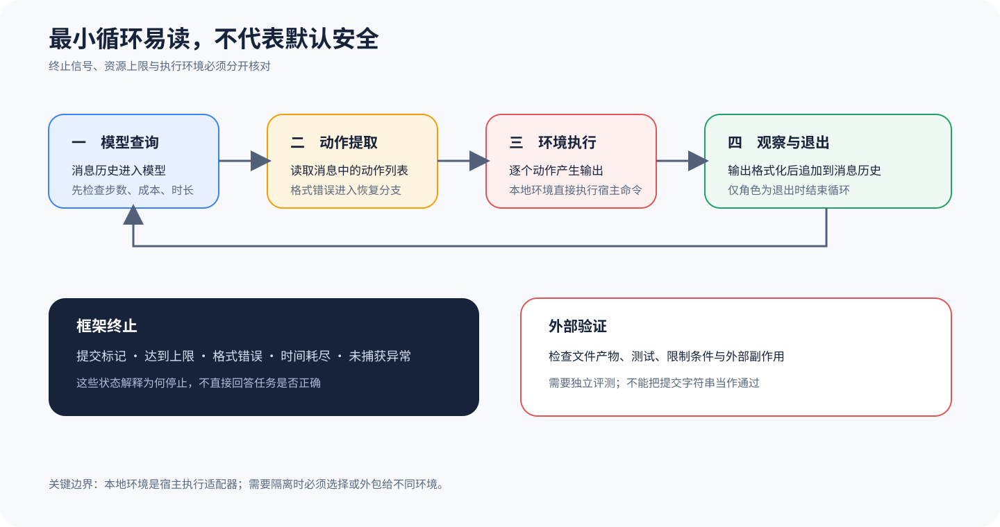

# mini-swe-agent：用最小循环看清执行边界

## 为什么值得单独看

mini-swe-agent 很适合拿来认识最小可读的 Agent Harness（智能体框架）。它用很短的源码，把 Model、Agent 和 Environment（运行环境）三个角色串了起来。你可以顺着一次查询往下看：模型给出动作，环境执行动作，观察结果写回，退出信号最后收住循环。这套最小结构怎样划清边界，才是这里要看的重点。代码少不代表能力弱，结构清楚也不代表它默认安全或足以用于生产。

它补充六条一级主线，却不能替代其中任何一条。一级主线会完整讲解 Config、Session、Permission（权限）、Extension 和产品 Surface（接口面）。这个样本则把教学范围缩小，让你在更短的源码路径里核对 Agent Loop 由哪些环节组成。源码明确写出了重试、限额、Trace 保存和执行环境，你也更容易分清哪些事实能直接核对，哪些还得靠外部实验。

## 最小循环保留了哪些必要状态

`DefaultAgent.run` 先清空 Message，放入 System（系统）消息和用户消息，然后反复调用 `step`。每次 `step` 依次做几件事：先查询模型，把响应里的动作交给环境执行，再由模型 Adapter（适配器）把输出整理成观察消息，放回 History。这里分得很清楚，模型决定下一步做什么，环境负责产生事实，两者合起来形成最小的查询、执行和观察循环。

成功提交并非唯一的终止方式，每次查询前，代码都会检查 Step 数、累计成本和墙钟时间。连续出现格式错误时，循环会进入对应的退出状态，遇到未捕获异常时，系统则先保存轨迹，再继续向外抛出。只有最后一条消息的角色变成 `exit`，循环才会结束，并返回这条消息的 `extra`。所以，`Submitted`、`LimitsExceeded`、`TimeExceeded` 和错误退出只说明控制流程怎样收场，不能直接判定业务任务通过还是失败。

另一个关键机制是环境可以替换，而每换一种环境，风险边界也会跟着改变。`LocalEnvironment`（本地环境）的类说明明确写着，它会直接在本机执行 Bash（Bash 命令行）命令。实际调用还会合并进程环境与配置环境，再交给运行函数。它提供的是一条简单而透明的执行路径，并不会自动带上容器、虚拟机或系统调用过滤。

本地环境读取输出的第一行，如果那里出现特殊提交标记，它就触发 `Submitted`，并把后面的文本当作 submission。这个 Protocol 方便系统把「Agent 主动结束」与普通命令输出分开，但它只是 Harness 内部约定的终止信号。恶意命令或写错的命令同样可以打印这段字符串，所以别把责任混在一起，外部 Artifact 检查、测试和 Scorer 仍要独立运行。

## 从哪里开始读源码

你可以先读 [`DefaultAgent` 的最小循环](https://github.com/SWE-agent/mini-swe-agent/blob/25941c89cfbc91eb40b3f8756348c91d9977d57e/src/minisweagent/agents/default.py#L88-L157)。`run` 控制循环，`query` 检查资源门限并调用模型，`execute_actions` 则让环境执行动作，再把观察写回。然后读 [`LocalEnvironment.execute`](https://github.com/SWE-agent/mini-swe-agent/blob/25941c89cfbc91eb40b3f8756348c91d9977d57e/src/minisweagent/environments/local.py#L19-L55)，确认本地执行怎样选择工作目录、继承环境、捕获异常，以及识别提交标记。

如果还要验证 Resume 行为，再看 DefaultAgent 怎样分别处理 `FormatError`、`InterruptAgentFlow` 和未捕获异常。你可以把每条异常分支整理成五列，逐项记录它是否记账、是否追加消息、是否继续循环、是否生成退出状态、是否保存轨迹。这样就不会把性质不同的重试统称为恢复。

## 把模型动作、环境观察和退出协议连起来

模型与 Agent 之间传递一条完整消息，不依赖还在流动的半成品。`query` 调用模型前先检查步数、成本和时间，收到 Response 后，再把内容与费用写入历史。只有已经生成完整的动作，才会交给 `execute_actions`。做教学实现时，最好让模型适配器解析动作，让 Agent 只负责安排查询和执行。这样你可以用录制好的响应单独验证循环，不必承受在线模型的随机性。

Agent 把动作输入交给 Environment，Environment 收到工作目录、命令和环境变量后，返回退出状态、输出或控制异常，模型适配器再把观察整理成下一轮消息。调用 ID、动作原文、执行目录和返回码必须一起保存，少了其中一项，LocalEnvironment 在 Host 上产生的错误就很容易被错记成模型错误。

退出协议还要接到外部 Eval，因为 Submitted、限额和错误状态只会写进 Trace，submission 也只是候选产物。两者不能混。Scorer 还得读取文件和测试，才能判断真正的结果。你可以让最小原型打印提交标记，却故意写错目标文件。这个实验能直接证明，Agent 即使正常退出，任务仍可能失败，也就切断了「框架结束等于任务通过」这条错误推断。

## 沿一次最小任务走完整链

1. 入口把任务渲染进系统模板和实例模板，形成初始消息历史。
2. 查询前检查调用次数、累计成本与运行时长，超过门限就追加退出消息。
3. 模型根据当前消息返回文本与零个或多个动作，Harness 记录调用成本。
4. Environment 逐个执行动作，模型适配器把结果转成观察消息，再进入下一轮。
5. 格式错误可以在上限内恢复；退出消息、提交标记或硬错误使当前运行停止。
6. 外部验证读取轨迹和文件产物，以冻结任务契约判断结果。

这条链要优先保存模型调用序号、累计成本、动作原文、工作目录、命令返回码、异常类型、退出状态和 submission。若只保存最终回答，Tool Call 失败和恢复经过都会丢失。若只保留完整日志，却不固定 Task、配置和来源 Commit，你同样无法复现当时的运行条件。

## 它补充了六条主课程的什么

DeepSeek Harness、Codex、Gemini CLI、Claude、pi 和 OpenCode 的主线课程，要讲清各自完整的产品和工程结构。mini-swe-agent 不参与谁更强的横向排序，它只提供一副基准骨架。面对更复杂的 Harness，你可以拿它追问模型请求在哪里形成、谁解释工具动作、真实执行发生在哪里、观察怎样回到 Context，以及最后由谁决定退出。

它也能帮你把评测分层。Harness 的退出状态只进入 Rollout，submission 只是候选产物，Evaluator 还要读取冻结任务和最终文件。这些职责仍然存在，只是没有全部内置进来。

## 什么时候值得采用

如果你要学习循环怎样推进、动作怎样解释、观察怎样写回，或者资源限额和环境替换怎样生效，mini-swe-agent 很合适。它也适合用来构造确定性的状态机实验。不过，它无法单独证明企业权限治理、多客户端协议、长期会话、分布式恢复或发布评测已经具备。核心实现写得短，这些责任也不会自动出现。

LocalEnvironment 适合在可信临时目录里教学和调试。面对不可信任务、未知仓库或敏感凭据时，你应当选择有明确隔离措施的环境，并验证挂载、网络和进程权限是否真的生效。这里仅覆盖锁定的 DefaultAgent 与 LocalEnvironment 路径，不评价其他环境或部署。它值得借鉴，因为边界清楚，并非因为实现越小越好。

## 最容易误判的地方

第一类风险，是把 LocalEnvironment 当成 Sandbox。它会直接继承宿主进程可以访问的文件、命令和网络。调用前即使有 Prompt 或命令格式约束，也替代不了操作系统隔离。确实需要隔离时，应选择 Docker 等其他环境实现，或者在 Harness 外提供受限账号、容器和网络 Policy，再验证这些限制是否真的生效。

第二类风险，是看到框架退出便认定产品成功。打印提交标记、触发 `exit` 或返回 submission，都不能证明测试通过、需求满足，也不能证明运行没有造成破坏性副作用。第三类风险，是反复重试格式错误，最后只保留一次成功，把前面的失败藏起来。基础设施恢复后可以再试，但真实任务失败不能靠这种办法改写。

## 怎样亲手核对

你可以做三个最小实验。正常链让模型返回一个只读动作，并确认观察消息进入下一轮。限额链把 step limit 设为一，检查第二次查询前有没有生成 `LimitsExceeded`。边界链在临时目录里运行 LocalEnvironment，记录它确实用了宿主进程和环境。这些实验只能证明锁定版本面对受控输入时怎样运行，不能外推到其他环境、模型或部署。

核对时要看两组信号：控制流信号包括退出状态、调用次数和异常，任务信号包括预期 Diff、测试、禁止副作用和 Score。只有任务信号满足冻结的任务契约，结果才算通过，而控制流日志只能解释结果，代替不了结果。

## 读完后做四个判断

### 问题 1

最小实现是否意味着没有恢复？

**答案：** 不是。源码包含格式错误恢复、限额和轨迹保存，只是恢复策略较集中，必须逐分支核对。

### 问题 2

LocalEnvironment 是否默认安全？

**答案：** 不能这样判断。它明确直接执行宿主命令，安全边界取决于外部进程权限和所选环境。

### 问题 3

出现 Submitted 是否可以计为通过？

**答案：** 不可以。它只表示 Harness 收到提交协议，仍需独立检查产物和任务契约。

### 问题 4

为什么它只是扩展样本？

**答案：** 它突出最小循环的教学价值，但不承担一级主线需要的完整产品表面、部署与治理覆盖。
