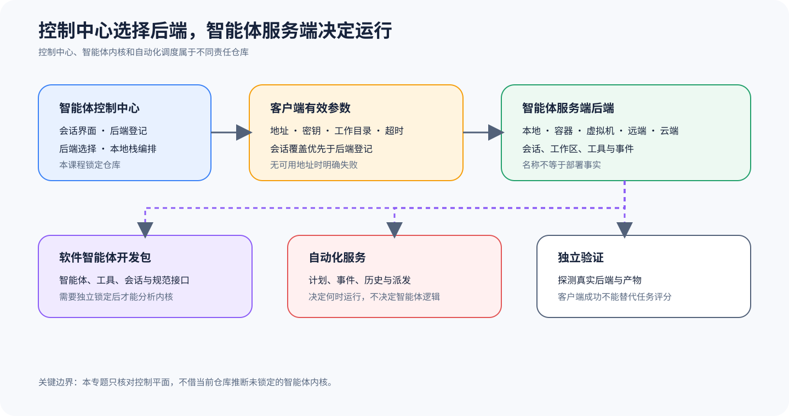

# OpenHands Agent Canvas：多后端控制平面与仓库边界

## 为什么值得单独看

当前锁定的 OpenHands 仓库把自己定位为 Agent Canvas，也就是供 Coding Agent 和自动化任务使用的自托管控制中心。这里的 Canvas（画布）负责启动 Session、登记并切换后端，再把不同的 Agent Server 投影到同一个界面。这个定位已经不同于早期常见的「OpenHands 单体 Agent 仓库」。因此，你要先看当前仓库究竟负责什么，不能只凭项目名就认定源码里一定包含 Agent Loop（智能体循环）、Tool 实现或 Sandbox 运行时。

Agent Canvas 让我们看到，控制平面怎样把多个 Agent 后端组织成用户可以操作的产品。它可以连接本地、远端、云端或兼容 ACP（Agent 客户端协议）的 Agent，但这些名称只说明连接类别，不能证明真实后端已经存在。要判断后端到底跑在哪里，采用了什么隔离措施，又支持哪些版本能力，还得逐项检查有效 Config、网络探测、服务信息和部署证据。

## 控制平面怎样选择并连接真实后端

Canvas 每次调用 Agent Server，都不会盲目使用一个写死的全局地址。`getAgentServerClientOptions` 会读取当前有效的本地后端，也允许本次 Call（调用）用 host、conversationUrl、sessionApiKey、apiKey、workingDir 和 timeout 覆盖对应配置。若系统既找不到可用后端，也没有收到明确地址，就会抛出 `NoBackendAvailableError`，防止请求悄悄发往未知目标。

代码按明确的优先级选择地址与凭证，会话密钥盖过调用密钥，调用密钥再盖过登记后端的密钥。明确传入的 host 或 conversation URL 可以改写后端地址，工作目录则取自调用参数或 Agent Server 配置。不过，workingDir 只是发给后端的一项运行参数，看到这个字符串，不能据此认定后端已经配置容器挂载、路径白名单或文件系统隔离。

仓库 README 还用一张表分清各仓库做什么，其中当前仓库负责 Agent Canvas 前端、用户控制中心、后端选择和本地栈编排。`software-agent-sdk` 负责 Python 的 Agent SDK（智能体开发工具包）、Agent Server、Agent、工具、会话、工作区和 Event，`automation` 则负责定义自动化任务、安排计划、接收 Webhook、保存运行历史并派发任务。

读自动化链时，要把「何时运行」和「运行什么」分开。这两件事不能混。Automation Server 根据计划或事件决定何时派发，Agent Server 与 SDK 决定会话和 Agent 怎样执行，Canvas 只提供配置和观察入口。如果你只看到 Canvas 页面成功创建了一条自动化，最多能确认控制对象已经登记。Scheduler（调度器）有没有触发、任务有没有派发成功、Agent 有没有完成工作，以及下游集成有没有收到正确结果，都还没有得到证明。

## 从哪里开始读源码

先读 [锁定 README 的仓库责任表](https://github.com/All-Hands-AI/OpenHands/blob/861e9ef501730e3b194cb0345a1ae2b04cfe68f1/README.md#L139-L150)，看清代码分布在哪些仓库。然后读 [`getAgentServerClientOptions`](https://github.com/All-Hands-AI/OpenHands/blob/861e9ef501730e3b194cb0345a1ae2b04cfe68f1/src/api/agent-server-client-options.ts#L42-L80)，核对 host、apiKey、workingDir 与 timeout 怎样组合。把这两处放在一起看，就不会把 Client 的 Router（路由器）代码当成 Agent Core（Agent 核心），也不会因为界面「支持某后端」，就认定后端已经部署。

继续往下读时，可以先沿 `backend-registry` 看系统怎样登记后端、选择当前活动后端，再沿具体 API service 追踪代码何时构造客户端参数。核对每项能力时，要把 Canvas 的配置记录、最终请求地址、Agent Server 返回的版本与能力，以及实际会话留下的 Artifact 记在一起。缺少其中任何一项，这项能力就只能标为部分可用或无法核对。

## 把 Canvas、Agent Server 与 Automation 连起来

系统登记后端后，客户端构造器会读取当前有效的 Backend，再叠加本次调用给出的覆盖值。每次发出 Query 前，构造器都会重新解析 host、conversation URL、会话密钥、API Key、工作目录和超时，并保留各项参数来自哪里、谁优先。若没有可用地址，就应明确失败，代码不能把上次活动后端缓存成永远有效的目标，更不能在切换会话后继续使用属于另一主体的密钥。

Canvas 通过一份带版本的客户端 Protocol 连接 Agent Server，连接成功后，它应先读取服务信息和能力，再创建或 Resume 会话。事件、Artifact 和最终状态都属于后端 Session，Canvas 只保存它们在界面上的投影和局部状态。workingDir 只是请求参数，Server 仍要自己解释并约束路径，客户端不能拿这个字符串替后端证明挂载或沙箱已经存在。

Automation 和 Agent Server 用派发记录衔接，计划或 Webhook 先生成 dispatch ID，派发动作再创建具体 Session，后端返回 Result 后，系统把它写回运行历史。这里有四个不能混为一谈的状态：自动化已经创建、派发成功、会话结束、Task 通过。做教学测试时，应在每个边界主动制造失败，检查控制平面会不会用绿色配置卡片遮住「根本没触发」或「产物不正确」。

## 沿一次多后端会话走完整链

1. 用户或配置注册一个后端，Canvas 保存地址、类别和所需认证信息。
2. 当前界面选择有效后端；会话也可以携带独立地址、密钥和工作目录覆盖。
3. 客户端参数构造器按优先级产生 host、apiKey、workingDir 与 timeout。
4. TypeScript 客户端调用 Agent Server，服务端创建或恢复会话并运行具体 Agent。
5. 事件和状态返回 Canvas；自动化服务则可以从计划或 Webhook 独立派发会话。
6. 外部验证读取服务端产物与目标系统状态，而不是只读取 Canvas 的成功提示。

兼容 ACP 的 Agent 也要遵守这条责任链。协议兼容只表示客户端和 Agent 进程能够交换初始化信息、Prompt、工具和会话事件，不保证每个 Agent 都提供相同工具，也不保证它们采用相同的权限模型、Context 恢复方式或终止语义。因此，界面里出现 Claude Code、Codex、Gemini 等名称时，只能把它们看成可选 Adapter 表面。实际能力仍要结合各自锁定的版本和后端配置验证。

## 它补充了六条主课程的什么

OpenHands Agent Canvas 作为扩展样本，为六条一级主线补上了「多后端控制平面」这个视角。Codex、Gemini CLI、Claude、pi 与 OpenCode 的一级文档，会沿各自可以核对的源码解释核心循环和产品表面，Canvas 则重点展示一个产品怎样把多个异构 Agent 放进统一入口。它不会因此变成第七条全面主线。

这个视角也能帮你看清 Eval 横跨哪些模块。Canvas 可以收集会话、事件和自动化运行历史，但这些记录只是一部分评测输入。独立 Eval Harness 必须固定任务、目标后端、有效配置、Agent 版本和产物，并分清客户端报错、后端不可达、Agent 产品失败和 Scorer 失败。控制中心显示绿色，代替不了独立的发布 Holdout（未用于训练和候选选择的隔离任务集）。

## 什么时候值得采用

当团队需要统一管理身份、配置和运行 History 时，Agent Canvas 很适合组织多个异构后端，也方便大家从同一入口切换会话、观察自动化运行。控制平面在这里有独立价值，不过对于单一离线 Agent 或完全嵌入式的库，这层服务化可能只会增加成本。不能因为它们没有 Canvas，就判定能力不足。

这个样本只能证明两件事：锁定仓库承担哪些控制平面职责，客户端怎样决定参数优先级。后端名称、下拉框或 server info 都不足以证明 Agent、工具、隔离、认证和生产可用性。你还得检查 software-agent-sdk、真实部署和受控任务，比较多个后端前也必须先固定版本和 Environment。界面一致，语义未必一致。

## 最容易误判的地方

第一类误判来自仓库身份变化。如果不读当前 README 的责任表，你可能会把 Canvas 发起 API 调用、选择后端的动作，误写成 OpenHands Agent 的内部决策。第二类误判来自部署推断。看到后端类型写着 Docker、VM、remote 或 cloud，就以为对应实例正在运行，而且隔离配置符合安全要求。其实，这些字段只记录了登记或选择信息。

第三类误判，是客户端显示成功后，就认定任务已经成功。HTTP 请求返回、会话创建、Stream（流）结束，或者自动化显示完成时，任务产物仍可能是错的。各后端的版本、认证、工作目录和工具能力也不会天然一致。切换后端后，模型输入、权限请求和可见工具都可能改变。因此，实验记录必须包含最终生效的参数。

## 怎样亲手核对

验证控制平面，至少要做三类实验。无后端实验用来确认没有地址时系统会明确失败。覆盖优先级实验分别为登记后端和会话设置不同地址与密钥，再检查客户端最终选了什么。真实后端实验则要调用 server info，创建受控会话并验证产物。若还研究自动化，需要另外固定触发事件、派发记录、会话 ID 和下游结果。

安全验证必须检查真实部署，你要记录进程或容器身份、挂载、网络 Policy、工作目录怎样解析，以及凭证在哪个作用域生效。Canvas 下拉框里的文字不能充当证据。遇到基础设施错误，可以重新派发，但要保留旧记录。如果 Agent 给出了错误结果，就不能重新派发后只展示一次成功，把前面的错误盖掉。

## 读完后做四个判断

### 问题 1

当前仓库是否包含完整 OpenHands Agent Loop？

**答案：** 不能这样声称。锁定仓库明确把 Agent 与规范服务端实现归到 software-agent-sdk。

### 问题 2

选择 Docker 后端是否证明容器隔离？

**答案：** 不证明。必须检查真实进程、容器配置、挂载和网络边界。

### 问题 3

Canvas 会话结束是否就是任务通过？

**答案：** 不是。结束属于客户端和服务端生命周期，任务结果仍由冻结契约和独立评分器判定。

### 问题 4

为何仍值得收录？

**答案：** 它提供了多后端控制平面、仓库分责和自动化派发边界，是六条一级主线之外的重要机制样本。
