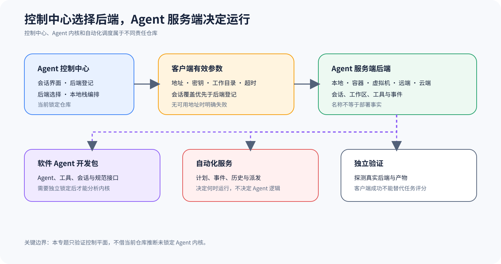

# OpenHands Agent Canvas：多后端控制平面与仓库边界

## 为什么值得单独看

当前锁定的 OpenHands 仓库把自己定位为 Agent Canvas，也就是一个面向编码 Agent 与自动化的自托管控制中心。它负责启动会话、登记和切换后端，再把不同 Agent Server 投影到统一界面上。因为这个定位与早期常见的「OpenHands 单体 Agent 仓库」印象已经不同，所以本专题会先固定仓库责任，不用项目名反推当前源码必然包含 Agent Loop、工具实现或沙箱运行时。

Agent Canvas 的独特价值，在于它展示了控制平面如何把多个 Agent 后端组织成可操作的产品。它虽然可以连接本地、远端、云端或 ACP 兼容 Agent，但这些名称只能说明连接类别，不能证明真实后端已经存在。要判断它运行在哪里，又具有何种隔离和版本能力，还得从有效配置、网络探测、服务信息与部署证据中逐层确认。

## 控制平面怎样选择并连接真实后端

Canvas 调用 Agent Server 时，不会始终使用一个写死的全局地址。`getAgentServerClientOptions` 会在每次调用时读取有效本地后端，同时允许当前调用用 host、conversationUrl、sessionApiKey、apiKey、workingDir 和 timeout 覆盖对应配置。如果既没有可用后端，也没有显式地址，它就抛出 `NoBackendAvailableError`，以免请求悄悄落到未知目标。

地址与凭证的优先级体现了控制平面的需求：会话级密钥先覆盖调用级密钥，调用级密钥再覆盖登记后端密钥，而显式 host 或 conversation URL 可以覆盖后端地址，工作目录则来自调用覆盖或 Agent Server 配置。不过，这里的 workingDir 只是发送给后端的运行参数——因此看到这个字符串并不能推断后端已经使用容器挂载、路径白名单或文件系统隔离。

仓库 README 还给出了一张多仓库责任表，其中当前仓库负责 Agent Canvas 前端、用户控制中心、后端选择和本地栈编排，`software-agent-sdk` 负责 Python SDK、Agent Server、Agent、工具、会话、工作区和事件，而 `automation` 负责自动化定义、计划、Webhook、运行历史与派发。

因此，阅读自动化链时要把「何时运行」与「运行什么」拆开。Automation Server 根据计划或事件决定派发时机，Agent Server 与 SDK 决定会话和 Agent 如何执行，Canvas 则提供配置与观察入口。如果只看到 Canvas 页面成功创建了一条自动化，那最多只能证明控制对象已经登记，不能证明计划器已触发、派发已成功、Agent 已完成任务，更不能证明下游集成收到了正确结果。

## 从哪里开始读源码

先读 [锁定 README 的仓库责任表](https://github.com/All-Hands-AI/OpenHands/blob/861e9ef501730e3b194cb0345a1ae2b04cfe68f1/README.md#L139-L150)。然后读 [`getAgentServerClientOptions`](https://github.com/All-Hands-AI/OpenHands/blob/861e9ef501730e3b194cb0345a1ae2b04cfe68f1/src/api/agent-server-client-options.ts#L42-L80)，核对 host、apiKey、workingDir 与 timeout 如何组合。两者配合可以防止最常见的误读：把客户端路由代码当成智能体内核，或把「支持某后端」当成后端已经部署。

继续分析时，可以先沿 `backend-registry` 查看后端登记和活动选择，再沿具体 API service 追踪客户端参数在何时构造。核对每个能力时，都应把 Canvas 中的配置记录、最终请求地址、Agent Server 返回的版本与能力，以及实际会话产物记在一起，因为任何一项缺失都意味着该能力只能标为部分可用或不可核对。

## 把 Canvas、Agent Server 与 Automation 连起来

后端登记与客户端构造之间，靠的是当前有效 Backend 加上调用覆盖这一层接缝。因为构造器会为每次请求重新解析 host、conversation URL、会话密钥、API Key、工作目录和超时，并保留它们的来源优先级，所以没有可用地址时应当明确失败。实现不能把上次活动后端缓存成永远有效的目标，更不能在会话切换时复用属于错误主体的密钥。

Canvas 与 Agent Server 之间通过一份版本化客户端协议衔接，因此连接成功后要先读取服务信息与能力，然后才创建或恢复会话。事件、Artifact 和终态都归属于后端 Session，Canvas 只维护它们的投影与局部界面状态。workingDir 只是请求参数，服务端仍须自行解释和约束路径，客户端不能拿一个字符串替后端证明挂载或沙箱已经存在。

Automation 与 Agent Server 之间则靠派发记录连接：计划或 Webhook 先产生 dispatch ID，派发随后创建具体 Session，后端结果最后再回到运行历史。在这条链上，创建自动化、派发成功、会话结束和任务通过是四个不同状态——因此教学测试应在每个边界注入失败，确保控制平面不会用绿色配置卡片掩盖未触发或错误产物。

## 沿一次多后端会话走完整链

1. 用户或配置注册一个后端，Canvas 保存地址、类别和所需认证信息。
2. 当前界面选择有效后端；会话也可以携带独立地址、密钥和工作目录覆盖。
3. 客户端参数构造器按优先级产生 host、apiKey、workingDir 与 timeout。
4. TypeScript 客户端调用 Agent Server，服务端创建或恢复会话并运行具体 Agent。
5. 事件和状态返回 Canvas；自动化服务则可以从计划或 Webhook 独立派发会话。
6. 外部验证读取服务端产物与目标系统状态，而不是只读取 Canvas 的成功提示。

ACP 兼容 Agent 同样遵循这条责任链。所谓协议兼容，只是说客户端和 Agent 进程能够交换初始化、提示、工具与会话事件，并不保证每个 Agent 暴露相同的工具、权限模型、上下文恢复或终止语义。因此，界面上展示 Claude Code、Codex、Gemini 等名称时，只应把它们视为可选适配表面，实际能力还要按各自的锁定版本和后端配置验证。

## 它补充了六条主课程的什么

OpenHands Agent Canvas 作为扩展样本，补充的是六条一级主线中的「多后端控制平面」视角。Codex、Gemini CLI、Claude、pi 与 OpenCode 的一级文档会从各自可核对源码解释核心循环与表面，而 Canvas 重点展示一个产品如何把多个异构 Agent 放到统一入口，并不会因此被提升为第七条全面主线。

这个视角也强化 Eval 的横切定位。Canvas 可以收集会话、事件与自动化运行历史，但这些记录仍是评测输入。独立 Eval Harness 必须冻结任务、目标后端、有效配置、Agent 版本与产物，区分客户端错误、后端不可达、Agent 产品失败和评分器失败。控制中心的绿色状态不能代替独立发布留出集。

## 什么时候值得采用

Agent Canvas 适合组织多个异构后端，也适合在同一入口中切换会话并观察自动化，因为当团队需要统一身份、配置和运行历史时，控制平面自有其独立价值。但对单一离线 Agent 或完全嵌入式库来说，这层服务化成本可能并不必要，也不能因为它们没有 Canvas 就判定能力不足。

本样本只能证明锁定仓库的控制平面责任，以及客户端参数的优先级。后端名称、下拉框或 server info 都不能证明 Agent、工具、隔离、认证和生产可用性，因为这些结论还要落到 software-agent-sdk、真实部署与受控任务上。比较多个后端之前，必须先固定版本和环境，否则很容易把控制中心的一致界面误写成后端语义一致。

## 最容易误判的地方

第一类误判来自仓库身份漂移，因为如果不读当前 README 的责任表，就可能把 Canvas 的 API 调用和后端选择描述成 OpenHands Agent 的内部决策。第二类误判来自部署推断，也就是看到后端类型写着 Docker、VM、remote 或 cloud，就认为对应实例正在运行且隔离配置符合安全要求，但这些字段实际上只是登记或选择信息。

第三类误判是把客户端成功当成任务成功，然而 HTTP 请求返回、会话创建、事件流结束或自动化显示完成，都可能发生在任务产物错误的情况下。多后端之间的版本、认证、工作目录和工具能力也不会天然一致，而一旦切换后端，模型输入、权限请求与可见工具就可能随之改变，因此有效参数必须纳入试验血缘。

## 怎样亲手核对

控制平面验证至少要包含三类实验：无后端实验用来确认没有地址时会明确失败，覆盖优先级实验会为登记后端和会话设置不同地址与密钥，再检查最终客户端参数，真实后端实验则要调用 server info、创建受控会话并验证产物。如果研究自动化，还需要单独固定触发事件、派发记录、会话 ID 和下游结果。

安全验证必须落到真实部署上，包括记录进程或容器身份、挂载、网络策略、工作目录解析和凭证作用域，而不是拿 Canvas 下拉框里的文字充当证据。发生基础设施错误时，可以重新派发并保留旧记录，但如果 Agent 给出了错误结果，就不能靠重新派发后只展示一次成功来覆盖。

## 读完后做四个判断

### 问题 1

当前仓库是否包含完整 OpenHands Agent Loop？

**答案：** 不能这样声称。锁定仓库明确把 Agent 与规范服务端实现归到 software-agent-sdk。

### 问题 2

选择 Docker 后端是否证明容器隔离？

**答案：** 不证明。必须检查真实进程、容器配置、挂载和网络边界。

### 问题 3

Canvas 会话结束是否就是任务通过？

**答案：** 不是。结束属于客户端和服务端生命周期，任务结果仍由冻结契约和独立评分器判定。

### 问题 4

为何仍值得收录？

**答案：** 它提供了多后端控制平面、仓库分责和自动化派发边界，是六条一级主线之外的重要机制样本。
